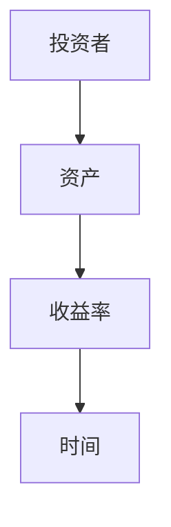
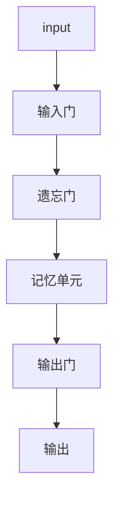
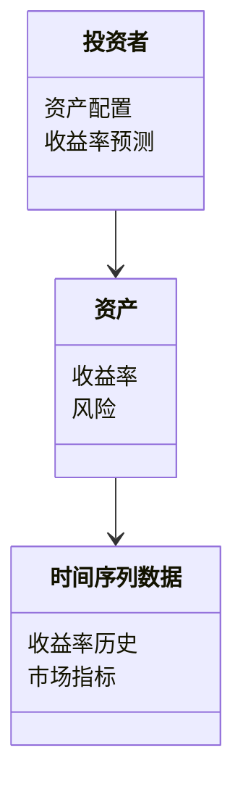
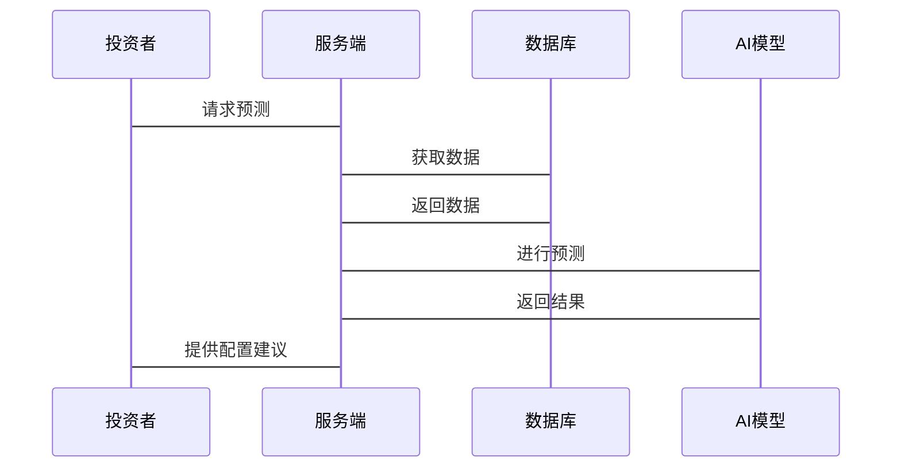

                 


# AI辅助的多资产类别收益率预测与资产配置

## 关键词
AI, 机器学习, 时间序列预测, 资产配置, 金融投资

## 摘要
本文详细探讨了AI技术在多资产类别收益率预测与资产配置中的应用。通过分析金融市场的复杂性，结合机器学习、时间序列分析等技术，提出了一种基于AI的资产配置优化方法。文章从背景介绍、核心概念、算法原理、系统架构到项目实战，全面解析了AI在金融投资中的潜力与实现方案，为投资者提供了科学的决策支持。

---

## 第一部分：背景介绍

### 第1章：问题背景与问题描述

#### 1.1 问题背景
随着全球金融市场的日益复杂化，投资者面临的风险和不确定性显著增加。传统的人工分析方法在处理海量数据和复杂市场波动时显得力不从心。AI技术的崛起为金融投资带来了新的可能性，尤其是在多资产类别收益率预测和资产配置领域，AI展现出强大的优势。

#### 1.2 问题描述
- **收益率预测的挑战**：金融市场数据具有高度的非线性和噪声，传统统计方法难以捕捉复杂的市场动态。
- **资产配置的复杂性**：在多资产类别中实现最优配置需要考虑的风险因素众多，包括市场风险、流动性风险等。
- **当前市场中的痛点**：投资者需要实时、动态的资产配置建议，而传统方法难以满足这一需求。

#### 1.3 问题解决
AI技术通过机器学习模型能够有效捕捉数据中的非线性关系，提供更精准的预测和动态的资产配置建议。结合大数据分析，AI可以帮助投资者在复杂市场中做出更明智的决策。

#### 1.4 边界与外延
- **收益率预测的边界条件**：模型的有效性依赖于数据质量和市场环境。
- **资产配置的适用范围**：适用于中长期投资策略，短期市场波动难以完全预测。
- **AI技术的应用边界**：AI无法完全取代人类的判断，特别是在极端市场条件下。

---

## 第二部分：核心概念与联系

### 第2章：AI与金融的核心概念

#### 2.1 AI在金融中的应用
AI在金融领域的应用主要集中在以下几个方面：
1. **机器学习**：用于股票价格预测、信用评分等。
2. **自然语言处理**：用于分析新闻和社交媒体情绪，影响投资决策。
3. **图神经网络**：用于分析复杂的金融关系网络。

#### 2.2 机器学习模型
- **监督学习**：用于分类和回归任务，如股票价格预测。
- **无监督学习**：用于聚类分析，如客户行为分析。
- **强化学习**：用于动态策略优化，如资产配置。

**常见模型对比**：
| 模型类型 | 优点 | 缺点 |
|----------|------|------|
| 监督学习  | 数据需求明确 | 数据获取难度大 |
| 无监督学习 | 数据需求灵活 | 结果解释性差 |
| 强化学习  | 动态环境适应性强 | 训练时间长 |

#### 2.3 时间序列分析
时间序列分析用于预测资产的未来收益率，常用模型包括ARIMA、LSTM等。

**常见模型对比**：
| 模型类型 | 优点 | 缺点 |
|----------|------|------|
| ARIMA    | 简单易用 | 无法捕捉复杂非线性关系 |
| LSTM     | 能捕捉长期依赖关系 | 易过拟合 |

#### 2.4 资产配置策略
- **现代投资组合理论（MPT）**：通过优化投资组合风险和收益。
- **基于AI的动态配置策略**：根据市场变化实时调整资产配置。

#### 2.5 实体关系图（ER图）


---

## 第三部分：算法原理讲解

### 第3章：时间序列预测算法

#### 3.1 ARIMA模型
ARIMA模型通过自回归和移动平均机制进行预测。其数学模型为：
$$ ARIMA(p, d, q) $$
其中，p为自回归阶数，d为差分阶数，q为移动平均阶数。

#### 3.2 LSTM模型
LSTM通过记忆单元和遗忘门实现长期依赖关系的捕捉。其核心结构包括输入门、遗忘门和输出门。

**LSTM流程图**：


---

## 第四部分：系统分析与架构设计

### 第4章：系统功能设计

#### 4.1 领域模型


#### 4.2 系统架构


#### 4.3 接口设计
- **输入接口**：接收市场数据和用户指令。
- **输出接口**：提供预测结果和配置建议。

#### 4.4 交互流程


---

## 第五部分：项目实战

### 第5章：环境安装与核心实现

#### 5.1 环境安装
安装必要的Python库：
```bash
pip install numpy pandas scikit-learn keras tensorflow
```

#### 5.2 核心实现
```python
import numpy as np
from sklearn.metrics import mean_squared_error
from keras.models import Sequential
from keras.layers import LSTM, Dense

# 数据准备
data = np.random.rand(100, 1)
train_data = data[:80]
test_data = data[80:]

# LSTM模型
model = Sequential()
model.add(LSTM(64, input_shape=(1, 1)))
model.add(Dense(1))
model.compile(loss='mean_squared_error', optimizer='adam')
model.fit(train_data, train_data, epochs=10, batch_size=32)

# 预测
predicted = model.predict(test_data)
```

---

## 第六部分：最佳实践与小结

### 第6章：总结与展望

#### 6.1 总结
AI技术为多资产类别收益率预测与资产配置提供了新的解决方案，能够显著提高预测精度和配置效率。

#### 6.2 注意事项
- 数据质量至关重要。
- 模型需定期更新。
- 结合人工判断以应对极端情况。

#### 6.3 拓展阅读
建议深入学习强化学习和图神经网络在金融中的应用。

---

## 结语

通过本文的详细讲解，读者可以全面了解AI在多资产类别收益率预测与资产配置中的应用。从理论到实践，结合实际案例，帮助投资者和数据科学家更好地利用AI技术优化投资策略。未来，随着AI技术的不断发展，金融领域的应用前景将更加广阔。

