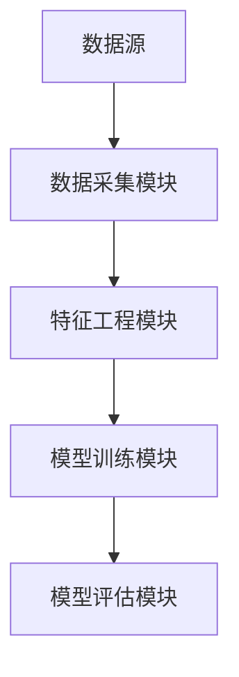
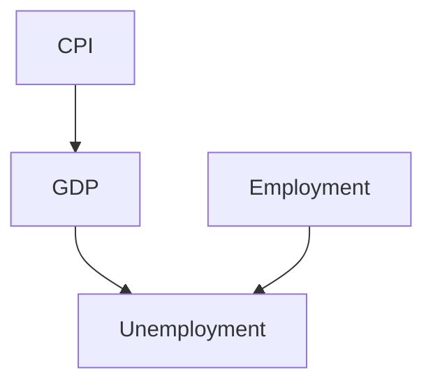

                 


# AI辅助的宏观经济指标预测模型

**关键词：** 宏观经济预测、人工智能、机器学习、时间序列分析、深度学习

**摘要：**  
本文探讨如何利用人工智能技术构建宏观经济指标预测模型，提升经济预测的准确性与效率。通过分析传统方法的局限性，介绍AI技术在宏观经济预测中的优势，涵盖算法原理、系统架构、项目实战等内容，帮助读者掌握AI辅助宏观经济预测的核心方法与实践技巧。

---

# 第1章: 宏观经济指标与AI预测概述

## 1.1 宏观经济指标的定义与分类

### 1.1.1 宏观经济指标的核心概念  
宏观经济指标是衡量经济运行状态的关键数据，主要包括国内生产总值（GDP）、失业率、通胀率、工业产值等。这些指标反映了经济的整体表现和趋势，是政策制定者和投资者的重要参考依据。

### 1.1.2 主要宏观经济指标的分类  
宏观经济指标可以分为以下几类：  
1. **总量指标**：如GDP、国民收入。  
2. **结构指标**：如各产业的产值占比。  
3. **价格指标**：如通胀率、消费者价格指数（CPI）。  
4. **就业指标**：如失业率、就业人口比例。  

### 1.1.3 宏观经济指标的经济意义  
通过分析宏观经济指标，可以评估经济的健康状况，预测未来的经济趋势，从而为政府制定货币政策和企业做出投资决策提供依据。

---

## 1.2 AI在宏观经济预测中的应用背景

### 1.2.1 宏观经济预测的传统方法与局限性  
传统的宏观经济预测主要依赖统计模型和经济学理论，例如计量经济学模型（如ARIMA）。然而，这些方法在处理非线性关系和复杂数据时表现有限，且难以捕捉大数据中的隐含信息。

### 1.2.2 AI技术在宏观经济分析中的优势  
AI技术，尤其是机器学习和深度学习，能够处理海量数据，发现传统方法难以察觉的模式和趋势，显著提高了预测的准确性和实时性。

### 1.2.3 当前AI辅助宏观经济预测的研究现状  
近年来，学术界和产业界都在积极探索AI在宏观经济预测中的应用，特别是在时间序列分析和深度学习模型（如LSTM）方面取得了显著进展。

---

## 1.3 宏观经济指标预测的挑战与机遇

### 1.3.1 数据复杂性与不确定性  
宏观经济数据受到多种因素影响，如政策变化、市场波动等，导致数据具有高度的不确定性和复杂性。

### 1.3.2 模型的可解释性问题  
复杂的AI模型（如深度神经网络）通常缺乏可解释性，这在宏观经济预测中尤为重要，因为政策制定者需要明确预测的依据。

### 1.3.3 AI技术带来的新可能性  
AI技术的进步为宏观经济预测提供了新的工具和方法，特别是在处理大数据和复杂非线性关系方面表现突出。

---

## 1.4 本章小结  
本章介绍了宏观经济指标的基本概念和分类，分析了AI技术在宏观经济预测中的优势与挑战，为后续章节奠定了基础。

---

# 第2章: 机器学习基础与宏观经济预测

## 2.1 机器学习基础

### 2.1.1 机器学习的基本概念  
机器学习是一种通过数据驱动的方法，让计算机能够“学习”并做出预测或决策的技术。主要分为监督学习、无监督学习和强化学习。

### 2.1.2 监督学习、无监督学习与强化学习  
- **监督学习**：基于 labeled 数据进行预测，如线性回归、随机森林。  
- **无监督学习**：基于 unlabeled 数据发现模式，如聚类分析。  
- **强化学习**：通过与环境交互优化决策，如策略网络。  

### 2.1.3 常见机器学习算法简介  
- 线性回归：用于预测连续变量。  
- 支持向量机（SVM）：用于分类和回归。  
- 随机森林：基于决策树的集成方法。  

---

## 2.2 时间序列分析与宏观经济预测

### 2.2.1 时间序列的基本特征  
时间序列数据具有趋势性、周期性和随机性，需要考虑这些特征进行建模。

### 2.2.2 时间序列预测的数学模型  
常用模型包括ARIMA（自回归积分滑动平均模型）和GARCH（广义自回归条件异方差模型）。  
**ARIMA模型公式：**  
$$ Y_t = c + \phi_1 Y_{t-1} + \theta_1 e_{t-1} + e_t $$  

### 2.2.3 常见时间序列预测方法  
- **ARIMA**：适用于线性可预测的序列。  
- **Prophet**：Facebook开源的时间序列预测工具，基于回归模型。  
- **LSTM**：长短期记忆网络，适合处理长序列依赖。  

---

## 2.3 常用宏观经济预测算法

### 2.3.1 线性回归模型  
线性回归是最简单的预测模型，适用于线性关系的数据。  
**线性回归公式：**  
$$ Y = \beta_0 + \beta_1 X + \epsilon $$  

### 2.3.2 随机森林与梯度提升树  
集成学习方法，通过多棵树的组合提高预测准确性。  

### 2.3.3 LSTM网络  
LSTM特别适合处理时间序列数据，能够捕捉长期依赖关系。  
**LSTM结构公式：**  
$$ f_t = \sigma(W_f \cdot [h_{t-1}, x_t]) $$  
$$ i_t = \sigma(W_i \cdot [h_{t-1}, x_t]) $$  
$$ o_t = \sigma(W_o \cdot [h_{t-1}, x_t]) $$  
$$ h_t = f_t \cdot c_t + i_t \cdot c_{t-1} $$  
$$ c_t = \text{cell state} $$  

---

## 2.4 本章小结  
本章介绍了机器学习的基础知识，并重点探讨了时间序列分析和常见宏观经济预测算法，为后续章节的模型构建奠定了基础。

---

# 第3章: 系统架构与数据建模

## 3.1 宏观经济预测系统的架构设计

### 3.1.1 系统功能模块  
- 数据采集模块：获取宏观经济数据。  
- 特征工程模块：提取特征并进行数据预处理。  
- 模型训练模块：基于机器学习算法训练预测模型。  
- 模型评估模块：评估模型性能并优化参数。  

### 3.1.2 系统架构图  


---

## 3.2 数据建模与特征工程

### 3.2.1 数据预处理  
- 数据清洗：处理缺失值、异常值。  
- 数据标准化：归一化处理。  

### 3.2.2 特征工程  
- 提取特征：如移动平均、增长率等。  
- 使用Mermaid绘制特征关系图：  


---

## 3.3 基于LSTM的宏观经济预测模型

### 3.3.1 模型设计  
- 输入层：接收宏观经济指标数据。  
- LSTM层：捕捉时间序列的依赖关系。  
- 输出层：预测未来指标值。  

### 3.3.2 模型实现  
使用Python代码实现LSTM模型：  
```python
import numpy as np
from tensorflow.keras.models import Sequential
from tensorflow.keras.layers import LSTM, Dense

# 数据准备
X_train = ... # 形状：(samples, timesteps, features)
y_train = ... # 形状：(samples, 1)

# 模型构建
model = Sequential()
model.add(LSTM(50, input_shape=(timesteps, features)))
model.add(Dense(1))
model.compile(optimizer='adam', loss='mean_squared_error')

# 训练
model.fit(X_train, y_train, epochs=100, batch_size=32)
```

---

## 3.4 本章小结  
本章详细介绍了宏观经济预测系统的架构设计和数据建模过程，重点讲解了LSTM模型的实现。

---

# 第4章: 项目实战——基于AI的GDP预测模型

## 4.1 项目背景与目标  
以预测季度GDP增长率为目标，利用AI技术构建预测模型。

### 4.2 环境配置  
- 安装Python和必要的库：numpy、pandas、keras、tensorflow。  

### 4.3 数据获取与预处理  
- 数据来源：使用FRED API获取美国季度GDP数据。  
- 数据清洗：处理缺失值和异常值。  

### 4.4 模型实现  
- 特征工程：提取GDP增长率、CPI、失业率等特征。  
- 模型训练：基于LSTM网络构建预测模型。  

### 4.5 模型评估  
- 使用均方误差（MSE）和R²系数评估模型性能。  

---

## 4.5 模型优化与部署  
- 调整超参数（如学习率、批量大小）优化模型性能。  
- 部署模型到生产环境，实现实时预测。  

---

## 4.6 本章小结  
通过实际案例详细讲解了AI辅助宏观经济预测的实现过程，从数据准备到模型部署，为读者提供了一个完整的参考。

---

# 第5章: 高级主题与最佳实践

## 5.1 模型集成与优化

### 5.1.1 集成学习  
通过集成多种模型（如随机森林和LSTM）提高预测准确性。  

### 5.1.2 超参数优化  
使用网格搜索或随机搜索优化模型参数。  

---

## 5.2 模型的可解释性与鲁棒性

### 5.2.1 模型解释性  
使用SHAP值等工具分析模型的可解释性，明确各特征对预测的贡献度。  

### 5.2.2 模型鲁棒性  
通过交叉验证和数据增强方法提高模型的泛化能力。  

---

## 5.3 数据与模型的局限性

### 5.3.1 数据稀疏性  
在数据量较少的情况下，模型性能可能受限。  

### 5.3.2 模型的适应性  
需要定期更新模型以应对数据分布的变化。  

---

## 5.4 最佳实践 tips  
- 数据预处理是关键，确保数据质量。  
- 选择合适的模型，结合可解释性和准确性。  
- 定期监控和更新模型，保持预测的准确性。  

---

# 第6章: 总结与展望

## 6.1 本章总结  
本文系统地介绍了AI辅助宏观经济指标预测模型的构建过程，从理论基础到实际应用，为读者提供了全面的指导。

## 6.2 未来展望  
随着AI技术的不断发展，宏观经济预测将更加智能化和精准化。未来的研究方向包括更复杂的时间序列模型和多模型集成方法。

---

**参考文献**  
[此处列出相关文献和资料]

---

通过以上章节的详细讲解，读者可以全面掌握AI辅助宏观经济指标预测的核心方法和实践技巧，为实际应用提供有力支持。

