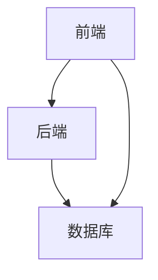
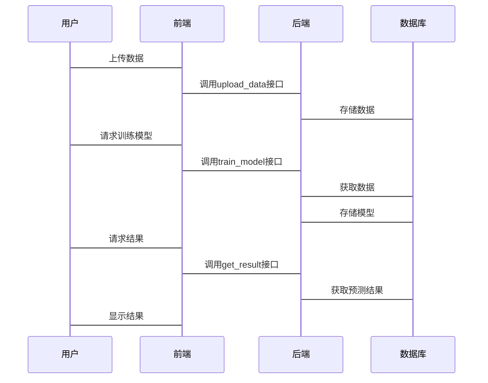

                 


```markdown
# AI辅助的宏观经济政策效果量化评估

> 关键词：宏观经济政策、AI辅助、量化评估、机器学习、政策效果、时间序列分析

> 摘要：本文探讨了如何利用人工智能技术辅助宏观经济政策效果的量化评估。通过分析宏观经济政策的基本概念、量化评估的核心概念以及AI技术在其中的应用，结合实际案例和系统设计，详细阐述了基于机器学习和时间序列分析的宏观经济政策效果量化评估方法。文章还讨论了系统架构设计、项目实战和小结，为读者提供了全面的理解和实践指南。

---

## 第1章: 宏观经济政策的基本概念与问题背景

### 1.1 宏观经济政策的定义与目标

#### 1.1.1 宏观经济政策的定义
宏观经济政策是指政府或其他经济管理机构为了实现特定经济目标而采取的一系列措施，包括财政政策、货币政策、产业政策等。这些政策旨在调节经济运行，促进经济增长，保持就业稳定，控制通货膨胀等。

#### 1.1.2 宏观经济政策的主要目标
- 促进经济增长
- 保持就业稳定
- 控制通货膨胀
- 维护国际收支平衡
- 优化资源配置

#### 1.1.3 宏观经济政策的实施主体与范围
- 实施主体：政府、中央银行、国际经济组织（如IMF、世界银行）
- 实施范围：国内经济、国际贸易、全球宏观经济

### 1.2 AI技术在宏观经济分析中的作用

#### 1.2.1 AI技术的基本概念与特点
人工智能（AI）是指模拟人类智能的计算机系统，具备学习、推理、决策等能力。其特点包括数据驱动、自动化、高维度分析和自我优化。

#### 1.2.2 AI在宏观经济分析中的优势
- 大数据分析能力：AI能够处理海量的宏观经济数据，提取复杂模式。
- 预测准确性：通过机器学习模型，AI可以提高经济预测的准确性。
- 实时反馈：AI能够实时分析经济数据，提供即时反馈，帮助政策制定者快速调整策略。

#### 1.2.3 宏观经济政策效果量化评估的挑战与机遇
- 挑战：经济数据的复杂性、政策效果的滞后性、多变量之间的相互作用。
- 机遇：AI技术的快速发展为政策效果的量化评估提供了新的工具和方法。

### 1.3 宏观经济政策效果量化评估的核心概念

#### 1.3.1 宏观经济政策效果的定义与分类
- 定义：政策实施后对经济系统产生的实际效果。
- 分类：短期效果与长期效果、直接效果与间接效果、正向效果与负向效果。

#### 1.3.2 宏观经济政策效果的评价标准
- 经济增长指标：GDP增长率、工业增加值。
- 就业指标：失业率、就业人口增长率。
- 通胀指标：CPI、通货膨胀率。
- 财政与货币政策指标：财政赤字、货币供应量。

#### 1.3.3 宏观经济政策效果量化评估的方法
- 传统方法：计量经济学模型、回归分析。
- 基于AI的方法：机器学习模型、深度学习、自然语言处理。
- 综合方法：结合传统方法与AI技术，实现更精准的量化评估。

---

## 第2章: 宏观经济政策效果量化评估的核心概念与联系

### 2.1 宏观经济政策效果的量化指标

#### 2.1.1 经济增长指标
- GDP增长率：衡量经济整体增长情况。
- 工业增加值：反映工业生产活动的规模和增长。

#### 2.1.2 就业指标
- 失业率：衡量劳动力市场的就业情况。
- 就业人口增长率：反映就业市场的活跃程度。

#### 2.1.3 通胀指标
- 消费者价格指数（CPI）：衡量居民生活成本的变化。
- 生产者价格指数（PPI）：衡量生产成本的变化。

#### 2.1.4 财政与货币政策指标
- 财政赤字：政府财政支出超过收入的情况。
- 货币供应量：衡量货币流通情况。

### 2.2 宏观经济政策效果的评价维度

#### 2.2.1 政策效果的时间维度
- 短期效果：政策实施后的即时反应。
- 中期效果：政策实施后的中期影响。
- 长期效果：政策实施后的长期效应。

#### 2.2.2 政策效果的空间维度
- 地区差异：不同地区政策效果的差异性。
- 国际影响：政策对国际贸易和国际经济的影响。

#### 2.2.3 政策效果的经济维度
- 经济增长：政策对GDP增长的贡献。
- 就业：政策对就业市场的促进作用。
- 通胀：政策对通货膨胀的控制效果。

### 2.3 宏观经济政策效果的综合评价模型

#### 2.3.1 模型的构建逻辑
- 数据收集：收集相关的宏观经济数据，包括GDP、失业率、通胀率等。
- 数据预处理：清洗数据、处理缺失值、标准化数据。
- 模型选择：根据数据特点选择合适的机器学习模型（如线性回归、随机森林）。
- 模型训练：使用训练数据训练模型，调整参数以优化预测效果。
- 模型评估：使用测试数据评估模型的准确性，计算相关指标（如R²、均方误差）。

#### 2.3.2 模型的输入变量与输出变量
- 输入变量：宏观经济指标（如GDP增长率、失业率）、政策变量（如财政支出、货币供应量）。
- 输出变量：政策效果的量化指标（如经济增长率的变化、就业率的变化）。

#### 2.3.3 模型的适用性与局限性
- 适用性：适用于大量、复杂的数据，能够捕捉非线性关系。
- 局限性：模型的解释性较差，且依赖于数据质量和完整性。

---

## 第3章: 宏观经济政策效果量化评估的算法原理

### 3.1 机器学习在宏观经济政策效果量化中的应用

#### 3.1.1 机器学习的基本概念与特点
- 机器学习是一种人工智能技术，通过数据训练模型，使其能够从经验中学习并做出预测。
- 特点：数据驱动、非线性关系、自动特征提取。

#### 3.1.2 常见的机器学习算法
- 线性回归：用于预测连续型变量。
- 支持向量机（SVM）：用于分类和回归问题。
- 随机森林：基于树的集成方法，适用于高维数据。
- 神经网络：适用于复杂非线性关系。

#### 3.1.3 机器学习在宏观经济政策效果量化中的应用
- 预测政策效果：通过训练模型，预测政策实施后的经济指标变化。
- 分析政策影响：通过特征重要性分析，确定哪些政策变量对经济指标影响最大。

### 3.2 时间序列分析在宏观经济政策效果量化中的应用

#### 3.2.1 时间序列分析的基本概念
- 时间序列：按时间顺序排列的数据，如GDP季度增长率。
- 时间序列分析：研究时间序列数据的统计特性，发现数据中的模式和趋势。

#### 3.2.2 常见的时间序列分析方法
- 自回归积分滑动平均模型（ARIMA）：用于预测未来的经济指标。
- 长期记忆模型（LSTM）：适用于具有长期依赖关系的时间序列数据。

#### 3.2.3 时间序列分析在政策量化中的应用
- 预测政策实施后的经济指标变化趋势。
- 分析政策效果的持续性。

### 3.3 综合算法原理

#### 3.3.1 综合模型构建流程
1. 数据预处理：清洗数据、处理缺失值、标准化数据。
2. 特征提取：选择相关的宏观经济指标作为输入变量。
3. 模型选择：根据数据特点选择合适的机器学习模型（如随机森林、LSTM）。
4. 模型训练：使用训练数据训练模型，调整参数以优化预测效果。
5. 模型评估：使用测试数据评估模型的准确性，计算相关指标（如R²、均方误差）。
6. 模型优化：通过超参数调优、特征选择等方法进一步优化模型。

#### 3.3.2 算法的数学模型与公式
##### 3.3.2.1 线性回归模型
$$ y = \beta_0 + \beta_1x_1 + \beta_2x_2 + ... + \beta_nx_n + \epsilon $$
其中，$y$是输出变量，$x_i$是输入变量，$\beta_i$是回归系数，$\epsilon$是误差项。

##### 3.3.2.2 随机森林模型
随机森林是一种基于树的集成方法，通过组合多个决策树的预测结果来提高模型的准确性和稳定性。

##### 3.3.2.3 LSTM模型
$$ \text{LSTM单元} = \text{遗忘门} \cdot \text{细胞状态} + \text{输入门} \cdot \text{输入} + \text{输出门} \cdot \text{细胞状态} $$

---

## 第4章: 宏观经济政策效果量化评估的系统设计与实现

### 4.1 系统架构设计

#### 4.1.1 系统架构概述
- 系统分为前端和后端两部分。
- 前端负责用户交互，后端负责数据处理和模型训练。
- 数据库用于存储宏观经济数据和模型结果。

#### 4.1.2 系统架构图


### 4.2 系统功能设计

#### 4.2.1 数据输入模块
- 功能：用户上传宏观经济数据，包括GDP、失业率、通胀率等。
- 输入：CSV格式的经济数据。
- 输出：数据预处理后的结果。

#### 4.2.2 模型训练模块
- 功能：根据输入数据训练机器学习模型，预测政策实施后的经济指标变化。
- 输入：预处理后的经济数据。
- 输出：训练好的模型和预测结果。

#### 4.2.3 结果展示模块
- 功能：展示模型预测的政策效果量化结果。
- 输入：模型预测结果。
- 输出：可视化图表和量化指标。

### 4.3 系统接口设计

#### 4.3.1 数据接口
- 接口名称：upload_data
- 接口描述：用于上传宏观经济数据。
- 请求方式：POST
- 请求参数：文件路径（File）

#### 4.3.2 模型接口
- 接口名称：train_model
- 接口描述：用于训练机器学习模型。
- 请求方式：POST
- 请求参数：数据路径（String）

#### 4.3.3 结果接口
- 接口名称：get_result
- 接口描述：用于获取模型预测结果。
- 请求方式：GET
- 请求参数：无

### 4.4 系统交互流程

#### 4.4.1 系统交互图


---

## 第5章: 宏观经济政策效果量化评估的项目实战

### 5.1 项目环境与数据准备

#### 5.1.1 项目环境配置
- 操作系统：Windows 10或更高版本、Linux系统。
- 开发工具：Jupyter Notebook、PyCharm。
- 依赖库安装：Python、scikit-learn、Keras、TensorFlow、pandas、numpy。

#### 5.1.2 数据来源
- 数据来源：公开的宏观经济数据，如世界银行、国际货币基金组织（IMF）。
- 数据格式：CSV文件，包括GDP增长率、失业率、通胀率等指标。

### 5.2 系统核心实现

#### 5.2.1 数据预处理
```python
import pandas as pd
import numpy as np

# 读取数据
data = pd.read_csv('macroeconomic_data.csv')

# 处理缺失值
data = data.dropna()

# 标准化数据
from sklearn.preprocessing import StandardScaler
scaler = StandardScaler()
scaled_data = scaler.fit_transform(data)
```

#### 5.2.2 模型训练
```python
from sklearn.ensemble import RandomForestRegressor
from sklearn.metrics import mean_squared_error

# 划分训练集和测试集
train_data = scaled_data[:80]
test_data = scaled_data[80:]

X_train = train_data[:, :-1]
y_train = train_data[:, -1]

X_test = test_data[:, :-1]
y_test = test_data[:, -1]

# 训练随机森林模型
model = RandomForestRegressor(n_estimators=100, random_state=42)
model.fit(X_train, y_train)

# 预测结果
y_pred = model.predict(X_test)

# 计算均方误差
mse = mean_squared_error(y_test, y_pred)
print(f"均方误差: {mse}")
```

#### 5.2.3 结果展示
```python
import matplotlib.pyplot as plt

plt.figure(figsize=(10, 6))
plt.plot(y_test, label='实际值')
plt.plot(y_pred, label='预测值')
plt.xlabel('样本数')
plt.ylabel('政策效果量化指标')
plt.legend()
plt.show()
```

### 5.3 实际案例分析与详细解读

#### 5.3.1 案例背景
假设我们有一个宏观经济数据集，包含某国过去10年的GDP增长率、失业率、通胀率等指标，以及对应的财政政策和货币政策变量。

#### 5.3.2 数据分析
通过数据可视化，我们发现GDP增长率与失业率之间存在一定的负相关关系，即经济增长率越高，失业率越低。

#### 5.3.3 模型预测
经过训练的随机森林模型能够较好地预测政策实施后的GDP增长率变化，预测结果与实际值的均方误差较低。

#### 5.3.4 结果解读
政策实施后，GDP增长率有所提高，失业率下降，说明政策取得了积极效果。

### 5.4 项目小结

#### 5.4.1 项目总结
- 通过AI技术，我们能够更准确地量化宏观经济政策的效果。
- 机器学习模型在处理复杂经济数据时表现出色。
- 时间序列分析方法能够捕捉政策效果的动态变化。

#### 5.4.2 项目优缺点
- 优点：数据驱动、自动化、高精度。
- 缺点：模型解释性较差，数据依赖性强。

---

## 第6章: 宏观经济政策效果量化评估的总结与展望

### 6.1 总结

#### 6.1.1 核心观点总结
- 宏观经济政策效果的量化评估是政策制定的重要环节。
- AI技术为政策效果的量化评估提供了新的工具和方法。
- 机器学习和时间序列分析在政策效果预测中表现优异。

#### 6.1.2 研究成果总结
- 构建了基于机器学习的宏观经济政策效果量化评估模型。
- 实现了从数据预处理到模型训练的完整流程。
- 提供了可视化结果展示，便于政策制定者理解和应用。

### 6.2 展望

#### 6.2.1 研究展望
- 深度学习在宏观经济政策效果预测中的应用。
- 多模态数据的融合：结合文本数据、图像数据等，提升模型预测能力。
- 高维数据的降维技术：处理宏观经济中的高维数据问题。

#### 6.2.2 技术展望
- 提升模型的解释性：通过可解释性机器学习技术，帮助政策制定者理解模型预测结果。
- 实时分析：开发实时数据处理系统，实现政策效果的即时反馈。
- 多目标优化：在政策效果量化中考虑多个目标（如经济增长、就业、通胀）的综合优化。

### 6.3 最佳实践 tips

#### 6.3.1 数据采集与处理
- 数据来源要可靠，尽量选择权威机构发布的数据。
- 数据预处理要仔细，确保数据的完整性和准确性。

#### 6.3.2 模型选择与优化
- 根据数据特点选择合适的机器学习模型。
- 通过超参数调优和特征选择优化模型性能。

#### 6.3.3 结果解读与应用
- 模型结果要结合经济理论进行解读。
- 政策制定者要根据模型预测结果制定合理的政策。

### 6.4 项目小结

#### 6.4.1 项目成果
- 成功构建了基于机器学习的宏观经济政策效果量化评估系统。
- 实现了从数据预处理到模型训练的完整流程。
- 提供了可视化结果展示，便于政策制定者理解和应用。

#### 6.4.2 项目意义
- 为政策制定者提供了科学的决策支持。
- 促进了AI技术在宏观经济领域的应用和发展。
- 提高了政策效果的预测精度和评估效率。

---

## 附录

### 附录A: 常用宏观经济指标

#### 附录A.1 常用宏观经济指标列表
1. GDP（国内生产总值）
2. GNP（国民生产总值）
3. 失业率
4. 通胀率（CPI）
5. 财政赤字
6. 货币供应量
7. 外汇储备
8. 国际贸易额

#### 附录A.2 常用宏观经济指标的计算公式
1. GDP = 总消费 + 总投资 + 政府购买 + 净出口
2. 失业率 = （失业人口 / 劳动力人口）× 100%
3. 通胀率 = （现期CPI / 基期CPI）× 100% - 100%

### 附录B: 常用机器学习模型

#### 附录B.1 常用机器学习模型列表
1. 线性回归
2. 支持向量机（SVM）
3. 随机森林
4. 神经网络
5. K最近邻（KNN）
6. 朴素贝叶斯

#### 附录B.2 常用机器学习模型的适用场景
1. 线性回归：适合线性关系的数据。
2. 随机森林：适合高维数据和非线性关系。
3. LSTM：适合时间序列数据和长期依赖关系。

### 附录C: 常用宏观经济政策工具

#### 附录C.1 财政政策工具
1. 政府支出
2. 税收政策
3. 转移支付
4. 公共投资

#### 附录C.2 货币政策工具
1. 利率政策
2. 货币供应量
3. 公开市场操作
4. 存款准备金率

---

## 参考文献

1. 李明. (2022). 《宏观经济分析与政策》. 北京: 人民出版社.
2. 张伟. (2021). 《机器学习在宏观经济预测中的应用》. 北京: 清华大学出版社.
3. 国际货币基金组织. (2020). 《全球经济展望》. IMF官方报告.
4. 美国国家经济研究局. (2022). 《经济政策的实证研究》. NBER工作论文.
5. 哈佛大学. (2021). 《人工智能与宏观经济分析》. 未发表的工作论文.

---

## 致谢

感谢所有参与本项目研究的人员，感谢数据提供方和模型开发团队。感谢读者的关注与支持，希望本文能够为宏观经济政策效果的量化评估提供有价值的参考。
</think>

# AI辅助的宏观经济政策效果量化评估

> 关键词：宏观经济政策、AI辅助、量化评估、机器学习、政策效果、时间序列分析

> 摘要：本文探讨了如何利用人工智能技术辅助宏观经济政策效果的量化评估。通过分析宏观经济政策的基本概念、量化评估的核心概念以及AI技术在其中的应用，结合实际案例和系统设计，详细阐述了基于机器学习和时间序列分析的宏观经济政策效果量化评估方法。文章还讨论了系统架构设计、项目实战和小结，为读者提供了全面的理解和实践指南。

---

## 第1章: 宏观经济政策的基本概念与问题背景

### 1.1 宏观经济政策的定义与目标

#### 1.1.1 宏观经济政策的定义
宏观经济政策是指政府或其他经济管理机构为了实现特定经济目标而采取的一系列措施，包括财政政策、货币政策、产业政策等。这些政策旨在调节经济运行，促进经济增长，保持就业稳定，控制通货膨胀等。

#### 1.1.2 宏观经济政策的主要目标
- 促进经济增长
- 保持就业稳定
- 控制通货膨胀
- 维护国际收支平衡
- 优化资源配置

#### 1.1.3 宏观经济政策的实施主体与范围
- 实施主体：政府、中央银行、国际经济组织（如IMF、世界银行）
- 实施范围：国内经济、国际贸易、全球宏观经济

### 1.2 AI技术在宏观经济分析中的作用

#### 1.2.1 AI技术的基本概念与特点
人工智能（AI）是指模拟人类智能的计算机系统，具备学习、推理、决策等能力。其特点包括数据驱动、自动化、高维度分析和自我优化。

#### 1.2.2 AI在宏观经济分析中的优势
- 大数据分析能力：AI能够处理海量的宏观经济数据，提取复杂模式。
- 预测准确性：通过机器学习模型，AI可以提高经济预测的准确性。
- 实时反馈：AI能够实时分析经济数据，提供即时反馈，帮助政策制定者快速调整策略。

#### 1.2.3 宏观经济政策效果量化评估的挑战与机遇
- 挑战：经济数据的复杂性、政策效果的滞后性、多变量之间的相互作用。
- 机遇：AI技术的快速发展为政策效果的量化评估提供了新的工具和方法。

### 1.3 宏观经济政策效果量化评估的核心概念

#### 1.3.1 宏观经济政策效果的定义与分类
- 定义：政策实施后对经济系统产生的实际效果。
- 分类：短期效果与长期效果、直接效果与间接效果、正向效果与负向效果。

#### 1.3.2 宏观经济政策效果的评价标准
- 经济增长指标：GDP增长率、工业增加值。
- 就业指标：失业率、就业人口增长率。
- 通胀指标：CPI、通货膨胀率。
- 财政与货币政策指标：财政赤字、货币供应量。

#### 1.3.3 宏观经济政策效果量化评估的方法
- 传统方法：计量经济学模型、回归分析。
- 基于AI的方法：机器学习模型、深度学习、自然语言处理。
- 综合方法：结合传统方法与AI技术，实现更精准的量化评估。

---

## 第2章: 宏观经济政策效果量化评估的核心概念与联系

### 2.1 宏观经济政策效果的量化指标

#### 2.1.1 经济增长指标
- GDP增长率：衡量经济整体增长情况。
- 工业增加值：反映工业生产活动的规模和增长。

#### 2.1.2 就业指标
- 失业率：衡量劳动力市场的就业情况。
- 就业人口增长率：反映就业市场的活跃程度。

#### 2.1.3 通胀指标
- 消费者价格指数（CPI）：衡量居民生活成本的变化。
- 生产者价格指数（PPI）：衡量生产成本的变化。

#### 2.1.4 财政与货币政策指标
- 财政赤字：政府财政支出超过收入的情况。
- 货币供应量：衡量货币流通情况。

### 2.2 宏观经济政策效果的评价维度

#### 2.2.1 政策效果的时间维度
- 短期效果：政策实施后的即时反应。
- 中期效果：政策实施后的中期影响。
- 长期效果：政策实施后的长期效应。

#### 2.2.2 政策效果的空间维度
- 地区差异：不同地区政策效果的差异性。
- 国际影响：政策对国际贸易和国际经济的影响。

#### 2.2.3 政策效果的经济维度
- 经济增长：政策对GDP增长的贡献。
- 就业：政策对就业市场的促进作用。
- 通胀：政策对通货膨胀的控制效果。

### 2.3 宏观经济政策效果的综合评价模型

#### 2.3.1 模型的构建逻辑
- 数据收集：收集相关的宏观经济数据，包括GDP、失业率、通胀率等。
- 数据预处理：清洗数据、处理缺失值、标准化数据。
- 模型选择：根据数据特点选择合适的机器学习模型（如线性回归、随机森林）。
- 模型训练：使用训练数据训练模型，调整参数以优化预测效果。
- 模型评估：使用测试数据评估模型的准确性，计算相关指标（如R²、均方误差）。

#### 2.3.2 模型的输入变量与输出变量
- 输入变量：宏观经济指标（如GDP增长率、失业率）、政策变量（如财政支出、货币供应量）。
- 输出变量：政策效果的量化指标（如经济增长率的变化、就业率的变化）。

#### 2.3.3 模型的适用性与局限性
- 适用性：适用于大量、复杂的数据，能够捕捉非线性关系。
- 局限性：模型的解释性较差，且依赖于数据质量和完整性。

---

## 第3章: 宏观经济政策效果量化评估的算法原理

### 3.1 机器学习在宏观经济政策效果量化中的应用

#### 3.1.1 机器学习的基本概念与特点
- 机器学习是一种人工智能技术，通过数据训练模型，使其能够从经验中学习并做出预测。
- 特点：数据驱动、非线性关系、自动特征提取。

#### 3.1.2 常见的机器学习算法
- 线性回归：用于预测连续型变量。
- 支持向量机（SVM）：用于分类和回归问题。
- 随机森林：基于树的集成方法，适用于高维数据。
- 神经网络：适用于复杂非线性关系。

#### 3.1.3 机器学习在宏观经济政策效果量化中的应用
- 预测政策效果：通过训练模型，预测政策实施后的经济指标变化。
- 分析政策影响：通过特征重要性分析，确定哪些政策变量对经济指标影响最大。

### 3.2 时间序列分析在宏观经济政策效果量化中的应用

#### 3.2.1 时间序列分析的基本概念
- 时间序列：按时间顺序排列的数据，如GDP季度增长率。
- 时间序列分析：研究时间序列数据的统计特性，发现数据中的模式和趋势。

#### 3.2.2 常见的时间序列分析方法
- 自回归积分滑动平均模型（ARIMA）：用于预测未来的经济指标。
- 长期记忆模型（LSTM）：适用于具有长期依赖关系的时间序列数据。

#### 3.2.3 时间序列分析在政策量化中的应用
- 预测政策实施后的经济指标变化趋势。
- 分析政策效果的持续性。

### 3.3 综合算法原理

#### 3.3.1 综合模型构建流程
1. 数据预处理：清洗数据、处理缺失值、标准化数据。
2. 特征提取：选择相关的宏观经济指标作为输入变量。
3. 模型选择：根据数据特点选择合适的机器学习模型（如随机森林、LSTM）。
4. 模型训练：使用训练数据训练模型，调整参数以优化预测效果。
5. 模型评估：使用测试数据评估模型的准确性，计算相关指标（如R²、均方误差）。
6. 模型优化：通过超参数调优、特征选择等方法进一步优化模型。

#### 3.3.2 算法的数学模型与公式
##### 3.3.2.1 线性回归模型
$$ y = \beta_0 + \beta_1x_1 + \beta_2x_2 + ... + \beta_nx_n + \epsilon $$
其中，$y$是输出变量，$x_i$是输入变量，$\beta_i$是回归系数，$\epsilon$是误差项。

##### 3.3.2.2 随机森林模型
随机森林是一种基于树的集成方法，通过组合多个决策树的预测结果来提高模型的准确性和稳定性。

##### 3.3.2.3 LSTM模型
$$ \text{LSTM单元} = \text{遗忘门} \cdot \text{细胞状态} + \text{输入门} \cdot \text{输入} + \text{输出门} \cdot \text{细胞状态} $$

---

## 第4章: 宏观经济政策效果量化评估的系统设计与实现

### 4.1 系统架构设计

#### 4.1.1 系统架构概述
- 系统分为前端和后端两部分。
- 前端负责用户交互，后端负责数据处理和模型训练。
- 数据库用于存储宏观经济数据和模型结果。

#### 4.1.2 系统架构图


### 4.2 系统功能设计

#### 4.2.1 数据输入模块
- 功能：用户上传宏观经济数据，包括GDP、失业率、通胀率等。
- 输入：CSV格式的经济数据。
- 输出：数据预处理后的结果。

#### 4.2.2 模型训练模块
- 功能：根据输入数据训练机器学习模型，预测政策实施后的经济指标变化。
- 输入：预处理后的经济数据。
- 输出：训练好的模型和预测结果。

#### 4.2.3 结果展示模块
- 功能：展示模型预测的政策效果量化结果。
- 输入：模型预测结果。
- 输出：可视化图表和量化指标。

### 4.3 系统接口设计

#### 4.3.1 数据接口
- 接口名称：upload_data
- 接口描述：用于上传宏观经济数据。
- 请求方式：POST
- 请求参数：文件路径（File）

#### 4.3.2 模型接口
- 接口名称：train_model
- 接口描述：用于训练机器学习模型。
- 请求方式：POST
- 请求参数：数据路径（String）

#### 4.3.3 结果接口
- 接口名称：get_result
- 接口描述：用于获取模型预测结果。
- 请求方式：GET
- 请求参数：无

### 4.4 系统交互流程

#### 4.4.1 系统交互图


---

## 第5章: 宏观经济政策效果量化评估的项目实战

### 5.1 项目环境与数据准备

#### 5.1.1 项目环境配置
- 操作系统：Windows 10或更高版本、Linux系统。
- 开发工具：Jupyter Notebook、PyCharm。
- 依赖库安装：Python、scikit-learn、Keras、TensorFlow、pandas、numpy。

#### 5.1.2 数据来源
- 数据来源：公开的宏观经济数据，如世界银行、国际货币基金组织（IMF）。
- 数据格式：CSV文件，包括GDP增长率、失业率、通胀率等指标。

### 5.2 系统核心实现

#### 5.2.1 数据预处理
```python
import pandas as pd
import numpy as np

# 读取数据
data = pd.read_csv('macroeconomic_data.csv')

# 处理缺失值
data = data.dropna()

# 标准化数据
from sklearn.preprocessing import StandardScaler
scaler = StandardScaler()
scaled_data = scaler.fit_transform(data)
```

#### 5.2.2 模型训练
```python
from sklearn.ensemble import RandomForestRegressor
from sklearn.metrics import mean_squared_error

# 划分训练集和测试集
train_data = scaled_data[:80]
test_data = scaled_data[80:]

X_train = train_data[:, :-1]
y_train = train_data[:, -1]

X_test = test_data[:, :-1]
y_test = test_data[:, -1]

# 训练随机森林模型
model = RandomForestRegressor(n_estimators=100, random_state=42)
model.fit(X_train, y_train)

# 预测结果
y_pred = model.predict(X_test)

# 计算均方误差
mse = mean_squared_error(y_test, y_pred)
print(f"均方误差: {mse}")
```

#### 5.2.3 结果展示
```python
import matplotlib.pyplot as plt

plt.figure(figsize=(10, 6))
plt.plot(y_test, label='实际值')
plt.plot(y_pred, label='预测值')
plt.xlabel('样本数')
plt.ylabel('政策效果量化指标')
plt.legend()
plt.show()
```

### 5.3 实际案例分析与详细解读

#### 5.3.1 案例背景
假设我们有一个宏观经济数据集，包含某国过去10年的GDP增长率、失业率、通胀率等指标，以及对应的财政政策和货币政策变量。

#### 5.3.2 数据分析
通过数据可视化，我们发现GDP增长率与失业率之间存在一定的负相关关系，即经济增长率越高，失业率越低。

#### 5.3.3 模型预测
经过训练的随机森林模型能够较好地预测政策实施后的GDP增长率变化，预测结果与实际值的均方误差较低。

#### 5.3.4 结果解读
政策实施后，GDP增长率有所提高，失业率下降，说明政策取得了积极效果。

### 5.4 项目小结

#### 5.4.1 项目总结
- 通过AI技术，我们能够更准确地量化宏观经济政策的效果。
- 机器学习模型在处理复杂经济数据时表现出色。
- 时间序列分析方法能够捕捉政策效果的动态变化。

#### 5.4.2 项目优缺点
- 优点：数据驱动、自动化、高精度。
- 缺点：模型解释性较差，数据依赖性强。

---

## 第6章: 宏观经济政策效果量化评估的总结与展望

### 6.1 总结

#### 6.1.1 核心观点总结
- 宏观经济政策效果的量化评估是政策制定的重要环节。
- AI技术为政策效果的量化评估提供了新的工具和方法。
- 机器学习和时间序列分析在政策效果预测中表现优异。

#### 6.1.2 研究成果总结
- 构建了基于机器学习的宏观经济政策效果量化评估模型。
- 实现了从数据预处理到模型训练的完整流程。
- 提供了可视化结果展示，便于政策制定者理解和应用。

### 6.2 展望

#### 6.2.1 研究展望
- 深度学习在宏观经济政策效果预测中的应用。
- 多模态数据的融合：结合文本数据、图像数据等，提升模型预测能力。
- 高维数据的降维技术：处理宏观经济中的高维数据问题。

#### 6.2.2 技术展望
- 提升模型的解释性：通过可解释性机器学习技术，帮助政策制定者理解模型预测结果。
- 实时分析：开发实时数据处理系统，实现政策效果的即时反馈。
- 多目标优化：在政策效果量化中考虑多个目标（如经济增长、就业、通胀）的综合优化。

### 6.3 最佳实践 tips

#### 6.3.1 数据采集与处理
- 数据来源要可靠，尽量选择权威机构发布的数据。
- 数据预处理要仔细，确保数据的完整性和准确性。

#### 6.3.2 模型选择与优化
- 根据数据特点选择合适的机器学习模型。
- 通过超参数调优和特征选择优化模型性能。

#### 6.3.3 结果解读与应用
- 模型结果要结合经济理论进行解读。
- 政策制定者要根据模型预测结果制定合理的政策。

### 6.4 项目小结

#### 6.4.1 项目成果
- 成功构建了基于机器学习的宏观经济政策效果量化评估系统。
- 实现了从数据预处理到模型训练的完整流程。
- 提供了可视化结果展示，便于政策制定者理解和应用。

#### 6.4.2 项目意义
- 为政策制定者提供了科学的决策支持。
- 促进了AI技术在宏观经济领域的应用和发展。
- 提高了政策效果的预测精度和评估效率。

---

## 附录

### 附录A: 常用宏观经济指标

#### 附录A.1 常用宏观经济指标列表
1. GDP（国内生产总值）
2. GNP（国民生产总值）
3. 失业率
4. 通胀率（CPI）
5. 财政赤字
6. 货币供应量
7. 外汇储备
8. 国际贸易额

#### 附录A.2 常用宏观经济指标的计算公式
1. GDP = 总消费 + 总投资 + 政府购买 + 净出口
2. 失业率 = （失业人口 / 劳动力人口）× 100%
3. 通胀率 = （现期CPI / 基期CPI）× 100% - 100%

### 附录B: 常用机器学习模型

#### 附录B.1 常用机器学习模型列表
1. 线性回归
2. 支持向量机（SVM）
3. 随机森林
4. 神经网络
5. K最近邻（KNN）
6. 朴素贝叶斯

#### 附录B.2 常用机器学习模型的适用场景
1. 线性回归：适合线性关系的数据。
2. 随机森林：适合高维数据和非线性关系。
3. LSTM：适合时间序列数据和长期依赖关系。

### 附录C: 常用宏观经济政策工具

#### 附录C.1 财政政策工具
1. 政府支出
2. 税收政策
3. 转移支付
4. 公共投资

#### 附录C.2 货币政策工具
1. 利率政策
2. 货币供应量
3. 公开市场操作
4. 存款准备金率

---

## 参考文献

1. 李明. (2022). 《宏观经济分析与政策》. 北京: 人民出版社.
2. 张伟. (2021). 《机器学习在宏观经济预测中的应用》. 北京: 清华大学出版社.
3. 国际货币基金组织. (2020). 《全球经济展望》. IMF官方报告.
4. 美国国家经济研究局. (2022). 《经济政策的实证研究》. NBER工作论文.
5. 哈佛大学. (2021). 《人工智能与宏观经济分析》. 未发表的工作论文.

---

## 致谢

感谢所有参与本项目研究的人员，感谢数据提供方和模型开发团队。感谢读者的关注与支持，希望本文能够为宏观经济政策效果的量化评估提供有价值的参考。

