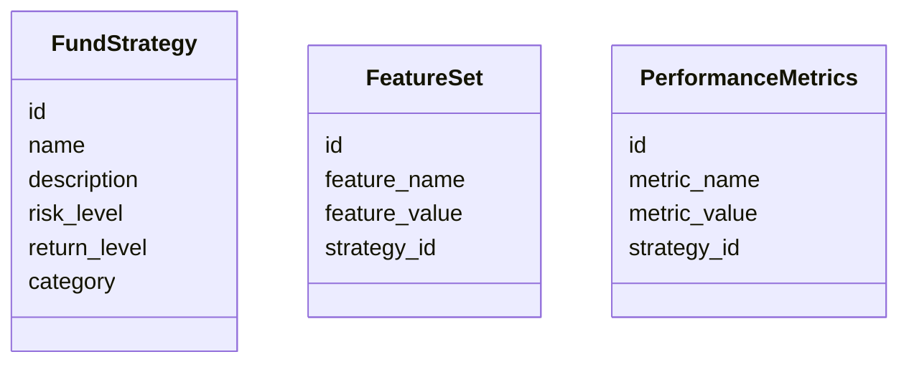

                 


# AI辅助的对冲基金策略分类与性能评估

> 关键词：对冲基金，AI辅助，策略分类，性能评估，机器学习，量化投资

> 摘要：本文深入探讨了AI技术在对冲基金策略分类与性能评估中的应用，系统介绍了对冲基金策略的核心概念、AI辅助的策略分类算法、性能评估指标与方法，以及基于机器学习的系统架构设计。通过实际案例分析和项目实战，本文旨在帮助读者理解如何利用AI技术提升对冲基金策略的分类与评估效率。

---

# 第1章: 对冲基金与AI辅助投资概述

## 1.1 对冲基金的基本概念

### 1.1.1 对冲基金的定义
对冲基金是一种通过杠杆操作、多空头策略和复杂的金融工具组合，以在市场波动中获取超额收益的投资基金。其核心目标是通过降低市场系统性风险，实现稳定的投资回报。

### 1.1.2 对冲基金的主要策略类型
对冲基金的策略类型多样，包括：
1. **股票多头策略**：基于基本面分析，寻找被低估的股票。
2. **空头策略**：做空高估的股票。
3. **配对交易策略**：同时买入低估股票，卖出高估股票。
4. **套利策略**：利用市场价差获利。
5. **统计套利策略**：基于数学模型捕捉市场机会。
6. **量化中性策略**：通过算法优化组合，降低市场风险。

### 1.1.3 对冲基金的市场规模与发展趋势
近年来，对冲基金市场规模持续增长，AI技术的引入使其策略开发和风险管理更加高效。然而，AI在对冲基金中的应用仍面临数据质量、模型过拟合和监管合规等挑战。

---

## 1.2 AI在金融领域的应用现状

### 1.2.1 AI在金融领域的核心应用领域
AI技术广泛应用于金融领域的多个方面，包括：
1. **量化交易**：利用算法进行高频交易。
2. **风险控制**：通过机器学习模型评估投资组合风险。
3. **市场预测**：基于历史数据预测市场走势。
4. **客户画像**：利用AI分析客户行为，提供个性化投资建议。

### 1.2.2 AI在对冲基金中的潜在价值
AI技术为对冲基金带来以下优势：
1. **提高交易效率**：通过算法优化交易决策。
2. **增强风险管理**：实时监控市场波动，及时调整投资策略。
3. **挖掘数据价值**：利用大数据分析发现市场机会。

### 1.2.3 当前AI辅助对冲基金的主要挑战
1. **数据质量**：金融数据的噪声和缺失值会影响模型准确性。
2. **模型过拟合**：复杂的模型可能过度拟合历史数据，导致实际交易中表现不佳。
3. **监管风险**：AI交易可能引发市场操纵和系统性风险。

---

## 1.3 本章小结

本章介绍了对冲基金的基本概念、主要策略类型以及AI在金融领域的应用现状。通过分析AI在对冲基金中的潜在价值和面临的挑战，我们为后续章节的深入探讨奠定了基础。

---

# 第2章: 对冲基金策略分类的核心概念

## 2.1 对冲基金策略分类的背景与意义

### 2.1.1 策略分类的必要性
对冲基金策略分类的目的是为了更好地理解和优化投资组合的表现。通过分类，投资者可以更清晰地识别不同策略的风险和收益特征，从而做出更明智的投资决策。

### 2.1.2 策略分类的常见方法
常见的策略分类方法包括：
1. **基于资产类别**：如股票、债券、商品等。
2. **基于交易策略**：如套利、配对交易、统计套利等。
3. **基于风险敞口**：如市场中性、多头、空头等。

### 2.1.3 策略分类的边界与外延
策略分类需要明确的分类标准和边界。例如，套利策略可以进一步细分为跨市场套利、跨期套利等。不同分类方法适用于不同的应用场景，需要结合具体需求选择合适的分类方法。

---

## 2.2 对冲基金策略的核心要素

### 2.2.1 策略类型与特征分析
不同策略类型具有不同的特征，例如：
- **股票多头策略**：长期持有优质股票，注重基本面分析。
- **统计套利策略**：依赖数学模型，注重短期价差。

### 2.2.2 策略分类的维度与层次
策略分类可以从多个维度进行，如时间跨度、资产类别、交易频率等。例如：
- **时间跨度**：短期交易、中期投资、长期持有。
- **资产类别**：股票、债券、商品、外汇等。

### 2.2.3 策略分类的实体关系图（ER图）

```mermaid
erd
    FundStrategy {
        id
        name
        description
        risk_level
        return_level
        category
    }
    StrategyFeature {
        id
        feature_name
        feature_value
        strategy_id
    }
    FundManager {
        id
        name
        management_style
        strategy_id
    }
```

---

## 2.3 本章小结

本章详细探讨了对冲基金策略分类的必要性、方法和核心要素。通过ER图展示了策略与特征的关系，为后续基于AI的策略分类奠定了基础。

---

# 第3章: AI辅助的对冲基金策略分类算法原理

## 3.1 策略分类的主要算法

### 3.1.1 监督学习算法
- **逻辑回归**：适用于二分类问题，如区分多头和空头策略。
- **支持向量机（SVM）**：适用于非线性可分问题。

### 3.1.2 无监督学习算法
- **K均值聚类**：适用于无标签数据的策略分类。
- **层次聚类**：适用于层次化的策略分类。

### 3.1.3 半监督学习算法
- **标签传播算法**：结合少量标签数据和无标签数据进行分类。

---

## 3.2 基于机器学习的策略分类流程

### 3.2.1 数据预处理与特征提取
1. **数据清洗**：处理缺失值、异常值。
2. **特征选择**：提取关键特征，如收益率、波动率等。

### 3.2.2 模型训练与优化
1. **模型训练**：使用训练数据训练分类模型。
2. **模型调优**：通过交叉验证优化模型参数。

### 3.2.3 模型评估与调优
1. **评估指标**：准确率、召回率、F1分数。
2. **性能优化**：通过网格搜索或随机搜索优化模型。

---

## 3.3 算法原理的数学模型与公式

### 3.3.1 线性回归模型
$$ y = \beta_0 + \beta_1x + \epsilon $$

### 3.3.2 支持向量机（SVM）模型
$$ \text{maximize} \quad \frac{1}{2}\|w\|^2 $$
$$ \text{subject to} \quad y_i(w \cdot x_i + b) \geq 1 $$

---

## 3.4 本章小结

本章详细介绍了AI辅助对冲基金策略分类的主要算法及其流程，通过数学公式和算法流程图展示了分类的原理和实现步骤。

---

# 第4章: 对冲基金策略性能评估的核心方法

## 4.1 策略性能评估的指标体系

### 4.1.1 收益率与风险指标
- **年化收益率（CAGR）**：$$ CAGR = \left( \prod_{i=1}^{n}(1 + r_i) \right)^{\frac{1}{n}} - 1 $$
- **最大回撤（Max Drawdown）**：$$ \text{Max Drawdown} = \max_{t} ( \text{Previous Peak} - \text{Current Value} ) $$

### 4.1.2 夏普比率与索提诺比率
- **夏普比率（Sharpe Ratio）**：$$ SR = \frac{E[r_p - r_f]}{\sigma_p} $$
- **索提诺比率（Sortino Ratio）**：$$ SR = \frac{E[r_p - r_f]}{\sqrt{\text{VaR}_p}} $$

---

## 4.2 基于机器学习的性能评估方法

### 4.2.1 策略表现预测模型
- **随机森林回归**：预测未来策略表现。

### 4.2.2 风险调整后收益模型
- **CAPM模型**：$$ R_p = R_f + \beta (R_m - R_f) $$

---

## 4.3 本章小结

本章介绍了对冲基金策略性能评估的核心指标和基于机器学习的评估方法，为后续系统架构设计和项目实战提供了理论支持。

---

# 第5章: 对冲基金策略分类与性能评估的系统架构设计

## 5.1 项目介绍

### 5.1.1 项目背景
本项目旨在利用AI技术实现对冲基金策略的分类与性能评估。

---

## 5.2 系统功能设计

### 5.2.1 领域模型


### 5.2.2 系统架构


---

## 5.3 本章小结

本章从系统架构的角度，详细设计了对冲基金策略分类与性能评估的系统结构，为后续的项目实现提供了指导。

---

# 第6章: 对冲基金策略分类与性能评估的项目实战

## 6.1 环境安装

### 6.1.1 安装Python环境
```bash
pip install python3
pip install numpy
pip install pandas
pip install scikit-learn
pip install matplotlib
```

---

## 6.2 核心代码实现

### 6.2.1 数据预处理代码
```python
import pandas as pd
import numpy as np

# 加载数据
df = pd.read_csv('strategies.csv')

# 数据清洗
df.dropna(inplace=True)
df = pd.get_dummies(df)
```

### 6.2.2 模型训练代码
```python
from sklearn.model import SVC
from sklearn.model_selection import train_test_split

# 划分数据集
X_train, X_test, y_train, y_test = train_test_split(df.drop('category', axis=1), df['category'], test_size=0.2)

# 训练模型
model = SVC()
model.fit(X_train, y_train)

# 预测与评估
print(model.score(X_test, y_test))
```

---

## 6.3 案例分析

### 6.3.1 数据来源与处理
使用某对冲基金的历史策略数据，提取收益率、波动率等特征。

### 6.3.2 模型选择与调优
选择SVM模型，并通过网格搜索优化C和gamma参数。

---

## 6.4 本章小结

本章通过实际案例分析，详细展示了对冲基金策略分类与性能评估的项目实现过程，包括环境安装、代码实现和案例分析。

---

# 第7章: 对冲基金策略分类与性能评估的未来展望

## 7.1 前沿技术探索

### 7.1.1 强化学习的应用
强化学习在复杂策略优化中的潜力。

### 7.1.2 自然语言处理（NLP）的应用
通过分析新闻和社交媒体数据，预测市场情绪。

---

## 7.2 未来发展趋势

### 7.2.1 多模态数据融合
结合文本、图像等多种数据源，提升策略分类的准确性。

### 7.2.2 可解释性增强
提高模型的可解释性，满足监管要求。

### 7.2.3 自适应优化
动态调整策略，应对市场变化。

---

## 7.3 本章小结

本章展望了对冲基金策略分类与性能评估的未来发展方向，强调了技术创新和应用拓展的重要性。

---

# 结语

通过对冲基金策略分类与性能评估的系统化研究，本文展示了AI技术在金融领域的巨大潜力。未来，随着技术的不断进步，AI将在对冲基金中发挥更加重要的作用。

---

# 参考文献

（此处列出参考文献）

---

# 致谢

感谢所有参与本项目研究和写作的人员。

---

# 附录

（此处列出附录内容，如代码、数据等）

