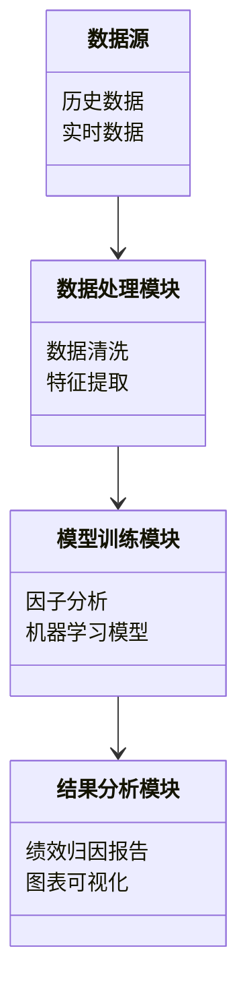

                 


# AI辅助的对冲基金绩效归因

## 关键词
AI技术、对冲基金、绩效归因、机器学习、因子分析

## 摘要
本文探讨了人工智能在对冲基金绩效归因中的应用，分析了AI如何帮助优化投资组合的表现评估。通过介绍相关算法、系统设计和实际案例，文章展示了AI在提升金融分析效率和准确性方面的潜力。

---

# 第1章: 对冲基金绩效归因概述

## 1.1 对冲基金与绩效归因的概念

### 1.1.1 对冲基金的基本定义
对冲基金是一种通过多种投资策略（如多空头寸、杠杆等）寻求绝对收益的投资工具，旨在在不同市场条件下实现正收益。

### 1.1.2 绩效归因的定义与作用
绩效归因是分析投资组合收益来源的过程，确定各个因素对总收益的贡献程度，帮助投资经理优化策略。

### 1.1.3 对冲基金绩效归因的核心要素
- 时间区间
- 业绩基准
- 多因子模型
- 风险调整后的收益

## 1.2 AI技术在金融领域的应用背景

### 1.2.1 人工智能在金融行业的应用现状
AI技术广泛应用于金融数据处理、风险评估、交易策略等领域，提升效率和准确性。

### 1.2.2 对冲基金行业对AI技术的需求
对冲基金需要高频交易、实时数据处理和复杂模式识别，AI技术满足这些需求。

### 1.2.3 绩效归因的复杂性与AI的结合
传统方法依赖统计分析，AI引入机器学习，提升复杂场景下的分析能力。

## 1.3 本章小结
本章介绍了对冲基金和绩效归因的基本概念，分析了AI技术在金融领域的应用背景及其对绩效归因的促进作用。

---

# 第2章: 绩效归因的核心概念与技术基础

## 2.1 绩效归因的核心概念

### 2.1.1 绩效归因的分类与方法
- 投资组合绩效归因
- 交易绩效归因
- 风险调整后的绩效归因

### 2.1.2 因子分析与多因子模型
因子分析用于识别影响资产收益的关键因素，多因子模型综合多个因子分析收益来源。

### 2.1.3 绩效归因的边界与外延
明确分析的范围和限制，确保归因结果的准确性和可操作性。

## 2.2 AI辅助绩效归因的技术基础

### 2.2.1 机器学习在金融分析中的应用
- 监督学习用于预测和分类
- 非监督学习用于数据聚类和异常检测

### 2.2.2 自然语言处理在金融文本分析中的应用
NLP技术用于分析财务报告和新闻，提取情感和关键信息。

### 2.2.3 时间序列分析与AI结合的可行性
利用LSTM等模型处理时间序列数据，捕捉趋势和周期性变化。

## 2.3 本章小结
本章详细阐述了绩效归因的核心概念和AI技术的基础，为后续分析奠定理论基础。

---

# 第3章: AI辅助绩效归因的核心算法原理

## 3.1 因子模型与机器学习算法

### 3.1.1 线性回归模型的数学公式
$$ y = \beta_0 + \beta_1x_1 + \beta_2x_2 + ... + \beta_nx_n + \epsilon $$

### 3.1.2 随机森林与梯度提升树的原理
随机森林通过组合多个决策树进行投票或平均，减少过拟合，提升泛化能力。

### 3.1.3 神经网络在时间序列预测中的应用
使用LSTM处理时间依赖性，捕捉长期模式。

## 3.2 基于因子模型的AI算法流程

### 3.2.1 数据预处理与特征提取
- 数据清洗
- 标准化和归一化
- 特征选择

### 3.2.2 算法选择与模型训练
- 确定模型类型
- 超参数调优
- 训练与验证

### 3.2.3 模型评估与优化
- 使用回测和前瞻测试评估模型性能
- 优化算法参数，提升准确性和稳定性

## 3.3 本章小结
本章详细介绍了AI算法在绩效归因中的应用，从因子模型到神经网络，展示了不同算法的适用场景和优势。

---

# 第4章: 系统分析与架构设计方案

## 4.1 系统分析与需求定义

### 4.1.1 问题场景介绍
- 对冲基金面临复杂市场环境，需要实时分析和调整策略
- 传统方法效率低下，难以捕捉复杂模式

### 4.1.2 项目目标与范围
- 开发AI辅助绩效归因系统，提升分析效率和准确性
- 确保系统可扩展性和稳定性

### 4.1.3 用户需求分析
- 投资经理需要实时的绩效归因分析
- 系统需支持多因子模型和机器学习算法

## 4.2 系统功能设计

### 4.2.1 领域模型设计（Mermaid类图）


## 4.3 系统架构设计（Mermaid架构图）


## 4.4 系统接口设计

### 4.4.1 API接口定义
- 数据接口：获取历史和实时数据
- 模型接口：执行因子分析和机器学习预测
- 报告接口：返回绩效归因结果

### 4.4.2 系统交互流程
1. 客户端发送请求
2. API网关接收请求并转发
3. 数据处理模块清洗数据
4. 模型训练模块执行分析
5. 结果分析模块生成报告
6. 客户端接收报告

## 4.5 本章小结
本章通过系统架构和接口设计，展示了AI辅助绩效归因系统的整体结构和功能流程。

---

# 第5章: 项目实战

## 5.1 环境安装

### 5.1.1 安装Python和必要的库
```bash
pip install numpy pandas scikit-learn xgboost matplotlib
```

### 5.1.2 安装Jupyter Notebook
```bash
pip install jupyter
```

## 5.2 系统核心实现源代码

### 5.2.1 数据预处理
```python
import pandas as pd
import numpy as np

# 加载数据
data = pd.read_csv('portfolio.csv')

# 数据清洗
data.dropna()
data = data[~data['returns'].isnull()]
```

### 5.2.2 特征工程
```python
from sklearn.preprocessing import StandardScaler

# 标准化处理
scaler = StandardScaler()
data_features = scaler.fit_transform(data[['factor1', 'factor2', 'factor3']])
```

### 5.2.3 模型训练
```python
from sklearn.ensemble import RandomForestRegressor

# 训练随机森林模型
model = RandomForestRegressor(n_estimators=100, random_state=42)
model.fit(data_features, data['returns'])
```

### 5.2.4 结果分析
```python
importances = model.feature_importances_
indices = np.argsort(importances)[::-1]

# 绘制特征重要性图表
import matplotlib.pyplot as plt

plt.figure(figsize=(10,6))
plt.title('Feature Importances')
plt.bar(range(len(importances)), importances[indices], align='center')
plt.xticks(range(len(importances)), data.columns[indices], rotation=45)
plt.xlabel('Feature')
plt.ylabel('Importance')
plt.show()
```

## 5.3 实际案例分析
假设我们有一个包含多个因子的对冲基金数据集，使用随机森林模型分析每个因子对收益的贡献。

### 5.3.1 数据加载与处理
```python
data = pd.read_csv('portfolio.csv')
data = data.dropna()
```

### 5.3.2 模型训练与评估
```python
from sklearn.metrics import mean_absolute_error

model = RandomForestRegressor(n_estimators=100, random_state=42)
model.fit(data[['factor1', 'factor2', 'factor3']], data['returns'])

# 预测
predicted = model.predict(data[['factor1', 'factor2', 'factor3']])
print(mean_absolute_error(data['returns'], predicted))
```

### 5.3.3 结果解读
通过特征重要性图表，我们可以看到各个因子对收益的贡献程度，帮助投资经理优化投资策略。

## 5.4 本章小结
本章通过实际案例展示了AI辅助绩效归因系统的核心实现，从数据处理到模型训练再到结果分析，详细讲解了每个步骤的操作。

---

# 第6章: 总结与展望

## 6.1 总结
本文详细探讨了AI技术在对冲基金绩效归因中的应用，介绍了核心算法和系统架构设计，展示了实际案例。

## 6.2 未来展望
- 更复杂的模型，如深度学习和强化学习的应用
- 处理更高维度和复杂数据的挑战
- 提升模型的可解释性和实时性

## 6.3 注意事项
- 数据质量对模型性能影响重大
- 需要结合业务知识进行模型调优
- 注意模型过拟合和欠拟合的问题

## 6.4 最佳实践Tips
- 使用多种算法进行对比分析
- 定期更新模型和数据
- 结合图表和文字进行结果展示

## 6.5 本章小结
本文总结了AI辅助绩效归因的主要内容，并展望了未来的发展方向，为读者提供了有益的参考。

---

# 参考文献
（此处列出相关书籍、论文和技术文档）

---

通过本文的系统讲解，读者可以全面了解AI在对冲基金绩效归因中的应用，掌握从理论到实践的全过程，为实际工作提供指导和借鉴。

