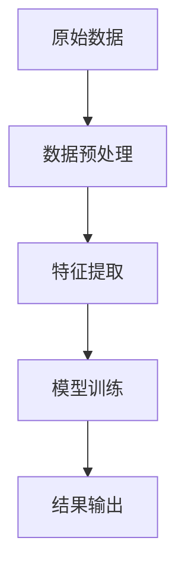
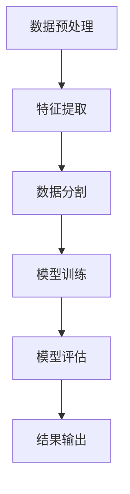
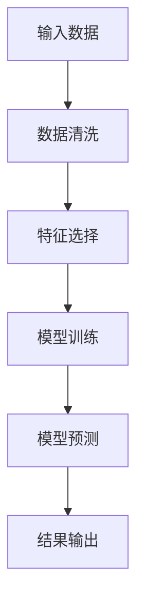
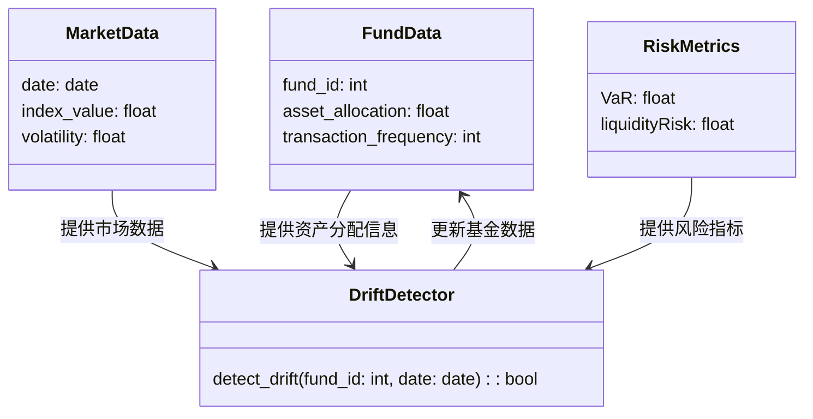
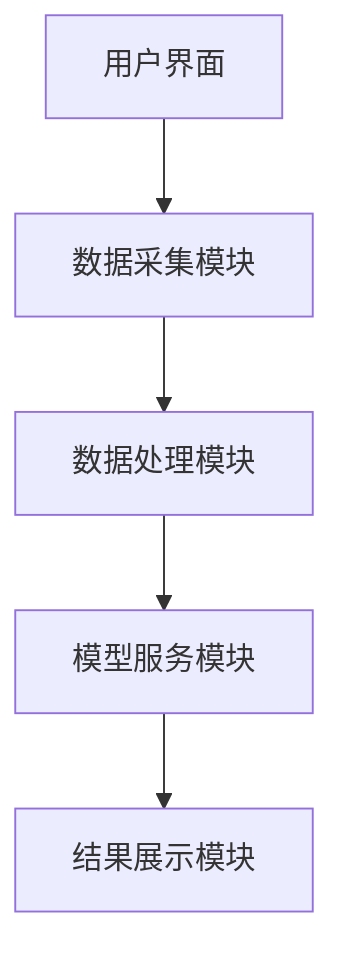
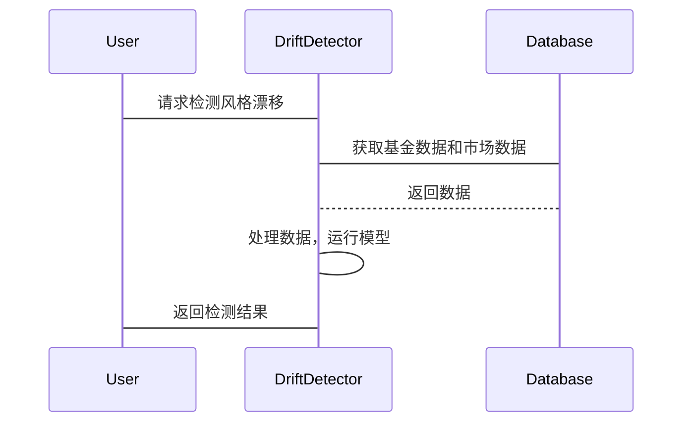

                 


# AI辅助的对冲基金风格漂移检测

> 关键词：对冲基金，风格漂移，AI检测，机器学习，金融数据分析

> 摘要：本文探讨了利用人工智能技术辅助对冲基金风格漂移检测的方法。通过分析对冲基金的基本概念、风格漂移的定义及其影响，结合AI技术的优势，详细阐述了风格漂移检测的核心概念、算法原理、系统架构设计、项目实战以及高级主题，为读者提供全面的技术解读和实践指导。

---

## 第一部分: 对冲基金风格漂移检测背景介绍

### 第1章: 对冲基金与风格漂移概述

#### 1.1 对冲基金的基本概念

对冲基金是一种通过投资证券和其他金融工具，利用市场波动进行套利和对冲风险的金融投资工具。它通常采用多种策略，如股票多空、量化对冲、事件驱动等，以实现稳定的投资收益。对冲基金的特点包括高度杠杆、复杂的交易策略以及灵活的投资组合调整能力。

##### 1.1.1 对冲基金的定义与特点
- **定义**：对冲基金是一种通过做多和做空相结合的方式，利用市场波动赚取利润的金融工具。
- **特点**：
  - **杠杆效应**：通过借入资金放大收益或损失。
  - **多样化策略**：涵盖股票、债券、衍生品等多种金融工具。
  - **高风险高回报**：适合风险承受能力强的投资者。

##### 1.1.2 对冲基金的主要策略类型
- **股票多空策略**：同时买入和卖出股票，利用价格波动获利。
- **量化对冲策略**：基于数学模型进行高频交易和算法交易。
- **事件驱动策略**：利用公司并购、重组等事件带来的股价波动获利。
- **套利策略**：利用不同市场或资产之间的价差进行无风险或低风险套利。

##### 1.1.3 对冲基金在金融市场的角色
对冲基金通过复杂的交易策略和杠杆效应，能够在市场波动中获利，同时为市场提供流动性。然而，其高杠杆和复杂策略也增加了金融市场的不稳定性。

#### 1.2 风格漂移的定义与影响

风格漂移是指对冲基金的投资策略或风险敞口与其投资目标或合同约定的策略发生偏离的现象。这种偏离可能导致基金的风险收益特征发生变化，影响投资者的预期收益和风险承受能力。

##### 1.2.1 风格漂移的定义
风格漂移是指对冲基金的实际投资行为与其公开的投资策略、目标或合同规定出现偏离的情况。

##### 1.2.2 风格漂移的常见原因
- **市场变化**：市场环境的变化可能导致基金经理调整投资策略。
- **管理人变更**：基金经理的更换可能带来投资风格的变化。
- **业绩压力**：为了追求更高的收益，基金经理可能偏离原定策略。
- **费用结构**：高额的管理费和业绩提成可能促使基金经理采取高风险策略。

##### 1.2.3 风格漂移对投资组合的影响
风格漂移可能导致投资组合的风险特征发生变化，例如增加市场风险、流动性风险或信用风险。此外，风格漂移还可能导致基金的实际收益与预期收益不符，影响投资者的信任和投资决策。

#### 1.3 AI辅助风格漂移检测的必要性

随着金融市场的复杂化和数据量的爆炸式增长，传统的风格漂移检测方法已难以满足需求。AI技术的引入为解决这一问题提供了新的思路。

##### 1.3.1 传统风格漂移检测的局限性
- **数据依赖性**：传统方法通常依赖于历史数据和统计指标，难以捕捉复杂市场环境下的细微变化。
- **主观性**：风格漂移的判断往往依赖于人的主观判断，缺乏客观性和一致性。
- **效率低下**：传统方法需要大量人工分析，效率较低，难以应对高频交易的需求。

##### 1.3.2 AI技术在金融分析中的优势
- **数据处理能力强**：AI能够处理海量的非结构化数据，提取有用的信息。
- **自动化与实时性**：AI算法可以自动分析数据并实时更新，提高了检测的效率。
- **模式识别能力**：AI能够识别复杂的模式和趋势，帮助发现潜在的风格漂移。

##### 1.3.3 AI辅助检测的潜在价值
- **提高准确性**：通过机器学习模型，可以更准确地识别风格漂移。
- **降低成本**：自动化检测减少了人工成本。
- **实时监控**：AI可以实现对对冲基金的实时监控，及时发现并预警风格漂移。

---

## 第二部分: 风格漂移检测的核心概念与联系

### 第2章: 风格漂移检测的核心概念

#### 2.1 风格漂移检测的原理

风格漂移检测的核心在于通过分析对冲基金的投资行为和市场数据，识别其投资策略是否偏离预定目标。这一过程通常包括数据预处理、特征提取、模型训练和结果解释等步骤。

##### 2.1.1 数据特征提取
- **市场数据**：包括股票价格、指数表现、市场波动率等。
- **基金数据**：包括基金的资产分配、交易频率、持仓情况等。
- **风险指标**：如VaR（Value at Risk）、波动率、流动性风险等。

##### 2.1.2 模型训练与分类
- **监督学习**：使用分类模型（如随机森林、支持向量机）对风格漂移进行分类。
- **无监督学习**：通过聚类分析发现异常行为。

##### 2.1.3 结果解释与反馈
- **解释性分析**：通过特征重要性分析，找出导致风格漂移的关键因素。
- **反馈机制**：根据检测结果调整模型或优化投资策略。

#### 2.2 核心概念对比分析

通过对比分析，可以更好地理解风格漂移检测的关键要素及其相互关系。

##### 2.2.1 数据特征与模型选择的对比
| 数据特征               | 监督学习模型         | 无监督学习模型         |
|------------------------|--------------------|------------------------|
| 数据类型               | 结构化数据           | 结构化和非结构化数据    |
| 数据量                 | 中等规模             | 大规模数据             |
| 模型目标               | 分类风格漂移         | 发现异常行为             |
| 优势                   | 高准确性             | 能够发现隐含模式         |
| 局限性                 | 需要标签数据         | 解释性较差             |

##### 2.2.2 不同风格漂移检测方法的优缺点
| 方法                   | 优点                   | 缺点                     |
|------------------------|------------------------|--------------------------|
| 基于统计的方法         | 计算简单               | 易受市场波动影响           |
| 基于机器学习的方法     | 高准确性               | 需要大量数据             |
| 基于规则的方法         | 易解释                 | 易受规则设定影响           |

##### 2.2.3 数据量与模型复杂度的关系
- **数据量小**：适合使用简单的模型（如逻辑回归）。
- **数据量大**：适合使用复杂的模型（如深度学习）。
- **数据量适中**：可以使用随机森林或梯度提升树模型。

#### 2.3 实体关系图与数据流图

##### 2.3.1 数据流图（Mermaid）


##### 2.3.2 实体关系图（Mermaid）
```mermaid
erd
    Fund[Fund]
    Strategy[Strategy]
    MarketData[Market Data]
    RiskMetrics[Risk Metrics]
    DriftDetection[Drift Detection]
    
    Fund -|-> Strategy: 定义投资策略
    Fund -|-> MarketData: 监测市场表现
    Fund -|-> RiskMetrics: 计算风险指标
    DriftDetection -|-> Strategy: 检测策略偏离
    DriftDetection -|-> MarketData: 分析市场影响
    DriftDetection -|-> RiskMetrics: 评估风险变化
```

---

## 第三部分: 算法原理讲解

### 第3章: 风格漂移检测的算法原理

#### 3.1 分类模型的构建

##### 3.1.1 分类模型的流程图（Mermaid）


##### 3.1.2 分类模型的数学公式

分类模型的目标是将对冲基金的行为分为“风格漂移”和“正常”两类。常用的是逻辑回归模型：

$$ P(y=1|x) = \frac{e^{\beta x + \alpha}}{1 + e^{\beta x + \alpha}} $$

其中，$\alpha$ 是截距项，$\beta$ 是系数向量，$x$ 是特征向量，$y$ 是标签（1表示风格漂移，0表示正常）。

#### 3.2 算法流程图（Mermaid）



#### 3.3 分类模型的代码实现

```python
import pandas as pd
from sklearn.model_selection import train_test_split
from sklearn.linear_model import LogisticRegression
from sklearn.metrics import accuracy_score

# 数据预处理
data = pd.read_csv('data.csv')
X = data.drop('drift', axis=1)
y = data['drift']

# 数据分割
X_train, X_test, y_train, y_test = train_test_split(X, y, test_size=0.2, random_state=42)

# 模型训练
model = LogisticRegression()
model.fit(X_train, y_train)

# 模型预测
y_pred = model.predict(X_test)

# 模型评估
print("Accuracy:", accuracy_score(y_test, y_pred))
```

---

## 第四部分: 系统分析与架构设计方案

### 第4章: 风格漂移检测系统设计

#### 4.1 问题场景介绍

风格漂移检测系统需要实时监测对冲基金的投资行为，及时发现并预警风格漂移现象。系统需要处理大量的市场数据和基金数据，要求高效、准确和实时。

#### 4.2 系统功能设计

##### 4.2.1 领域模型（Mermaid 类图）


#### 4.3 系统架构设计

##### 4.3.1 系统架构图（Mermaid）


#### 4.4 系统接口设计

##### 4.4.1 接口描述
- **数据采集接口**：从数据库获取基金数据和市场数据。
- **模型服务接口**：接收特征数据，返回风格漂移检测结果。
- **结果展示接口**：将检测结果展示给用户。

#### 4.5 系统交互设计（Mermaid 序列图）



---

## 第五部分: 项目实战

### 第5章: 风格漂移检测系统实现

#### 5.1 环境安装

需要安装以下依赖：

```bash
pip install pandas numpy scikit-learn matplotlib
```

#### 5.2 核心代码实现

##### 5.2.1 数据预处理代码

```python
import pandas as pd
import numpy as np

# 数据加载
data = pd.read_csv('drift_data.csv')

# 删除缺失值
data = data.dropna()

# 标准化处理
from sklearn.preprocessing import StandardScaler
scaler = StandardScaler()
X = scaler.fit_transform(data.drop('drift', axis=1))
y = data['drift'].values
```

##### 5.2.2 模型训练代码

```python
from sklearn.model_selection import train_test_split
from sklearn.ensemble import RandomForestClassifier

X_train, X_test, y_train, y_test = train_test_split(X, y, test_size=0.2, random_state=42)

model = RandomForestClassifier(n_estimators=100, random_state=42)
model.fit(X_train, y_train)
```

##### 5.2.3 模型评估代码

```python
from sklearn.metrics import classification_report

y_pred = model.predict(X_test)
print(classification_report(y_test, y_pred))
```

#### 5.3 实际案例分析

以某对冲基金为例，分析其风格漂移情况：

```python
sample_data = pd.read_csv('sample.csv')
sample_X = scaler.transform(sample_data.drop('drift', axis=1))
sample_y_pred = model.predict(sample_X)
print("风格漂移检测结果:", sample_y_pred)
```

---

## 第六部分: 高级主题与扩展阅读

### 第6章: 风格漂移检测的高级主题

#### 6.1 模型优化与调参

通过网格搜索优化模型参数：

```python
from sklearn.model_selection import GridSearchCV

param_grid = {'n_estimators': [100, 200], 'max_depth': [None, 10]}
grid_search = GridSearchCV(RandomForestClassifier(), param_grid, cv=5)
grid_search.fit(X_train, y_train)
print("最佳参数:", grid_search.best_params_)
```

#### 6.2 多模态数据分析

结合文本数据（如基金报告）进行风格漂移检测：

```python
import nltk
from sklearn.feature_extraction.text import TfidfVectorizer

text_data = data['report'].values
vectorizer = TfidfVectorizer()
text_features = vectorizer.fit_transform(text_data)
```

#### 6.3 监管与合规

确保风格漂移检测系统的合规性，符合金融监管机构的要求。

---

## 第七部分: 总结与展望

### 第7章: 总结与展望

#### 7.1 总结

本文详细介绍了AI辅助的对冲基金风格漂移检测的方法，从背景介绍、核心概念、算法原理到系统设计和项目实战，为读者提供了全面的技术解读。

#### 7.2 注意事项与最佳实践

- **数据质量**：确保数据的准确性和完整性。
- **模型解释性**：选择可解释性强的模型，便于分析和调整。
- **实时性**：优化系统架构，确保检测的实时性。

#### 7.3 拓展阅读

- 《机器学习在金融中的应用》
- 《对冲基金投资策略解析》
- 《深度学习在时间序列分析中的应用》

---

通过以上内容，读者可以全面了解AI在对冲基金风格漂移检测中的应用，掌握从理论到实践的完整流程。

