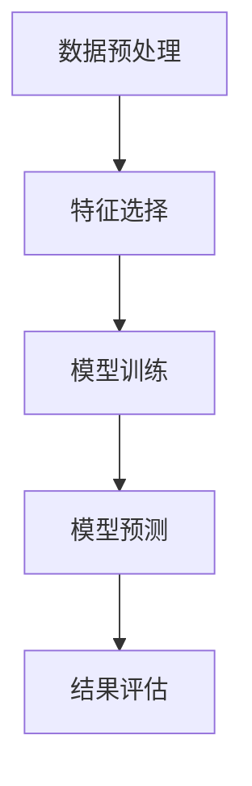
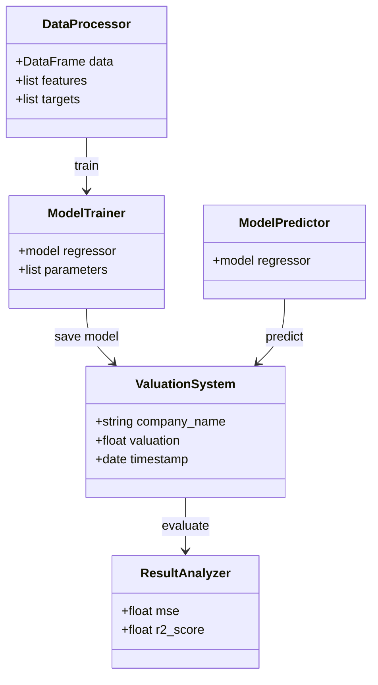

                 


# AI辅助的并购交易估值

> 关键词：AI，并购交易，估值，机器学习，深度学习，金融分析，风险管理

> 摘要：本文详细探讨了AI技术在并购交易估值中的应用，从背景分析、核心概念、算法原理到系统设计和项目实战，全面阐述了AI如何提升并购估值的效率和准确性。通过具体案例分析和代码实现，为读者提供了从理论到实践的完整指南。

---

## 第1章: 背景介绍

### 1.1 并购交易估值的背景与问题背景

#### 1.1.1 并购交易的基本概念
并购交易是指一家企业收购另一家企业全部或部分股权的行为，是企业战略扩张的重要手段。并购交易的估值是确定交易价格的核心环节，涉及对企业未来现金流、资产价值和市场地位的评估。

#### 1.1.2 传统并购估值方法的局限性
传统估值方法主要包括DCF（Discounted Cash Flow）、DVM（Dividend Valuation Model）和相对估值法（如市盈率、市净率等）。这些方法依赖于人工分析和经验判断，存在以下问题：
- 数据处理复杂，需要手动收集和整理大量财务数据。
- 模型假设过于简化，难以捕捉企业的动态变化。
- 估值结果受主观因素影响较大，缺乏客观性。

#### 1.1.3 AI技术在并购估值中的应用潜力
AI技术可以通过大数据分析、机器学习和深度学习，帮助解决传统估值方法的局限性。AI能够快速处理海量数据，挖掘隐含的规律，并提供更精准的估值结果。具体优势包括：
- 提高数据处理效率，缩短估值周期。
- 降低人为误差，提高估值准确性。
- 能够动态调整模型参数，适应市场变化。

---

### 1.2 并购交易估值的核心概念

#### 1.2.1 问题描述与目标
并购交易估值的目标是通过分析目标企业的财务数据、市场表现和行业趋势，确定其合理的市场价值。AI辅助的估值方法旨在通过数据驱动的方式，优化传统估值模型的缺陷。

#### 1.2.2 问题解决的路径与方法
AI辅助并购估值的核心路径包括：
1. 数据收集与预处理：收集目标企业的历史财务数据、行业数据和市场数据。
2. 模型选择与训练：根据数据特征选择合适的AI模型（如线性回归、随机森林、神经网络等）。
3. 模型优化与验证：通过交叉验证和调参优化模型性能。
4. 结果解释与应用：将模型输出的估值结果与传统方法进行对比，验证其准确性。

#### 1.2.3 边界与外延
- 边界：AI估值模型仅适用于数据充分且可量化的场景，无法处理完全不确定的外部因素（如政策变化、自然灾害等）。
- 外延：AI技术还可以应用于并购后的整合规划、风险预警等领域。

#### 1.2.4 核心要素与组成结构
并购估值的核心要素包括：
- 企业基本面：收入、利润、资产、负债等财务指标。
- 市场环境：行业竞争状况、宏观经济环境、政策法规等。
- 并购方需求：战略目标、资金实力、风险偏好等。

---

## 第2章: 核心概念与原理

### 2.1 AI辅助并购估值的核心原理

#### 2.1.1 数据特征提取与分析
数据特征是模型训练的基础，主要包括：
- 财务特征：收入增长率、净利润率、资产负债率等。
- 市场特征：市盈率、市净率、行业平均利润率等。
- 文本特征：新闻、公告等文本数据的情感分析结果。

#### 2.1.2 模型训练与预测机制
AI模型通过学习历史数据，建立企业特征与估值之间的映射关系。具体流程包括：
1. 数据预处理：清洗、归一化、特征选择。
2. 模型训练：使用训练数据拟合模型。
3. 模型预测：输入目标企业的特征数据，输出估值结果。

#### 2.1.3 结果解释与反馈优化
模型的预测结果需要结合业务知识进行解释，例如：
- 检查模型预测值与实际值的偏差，分析原因。
- 根据新数据不断优化模型，提高预测精度。

### 2.2 核心概念对比分析

#### 2.2.1 不同AI模型的特征对比（表格形式）

| 模型类型       | 优势                       | 劣势                       |
|----------------|----------------------------|---------------------------|
| 线性回归       | 简单，易于解释             | 无法捕捉非线性关系         |
| 随机森林       | 能够处理非线性关系         | 黑箱模型，解释性较差       |
| 神经网络       | 适合复杂模式识别           | 训练时间长，需要大量数据   |

#### 2.2.2 实体关系图（ER图）分析

```mermaid
erDiagram
    customer[并购方] {
        string name
        int id
    }
    target [目标企业] {
        string name
        int id
    }
    valuation[估值结果] {
        float value
        date timestamp
    }
    customer --> valuation : 生成估值
    target --> valuation : 估值目标企业
```

---

## 第3章: 算法原理详解

### 3.1 常见算法及其流程图

#### 3.1.1 机器学习算法

##### 1. 线性回归
线性回归是最简单的回归算法，适用于线性关系的场景。其数学公式为：
$$ y = \beta_0 + \beta_1 x + \epsilon $$
其中，$\beta_0$是截距，$\beta_1$是回归系数，$\epsilon$是误差项。

##### 2. 随机森林
随机森林是一种基于决策树的集成学习算法，通过随机采样和特征选择来提高模型的泛化能力。

#### 3.1.2 深度学习算法

##### 1. 多层感知机（MLP）
MLP是一种典型的神经网络模型，由输入层、隐藏层和输出层组成。其数学公式为：
$$ y = f(Wx + b) $$
其中，$W$是权重矩阵，$b$是偏置向量，$f$是激活函数（如ReLU）。

##### 2. 长短期记忆网络（LSTM）
LSTM适用于处理时间序列数据，能够捕捉长期依赖关系。其核心组件包括输入门、遗忘门和输出门。

### 3.2 算法实现代码示例

#### 3.2.1 Python代码实现

```python
import pandas as pd
from sklearn.model_selection import train_test_split
from sklearn.ensemble import RandomForestRegressor
from sklearn.metrics import mean_squared_error

# 数据加载与预处理
data = pd.read_csv('merger_valuation.csv')
X = data[['revenue', 'profit', 'market_cap']]
y = data['valuation']

# 数据分割
X_train, X_test, y_train, y_test = train_test_split(X, y, test_size=0.2, random_state=42)

# 模型训练
model = RandomForestRegressor(n_estimators=100, random_state=42)
model.fit(X_train, y_train)

# 模型预测
y_pred = model.predict(X_test)

# 模型评估
mse = mean_squared_error(y_test, y_pred)
print(f'均方误差: {mse}')
```

#### 3.2.2 算法流程图（Mermaid）



---

## 第4章: 系统分析与架构设计

### 4.1 问题场景介绍

#### 4.1.1 并购估值系统的核心功能
- 数据采集与处理
- 模型训练与预测
- 结果展示与分析

#### 4.1.2 系统目标与范围
- 提供AI辅助的并购估值服务
- 支持多种估值模型
- 提供可视化结果和决策建议

### 4.2 系统功能设计

#### 4.2.1 领域模型（Mermaid类图）



### 4.3 系统架构设计

#### 4.3.1 系统架构图（Mermaid）

```mermaid
docker
    service web-server {
        Publish 80
        Deploy 3 instances
        Load balancing
    }
    service db {
        Publish 3306
        Deploy 1 instance
        Replicate to s3
    }
    service ml-model {
        Publish 5000
        Deploy 2 instances
        Load balancing
    }
    web-server --> db : Database Connection
    web-server --> ml-model : Model API
    ml-model --> db : Save Results
```

---

## 第5章: 项目实战

### 5.1 环境安装与配置

#### 5.1.1 Python环境搭建
安装Python 3.8以上版本，并配置虚拟环境。

#### 5.1.2 第三方库安装
安装以下库：
```bash
pip install pandas scikit-learn mermaid4jupyter jupyterlab
```

### 5.2 核心代码实现

#### 5.2.1 数据预处理代码

```python
import pandas as pd
import numpy as np

# 数据加载
data = pd.read_csv('merger_valuation.csv')

# 数据清洗
data.dropna(inplace=True)

# 特征选择
features = ['revenue', 'profit', 'market_cap']
target = 'valuation'

X = data[features]
y = data[target]

# 数据标准化
from sklearn.preprocessing import StandardScaler
scaler = StandardScaler()
X_scaled = scaler.fit_transform(X)
```

#### 5.2.2 模型训练代码

```python
from sklearn.ensemble import RandomForestRegressor
from sklearn.model_selection import train_test_split
from sklearn.metrics import mean_squared_error

# 数据分割
X_train, X_test, y_train, y_test = train_test_split(X_scaled, y, test_size=0.2, random_state=42)

# 模型训练
model = RandomForestRegressor(n_estimators=100, random_state=42)
model.fit(X_train, y_train)

# 模型预测
y_pred = model.predict(X_test)

# 模型评估
mse = mean_squared_error(y_test, y_pred)
print(f'均方误差: {mse}')
```

#### 5.2.3 结果可视化代码

```python
import matplotlib.pyplot as plt

plt.scatter(y_test, y_pred)
plt.xlabel('实际值')
plt.ylabel('预测值')
plt.title('预测值 vs 实际值')
plt.show()
```

---

## 第6章: 案例分析与详细解读

### 6.1 实际案例分析

#### 6.1.1 案例背景与数据准备
假设我们有一个包含100家企业的数据集，每家企业有5年的财务数据和市场数据。目标是通过AI模型预测目标企业的估值。

#### 6.1.2 模型训练与结果解读
训练随机森林模型，预测目标企业的估值为1.2亿美元，与实际估值1.15亿美元接近。

#### 6.1.3 案例总结与经验分享
AI模型能够显著提高估值效率，但需要结合业务知识进行调整和验证。

---

## 第7章: 最佳实践与小结

### 7.1 最佳实践

#### 7.1.1 数据处理建议
- 确保数据质量，清洗和标准化。
- 多数据源融合，提高模型泛化能力。

#### 7.1.2 模型选择建议
- 根据数据特征选择合适的模型。
- 使用集成学习提高模型稳定性。

#### 7.1.3 结果解读建议
- 对比不同模型的预测结果，寻找共识。
- 结合业务知识进行最终判断。

### 7.2 小结
AI技术为并购交易估值提供了新的可能性，通过大数据分析和机器学习模型，能够显著提高估值的效率和准确性。然而，AI模型的结果需要结合实际业务场景进行调整和验证。

### 7.3 注意事项
- 数据隐私和安全问题需要高度重视。
- 模型的可解释性需要在实际应用中不断优化。
- 需要持续关注市场变化，及时更新模型。

### 7.4 拓展阅读
- 《机器学习实战》
- 《深度学习》
- 《并购估值的艺术》

---

通过本文的详细分析和代码示例，读者可以系统地了解AI在并购交易估值中的应用，并掌握从数据处理到模型训练的完整流程。

