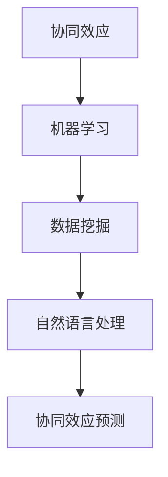
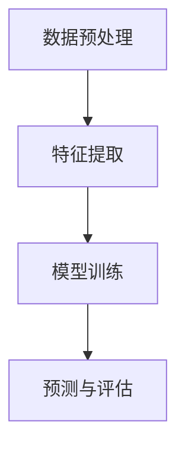
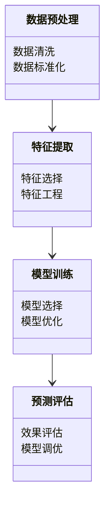
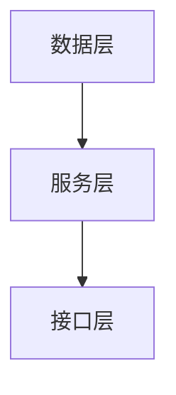

                 


# AI辅助的并购协同效应分析

> 关键词：AI技术，协同效应，并购分析，机器学习，数据挖掘，自然语言处理

> 摘要：本文将探讨如何利用人工智能技术辅助分析并购中的协同效应。通过介绍协同效应的基本概念、AI技术的核心原理以及具体的算法实现，本文旨在为企业提供一种高效、准确的并购决策支持方法。

---

## 第1章: 背景介绍

### 1.1 并购协同效应的基本概念

#### 1.1.1 协同效应的定义
协同效应（Synergy）是指企业在并购过程中，通过资源整合、资源共享等方式实现的成本节约或价值提升。协同效应的大小是衡量并购成功的重要指标。

#### 1.1.2 协同效应的类型与特点
协同效应可以分为以下几类：
- **业务协同效应**：通过业务整合、资源共享等方式实现的成本节约或收入增加。
- **财务协同效应**：通过合并财务资源、优化资本结构等方式实现的财务价值提升。
- **管理协同效应**：通过优化管理流程、共享管理经验等方式实现的效率提升。

#### 1.1.3 协同效应的实现机制
协同效应的实现机制包括以下步骤：
1. **战略规划**：明确并购目标和协同效应的具体实现路径。
2. **资源整合**：整合双方的资源，包括人力资源、财务资源、技术资源等。
3. **协同实施**：通过具体的协同措施实现协同效应。
4. **效果评估**：对协同效应的实现情况进行评估和优化。

### 1.2 AI在并购中的作用

#### 1.2.1 AI技术在并购中的应用背景
随着人工智能技术的快速发展，AI在并购中的应用越来越广泛。通过AI技术，企业可以更高效地分析并购目标的潜力、评估协同效应的大小，并制定最优的并购策略。

#### 1.2.2 AI辅助并购的优势与挑战
- **优势**：
  - 提高并购分析的效率和准确性。
  - 通过大数据分析发现潜在的协同效应。
  - 帮助企业制定最优的并购策略。
- **挑战**：
  - 数据隐私和安全问题。
  - AI模型的准确性和可解释性问题。
  - 并购过程中的不确定性因素。

#### 1.2.3 AI辅助并购的未来发展趋势
随着AI技术的不断进步，未来AI在并购中的应用将更加广泛和深入。企业可以通过AI技术实现更加智能化、个性化的并购决策支持。

### 1.3 本章小结
本章主要介绍了协同效应的基本概念、类型与特点，以及AI技术在并购中的作用、优势与挑战。通过本章的介绍，读者可以初步了解AI在并购协同效应分析中的重要性。

---

## 第2章: 核心概念与联系

### 2.1 协同效应的类型与分析框架

#### 2.1.1 协同效应的类型
协同效应可以分为以下几种：
- **业务协同效应**：通过业务整合实现的成本节约或收入增加。
- **财务协同效应**：通过合并财务资源实现的财务价值提升。
- **管理协同效应**：通过优化管理流程实现的效率提升。

#### 2.1.2 协同效应的分析框架
协同效应的分析框架包括以下几个步骤：
1. **明确并购目标**：确定并购的具体目标和协同效应的实现路径。
2. **分析协同潜力**：通过数据分析和模型预测评估协同效应的潜力。
3. **制定协同计划**：根据协同潜力制定具体的协同实施计划。
4. **评估协同效果**：对协同效应的实现情况进行评估和优化。

### 2.2 AI技术的核心原理

#### 2.2.1 机器学习在协同效应分析中的应用
机器学习可以通过对历史数据的学习，预测并购后的协同效应。常用的机器学习算法包括线性回归、支持向量机和神经网络等。

#### 2.2.2 自然语言处理在并购文档分析中的应用
自然语言处理技术可以通过对并购相关的文档进行分析，提取关键信息，帮助评估协同效应的潜力。

#### 2.2.3 数据挖掘在协同效应预测中的应用
数据挖掘技术可以通过对大量数据的挖掘和分析，发现潜在的协同效应，并制定最优的并购策略。

### 2.3 协同效应与AI技术的实体关系图



### 2.4 本章小结
本章详细介绍了协同效应的类型与分析框架，以及AI技术的核心原理。通过本章的介绍，读者可以更好地理解协同效应与AI技术之间的关系。

---

## 第3章: AI辅助协同效应分析的算法原理

### 3.1 协同过滤算法

#### 3.1.1 协同过滤的定义与原理
协同过滤是一种基于用户行为或特征相似性推荐相关物品的算法。在并购协同效应分析中，协同过滤可以用于预测并购后的协同效应。

#### 3.1.2 基于用户的协同过滤算法
基于用户的协同过滤算法通过计算用户之间的相似性，推荐与目标用户兴趣相似的物品。在并购分析中，可以用于预测并购后的协同效应。

#### 3.1.3 基于物品的协同过滤算法
基于物品的协同过滤算法通过计算物品之间的相似性，推荐与目标物品相关的物品。在并购分析中，可以用于预测并购后的协同效应。

### 3.2 聚类分析算法

#### 3.2.1 聚类分析的定义与原理
聚类分析是一种将数据划分为多个簇的技术。在并购协同效应分析中，聚类分析可以用于发现潜在的协同效应。

#### 3.2.2 K-means算法在协同效应分析中的应用
K-means算法是一种常用的聚类算法。在并购分析中，可以通过K-means算法对目标企业进行聚类分析，发现潜在的协同效应。

#### 3.2.3 层次聚类算法的应用
层次聚类算法是一种通过层次化的方式对数据进行聚类的技术。在并购分析中，可以通过层次聚类算法对目标企业进行聚类分析，发现潜在的协同效应。

### 3.3 机器学习模型

#### 3.3.1 线性回归模型
线性回归模型是一种常用的回归模型。在并购分析中，可以通过线性回归模型预测并购后的协同效应。

#### 3.3.2 支持向量机模型
支持向量机模型是一种常用的分类模型。在并购分析中，可以通过支持向量机模型对目标企业进行分类，预测并购后的协同效应。

#### 3.3.3 神经网络模型
神经网络模型是一种常用的深度学习模型。在并购分析中，可以通过神经网络模型对目标企业进行分析，预测并购后的协同效应。

### 3.4 算法流程图



### 3.5 本章小结
本章详细介绍了协同过滤、聚类分析和机器学习模型的算法原理，并通过mermaid流程图展示了算法的实现流程。通过本章的介绍，读者可以更好地理解AI辅助并购协同效应分析的实现过程。

---

## 第4章: 系统分析与架构设计

### 4.1 项目背景

#### 4.1.1 项目介绍
本项目旨在通过AI技术辅助分析并购中的协同效应，帮助企业制定最优的并购策略。

#### 4.1.2 项目目标
通过AI技术实现以下目标：
1. 预测并购后的协同效应。
2. 优化并购策略。

### 4.2 系统功能设计

#### 4.2.1 系统功能模块
系统功能模块包括数据预处理、特征提取、模型训练和预测评估。

#### 4.2.2 领域模型



### 4.3 系统架构设计

#### 4.3.1 系统架构



#### 4.3.2 系统交互

```mermaid
sequenceDiagram
    User -> 数据层: 请求数据
    数据层 -> 服务层: 提供数据
    服务层 -> 接口层: 返回数据
    User <- 接口层: 获取数据
```

### 4.4 本章小结
本章详细介绍了项目的背景、系统功能设计和系统架构设计。通过本章的介绍，读者可以更好地理解AI辅助并购协同效应分析的系统实现过程。

---

## 第5章: 项目实战

### 5.1 环境安装

#### 5.1.1 安装Python
需要安装Python 3.8及以上版本。

#### 5.1.2 安装依赖库
需要安装以下依赖库：
- numpy
- pandas
- scikit-learn
- matplotlib

### 5.2 核心代码实现

#### 5.2.1 数据预处理
```python
import pandas as pd
import numpy as np

# 数据加载
data = pd.read_csv('并购数据.csv')

# 数据清洗
data = data.dropna()

# 数据标准化
from sklearn.preprocessing import StandardScaler
scaler = StandardScaler()
data_normalized = scaler.fit_transform(data)
```

#### 5.2.2 特征提取
```python
from sklearn.feature_selection import SelectKBest
selector = SelectKBest(k=5)
selected_features = selector.fit_transform(data_normalized, target)
```

#### 5.2.3 模型训练
```python
from sklearn.model

