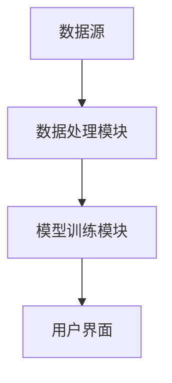
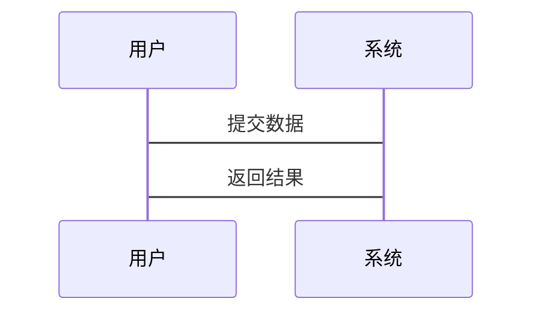

                 


# AI辅助的房地产投资分析

> 关键词：AI技术，房地产投资，数据分析，机器学习，系统架构

> 摘要：随着人工智能技术的快速发展，AI在房地产投资分析中的应用日益广泛。本文旨在探讨AI如何辅助房地产投资分析，从背景介绍、核心概念、算法原理到系统架构设计，再到项目实战和最佳实践，全面解析AI在房地产投资分析中的潜力与应用。

---

## 第1章: AI辅助的房地产投资分析基础

### 1.1 房地产投资分析的背景

#### 1.1.1 房地产市场的基本概念
房地产市场是一个复杂的系统，涉及土地、建筑物、房地产价格等多个因素。房地产投资是指通过购买、持有和管理房地产资产，以获得收益或资本增值的行为。房地产市场的波动性较高，受经济、政策、社会等多种因素影响。

#### 1.1.2 房地产投资的定义与特点
房地产投资具有高资本需求、长期性和高风险等特点。投资者需要综合考虑市场趋势、政策环境、经济周期等因素，以做出科学的投资决策。

#### 1.1.3 AI技术在房地产投资中的应用潜力
人工智能技术可以通过数据分析、模式识别和预测模型，帮助投资者更好地理解市场趋势、优化投资组合、降低投资风险。AI技术的应用可以显著提高房地产投资的效率和准确性。

### 1.2 问题背景与问题描述

#### 1.2.1 房地产投资中的主要问题
- 数据不足：房地产市场受到多种因素影响，数据收集和处理的难度较大。
- 信息不对称：投资者难以获取全面的市场信息，导致决策的不确定性增加。
- 投资决策的复杂性：房地产投资涉及多个变量，决策过程复杂且耗时。

#### 1.2.2 数据不足与信息不对称的问题
房地产市场的数据来源广泛，包括政府统计、市场调研、交易数据等。然而，数据的不完整性和不一致性可能导致分析结果的偏差。信息不对称问题使得投资者难以做出最优决策。

#### 1.2.3 投资决策的复杂性与不确定性
房地产投资涉及多个变量，如经济指标、政策变化、市场需求等。投资者需要综合考虑这些因素，但复杂性导致决策过程耗时且容易出错。

### 1.3 AI辅助房地产投资分析的核心目标

#### 1.3.1 提高投资决策的效率
通过AI技术快速分析大量数据，提供实时市场洞察，帮助投资者做出快速决策。

#### 1.3.2 优化投资组合的合理性
AI可以帮助投资者优化资产配置，降低投资风险，提高投资回报率。

#### 1.3.3 提升市场预测的准确性
通过机器学习模型，AI可以更准确地预测房地产市场的趋势，帮助投资者制定科学的投资策略。

### 1.4 本章小结
本章介绍了房地产投资的基本概念和AI技术的应用潜力，分析了投资决策中的主要问题，并明确了AI辅助房地产投资分析的核心目标。下一章将详细探讨AI辅助房地产投资分析的核心概念。

---

## 第2章: AI辅助房地产投资分析的核心概念

### 2.1 AI技术在房地产投资中的应用领域

#### 2.1.1 房地产市场预测
AI可以通过分析历史数据，预测未来房地产价格走势，帮助投资者制定投资策略。

#### 2.1.2 投资组合优化
AI可以帮助投资者优化资产配置，降低投资风险，提高投资回报率。

#### 2.1.3 风险评估与管理
AI可以评估房地产投资的风险，帮助投资者制定风险管理策略。

### 2.2 数据驱动的房地产投资分析

#### 2.2.1 数据来源与数据类型
房地产数据来源包括政府统计、市场调研、交易数据等。数据类型包括数值型数据、文本数据、时间序列数据等。

#### 2.2.2 数据清洗与预处理
数据清洗包括处理缺失值、异常值和重复数据。数据预处理包括数据标准化、特征提取等。

#### 2.2.3 数据特征分析
通过数据分析，识别影响房地产价格的关键因素，如地理位置、经济发展指标等。

### 2.3 AI模型在房地产投资分析中的作用

#### 2.3.1 回归分析与预测模型
回归分析是一种常用的统计方法，用于预测房地产价格。线性回归模型可以表示为：
$$ y = \beta_0 + \beta_1x_1 + \beta_2x_2 + \dots + \beta_nx_n + \epsilon $$
其中，$y$是目标变量，$x_i$是特征变量，$\beta_i$是回归系数，$\epsilon$是误差项。

#### 2.3.2 时间序列分析
时间序列分析用于预测房地产价格的未来走势。ARIMA模型是一种常用的时间序列模型，适用于具有趋势和周期性的数据。

#### 2.3.3 机器学习算法的应用
机器学习算法，如随机森林和神经网络，可以用于房地产价格预测和投资组合优化。

### 2.4 本章小结
本章介绍了AI技术在房地产投资中的应用领域，详细讲解了数据驱动的房地产投资分析方法，以及AI模型在投资分析中的作用。下一章将详细探讨AI辅助房地产投资分析的核心算法。

---

## 第3章: AI辅助房地产投资分析的核心算法

### 3.1 线性回归模型

#### 3.1.1 线性回归的基本原理
线性回归是一种统计方法，用于建立因变量与自变量之间的线性关系。线性回归模型可以表示为：
$$ y = \beta_0 + \beta_1x + \epsilon $$
其中，$y$是目标变量，$x$是特征变量，$\beta_0$是截距，$\beta_1$是回归系数，$\epsilon$是误差项。

#### 3.1.2 最小二乘法的数学推导
最小二乘法是一种常用的回归分析方法，用于估计回归系数。目标是最小化预测值与实际值之间的残差平方和：
$$ \text{最小化} \sum_{i=1}^n (y_i - \hat{y}_i)^2 $$
其中，$\hat{y}_i = \beta_0 + \beta_1x_i$。

#### 3.1.3 实际案例中的应用
以某城市房地产价格预测为例，假设我们有房屋面积和价格的数据，可以使用线性回归模型预测未来的价格。

### 3.2 时间序列分析

#### 3.2.1 ARIMA模型的原理
ARIMA模型是一种常用的时间序列分析方法，适用于具有趋势和周期性的数据。ARIMA模型由三个参数组成：AR（自回归）、I（差分）和MA（移动平均）。

#### 3.2.2 季节性与趋势的分解
时间序列数据可以分解为趋势、季节性、周期性和随机成分。通过分解，可以更好地理解数据的内在规律。

#### 3.2.3 模型的训练与预测
ARIMA模型的训练过程包括参数估计和模型验证。预测过程包括模型应用和结果评估。

### 3.3 机器学习算法

#### 3.3.1 随机森林算法的原理
随机森林是一种基于决策树的集成学习算法，通过构建多棵决策树并进行投票或平均，提高模型的准确性和稳定性。

#### 3.3.2 神经网络模型的应用
神经网络是一种模仿人脑结构和功能的机器学习模型，适用于复杂非线性关系的建模。神经网络模型可以用于房地产价格预测和投资组合优化。

#### 3.3.3 支持向量机的使用场景
支持向量机是一种监督学习算法，适用于分类和回归问题。支持向量机可以用于房地产市场的分类预测，如判断房价是上涨还是下跌。

### 3.4 算法的优缺点对比

#### 3.4.1 各种算法的性能对比
线性回归模型简单易用，但适用于线性关系；随机森林模型具有高准确性和鲁棒性，但计算复杂；神经网络模型适用于复杂非线性关系，但训练过程需要大量数据和计算资源。

#### 3.4.2 算法选择的注意事项
选择算法时需要考虑数据类型、问题类型和计算资源。例如，时间序列数据适合使用ARIMA模型，分类问题适合使用支持向量机。

#### 3.4.3 算法调优的技巧
算法调优包括参数优化、特征选择和模型评估。例如，通过交叉验证选择最佳参数，通过特征重要性分析选择关键特征。

### 3.5 本章小结
本章详细讲解了线性回归、时间序列分析和机器学习算法的基本原理和应用，分析了各种算法的优缺点，为后续的系统架构设计和项目实战提供了理论基础。下一章将探讨系统架构设计。

---

## 第4章: 系统架构与设计方案

### 4.1 系统功能设计

#### 4.1.1 用户需求分析
系统需要满足投资者的市场预测、投资组合优化和风险评估需求。

#### 4.1.2 功能模块划分
系统功能模块包括数据采集、数据处理、模型训练、预测分析和结果展示。

#### 4.1.3 领域模型设计
领域模型展示了系统的功能和数据流，包括数据源、数据处理模块、模型训练模块和用户界面。

### 4.2 系统架构设计

#### 4.2.1 分层架构设计
系统采用分层架构，包括数据层、业务逻辑层和用户界面层。分层架构有助于模块化开发和维护。

#### 4.2.2 微服务架构的应用
微服务架构将系统功能分解为多个独立的服务，如数据采集服务、模型训练服务和结果展示服务。微服务架构具有良好的扩展性和灵活性。

#### 4.2.3 架构图展示
以下是系统的架构图：


### 4.3 系统接口设计

#### 4.3.1 数据接口的设计
数据接口用于获取房地产市场数据，如API接口和数据库接口。数据接口需要支持多种数据格式，如JSON和CSV。

#### 4.3.2 API接口的定义
API接口定义了系统的功能和交互方式，例如：
- `/api/v1/price_predict`：房地产价格预测接口
- `/api/v1/portfolio`：投资组合优化接口

#### 4.3.3 接口文档的编写
接口文档详细描述了接口的功能、参数和返回值，方便开发者使用。

### 4.4 系统交互设计

#### 4.4.1 用户与系统的交互流程
用户通过用户界面提交数据和请求，系统通过接口处理请求并返回结果。

#### 4.4.2 交互序列图展示
以下是系统的交互序列图：


#### 4.4.3 交互设计的优化建议
优化交互设计包括简化用户操作、提高系统响应速度和提供良好的用户体验。

### 4.5 本章小结
本章详细探讨了系统架构设计，包括功能设计、架构设计、接口设计和交互设计。下一章将通过项目实战展示系统的实现过程。

---

## 第5章: 项目实战与代码实现

### 5.1 环境安装

#### 5.1.1 安装Python和相关库
需要安装Python 3.6及以上版本，以及以下库：
- NumPy
- Pandas
- scikit-learn
- matplotlib
- statsmodels

#### 5.1.2 安装开发环境
安装Jupyter Notebook或PyCharm等开发环境，用于代码编写和调试。

### 5.2 系统核心实现源代码

#### 5.2.1 数据处理代码
```python
import pandas as pd
import numpy as np

# 加载数据
data = pd.read_csv('real_estate.csv')

# 数据清洗
data.dropna(inplace=True)
data['price'] = data['price'].astype(float)
```

#### 5.2.2 模型训练代码
```python
from sklearn.linear_model import LinearRegression
from sklearn.metrics import mean_squared_error

# 训练线性回归模型
model = LinearRegression()
model.fit(data[['area']], data['price'])

# 预测房价
predictions = model.predict(data[['area']])
print('均方误差:', mean_squared_error(data['price'], predictions))
```

#### 5.2.3 结果展示代码
```python
import matplotlib.pyplot as plt

# 绘制实际值与预测值的散点图
plt.scatter(data['area'], data['price'], color='blue')
plt.scatter(data['area'], predictions, color='red')
plt.xlabel('面积')
plt.ylabel('价格')
plt.title('线性回归模型预测结果')
plt.show()
```

### 5.3 案例分析与详细讲解

#### 5.3.1 数据来源与处理
以某城市房地产交易数据为例，数据包括房屋面积、价格、地理位置等特征。数据清洗包括删除缺失值和异常值。

#### 5.3.2 模型训练与评估
使用线性回归模型训练房地产价格预测模型，并评估模型的均方误差和决定系数。

#### 5.3.3 结果分析
分析模型预测结果与实际值的差异，找出影响预测精度的关键因素，如数据特征和模型选择。

### 5.4 项目小结
本章通过实际案例展示了AI辅助房地产投资分析的实现过程，包括数据处理、模型训练和结果展示。下一章将总结最佳实践和未来研究方向。

---

## 第6章: 最佳实践与未来展望

### 6.1 最佳实践 tips

#### 6.1.1 数据质量管理
确保数据的准确性和完整性，避免数据偏差影响模型结果。

#### 6.1.2 模型选择与优化
根据具体问题选择合适的算法，通过参数调优和特征选择提高模型性能。

#### 6.1.3 系统架构优化
采用微服务架构和分布式系统，提高系统的扩展性和可用性。

### 6.2 小结
AI技术在房地产投资分析中的应用前景广阔，通过数据驱动和智能算法，可以显著提高投资决策的效率和准确性。

### 6.3 注意事项

#### 6.3.1 数据隐私与安全
房地产数据涉及个人隐私和商业机密，需注意数据的安全性和合规性。

#### 6.3.2 模型的局限性
AI模型依赖于数据质量和算法选择，可能存在过拟合和欠拟合问题。

#### 6.3.3 技术与业务的结合
AI技术的应用需要与业务需求紧密结合，避免技术驱动而忽视实际需求。

### 6.4 拓展阅读

#### 6.4.1 推荐书籍
- 《Python机器学习实战》
- 《时间序列分析》

#### 6.4.2 推荐博客和资源
- scikit-learn官方文档
- TensorFlow官方文档
- PyTorch官方文档

### 6.5 未来展望
随着AI技术的不断发展，房地产投资分析将更加智能化和自动化。未来的研究方向包括更复杂的模型、多模态数据融合和实时预测系统。

---

## 附录: 完整代码与数据集

### 附录A: 完整代码
```python
import pandas as pd
import numpy as np
from sklearn.linear_model import LinearRegression
from sklearn.metrics import mean_squared_error
import matplotlib.pyplot as plt

# 加载数据
data = pd.read_csv('real_estate.csv')

# 数据清洗
data.dropna(inplace=True)
data['price'] = data['price'].astype(float)

# 训练线性回归模型
model = LinearRegression()
model.fit(data[['area']], data['price'])

# 预测房价
predictions = model.predict(data[['area']])
print('均方误差:', mean_squared_error(data['price'], predictions))

# 绘制实际值与预测值的散点图
plt.scatter(data['area'], data['price'], color='blue')
plt.scatter(data['area'], predictions, color='red')
plt.xlabel('面积')
plt.ylabel('价格')
plt.title('线性回归模型预测结果')
plt.show()
```

### 附录B: 数据集说明
数据集包括房屋面积和价格等特征，数据来源为某城市房地产交易数据，已清洗和预处理。

---

## 参考文献
1. Hastie, T., Tibshirani, R., & Friedman, J. (2009). The Elements of Statistical Learning.
2. 吴恩达. (2016). 机器学习实战.
3. Hyndman, R. J., & Athanasopoulos, G. (2018). Forecasting: principles and practice.

---

通过以上内容，您可以逐步理解AI在房地产投资分析中的应用，从基础概念到算法实现，再到系统架构和项目实战，全面掌握AI辅助房地产投资分析的核心知识。

