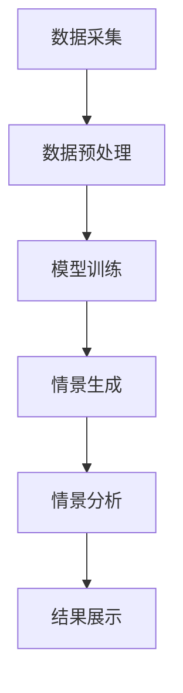

                 


# AI辅助的投资组合压力测试情景生成

---

## 关键词
AI, 投资组合, 压力测试, 情景生成, 深度学习, 生成对抗网络(GAN)

---

## 摘要
随着金融市场波动加剧，投资组合的压力测试变得越来越重要。传统的压力测试方法依赖于经验丰富的专家和复杂的模型，但在面对复杂和不确定的市场环境时，其效率和准确性往往受到限制。人工智能（AI）技术，尤其是深度学习，为压力测试情景的生成提供了新的可能性。本文详细探讨了如何利用AI技术生成投资组合压力测试情景，从核心概念、算法原理到系统架构设计，再到实际案例分析，全面解析了AI辅助压力测试的实现过程和应用价值。通过本文的阐述，读者可以深入了解AI在投资组合压力测试中的应用，掌握基于深度学习的情景生成方法，并在实际操作中应用这些技术。

---

## 第1章: 投资组合压力测试的背景与意义

### 1.1 投资组合压力测试的定义与作用

#### 1.1.1 投资组合压力测试的定义
投资组合压力测试是一种通过模拟极端市场条件下的资产表现，评估投资组合在不利情况下的风险承受能力的方法。它帮助投资者了解投资组合在市场波动、经济衰退或其他极端情况下的表现，从而制定更稳健的投资策略。

#### 1.1.2 压力测试在投资组合管理中的作用
- **风险评估**：识别投资组合在极端情况下的潜在损失。
- **策略优化**：通过模拟不同情景，优化投资组合的配置。
- **决策支持**：为投资决策提供数据支持，特别是在市场波动剧烈时。

#### 1.1.3 压力测试的常见应用场景
- **市场风险分析**：评估投资组合在市场剧烈波动时的损失。
- **信用风险评估**：分析投资组合在信用事件发生时的表现。
- **流动性风险测试**：模拟市场流动性枯竭时的投资组合表现。

---

### 1.2 AI在金融领域的应用现状

#### 1.2.1 AI在金融领域的核心应用领域
- **金融数据分析**：利用自然语言处理（NLP）和深度学习分析市场新闻、财务报表等数据。
- **交易策略优化**：通过强化学习算法优化交易策略，提高投资收益。
- **风险管理**：利用AI技术预测市场风险，优化投资组合配置。

#### 1.2.2 AI在投资组合管理中的优势
- **高效性**：AI可以快速处理大量数据，生成大量情景供分析。
- **准确性**：基于深度学习的模型能够捕捉复杂市场规律，生成更准确的情景。
- **灵活性**：AI模型可以根据市场变化动态调整，生成符合当前市场条件的情景。

#### 1.2.3 当前AI辅助压力测试的挑战与机遇
- **挑战**：市场数据的复杂性、模型的可解释性、计算资源需求。
- **机遇**：AI技术的快速发展为压力测试提供了新的工具和方法。

---

## 第2章: 压力测试情景生成的核心概念

### 2.1 压力测试情景的定义与分类

#### 2.1.1 压力测试情景的定义
压力测试情景是模拟市场在极端条件下的表现，用于评估投资组合在这些情景下的表现和风险。情景生成的关键在于模拟可能出现的极端市场情况，如剧烈波动、资产价格下跌、流动性危机等。

#### 2.1.2 压力测试情景的分类
- **市场风险情景**：如市场崩盘、资产价格大幅波动。
- **信用风险情景**：如企业违约率上升、信用利差扩大。
- **流动性风险情景**：如市场流动性枯竭，资产难以变现。

#### 2.1.3 不同类型情景生成的优缺点对比
| 情景类型 | 优点 | 缺点 |
|----------|------|------|
| 市场风险 | 模拟极端波动，评估投资组合的抗跌能力 | 需要大量历史数据支持，难以完全模拟黑天鹅事件 |
| 信用风险 | 适用于信用类产品，能够评估违约风险 | 数据获取难度大，模型复杂度高 |
| 流动性风险 | 评估市场流动性对投资组合的影响 | 情景生成复杂，难以量化 |

---

### 2.2 AI辅助情景生成的关键技术

#### 2.2.1 机器学习在情景生成中的应用
- **监督学习**：利用历史数据训练模型，预测未来市场情况。
- **无监督学习**：通过聚类分析发现市场潜在模式。

#### 2.2.2 深度学习模型的优势
- **非线性建模能力**：深度学习能够捕捉数据中的复杂关系。
- **特征提取能力**：自动提取市场数据中的有用特征。

#### 2.2.3 基于生成对抗网络（GAN）的情景生成方法
- **GAN的原理**：由生成器和判别器组成，通过对抗训练生成逼真的数据。
- **GAN的优势**：能够生成多样化的情景，模拟市场中的极端情况。

---

## 第3章: 压力测试情景生成的数学模型与算法原理

### 3.1 基于概率分布的情景生成

#### 3.1.1 概率分布的基本概念
- **概率分布**：描述随机变量取值及其概率的分布情况。
- **常见分布**：正态分布、t分布、柯西分布等。

#### 3.1.2 多变量分布的建模方法
- **多元正态分布**：适用于资产回报的建模。
- **Copula函数**：用于建模变量之间的相关性。

#### 3.1.3 基于Copula函数的联合分布建模
- **Copula函数的作用**：将边缘分布连接起来，建模变量之间的相关性。
- **应用**：用于生成具有特定相关性的资产回报情景。

---

### 3.2 基于深度学习的情景生成算法

#### 3.2.1 变量自编码器（VAE）的原理
- **VAE的基本结构**：由编码器和解码器组成，用于生成数据。
- **VAE的优势**：能够生成多样化的数据，适合用于情景生成。

#### 3.2.2 生成对抗网络（GAN）的实现
- **GAN的基本结构**：生成器和判别器对抗训练。
- **GAN的训练过程**：生成器生成数据，判别器判断数据的真假，模型通过不断优化参数进行对抗训练。

#### 3.2.3 基于Transformer的序列生成模型
- **Transformer模型**：用于生成序列数据，如时间序列。
- **应用**：用于生成具有时间依赖性的资产回报情景。

---

## 第4章: 压力测试情景生成的系统架构设计

### 4.1 系统功能模块划分

#### 4.1.1 数据采集与预处理模块
- **数据源**：市场数据、历史数据、新闻数据等。
- **数据清洗**：去除噪声数据，处理缺失值。
- **数据转换**：将数据转换为模型输入格式。

#### 4.1.2 模型训练与优化模块
- **模型选择**：选择适合的深度学习模型，如GAN、VAE等。
- **模型训练**：利用训练数据训练模型，优化模型参数。
- **模型评估**：通过验证集评估模型性能，调整超参数。

#### 4.1.3 情景生成与分析模块
- **情景生成**：利用训练好的模型生成压力测试情景。
- **情景分析**：分析情景对投资组合的影响，评估风险。

---

### 4.2 系统架构设计

#### 4.2.1 分层架构设计
- **数据层**：存储和管理市场数据。
- **模型层**：实现深度学习模型，生成情景。
- **应用层**：提供用户界面，展示情景分析结果。

#### 4.2.2 微服务架构设计
- **数据服务**：提供数据接口，供其他模块调用。
- **模型服务**：提供情景生成接口，供其他模块调用。
- **应用服务**：提供用户界面，展示情景分析结果。

#### 4.2.3 数据流与交互流程图


---

## 第5章: 基于深度学习的AI辅助情景生成实现

### 5.1 基于GAN的情景生成模型

#### 5.1.1 GAN模型的基本结构
- **生成器**：通过卷积神经网络生成数据。
- **判别器**：通过卷积神经网络判断数据的真实性。

#### 5.1.2 判别器与生成器的对抗训练过程
- **对抗训练**：生成器和判别器同时训练，生成器生成的数据越来越逼真，判别器的判断能力越来越强。
- **损失函数**：使用交叉熵损失函数，衡量生成数据的真假。

#### 5.1.3 模型训练的数学公式推导
- **生成器的损失函数**：$$ \mathcal{L}_G = -\mathbb{E}_{z}[ \log(D(G(z))) ] $$
- **判别器的损失函数**：$$ \mathcal{L}_D = -\mathbb{E}_{x}[ \log(D(x)) ] - \mathbb{E}_{z}[ \log(1-D(G(z))) ] $$

---

### 5.2 模型训练与优化

#### 5.2.1 数据准备
- **数据来源**：历史市场数据，包括资产回报、波动率等。
- **数据预处理**：标准化、去噪等。

#### 5.2.2 模型训练
- **训练数据**：利用历史数据训练GAN模型。
- **训练过程**：交替训练生成器和判别器，优化模型参数。

#### 5.2.3 模型优化
- **超参数调整**：调整学习率、批量大小等超参数。
- **模型评估**：通过验证集评估模型性能，调整模型结构。

---

## 第6章: 项目实战——基于GAN的投资组合压力测试情景生成

### 6.1 项目背景
- **目标**：利用GAN生成投资组合压力测试情景。
- **数据集**：使用历史市场数据，包括资产回报、波动率等。

### 6.2 环境安装
- **Python**：3.8及以上版本。
- **深度学习框架**：TensorFlow或Keras。
- **其他依赖**：numpy、pandas、matplotlib等。

### 6.3 核心实现

#### 6.3.1 数据准备
```python
import numpy as np
import pandas as pd

# 加载数据
data = pd.read_csv('market_data.csv')

# 数据预处理
data = data[['return1', 'return2', 'return3']]  # 假设我们关注三个资产的回报
data = data.values
```

#### 6.3.2 模型构建
```python
import tensorflow as tf
from tensorflow.keras import layers

# 定义生成器
def generator():
    model = tf.keras.Sequential()
    model.add(layers.Dense(256, activation='relu', input_shape=(100,)))
    model.add(layers.Dense(3, activation='linear'))
    return model

# 定义判别器
def discriminator():
    model = tf.keras.Sequential()
    model.add(layers.Dense(256, activation='relu', input_shape=(3,)))
    model.add(layers.Dense(1, activation='sigmoid'))
    return model

# 初始化模型
generator_model = generator()
discriminator_model = discriminator()
```

#### 6.3.3 模型训练
```python
# 定义损失函数
cross_entropy = tf.keras.losses.BinaryCrossentropy()

# 定义优化器
generator_optimizer = tf.keras.optimizers.Adam(0.0002)
discriminator_optimizer = tf.keras.optimizers.Adam(0.0002)

# 定义对抗训练过程
def train_step(real_data, generator, discriminator, generator_optimizer, discriminator_optimizer):
    # 生成假数据
    noise = tf.random.normal([real_data.shape[0], 100])
    generated_data = generator(noise)

    # 训练判别器
    with tf.GradientTape() as tape:
       判别器_loss = cross_entropy(判别器(真实数据), 判别器(生成数据))
    判别器_grad = tape.gradient(判别器_loss, 判别器.trainable_weights)
    判别器_optimizer.apply_gradients(判别器.trainable_weights, 判别器_grad)

    # 训练生成器
    with tf.GradientTape() as tape:
       生成器_loss = cross_entropy(判别器(生成数据), 判别器(生成数据))
    生成器_grad = tape.gradient(生成器_loss, 生成器.trainable_weights)
    生成器_optimizer.apply_gradients(生成器.trainable_weights, 生成器_grad)

# 开始训练
for epoch in range(100):
    for batch in batches:
        train_step(real_data, generator, discriminator, generator_optimizer, discriminator_optimizer)
```

#### 6.3.4 情景生成与分析
```python
# 生成情景
noise = tf.random.normal([1, 100])
generated_data = generator(noise)

# 分析情景
print("生成的情景数据为：", generated_data.numpy())
```

---

## 第7章: 总结与展望

### 7.1 总结
本文详细探讨了AI辅助的投资组合压力测试情景生成方法，从核心概念、算法原理到系统架构设计，再到实际案例分析，全面解析了基于深度学习的压力测试情景生成技术。通过本文的阐述，读者可以深入了解如何利用AI技术生成投资组合压力测试情景，并在实际操作中应用这些技术。

### 7.2 展望
随着AI技术的不断发展，投资组合压力测试情景生成技术将更加智能化和高效化。未来的研究方向包括：
- **更复杂的模型**：如基于Transformer的模型，用于生成更复杂的市场情景。
- **多模态数据的应用**：结合文本、图像等多种数据源，生成更全面的市场情景。
- **模型的可解释性**：提高模型的可解释性，增强投资者对生成情景的信任。

---

## 附录: 更多资源与推荐阅读

- **推荐阅读**：
  - Goodfellow, I., Bengio, Y., & Courville, A. (2016). *Deep Learning*. MIT Press.
  - Hull, J. C. (2006). *Options, Futures, and Other Derivatives*. Prentice Hall.
- **推荐阅读博客**：
  - [深入理解生成对抗网络](https://zhuanlan.zhihu.com/p/...)
  - [深度学习在金融中的应用](https://zhuanlan.zhihu.com/p/...)
- **工具与库**：
  - TensorFlow官方文档：https://tensorflow.org
  - Keras官方文档：https://keras.io

---

通过本文的详细阐述，读者可以系统地了解AI辅助的投资组合压力测试情景生成技术，并在实际应用中利用这些技术优化投资组合的风险管理。

