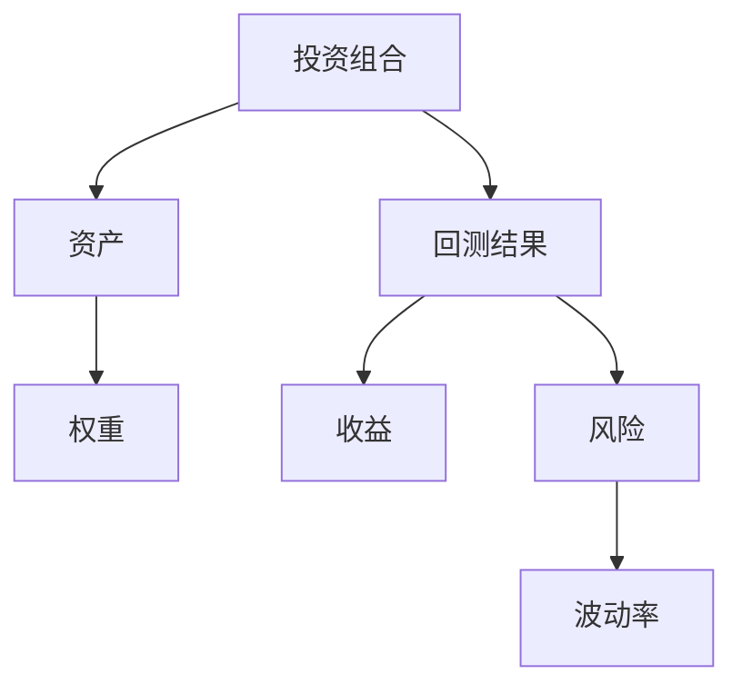
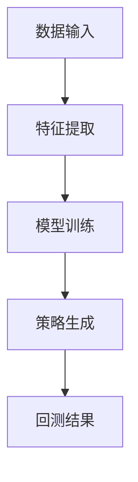
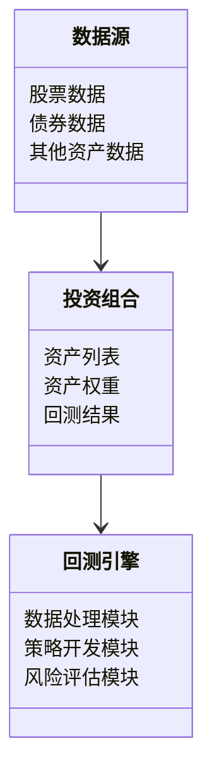
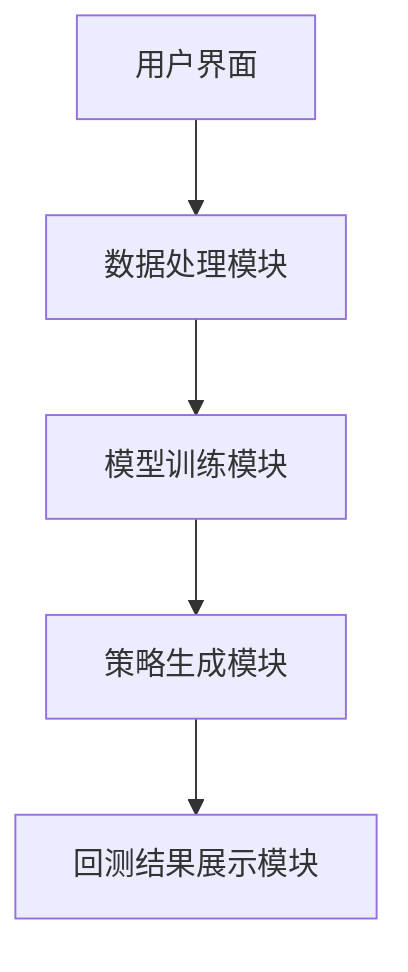
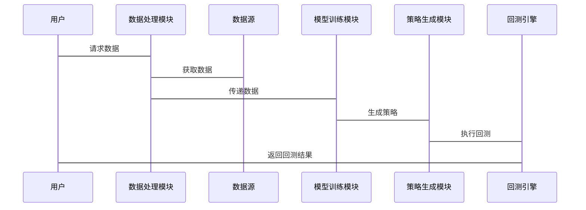

                 


# AI辅助的投资组合回测平台

## 关键词：AI, 投资组合, 回测, 机器学习, 金融, 算法

## 摘要：随着人工智能技术的快速发展，AI在金融领域的应用越来越广泛。本文将探讨如何利用AI技术辅助投资组合的回测过程，从背景介绍、核心概念、算法原理到系统架构，再到项目实战，全面解析AI在投资组合回测中的应用。通过本文，读者将了解AI如何提升投资组合回测的效率和准确性，掌握相关的核心技术与实现方法。

---

# 第1章: 投资组合回测与AI辅助的背景

## 1.1 投资组合回测的基本概念

### 1.1.1 投资组合回测的定义
投资组合回测是指通过对历史数据进行模拟交易，评估投资组合在不同市场条件下的表现，从而验证和优化投资策略。其核心目标是通过历史数据分析，预测投资组合在未来的潜在收益和风险。

### 1.1.2 投资组合回测的目的与意义
- **目的**：验证投资策略的有效性，评估投资组合的风险和收益。
- **意义**：通过回测，投资者可以更科学地制定投资策略，降低投资风险。

### 1.1.3 投资组合回测的核心要素
- 数据来源：历史价格、成交量、财务指标等。
- 策略选择：均值-方差模型、动量策略、因子模型等。
- 风险控制：最大回撤、VaR（Value at Risk）等风险指标。

## 1.2 AI在金融领域的应用现状

### 1.2.1 AI在金融领域的主要应用领域
- **股票预测**：利用机器学习模型预测股票价格走势。
- **风险控制**：通过AI技术评估投资组合的风险。
- **量化交易**：基于算法生成交易信号。

### 1.2.2 AI在投资组合管理中的优势
- **数据处理能力**：AI能够快速处理大量金融数据，提取有效特征。
- **策略优化**：AI可以通过历史数据优化投资组合的配置。
- **实时监控**：AI能够实时监控市场变化，及时调整投资策略。

### 1.2.3 当前AI辅助投资组合回测的挑战
- **数据质量**：历史数据可能存在偏差，影响模型的准确性。
- **模型过拟合**：AI模型可能在历史数据上过拟合，导致实际表现不佳。
- **市场变化**：金融市场具有不确定性，AI模型需要不断更新和调整。

## 1.3 AI辅助投资组合回测的必要性

### 1.3.1 传统回测方法的局限性
- **计算复杂**：传统回测需要手动处理大量数据，耗时且容易出错。
- **策略有限**：传统方法依赖固定策略，难以应对复杂市场变化。
- **人为干扰**：人为判断可能影响回测结果的客观性。

### 1.3.2 AI如何提升回测效率与准确性
- **自动化处理**：AI能够自动采集、清洗和分析数据，提高回测效率。
- **策略多样性**：AI可以生成多种策略，覆盖更多市场场景。
- **动态调整**：AI能够根据市场变化实时调整投资策略，提高准确性。

### 1.3.3 AI辅助回测的未来发展趋势
- **智能化**：AI将更加智能化，能够自主学习和优化策略。
- **个性化**：根据投资者的个性化需求，提供定制化投资组合回测服务。
- **多模态数据融合**：结合文本、图像等多种数据源，提升回测的准确性。

## 1.4 本章小结
本章介绍了投资组合回测的基本概念、AI在金融领域的应用现状以及AI辅助投资组合回测的必要性。通过分析，我们可以看到AI在提升回测效率和准确性方面具有巨大潜力，但也需要克服一些挑战。

---

# 第2章: AI辅助投资组合回测的核心概念

## 2.1 AI在投资组合回测中的角色

### 2.1.1 AI作为数据处理工具
- **数据清洗**：去除异常值和缺失值。
- **特征提取**：从历史数据中提取有效特征，如动量、波动率等。

### 2.1.2 AI作为策略优化工具
- **策略生成**：基于历史数据生成投资策略。
- **策略优化**：通过机器学习优化策略参数，提高收益和降低风险。

### 2.1.3 AI作为风险评估工具
- **风险预测**：预测投资组合的风险，如最大回撤、VaR等。
- **风险控制**：根据风险预测结果，调整投资组合配置。

## 2.2 投资组合回测的关键步骤

### 2.2.1 数据收集与预处理
- **数据来源**：股票价格、成交量、财务指标等。
- **数据清洗**：处理缺失值、异常值等。
- **数据标准化**：对数据进行标准化处理，方便模型训练。

### 2.2.2 策略开发与回测
- **策略开发**：基于数据开发投资策略，如动量策略、均值-方差模型等。
- **回测模拟**：通过回测平台对策略进行模拟交易，评估策略表现。
- **策略优化**：根据回测结果优化策略参数，提高收益和降低风险。

### 2.2.3 风险评估与优化
- **风险评估**：评估投资组合的风险，如VaR、最大回撤等。
- **风险优化**：根据风险评估结果，调整投资组合配置，降低风险。

## 2.3 AI辅助回测的核心技术

### 2.3.1 机器学习在回测中的应用
- **监督学习**：用于分类和回归问题，如股票价格预测。
- **无监督学习**：用于聚类分析，如客户分群。
- **强化学习**：用于动态策略调整，如量化交易。

### 2.3.2 自然语言处理在金融文本分析中的应用
- **情感分析**：分析新闻和社交媒体情绪，预测股价波动。
- **实体识别**：识别公司名称、行业等信息，辅助投资决策。
- **文本挖掘**：从大量文本数据中提取有用信息，辅助策略开发。

### 2.3.3 时间序列分析在回测中的应用
- **ARIMA模型**：用于时间序列预测。
- **GARCH模型**：用于波动率预测。
- **LSTM模型**：用于长期依赖关系的预测。

## 2.4 核心概念的ER实体关系图



## 2.5 本章小结
本章详细介绍了AI在投资组合回测中的角色，包括数据处理、策略优化和风险评估。同时，分析了回测的关键步骤和核心技术，为后续章节的深入分析奠定了基础。

---

# 第3章: AI辅助投资组合回测的算法原理

## 3.1 常见的回测算法

### 3.1.1 简单移动平均线（SMA）策略
- **原理**：根据一定周期内的平均价格，判断买入或卖出信号。
- **实现步骤**：
  1. 计算N天的平均价格。
  2. 当当前价格高于N天平均价格时，买入；低于时，卖出。

### 3.1.2 相对强弱指数（RSI）策略
- **原理**：通过计算一定周期内的相对强弱，判断超买或超卖信号。
- **实现步骤**：
  1. 计算N天内的涨跌幅度。
  2. 计算RSI值，当RSI高于80时为超买，低于20时为超卖。

### 3.1.3 马科维茨均值-方差模型
- **原理**：通过优化投资组合的收益和风险，找到最优资产配置。
- **数学公式**：
  $$ E(r_p) = \sum_{i=1}^n w_i E(r_i) $$
  $$ Var(r_p) = \sum_{i=1}^n \sum_{j=1}^n w_i w_j \sigma_{ij} $$

## 3.2 基于机器学习的回测算法

### 3.2.1 线性回归模型
- **原理**：通过线性关系，预测股票价格。
- **数学公式**：
  $$ y = \beta_0 + \beta_1 x + \epsilon $$

### 3.2.2 支持向量机（SVM）模型
- **原理**：通过寻找最优超平面，实现分类或回归。
- **数学公式**：
  $$ \text{最大化} \quad \frac{1}{2} \|w\|^2 $$
  $$ \text{满足} \quad y_i (w \cdot x_i + b) \geq 1 $$

### 3.2.3 随机森林模型
- **原理**：通过集成学习，提高模型的准确性和鲁棒性。
- **实现步骤**：
  1. 从数据集中随机抽取样本，构建决策树。
  2. 对决策树进行投票或平均，得到最终结果。

## 3.3 神经网络在回测中的应用

### 3.3.1 基于RNN的时序预测
- **原理**：利用循环神经网络处理时间序列数据。
- **数学公式**：
  $$ s_t = \tanh(W_{ff} x_t + W_{rn} s_{t-1} + b) $$
  $$ y_t = W_{out} s_t + b_{out} $$

### 3.3.2 基于CNN的金融数据特征提取
- **原理**：利用卷积神经网络提取金融数据的特征。
- **数学公式**：
  $$ y = \text{maxpool}(W \ast x + b) $$

### 3.3.3 神经网络回测策略的实现流程
1. 数据预处理：清洗和标准化数据。
2. 模型训练：训练神经网络模型。
3. 策略生成：根据模型预测结果生成交易信号。
4. 回测模拟：对策略进行回测，评估表现。

## 3.4 算法流程图



## 3.5 数学模型与公式

### 3.5.1 马科维茨均值-方差模型
$$ E(r_p) = \sum_{i=1}^n w_i E(r_i) $$
$$ Var(r_p) = \sum_{i=1}^n \sum_{j=1}^n w_i w_j \sigma_{ij} $$

### 3.5.2 线性回归模型
$$ y = \beta_0 + \beta_1 x + \epsilon $$

### 3.5.3 支持向量机模型
$$ \text{最大化} \quad \frac{1}{2} \|w\|^2 $$
$$ \text{满足} \quad y_i (w \cdot x_i + b) \geq 1 $$

## 3.6 本章小结
本章详细介绍了常见的回测算法及其基于机器学习的实现方法，包括线性回归、随机森林和神经网络等。通过数学公式和流程图，读者可以清晰地理解这些算法的原理和实现步骤。

---

# 第4章: 系统分析与架构设计方案

## 4.1 问题场景介绍

### 4.1.1 系统目标
开发一个基于AI的投资组合回测平台，实现投资组合的自动回测、策略优化和风险评估。

### 4.1.2 系统功能需求
- 数据采集与处理：从多个数据源采集金融数据，清洗和标准化。
- 策略开发与回测：支持多种投资策略的开发和回测。
- 风险评估与优化：评估投资组合的风险，优化资产配置。

### 4.1.3 系统边界与范围
- 数据范围：股票、基金、期货等金融资产。
- 功能范围：数据处理、策略开发、回测模拟、风险评估。
- 用户范围：机构投资者、个人投资者。

## 4.2 项目介绍

### 4.2.1 项目目标
开发一个智能化的投资组合回测平台，帮助用户优化投资策略，降低投资风险。

### 4.2.2 项目背景
随着AI技术的快速发展，越来越多的投资者开始利用AI技术进行投资决策。投资组合回测是投资决策的重要环节，AI技术可以显著提高回测的效率和准确性。

## 4.3 系统功能设计

### 4.3.1 领域模型设计


### 4.3.2 系统架构设计


### 4.3.3 系统接口设计
- 数据接口：与数据源对接，获取金融数据。
- 策略接口：与策略开发模块对接，生成交易信号。
- 回测接口：与回测引擎对接，执行回测模拟。

### 4.3.4 系统交互设计


## 4.4 本章小结
本章详细介绍了投资组合回测平台的系统架构设计，包括领域模型、系统架构、接口设计和交互设计。通过这些设计，我们可以实现投资组合回测的自动化和智能化。

---

# 第5章: 项目实战

## 5.1 环境安装

### 5.1.1 安装Python
- 下载并安装Python 3.8及以上版本。
- 安装pip：`python get-pip.py`

### 5.1.2 安装依赖库
- NumPy：`pip install numpy`
- Pandas：`pip install pandas`
- Scikit-learn：`pip install scikit-learn`
- TensorFlow：`pip install tensorflow`
- Matplotlib：`pip install matplotlib`

## 5.2 系统核心实现源代码

### 5.2.1 数据处理模块
```python
import numpy as np
import pandas as pd

def load_data(filePath):
    df = pd.read_csv(filePath)
    return df

def preprocess_data(df):
    df = df.dropna()
    df = (df - df.mean()) / df.std()
    return df

if __name__ == "__main__":
    df = load_data("stock_data.csv")
    df_processed = preprocess_data(df)
    print(df_processed.head())
```

### 5.2.2 回测引擎模块
```python
from backtrader import Strategy, Broker, Trade

class SimpleStrategy(Strategy):
    def __init__(self):
        self.position = None

    def go_long(self):
        self.position = self.buy()

    def go_short(self):
        self.position = self.sell()

    def on_close(self):
        if self.position:
            self.position.close()
```

### 5.2.3 风险评估模块
```python
import numpy as np

def calculate VaR(returns, confidence_level=0.95):
    sorted_returns = np.sort(returns)
    VaR = sorted_returns[int(len(returns) * (1 - confidence_level))]
    return VaR
```

## 5.3 代码应用解读与分析

### 5.3.1 数据处理模块解读
- **功能**：从CSV文件中加载数据，删除缺失值，标准化数据。
- **实现**：使用Pandas库进行数据处理，使用NumPy库进行标准化。

### 5.3.2 回测引擎模块解读
- **功能**：实现简单的买卖策略，根据价格波动发出交易信号。
- **实现**：使用Backtrader库进行回测，定义买入和卖出信号。

### 5.3.3 风险评估模块解读
- **功能**：计算投资组合的VaR值，评估潜在损失。
- **实现**：使用NumPy库进行排序和计算。

## 5.4 实际案例分析

### 5.4.1 案例背景
假设我们有一个股票数据集，包含过去5年的每日收盘价。

### 5.4.2 案例实现
```python
import backtrader as bt

class MyStrategy(bt.Strategy):
    def __init__(self):
        self.buy_signal = False
        self.sell_signal = False

    def next(self):
        if self.data.close > self.data.close.mean():
            self.buy_signal = True
        if self.data.close < self.data.close.mean():
            self.sell_signal = True

        if self.buy_signal and not self.position:
            self.buy()
        if self.sell_signal and self.position:
            self.sell()

if __name__ == "__main__":
    cerebro = bt.Cerebro()
    cerebro.addstrategy(MyStrategy)
    data = bt.feeds.PandasData(dataname=df_processed)
    cerebro.adddata(data)
    cerebro.run()
```

### 5.4.3 案例分析
- **策略表现**：通过回测，我们可以看到该策略在某些市场条件下表现良好，但在其他情况下可能表现不佳。
- **风险评估**：通过VaR计算，我们可以评估该策略在极端情况下的潜在损失。

## 5.5 本章小结
本章通过实际案例，展示了如何利用Python和相关库实现投资组合回测平台的核心功能。通过代码实现，读者可以更好地理解AI在投资组合回测中的应用。

---

# 第6章: 最佳实践与注意事项

## 6.1 小结

### 6.1.1 核心观点总结
- AI技术可以显著提高投资组合回测的效率和准确性。
- 需要结合具体市场情况，选择合适的算法和策略。

### 6.1.2 本章总结
通过本文的介绍，读者可以全面了解AI辅助投资组合回测的核心概念、算法原理和系统架构。

## 6.2 注意事项

### 6.2.1 数据质量问题
- 数据的准确性和完整性对回测结果影响重大。
- 需要确保数据来源可靠，数据清洗充分。

### 6.2.2 模型过拟合问题
- 需要通过交叉验证等方法，避免模型过拟合。
- 选择合适的评估指标，如准确率、召回率等。

### 6.2.3 市场变化问题
- 金融市场具有不确定性，模型需要不断更新和调整。
- 需要结合市场变化，动态优化投资策略。

## 6.3 拓展阅读

### 6.3.1 推荐书籍
- 《Python金融大数据分析》
- 《机器学习在金融中的应用》

### 6.3.2 推荐博客和网站
- QuantInst International
- Quantitative Research and Data Science

### 6.3.3 其他资源
- GitHub上的开源项目
- 专业金融论坛和社区

## 6.4 本章小结
本章总结了本文的主要内容，并提出了在实际应用中的注意事项和拓展资源，帮助读者更好地理解和应用AI辅助投资组合回测技术。

---

# 附录: 参考文献

- Bollerslev, Tim. "Generalized autoregressive conditional heteroskedasticity." Journal of econometrics 31.2 (1985): 307-327.
- Engle, Robert F. "Autoregressive conditional heteroskedasticity with estimates of the variance of

