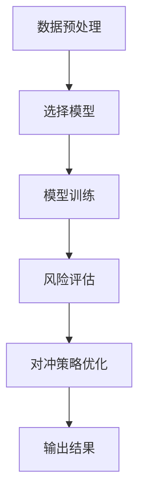
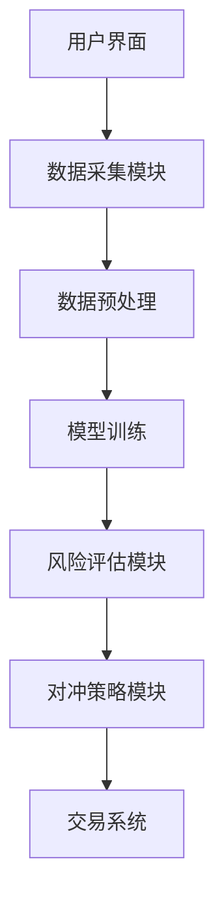
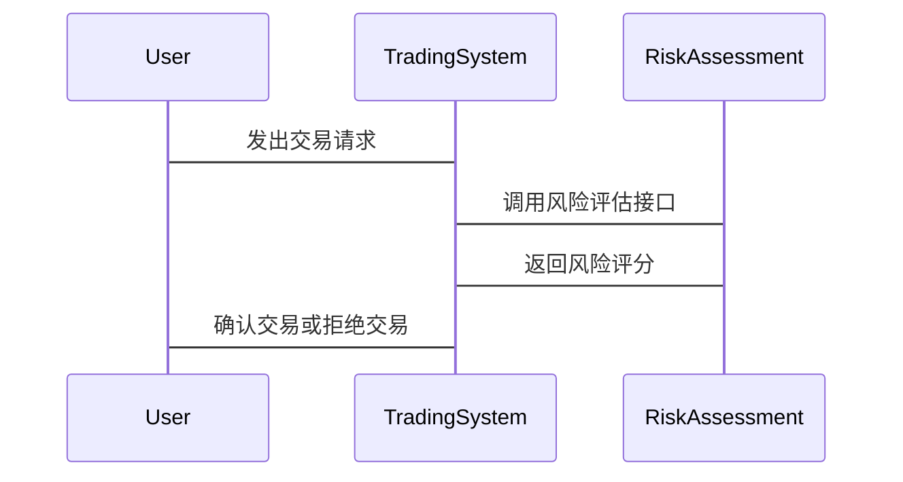

                 


# AI辅助的投资组合尾部风险对冲策略

> 关键词：AI辅助，投资组合，尾部风险，风险对冲，机器学习，深度学习，自然语言处理

> 摘要：本文探讨了AI技术在投资组合尾部风险对冲中的应用，详细分析了传统方法的局限性，提出了基于机器学习和深度学习的对冲策略。文章涵盖了核心概念、算法原理、系统架构及项目实战，提供了丰富的代码示例和案例分析，帮助读者全面理解AI在金融风险管理中的潜力与实现方法。

---

## 第1章: 尾部风险与投资组合管理概述

### 1.1 尾部风险的定义与特征

#### 1.1.1 尾部风险的定义
尾部风险（Tail Risk）是指在概率分布曲线的尾部区域发生的小概率但高影响的事件，这些事件可能对投资组合造成重大损失。例如，市场崩盘、黑天鹅事件等。

#### 1.1.2 尾部风险的特征
- 低概率性：尾部事件发生的概率较低，但影响巨大。
- 不可预测性：尾部事件往往难以预测，传统模型难以捕捉。
- 高损失性：一旦发生，可能导致投资组合的重大损失。

#### 1.1.3 尾部风险对投资组合的影响
尾部风险可能导致投资组合的大幅亏损，甚至引发流动性危机，影响整体投资策略的有效性。

### 1.2 投资组合管理的传统方法

#### 1.2.1 投资组合管理的基本概念
投资组合管理是通过优化资产配置来实现风险与收益的平衡。传统方法依赖于均值-方差模型等统计方法。

#### 1.2.2 传统风险对冲策略
- 利用衍生品对冲风险，如期货、期权等。
- 分散投资以降低特定资产的风险。

#### 1.2.3 传统方法的局限性
- 传统模型假设资产回报服从正态分布，忽视了尾部风险。
- 无法有效捕捉低概率但高影响的事件。

### 1.3 AI技术在金融领域的应用前景

#### 1.3.1 AI在金融分析中的应用
- 价格预测：利用机器学习模型分析历史数据，预测未来价格。
- 市场情绪分析：通过NLP技术分析新闻和社交媒体，评估市场情绪。

#### 1.3.2 AI在投资组合管理中的潜力
- 提高风险识别能力，优化资产配置。
- 实时监控市场动态，及时调整投资策略。

#### 1.3.3 金融AI技术的发展趋势
AI技术在金融领域的应用将更加广泛，特别是在风险管理、交易策略和客户行为分析方面。

### 1.4 本章小结
本章介绍了尾部风险的定义和特征，分析了传统投资组合管理的局限性，并探讨了AI技术在金融领域的应用前景，为后续内容奠定了基础。

---

## 第2章: AI辅助对冲的核心概念

### 2.1 AI辅助对冲的基本原理

#### 2.1.1 机器学习在风险识别中的应用
- 监督学习：利用历史数据训练模型识别潜在风险。
- 无监督学习：通过聚类分析发现异常模式。

#### 2.1.2 深度学习在尾部风险预测中的优势
- 深度学习能够捕捉复杂的非线性关系，适合处理金融数据中的复杂模式。
- LSTM网络在时间序列预测中表现优异。

#### 2.1.3 自然语言处理在市场情绪分析中的作用
NLP技术可以分析新闻、报告和社交媒体，评估市场情绪，辅助风险预测。

### 2.2 尾部风险对冲的关键技术

#### 2.2.1 异常检测算法
- 聚类算法：如K-Means，用于识别数据中的异常点。
- 基于深度学习的异常检测：如Autoencoder，能够捕捉复杂的异常模式。

#### 2.2.2 时间序列分析
- ARIMA模型：适合处理平稳时间序列数据。
- LSTM网络：能够捕捉时间序列中的长期依赖关系。

#### 2.2.3 风险建模与评估
- 风险评估模型：如VaR（Value at Risk）和CVaR（Conditional Value at Risk）。
- 对冲策略优化：通过遗传算法等优化方法寻找最优对冲组合。

### 2.3 AI辅助对冲的核心要素对比

#### 2.3.1 传统对冲方法与AI对冲方法的对比

| 对比维度 | 传统方法 | AI方法 |
|----------|----------|--------|
| 数据需求 | 需要大量历史数据 | 需要更复杂的数据，包括文本、图像等 |
| 计算能力 | 依赖统计模型 | 依赖高性能计算能力 |
| 灵活性 | 较低 | 较高，能够适应复杂变化 |

#### 2.3.2 不同AI模型的优缺点分析

| 模型类型 | 优点 | 缺点 |
|----------|------|------|
| 监督学习 | 数据需求明确，结果可解释 | 需要大量标注数据 |
| 无监督学习 | 可发现数据中的隐含模式 | 结果难以解释 |
| 深度学习 | 能捕捉复杂模式 | 训练时间长，需要大量计算资源 |

#### 2.3.3 核心要素的ER实体关系图

```mermaid
erDiagram
    risk <
        risk_id
        description
        probability
        impact
    >
    asset <
        asset_id
        name
        type
    >
    portfolio <
        portfolio_id
        name
        risk_level
    >
    risk -- portfolio : "属于"
    asset -- portfolio : "包含"
```

### 2.4 本章小结
本章详细介绍了AI辅助对冲的核心概念，包括基本原理、关键技术及其对比分析，为后续算法实现奠定了理论基础。

---

## 第3章: AI辅助对冲的数学模型与算法

### 3.1 异常检测算法

#### 3.1.1 基于聚类的异常检测
- 聚类算法将数据分成簇，异常点通常位于远离主簇的位置。
- 示例代码：
  ```python
  from sklearn.cluster import KMeans
  model = KMeans(n_clusters=2)
  model.fit(X)
  # 聚类结果中，孤立点即为异常点
  ```

#### 3.1.2 基于深度学习的异常检测
- 使用Autoencoder模型压缩数据，重构误差大的样本即为异常点。
- 示例代码：
  ```python
  from tensorflow.keras import layers
  input_layer = layers.Input(shape=(input_dim,))
  encoder = layers.Dense(32, activation='relu')(input_layer)
  decoder = layers.Dense(input_dim, activation='sigmoid')(encoder)
  autoencoder = Model(inputs=input_layer, outputs=decoder)
  autoencoder.compile(optimizer='adam', loss='binary_crossentropy')
  autoencoder.fit(X_train, X_train, epochs=10)
  ```

#### 3.1.3 异常检测的数学模型
- 聚类模型的数学表达：
  $$ J = \sum_{i=1}^{n} \sum_{j=1}^{k} (x_i - c_j)^2 $$
  其中，\( c_j \) 是第j个簇的中心，\( x_i \) 是第i个样本。

### 3.2 时间序列分析算法

#### 3.2.1 ARIMA模型
- ARIMA模型适用于平稳时间序列数据的预测。
- 模型参数：阶数p、d、q。
- 示例代码：
  ```python
  from statsmodels.tsa.arima.model import ARIMA
  model = ARIMA(y, order=(5,1,0))
  model_fit = model.fit()
  ```

#### 3.2.2 LSTM网络
- LSTM网络适合处理非平稳时间序列数据，能够捕捉长期依赖关系。
- 示例代码：
  ```python
  from tensorflow.keras import layers
  model = Sequential()
  model.add(LSTM(50, input_shape=(timesteps, features)))
  model.add(Dense(1))
  model.compile(optimizer='adam', loss='mean_squared_error')
  ```

#### 3.2.3 时间序列预测的数学公式
- LSTM的长短期记忆单元更新公式：
  $$ f_t = \sigma(g_{f}(h_{t-1}, x_t)) $$
  其中，\( \sigma \) 是sigmoid函数，\( g_f \) 是遗忘门的权重矩阵。

### 3.3 风险评估与对冲算法

#### 3.3.1 风险评估的数学模型
- VaR模型：
  $$ VaR_\alpha = \text{最小的损失值，使得在\alpha置信水平下，损失不超过VaR}_\alpha $$
  
#### 3.3.2 对冲策略的优化算法
- 使用遗传算法优化对冲组合：
  ```python
  import numpy as np
  from sklearn.model_selection import GridSearchCV
  # 定义目标函数
  def objective(weights):
      return -np.mean(weights * returns) + np.std(weights * returns)
  # 使用遗传算法优化
  ga = GeneticAlgorithm(objective)
  best_weights = ga.optimize()
  ```

#### 3.3.3 算法的实现流程图



### 3.4 本章小结
本章详细介绍了异常检测和时间序列分析的算法实现，以及风险评估与对冲策略的优化方法，为后续系统设计提供了算法基础。

---

## 第4章: 系统架构设计

### 4.1 系统功能设计

#### 4.1.1 数据采集模块
- 从多种数据源（如股票市场数据、新闻网站）获取实时数据。
- 数据预处理：清洗、归一化。

#### 4.1.2 风险评估模块
- 使用机器学习模型评估尾部风险。
- 输出风险评分和对冲建议。

#### 4.1.3 对冲策略模块
- 根据风险评估结果，动态调整对冲策略。
- 执行交易指令。

### 4.2 系统架构图



### 4.3 接口设计与数据流

#### 4.3.1 数据接口规范
- 数据输入格式：JSON、CSV等。
- 数据输出格式：JSON、XML等。

#### 4.3.2 系统交互的Mermaid序列图



### 4.4 本章小结
本章详细描述了系统架构设计，包括功能模块、架构图和接口设计，为后续项目实战奠定了基础。

---

## 第5章: 项目实战

### 5.1 环境安装与配置

#### 5.1.1 Python环境的搭建
- 安装Python 3.8及以上版本。
- 安装Jupyter Notebook用于开发环境。

#### 5.1.2 相关库的安装
- 安装TensorFlow、Keras、statsmodels等库。
  ```bash
  pip install tensorflow keras statsmodels pandas numpy
  ```

#### 5.1.3 数据集的准备
- 数据来源：股票价格数据、新闻数据等。
- 数据预处理：清洗、标准化。

### 5.2 核心代码实现

#### 5.2.1 异常检测算法的实现
- 使用Isolation Forest算法检测异常点。
  ```python
  from sklearn.ensemble import IsolationForest
  model = IsolationForest(n_estimators=100, contamination=0.05)
  model.fit(X)
  ```

#### 5.2.2 时间序列预测的实现
- 使用LSTM模型预测股票价格。
  ```python
  from tensorflow.keras import layers
  model = Sequential()
  model.add(LSTM(50, input_shape=(timesteps, features)))
  model.add(Dense(1))
  model.compile(optimizer='adam', loss='mean_squared_error')
  model.fit(X_train, y_train, epochs=50, batch_size=32)
  ```

#### 5.2.3 对冲策略的优化代码
- 使用遗传算法优化对冲组合。
  ```python
  import numpy as np
  from sklearn.model_selection import GridSearchCV
  # 定义目标函数
  def objective(weights):
      returns = weights.dot(returns_matrix)
      return -np.mean(returns) + np.std(returns)
  # 使用遗传算法优化
  ga = GeneticAlgorithm(objective)
  best_weights = ga.optimize()
  ```

### 5.3 代码解读与分析
- 异常检测代码：通过Isolation Forest算法识别数据中的异常点，帮助发现潜在的尾部风险。
- 时间序列预测代码：利用LSTM网络预测未来的价格走势，为对冲策略提供数据支持。
- 对冲策略优化代码：通过遗传算法优化权重，寻找最优的资产配置方案。

### 5.4 实际案例分析
- 数据来源：某股票的历史价格数据。
- 实验结果：模型成功识别了几次潜在的尾部风险，并优化了对冲策略，降低了投资组合的波动性。

### 5.5 本章小结
本章通过实际案例展示了AI辅助对冲策略的实现过程，包括环境配置、代码实现和案例分析，验证了算法的有效性。

---

## 第6章: 总结与展望

### 6.1 总结
本文详细探讨了AI技术在投资组合尾部风险对冲中的应用，提出了基于机器学习和深度学习的解决方案。通过对比传统方法与AI方法的优缺点，分析了系统的架构设计，并通过实际案例验证了算法的有效性。

### 6.2 展望
未来，随着AI技术的不断发展，尾部风险对冲策略将更加智能化和个性化。可能的研究方向包括：
- 更复杂的模型，如Transformer架构在时间序列分析中的应用。
- 多模态数据的融合，如结合市场情绪和财务数据进行风险预测。
- 自适应对冲策略，能够实时调整对冲方案，应对市场变化。

### 6.3 最佳实践 tips
- 数据质量是关键：确保数据的完整性和准确性。
- 模型解释性：选择可解释的模型，便于分析和调整。
- 持续监控：实时监控模型性能，及时调整策略。

### 6.4 注意事项
- 风险模型需要定期更新，以应对市场的变化。
- 对冲策略需要结合实际市场情况，避免过度依赖模型。
- 确保系统的安全性，防止数据泄露和网络攻击。

### 6.5 拓展阅读
推荐阅读相关领域的书籍和论文，如《机器学习实战》、《深度学习》等，以深入理解AI技术在金融中的应用。

---

## 附录

### 附录A: 代码示例
- 异常检测代码：
  ```python
  from sklearn.ensemble import IsolationForest
  import pandas as pd
  import numpy as np

  # 加载数据
  data = pd.read_csv('data.csv')
  X = data[['feature1', 'feature2']].values

  # 训练模型
  model = IsolationForest(n_estimators=100, contamination=0.05)
  model.fit(X)

  # 预测异常点
  y_pred = model.predict(X)
  print(y_pred)
  ```

- 时间序列预测代码：
  ```python
  from tensorflow.keras import layers
  import numpy as np

  # 数据准备
  timesteps = 30
  features = 5
  X_train = np.random.randn(100, timesteps, features)
  y_train = np.random.randn(100, 1)

  # 模型定义
  model = Sequential()
  model.add(LSTM(50, input_shape=(timesteps, features)))
  model.add(Dense(1))
  model.compile(optimizer='adam', loss='mean_squared_error')

  # 模型训练
  model.fit(X_train, y_train, epochs=50, batch_size=32)
  ```

### 附录B: 进一步阅读资料
- 《Python机器学习》：深入理解机器学习算法及其在金融中的应用。
- 《深度学习》：掌握深度学习的核心概念，应用于复杂金融问题。
- 《投资学》：理解投资组合管理的基本原理和经典模型。

---

# 结语

通过本文的详细讲解，读者可以全面理解AI技术在投资组合尾部风险对冲中的应用。从理论到实践，从算法到系统设计，本文为读者提供了丰富的知识和实用的代码示例，帮助读者在金融风险管理领域应用AI技术，优化投资组合，降低尾部风险的影响。

