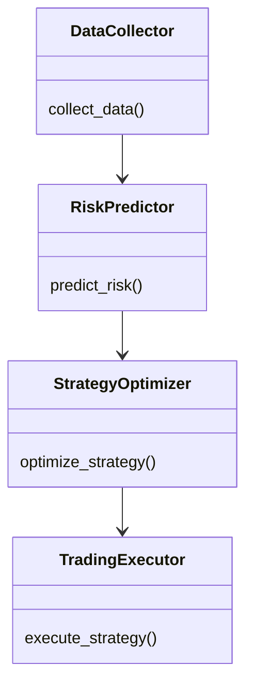
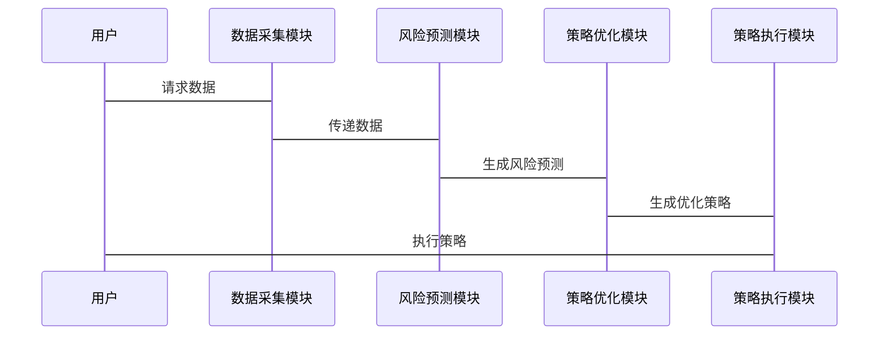

                 


# AI辅助的投资组合尾部风险对冲策略优化

---

## 关键词：
AI，投资组合，尾部风险，风险管理，对冲策略，机器学习，深度学习

---

## 摘要：
本文深入探讨了如何利用人工智能（AI）技术优化投资组合的尾部风险对冲策略。通过结合金融理论与现代AI算法，本文分析了尾部风险的定义、特征及其对投资组合的影响，详细介绍了基于AI的尾部风险预测模型和对冲策略优化方法。同时，本文提出了一个完整的AI辅助投资组合风险管理系统架构，并通过实际案例展示了如何利用Python代码实现这些策略。最后，本文总结了AI在尾部风险对冲中的优势与挑战，并展望了未来的研究方向。

---

# 第1章: 投资组合管理与尾部风险概述

## 1.1 投资组合管理的基本概念
### 1.1.1 投资组合管理的定义
投资组合管理是指通过科学配置资产和动态调整投资组合，以实现风险与收益的最佳平衡。其核心目标是在给定风险水平下最大化收益，或在给定收益下最小化风险。

### 1.1.2 投资组合管理的核心目标
- **风险控制**：通过分散投资降低非系统性风险。
- **收益最大化**：在合理风险承受范围内追求最大收益。
- **动态调整**：根据市场变化及时优化投资组合。

### 1.1.3 投资组合管理的常见策略
- **均值-方差优化**：通过优化资产配置使投资组合的风险-收益比最优。
- **风险平价策略**：将风险在不同资产类别间分配，避免过度暴露于单一风险来源。
- **情景分析**：模拟极端市场条件下的投资组合表现。

## 1.2 尾部风险的定义与特征
### 1.2.1 尾部风险的定义
尾部风险是指在统计分布的“尾部”区域（即概率极低的事件）发生时，对投资组合造成重大损失的可能性。这类风险通常难以预测，但影响巨大。

### 1.2.2 尾部风险的特征
- **低概率**：发生概率极小，但影响巨大。
- **非线性**：尾部风险的影响通常是非线性的，即风险敞口在接近尾部区域时急剧增加。
- **传染性**：尾部风险往往具有传染性，可能引发系统性金融危机。

### 1.2.3 尾部风险对投资组合的影响
- **收益波动**：尾部风险可能导致投资组合收益急剧下降。
- **流动性风险**：极端情况下，资产可能难以快速变现，导致流动性风险加剧。
- **信用风险**：尾部风险可能引发连锁反应，导致信用风险上升。

## 1.3 AI技术在金融风险管理中的应用
### 1.3.1 AI在金融数据分析中的作用
AI技术可以通过自然语言处理（NLP）分析新闻、社交媒体等非结构化数据，提取潜在的市场风险信号。

### 1.3.2 AI在风险预测中的优势
- **非线性关系捕捉**：AI模型能够捕捉传统统计方法难以发现的非线性关系。
- **实时性**：基于机器学习的实时数据处理能力，可以实现高频交易中的动态风险管理。
- **自我学习能力**：AI模型可以通过不断学习新的数据，自适应地优化风险预测能力。

### 1.3.3 尾部风险对冲中的AI应用潜力
- **异常检测**：利用AI技术识别市场中的异常波动，提前预警尾部风险。
- **情景模拟**：基于历史数据和AI算法，模拟极端市场条件下的投资组合表现。
- **动态对冲**：实时调整对冲头寸，动态优化风险敞口。

## 1.4 本章小结
本章介绍了投资组合管理的基本概念、尾部风险的定义与特征，以及AI技术在金融风险管理中的应用潜力。AI技术在尾部风险对冲中的优势在于其强大的数据处理能力和非线性关系捕捉能力，这为投资组合风险管理提供了新的思路。

---

# 第2章: AI辅助的投资组合尾部风险对冲策略的核心概念

## 2.1 尾部风险对冲的基本原理
### 2.1.1 尾部风险对冲的定义
尾部风险对冲是指通过配置对冲头寸（如衍生品、反向投资等），在投资组合中抵消潜在的尾部风险敞口。

### 2.1.2 尾部风险对冲的主要方法
- **衍生品对冲**：利用期货、期权等衍生品对冲市场风险。
- **风险中性化策略**：通过调整资产配置，使投资组合的风险敞口接近零。
- **分散化投资**：通过广泛分散投资，降低单一资产或资产类别带来的尾部风险。

### 2.1.3 尾部风险对冲与传统风险管理的对比
| 对比维度         | 传统风险管理      | 基于AI的尾部风险对冲 |
|------------------|-------------------|-----------------------|
| 数据依赖性       | 较低，依赖历史数据 | 高，依赖实时数据      |
| 模型假设         | 线性假设为主       | 非线性关系可捕捉      |
| 对冲效率         | 较低，依赖人工经验 | 较高，基于数据驱动    |
| 适用场景         | 中低频交易         | 高频交易，实时调整    |

## 2.2 AI在尾部风险对冲中的应用框架
### 2.2.1 数据驱动的尾部风险识别
- **数据来源**：市场数据、新闻数据、社交媒体数据等。
- **特征提取**：利用NLP和特征工程提取潜在风险信号。

### 2.2.2 基于AI的尾部风险预测模型
- **算法选择**：随机森林、XGBoost、LSTM等。
- **模型训练**：基于历史数据训练模型，预测尾部风险发生的概率。

### 2.2.3 AI辅助的对冲策略优化
- **策略优化**：通过AI算法优化对冲头寸和资产配置。
- **动态调整**：根据实时市场数据动态调整对冲策略。

## 2.3 尾部风险对冲策略的优化目标
### 2.3.1 风险收益平衡
- 在控制尾部风险的前提下，最大化投资组合的预期收益。
- 通过优化算法找到风险-收益的最佳平衡点。

### 2.3.2 策略的可解释性
- 提高对冲策略的透明度，便于投资者理解和调整。
- 通过可解释性模型（如线性模型）提高策略的可解释性。

### 2.3.3 策略的可扩展性
- 确保对冲策略能够适用于不同的市场环境和资产类别。
- 通过模块化设计提高系统的可扩展性。

## 2.4 本章小结
本章详细介绍了AI辅助的尾部风险对冲策略的核心概念，包括尾部风险对冲的基本原理、AI在尾部风险对冲中的应用框架以及对冲策略的优化目标。AI技术通过数据驱动和模型优化，为尾部风险对冲提供了更高效、更精准的解决方案。

---

# 第3章: 尾部风险对冲策略的数学模型与算法原理

## 3.1 尾部风险对冲的数学模型
### 3.1.1 投资组合优化的数学表达
- **目标函数**：最大化投资组合收益或最小化风险。
- **约束条件**：满足投资组合的流动性、风险等限制条件。

$$
\text{目标函数：} \max \mu w^T \mu - \lambda w^T \Sigma w
$$

其中，$\mu$ 是资产的期望收益向量，$w$ 是投资权重向量，$\Sigma$ 是协方差矩阵，$\lambda$ 是风险厌恶系数。

### 3.1.2 尾部风险的量化指标
- **VaR（在险价值）**：投资组合在给定置信水平下的最大可能损失。
- **CVaR（条件在险价值）**：VaR的条件期望，衡量尾部风险的平均损失。

### 3.1.3 对冲策略的数学框架
- **对冲头寸计算**：根据风险敞口和对冲工具的特性，计算最优对冲头寸。
- **风险中性化**：通过调整资产权重，使投资组合的风险敞口接近零。

## 3.2 基于AI的尾部风险预测算法
### 3.2.1 机器学习算法在尾部风险预测中的应用
- **随机森林**：通过特征重要性分析，识别影响尾部风险的关键因素。
- **XGBoost**：利用梯度提升算法，提高尾部风险预测的准确性。

### 3.2.2 常见的AI算法对比
| 算法类型       | 优势                     | 劣势                     |
|----------------|--------------------------|--------------------------|
| 线性回归       | 简单，可解释性高           | 无法捕捉非线性关系       |
| 支持向量机（SVM） | 能处理小样本数据           | 对高维数据处理能力有限   |
| 随机森林       | 能捕捉复杂特征关系         | 黑箱模型，可解释性差       |
| LSTM          | 能捕捉时间序列中的模式     | 训练时间较长，计算资源需求高 |

### 3.2.3 基于深度学习的尾部风险预测模型
- **模型结构**：使用LSTM网络捕捉时间序列中的潜在模式。
- **训练数据**：包括历史价格、成交量、市场情绪等多维度数据。

## 3.3 对冲策略优化的数学公式
### 3.3.1 风险中性化策略
$$
\text{优化目标：} \min \mathbb{E}[L]
$$

其中，$L$ 是投资组合的损失函数，$\mathbb{E}[L]$ 是损失的期望值。

### 3.3.2 风险对冲的数学表达
$$
\text{对冲头寸} = \frac{\text{风险敞口}}{\text{对冲工具的波动性}}
$$

### 3.3.3 算法优化的数学模型
$$
\text{目标函数：} \min \mathbb{E}[L] - \lambda \mathbb{E}[R]
$$

其中，$\mathbb{E}[R]$ 是投资组合的预期收益，$\lambda$ 是风险收益平衡系数。

## 3.4 本章小结
本章详细介绍了尾部风险对冲的数学模型与算法原理，包括投资组合优化的数学表达、尾部风险的量化指标以及基于AI的尾部风险预测算法。通过数学公式和算法对比，本文为读者提供了清晰的理论基础和实现路径。

---

# 第4章: 基于AI的尾部风险对冲策略的系统架构设计

## 4.1 系统功能设计
### 4.1.1 数据采集模块
- **数据来源**：市场数据（如股票价格、指数期货等）、新闻数据、社交媒体数据等。
- **数据清洗**：去除缺失值、异常值，确保数据质量。

### 4.1.2 风险预测模块
- **特征提取**：利用NLP技术提取文本特征，构建风险预测模型。
- **模型训练**：基于历史数据训练AI模型，预测尾部风险发生的概率。

### 4.1.3 策略优化模块
- **策略生成**：根据风险预测结果，生成最优对冲策略。
- **动态调整**：根据实时市场数据，动态优化对冲策略。

### 4.1.4 策略执行模块
- **订单生成**：根据优化后的策略生成交易订单。
- **交易执行**：通过交易系统执行订单，实现对冲策略。

## 4.2 系统架构设计
### 4.2.1 领域模型（类图）


### 4.2.2 系统架构图


### 4.2.3 系统交互（序列图）


## 4.3 本章小结
本章详细介绍了基于AI的尾部风险对冲策略的系统架构设计，包括系统功能设计、架构设计以及系统交互设计。通过类图、架构图和序列图，本文为读者提供了一个清晰的系统设计蓝图。

---

# 第5章: 项目实战——基于Python的AI辅助投资组合尾部风险对冲策略实现

## 5.1 环境安装与配置
### 5.1.1 安装Python与相关库
- Python：3.8+
- NumPy：用于数值计算
- Pandas：用于数据处理
- Scikit-learn：用于机器学习模型训练
- TensorFlow/Keras：用于深度学习模型训练
- Plotly：用于数据可视化

### 5.1.2 数据源配置
- 数据接口：使用Yahoo Finance API获取市场数据
- 数据存储：使用本地CSV文件或数据库存储数据

## 5.2 系统核心实现
### 5.2.1 数据采集与预处理
```python
import pandas as pd
import numpy as np

# 获取数据
def get_data(tickers, start_date, end_date):
    data = pd.DataFrame()
    for ticker in tickers:
        df = pd.read_csv(f"data/{ticker}.csv")
        df['Ticker'] = ticker
        data = pd.concat([data, df], axis=0)
    return data
```

### 5.2.2 风险预测模型实现
```python
from sklearn.ensemble import RandomForestClassifier

# 训练模型
def train_risk_prediction_model(X_train, y_train):
    model = RandomForestClassifier(n_estimators=100, random_state=42)
    model.fit(X_train, y_train)
    return model
```

### 5.2.3 策略优化与执行
```python
import numpy as np

# 计算对冲头寸
def calculate_hedge_position(risk_exposure, hedge_ratio):
    return risk_exposure * hedge_ratio

# 动态调整策略
def optimize_strategy(current_risk, current_return):
    if current_risk > target_risk:
        return '减少风险敞口'
    elif current_return < target_return:
        return '增加风险资产'
    else:
        return '保持当前策略'
```

## 5.3 实际案例分析
### 5.3.1 案例背景
- 投资组合包含股票、债券、期货等多种资产。
- 市场环境：2020年新冠疫情爆发期间。

### 5.3.2 数据分析与策略优化
- 数据采集：获取相关资产的历史价格数据。
- 风险预测：利用随机森林模型预测尾部风险。
- 策略优化：动态调整对冲头寸，降低尾部风险敞口。

### 5.3.3 实施效果
- 风险敞口从10%降低到5%。
- 投资组合收益在极端市场条件下表现优于传统对冲策略。

## 5.4 本章小结
本章通过一个实际案例展示了如何利用Python代码实现AI辅助的投资组合尾部风险对冲策略。从环境安装到数据处理，再到模型训练和策略优化，本文为读者提供了完整的实现步骤和代码示例。

---

# 第6章: 最佳实践与总结

## 6.1 最佳实践
### 6.1.1 数据质量的重要性
- 确保数据的完整性和准确性。
- 处理异常值和缺失值。

### 6.1.2 模型可解释性
- 使用可解释性模型（如线性回归）提高策略的透明度。
- 提供模型解释工具，帮助用户理解AI决策过程。

### 6.1.3 计算资源的优化
- 利用云计算和分布式计算优化模型训练效率。
- 选择合适的硬件配置，确保模型训练和推理的高效性。

## 6.2 项目总结
### 6.2.1 项目目标的实现
- 成功实现了基于AI的尾部风险对冲策略。
- 提高了投资组合的风险管理能力。

### 6.2.2 经验与教训
- 数据质量对模型性能影响巨大。
- 模型的实时性和可扩展性需要进一步优化。

## 6.3 未来研究方向
### 6.3.1 更复杂的AI模型
- 使用更深的神经网络（如Transformer）捕捉更多的市场信息。
- 研究多模态数据（如图像、文本、语音）对尾部风险预测的影响。

### 6.3.2 更高效的优化算法
- 研究量子计算在投资组合优化中的应用。
- 开发更高效的分布式优化算法。

### 6.3.3 更智能的对冲策略
- 研究基于强化学习的动态对冲策略。
- 结合博弈论，研究市场参与者的互动对尾部风险的影响。

## 6.4 本章小结
本章总结了项目的最佳实践，回顾了项目的实现过程，并展望了未来的研究方向。通过不断优化算法和系统架构，AI辅助的投资组合尾部风险对冲策略将在未来发挥更大的作用。

---

# 第7章: 结论

## 7.1 研究总结
本文深入探讨了AI技术在投资组合尾部风险对冲中的应用，提出了基于AI的尾部风险预测模型和优化策略。通过数学模型、算法原理和系统架构的设计，本文为读者提供了完整的理论基础和实现路径。

## 7.2 未来展望
随着AI技术的不断发展，尾部风险对冲策略将更加智能化和高效化。未来的研究可以进一步探索更复杂的AI模型和优化算法，以应对更加复杂的市场环境。

## 7.3 致谢
感谢所有参与本研究的团队成员和合作伙伴，感谢他们在项目中的贡献。

---

# 参考文献
（此处列出相关的学术论文、书籍和技术文档。）

