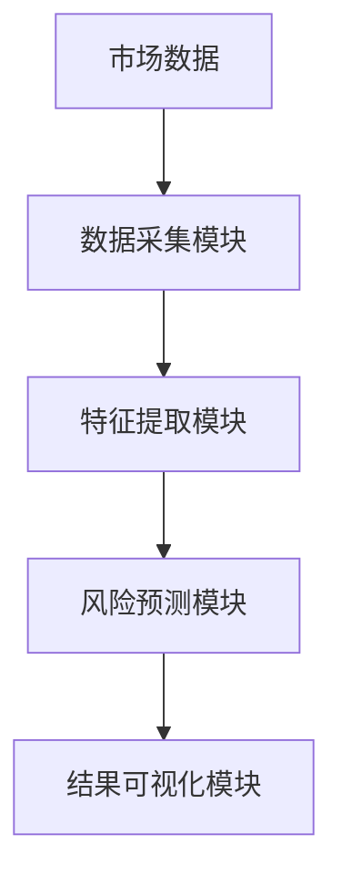

                 


# AI辅助的投资组合尾部风险度量

---

> **关键词**：AI辅助，投资组合，尾部风险，风险度量，深度学习，金融风险管理  
> **摘要**：本文探讨了利用人工智能技术辅助投资组合尾部风险度量的方法，结合传统统计学与现代机器学习技术，提出了一种基于深度学习的尾部风险识别系统，并通过实际案例展示了系统的实现与应用。

---

# 第一部分: 尾部风险与AI辅助概述

## 第1章: 尾部风险的定义与特征

### 1.1 尾部风险的定义与特征

尾部风险（Tail Risk）是指在投资组合中，由于极端事件或“黑天鹅”事件导致的潜在重大损失。与传统的波动风险不同，尾部风险具有以下特征：

- **低概率**：尾部事件发生的概率较低，但影响巨大。
- **非对称性**：尾部风险通常表现为非对称分布，即左尾和右尾的风险不对称。
- **不可预测性**：尾部事件往往难以预测，传统统计模型难以捕捉。

### 1.2 AI在金融风险管理中的作用

人工智能（AI）技术在金融风险管理中的应用日益广泛，尤其是在尾部风险度量方面，AI的优势主要体现在以下几点：

- **数据处理能力**：AI能够处理海量非结构化数据，发现传统方法难以察觉的模式。
- **实时性**：AI算法能够实时更新模型，捕捉市场动态变化。
- **非线性关系建模**：深度学习模型能够捕捉复杂的非线性关系，提升预测准确性。

---

## 第2章: 投资组合风险度量的核心概念

### 2.1 风险度量的数学模型

#### 2.1.1 期望值与方差

期望值（Mean）和方差（Variance）是描述投资组合风险的基本统计指标：

- **期望值**：表示投资组合的平均收益。
- **方差**：表示投资组合收益的波动性。

$$
\text{方差} = \sigma^2 = E[(r_i - \mu)^2]
$$

其中，$\mu$ 是期望值，$r_i$ 是每个资产的收益。

#### 2.1.2 威险价值（VaR）

VaR（Value at Risk）是一种常用的风险度量方法，表示在一定置信水平下，投资组合的最大可能损失。

- **95% VaR**：表示在95%的置信水平下，投资组合的最大损失。
- **计算方法**：可以通过历史模拟法、方差-协方差法或蒙特卡洛模拟法计算。

#### 2.1.3 置信风险价值（CVaR）

CVaR（Conditional Value at Risk）是VaR的扩展，表示在VaR水平下的平均损失。

$$
\text{CVaR} = E[r | r \leq \text{VaR}]
$$

### 2.2 尾部风险的统计学方法

#### 2.2.1 历史模拟法

历史模拟法通过回顾历史数据，计算投资组合在极端情况下的损失。

#### 2.2.2 方差-协方差法

方差-协方差法基于资产之间的协方差矩阵，计算投资组合的波动性。

#### 2.2.3 蒙特卡洛模拟法

蒙特卡洛模拟法通过生成大量随机情景，估算投资组合的尾部风险。

---

## 第3章: AI辅助尾部风险度量的核心原理

### 3.1 机器学习在风险预测中的应用

#### 3.1.1 监督学习模型

- **随机森林**：通过树模型的集成，提高预测准确性。
- **神经网络**：能够捕捉复杂的非线性关系。

#### 3.1.2 非监督学习模型

- **聚类分析**：用于识别市场状态的变化。

#### 3.1.3 强化学习

强化学习通过策略优化，帮助投资者在极端情况下做出最优决策。

### 3.2 深度学习在尾部风险识别中的优势

#### 3.2.1 卷积神经网络（CNN）

CNN适用于处理时间序列数据，能够捕捉市场波动中的模式。

#### 3.2.2 循环神经网络（RNN）

RNN适用于处理序列数据，能够捕捉市场的趋势变化。

#### 3.2.3 图神经网络（GNN）

GNN适用于处理资产之间的相互关系，能够捕捉复杂的网络结构。

---

## 第4章: 尾部风险度量的系统架构设计

### 4.1 系统功能模块划分

- **数据采集模块**：收集市场数据。
- **特征提取模块**：提取有用的特征。
- **风险预测模块**：使用AI模型预测尾部风险。
- **结果可视化模块**：展示风险评估结果。

### 4.2 系统架构图



---

## 第5章: 基于AI的尾部风险度量算法实现

### 5.1 基于神经网络的VaR预测模型

#### 5.1.1 神经网络结构设计

- **输入层**：市场数据特征。
- **隐藏层**：非线性变换。
- **输出层**：风险值。

#### 5.1.2 损失函数与优化算法

- **损失函数**：均方误差。
- **优化算法**：Adam优化器。

#### 5.1.3 模型训练与验证

- **训练数据**：历史市场数据。
- **验证数据**：用于模型调优。

### 5.2 基于深度学习的极端事件检测

#### 5.2.1 异常检测算法

- **Isolation Forest**：基于树的异常检测算法。

#### 5.2.2 深度学习模型实现

- **模型结构**：使用RNN检测时间序列中的异常。

#### 5.2.3 模型评估与调优

- **评估指标**：准确率、召回率。
- **超参数调优**：学习率、批量大小。

---

## 第6章: 项目实战与案例分析

### 6.1 项目环境搭建

#### 6.1.1 Python环境安装

- **安装Python**：3.8以上版本。
- **安装依赖库**：Pandas、NumPy、TensorFlow、PyTorch。

#### 6.1.2 数据处理库安装

- **Pandas**：数据处理。
- **NumPy**：数值计算。

#### 6.1.3 深度学习框架安装

- **TensorFlow**：Google的深度学习框架。
- **PyTorch**：Facebook的深度学习框架。

### 6.2 数据预处理与特征提取

#### 6.2.1 数据清洗与标准化

- **数据清洗**：处理缺失值、异常值。
- **标准化**：归一化处理。

#### 6.2.2 特征选择与工程

- **特征选择**：选择重要的市场指标。
- **特征工程**：构建新的特征，如移动平均线、波动率。

#### 6.2.3 数据集划分与增强

- **训练集、验证集、测试集**：按比例划分。
- **数据增强**：如随机噪声添加。

### 6.3 模型实现与训练

#### 6.3.1 神经网络模型定义

```python
import tensorflow as tf
from tensorflow.keras import layers

model = tf.keras.Sequential([
    layers.Dense(64, activation='relu'),
    layers.Dense(1, activation='linear')
])
```

#### 6.3.2 模型训练与评估

```python
model.compile(optimizer='adam', loss='mse')
model.fit(X_train, y_train, epochs=100, batch_size=32, validation_data=(X_val, y_val))
```

#### 6.3.3 超参数调优与优化

- **学习率**：调整Adam优化器的学习率。
- **批量大小**：调整训练时的批量大小。

### 6.4 实际案例分析

#### 6.4.1 数据来源

- **股票数据集**：选取若干股票的历史收盘价和成交量数据。

#### 6.4.2 模型训练与验证

- **训练过程**：使用历史数据训练模型。
- **验证结果**：评估模型的预测准确性。

#### 6.4.3 结果分析与解读

- **预测VaR**：展示模型预测的VaR值。
- **实际损失对比**：将模型预测值与实际损失进行对比。

---

## 第7章: 最佳实践与小结

### 7.1 最佳实践

- **数据质量**：确保数据的完整性和准确性。
- **模型选择**：根据具体问题选择合适的模型。
- **风险控制**：结合AI模型和传统方法进行综合判断。

### 7.2 小结

本文详细介绍了AI辅助的投资组合尾部风险度量方法，结合理论与实践，展示了如何利用深度学习技术提升尾部风险的识别能力。通过实际案例分析，验证了AI技术在金融风险管理中的有效性。

### 7.3 注意事项

- **模型过拟合**：避免在训练数据上过拟合。
- **数据稀疏性**：尾部事件数据较少，需注意模型的泛化能力。

### 7.4 拓展阅读

- **推荐书籍**：《机器学习实战》、《深度学习》。
- **推荐工具**：TensorFlow、PyTorch、Scikit-learn。

---

通过本文的讲解，读者可以全面了解AI辅助的投资组合尾部风险度量方法，并能够将其应用于实际的金融风险管理中。

