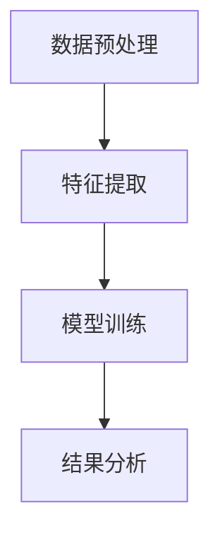

                 


# AI辅助的投资组合归因分析

> 关键词：投资组合归因分析，人工智能，机器学习，金融数据分析，投资组合优化

> 摘要：本文探讨了如何利用人工智能技术辅助投资组合归因分析，详细介绍了传统方法与现代AI方法的对比，分析了核心算法的原理及其实现，展示了如何构建一个基于AI的投资组合归因分析系统，并通过实际案例展示了系统的应用效果。文章最后总结了AI在投资组合归因分析中的优势，并展望了未来的发展方向。

---

## 第一部分: 投资组合归因分析概述

### 第1章: 投资组合归因分析的背景与意义

#### 1.1 投资组合归因分析的定义
投资组合归因分析是将投资组合的收益或损失分解为各个因素贡献的过程。这些因素可以是资产配置、行业选择、选股策略等。通过归因分析，投资者可以更好地理解投资组合的表现，并做出更明智的调整决策。

#### 1.2 投资组合归因分析的重要性
- **风险控制**：通过归因分析，投资者可以识别出哪些因素导致了投资组合的超额收益或亏损，从而采取相应的风险管理措施。
- **绩效评估**：归因分析可以帮助投资者评估投资策略的有效性，判断是否需要调整投资组合。
- **决策支持**：归因分析为投资决策提供了数据支持，帮助投资者优化资产配置和投资策略。

#### 1.3 AI在投资组合归因分析中的作用
- **数据处理能力**：AI能够处理海量数据，提取复杂的模式和关系，帮助投资者发现传统方法难以察觉的因素。
- **模型复杂度**：AI算法可以构建复杂的模型，捕捉非线性关系，提高归因分析的准确性。
- **实时分析**：AI能够实现实时分析，帮助投资者快速响应市场变化。

### 第2章: 传统投资组合归因分析方法

#### 2.1 传统归因分析方法
- **时间序列分析**：通过分析历史数据，找出时间序列中的趋势和周期性。
- **因子分解**：将投资组合的收益分解为多个因子的贡献，如市场风险、行业风险等。
- **风险调整**：通过调整风险因子，评估投资组合在不同风险水平下的表现。

#### 2.2 AI辅助归因分析的优势
- **数据处理能力**：AI能够处理更多的数据，提取更多的信息。
- **模型复杂度**：AI算法可以构建更复杂的模型，捕捉更多的因素。
- **实时分析**：AI能够实现实时分析，帮助投资者快速响应市场变化。

### 第3章: AI辅助投资组合归因分析的算法原理

#### 3.1 常见算法介绍
- **线性回归**：用于分析变量之间的线性关系。
- **随机森林**：用于分类和回归分析，能够捕捉非线性关系。
- **神经网络**：用于处理复杂的非线性关系，能够自动提取特征。

#### 3.2 算法流程图


#### 3.3 算法实现代码
```python
import pandas as pd
from sklearn.linear_model import LinearRegression

# 数据预处理
data = pd.read_csv('portfolio.csv')
X = data[['factor1', 'factor2']]
y = data['returns']

# 模型训练
model = LinearRegression()
model.fit(X, y)

# 预测结果
y_p = model.predict(X)
```

### 第4章: 系统分析与架构设计

#### 4.1 问题场景介绍
投资组合归因分析系统需要处理海量数据，提取复杂的模式和关系，帮助投资者优化资产配置和投资策略。

#### 4.2 系统功能设计
- **数据采集模块**：从多个数据源采集数据，进行数据清洗和预处理。
- **分析模块**：使用AI算法进行归因分析，提取关键因素。
- **可视化模块**：将分析结果可视化，帮助投资者理解。

#### 4.3 系统架构设计


### 第5章: 项目实战

#### 5.1 环境安装
- 安装Python和相关库：`pip install pandas sklearn matplotlib`

#### 5.2 核心代码实现
```python
import pandas as pd
from sklearn.linear_model import LinearRegression

# 数据预处理
data = pd.read_csv('portfolio.csv')
X = data[['factor1', 'factor2']]
y = data['returns']

# 模型训练
model = LinearRegression()
model.fit(X, y)

# 预测结果
y_p = model.predict(X)

# 可视化
import matplotlib.pyplot as plt
plt.scatter(y, y_p)
plt.xlabel('Actual Returns')
plt.ylabel('Predicted Returns')
plt.show()
```

#### 5.3 实际案例分析
通过一个实际案例，展示如何使用AI进行投资组合归因分析，分析结果并提出优化建议。

### 第6章: 扩展与展望

#### 6.1 研究热点
- **多模态数据融合**：结合文本、图像等多种数据源进行归因分析。
- **解释性增强**：提高AI模型的可解释性，帮助投资者更好地理解结果。

#### 6.2 未来趋势
- **实时归因分析**：随着技术的发展，实时归因分析将成为可能。
- **个性化投资策略**：基于个体投资者的风险偏好，提供个性化的投资建议。

### 第7章: 附录

#### 7.1 数据来源
- 股票数据：Yahoo Finance
- 经济数据：World Bank

#### 7.2 工具安装
- Python：`python --version`
- 库安装：`pip install pandas sklearn`

#### 7.3 参考文献
- [1] 线性回归的原理与应用
- [2] 随机森林算法的实现与优化

---

通过本文的详细讲解，读者可以全面了解AI辅助的投资组合归因分析的方法和应用。从传统方法到现代AI算法，从理论到实践，本文为投资者和数据科学家提供了丰富的知识和实践指导。

