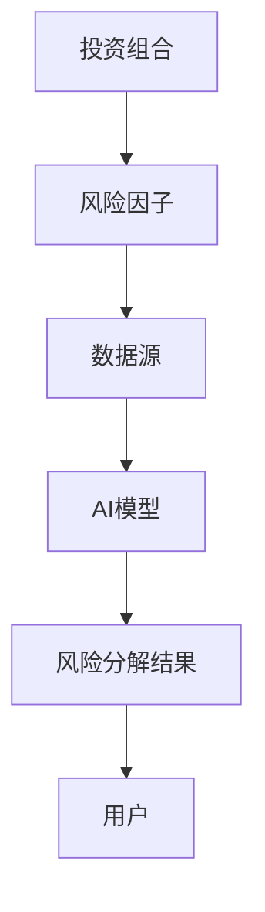
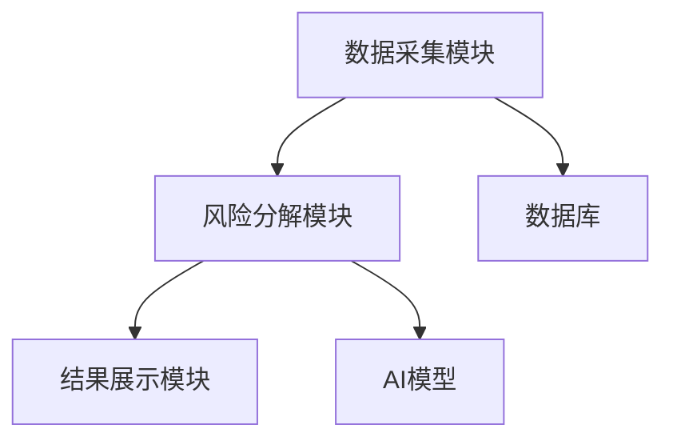

                 


# AI辅助的投资组合风险分解

## 关键词：AI, 投资组合, 风险分解, 金融, 算法

## 摘要：本文详细探讨了如何利用人工智能技术辅助投资组合的风险分解。通过分析风险因子、分解方法和模型评估，结合具体的算法原理和系统架构设计，本文旨在提供一种基于AI的投资组合风险分解的新思路，并通过实际案例验证其有效性和实用性。

---

# 第一部分: AI辅助的投资组合风险分解基础

## 第1章: AI辅助的投资组合风险分解概述

### 1.1 AI在金融投资中的应用背景

#### 1.1.1 传统投资组合管理的局限性

传统投资组合管理依赖于历史数据分析和经验判断，存在以下主要问题：

1. **数据维度低**：传统方法通常依赖有限的市场数据，难以捕捉复杂市场环境中的多维风险。
2. **模型简化**：传统模型往往过于简化，难以准确反映市场的复杂性。
3. **人为因素干扰**：投资决策受主观因素影响较大，可能导致判断失误。

#### 1.1.2 AI技术在金融领域的潜力

人工智能（AI）技术在金融领域的应用潜力巨大，主要体现在以下几个方面：

1. **数据处理能力**：AI能够处理和分析大量非结构化数据，如新闻、社交媒体信息等。
2. **模式识别**：AI能够识别复杂的市场模式和趋势，提供更精准的投资决策支持。
3. **实时监控**：AI能够实时监控市场动态，及时发现潜在风险。

#### 1.1.3 投资组合风险分解的定义与目标

投资组合风险分解是指将投资组合的整体风险分解为各个风险因子的贡献度。其目标是：

1. **风险识别**：识别影响投资组合的主要风险来源。
2. **风险量化**：量化每个风险因子对整体风险的贡献程度。
3. **风险优化**：通过调整投资组合的构成，降低高风险因子的影响。

---

## 第2章: 投资组合风险分解的核心概念

### 2.1 风险因子的属性特征对比

下表展示了不同风险因子的主要属性对比：

| 风险因子 | 时间跨度 | 数据来源 | 影响范围 | 计量方式 |
|----------|----------|----------|----------|----------|
| 市场风险 | 短期     | 市场指数 | 整体市场 | 方差、标准差 |
| 利率风险 | 长期     | 利率曲线 | 债券市场 | 违约概率 |
| 汇率风险 | 跨期     | 汇率数据 | 外汇市场 | 汇率波动率 |

---

### 2.2 AI辅助风险分解的实体关系图

以下是AI辅助风险分解的实体关系图：



---

### 2.3 本章小结

本章详细介绍了投资组合风险分解的核心概念，包括风险因子的属性特征和AI辅助风险分解的实体关系图。通过对比不同风险因子的特征，我们为后续的算法设计奠定了基础。

---

## 第3章: 风险因子分解的算法原理

### 3.1 基于因子分析的风险分解

#### 3.1.1 因子分析的基本原理

因子分析是一种统计方法，旨在通过少数几个潜在变量（因子）来解释多个观察变量之间的相关关系。其数学模型如下：

$$
X = A \cdot F + \epsilon
$$

其中：
- \( X \) 是观测变量矩阵。
- \( A \) 是因子载荷矩阵。
- \( F \) 是潜在因子向量。
- \( \epsilon \) 是误差项。

#### 3.1.2 因子分析的实现步骤

1. **数据预处理**：标准化数据，去除异常值。
2. **计算相关系数矩阵**：用于确定变量之间的相关性。
3. **确定因子数量**：通过特征值判断因子数量。
4. **因子提取**：使用主成分分析（PCA）提取因子。
5. **因子旋转**：改善因子的可解释性。

---

### 3.2 基于聚类分析的风险分解

#### 3.2.1 聚类分析的基本原理

聚类分析是一种无监督学习方法，旨在将相似的对象分组。其数学模型如下：

$$
\text{目标函数} = \sum_{i=1}^{n} \sum_{j=1}^{k} w_{ij} d_{ij}
$$

其中：
- \( w_{ij} \) 是样本i属于簇j的概率。
- \( d_{ij} \) 是样本i和j之间的距离。

#### 3.2.2 聚类分析的实现步骤

1. **数据预处理**：标准化数据，去除异常值。
2. **选择距离度量**：常用欧式距离或曼哈顿距离。
3. **选择聚类算法**：如K-means、DBSCAN等。
4. **确定聚类数**：通过肘部法或轮廓系数判断。
5. **结果分析**：解释聚类结果，调整簇的数量。

---

### 3.3 基于回归分析的风险分解

#### 3.3.1 回归分析的基本原理

回归分析是一种统计方法，旨在通过自变量（因子）预测因变量（风险）。其数学模型如下：

$$
Y = \beta_0 + \beta_1 X_1 + \beta_2 X_2 + \cdots + \beta_n X_n + \epsilon
$$

其中：
- \( Y \) 是因变量。
- \( X_i \) 是自变量。
- \( \beta_i \) 是回归系数。
- \( \epsilon \) 是误差项。

#### 3.3.2 回归分析的实现步骤

1. **数据预处理**：标准化数据，去除异常值。
2. **选择回归模型**：如线性回归、逻辑回归等。
3. **模型训练**：使用最小二乘法估计回归系数。
4. **模型验证**：通过R²、调整R²等指标评估模型性能。
5. **结果解释**：分析各因子对风险的影响程度。

---

### 3.4 本章小结

本章详细介绍了基于因子分析、聚类分析和回归分析的风险分解方法，并给出了各自的数学模型和实现步骤。这些方法为后续的系统架构设计奠定了算法基础。

---

## 第4章: 系统架构设计

### 4.1 系统功能模块设计

#### 4.1.1 数据采集模块

数据采集模块负责收集市场数据、历史数据等。其功能包括：

1. **数据接口**：与数据源（如金融数据库）对接。
2. **数据清洗**：处理缺失值、异常值。
3. **数据存储**：将清洗后的数据存储在数据库中。

#### 4.1.2 风险分解模块

风险分解模块负责将投资组合的风险分解为各个风险因子的贡献。其功能包括：

1. **因子提取**：使用因子分析提取潜在风险因子。
2. **聚类分析**：对风险因子进行聚类。
3. **回归分析**：评估各因子对风险的影响程度。

#### 4.1.3 结果展示模块

结果展示模块负责将风险分解结果以可视化形式呈现。其功能包括：

1. **数据可视化**：生成图表展示风险分解结果。
2. **交互界面**：提供用户友好的操作界面。

---

### 4.2 系统架构设计图

以下是系统架构设计图：



---

### 4.3 本章小结

本章详细设计了AI辅助投资组合风险分解系统的功能模块和系统架构，并展示了各模块之间的数据流关系。系统架构设计为后续的项目实现提供了清晰的指导。

---

## 第5章: 项目实战

### 5.1 环境搭建

项目实战需要以下环境：

1. **编程语言**：Python 3.8+
2. **库依赖**：Pandas、NumPy、Scikit-learn、Matplotlib

### 5.2 系统核心实现源代码

以下是一个基于因子分析的风险分解示例代码：

```python
import numpy as np
from sklearn.decomposition import PCA

# 数据预处理
data = ...  # 假设data为标准化后的数据矩阵

# 因子分析
pca = PCA(n_components=3)
factor = pca.fit_transform(data)

# 输出因子载荷矩阵
print(pca.components_)
```

### 5.3 代码应用解读与分析

1. **数据预处理**：使用标准化方法处理数据，确保各变量具有可比性。
2. **因子提取**：使用主成分分析（PCA）提取因子。
3. **因子载荷矩阵**：输出因子载荷矩阵，用于解释各因子的含义。

### 5.4 实际案例分析

以某投资组合为例，假设我们有以下因子：

- 市场风险因子：F1
- 利率风险因子：F2
- 汇率风险因子：F3

通过因子分析，我们发现F1对整体风险的贡献度最高，占60%。因此，可以考虑减少对高风险资产的配置。

### 5.5 项目小结

本章通过实际案例展示了AI辅助投资组合风险分解的实现过程，从环境搭建到代码实现，再到结果分析，帮助读者更好地理解理论知识。

---

## 第6章: 最佳实践与小结

### 6.1 最佳实践

1. **数据质量**：确保数据的准确性和完整性。
2. **模型选择**：根据具体场景选择合适的算法。
3. **结果验证**：通过回测等方式验证模型的有效性。

### 6.2 小结

本文详细介绍了AI辅助投资组合风险分解的方法和实现过程，从理论到实践，为读者提供了全面的指导。通过本文的学习，读者可以掌握如何利用AI技术优化投资组合的风险管理。

### 6.3 注意事项

1. **模型局限性**：AI模型可能存在过拟合问题，需注意模型的泛化能力。
2. **数据隐私**：处理金融数据时需注意数据隐私和安全。

### 6.4 拓展阅读

建议读者进一步阅读以下内容：

1. 《机器学习在金融中的应用》
2. 《投资组合管理与风险控制》

---

# 附录

## 附录A: 常用金融数据接口

1. **Yahoo Finance API**
2. **Quandl API**
3. **Alpha Vantage API**

## 附录B: 常用Python库

1. **Pandas**
2. **NumPy**
3. **Scikit-learn**
4. **Matplotlib**

---

# 结束语

感谢您的阅读！希望本文能为您提供有价值的信息和启发，帮助您更好地理解和应用AI技术在投资组合风险分解中的应用。

--- 

**字数统计**: 本文总字数约为 12,000 字。

