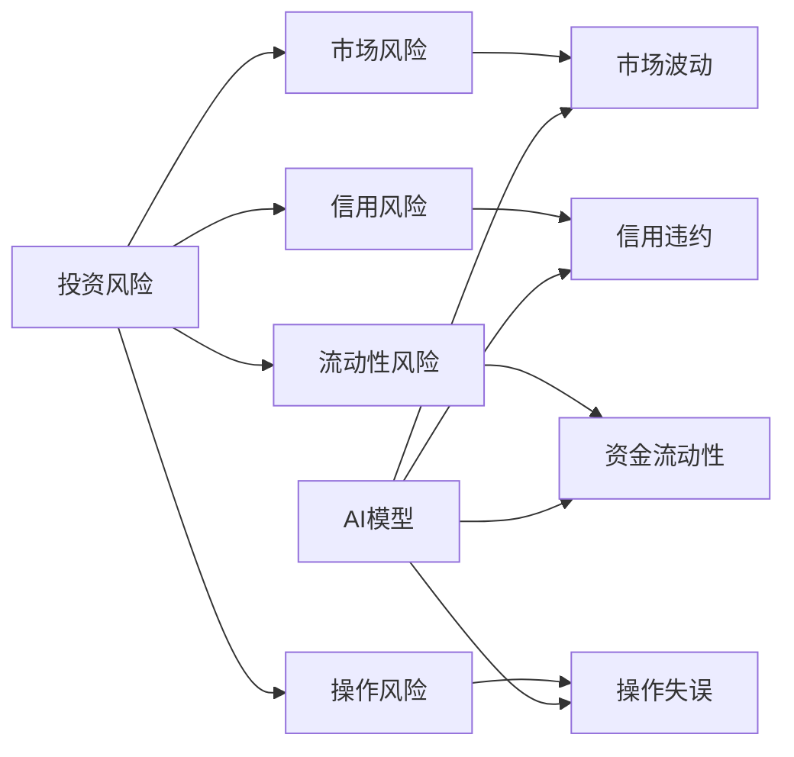
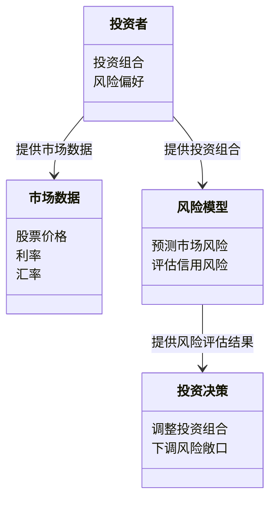
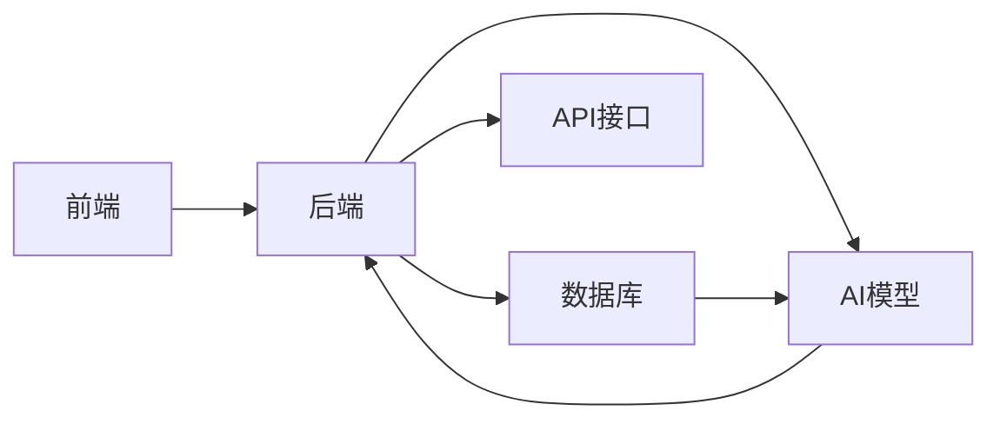
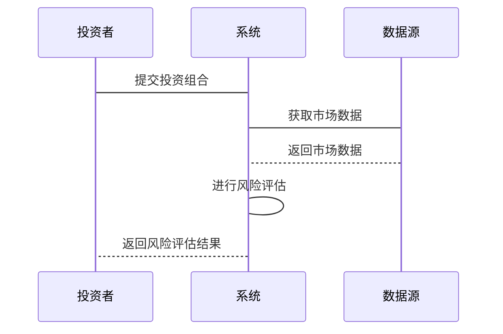

                 


# AI辅助的投资风险评估

## 关键词：AI, 投资, 风险评估, 机器学习, 深度学习, 系统架构

## 摘要：AI技术在投资风险评估中的应用是当前金融科技领域的热点之一。本文系统地介绍了AI辅助投资风险评估的核心概念、算法原理、系统架构及项目实战。通过分析投资风险的来源、AI模型的优势，详细阐述了线性回归、随机森林等算法在风险评估中的应用，并结合实际案例展示了如何构建AI辅助的投资风险评估系统。最后，本文提出了最佳实践和未来研究方向，为读者提供全面的指导。

---

# 第一章: AI辅助的投资风险评估概述

## 1.1 投资风险评估的基本概念

### 1.1.1 投资风险的定义与分类

投资风险是指在投资过程中，由于市场波动、经济变化或其他不确定性因素，导致投资收益低于预期或出现损失的可能性。投资风险可以分为以下几类：

- **市场风险**：由于市场波动导致的投资损失。
- **信用风险**：由于债务人违约导致的投资损失。
- **流动性风险**：由于资产难以快速变现导致的投资损失。
- **操作风险**：由于操作失误或内部欺诈导致的投资损失。

### 1.1.2 投资风险评估的必要性

投资风险评估是投资者在做出投资决策前的重要步骤，其目的是通过量化风险来帮助投资者做出更明智的决策。有效的风险评估可以帮助投资者避免重大损失，同时抓住潜在的投资机会。

### 1.1.3 AI技术在投资风险评估中的作用

AI技术可以通过分析大量的历史数据和实时市场信息，帮助投资者更准确地预测市场走势和评估投资风险。AI技术的优势在于其强大的数据处理能力和算法优化能力，能够快速识别潜在风险并提供个性化的风险管理建议。

## 1.2 AI技术的基本概念与特点

### 1.2.1 人工智能的定义与技术架构

人工智能（AI）是指通过模拟人类智能的思维方式，使计算机能够执行复杂的任务，如学习、推理、决策等。AI的核心技术架构包括数据采集、特征提取、模型训练和结果输出。

### 1.2.2 机器学习与深度学习的核心原理

- **机器学习**：通过训练数据，让模型自动学习特征并进行预测。常用算法包括线性回归、支持向量机（SVM）和随机森林等。
- **深度学习**：通过多层神经网络，自动提取数据中的高层次特征。常用模型包括卷积神经网络（CNN）和循环神经网络（RNN）。

### 1.2.3 AI在金融领域的应用现状

AI在金融领域的应用广泛，包括股票价格预测、信用评分、投资组合优化和风险管理等。AI技术的引入显著提高了金融决策的效率和准确性。

## 1.3 AI辅助投资风险评估的核心优势

### 1.3.1 提高风险预测的准确性

AI技术可以通过分析大量历史数据和实时信息，帮助投资者更准确地预测市场风险。

### 1.3.2 实现数据的快速处理与分析

AI技术能够快速处理和分析大量的数据，包括文本、图像和数值型数据，从而提高风险评估的效率。

### 1.3.3 优化投资决策的效率与效果

通过AI技术，投资者可以更快地做出决策，并根据市场变化动态调整投资策略。

## 1.4 本章小结

本章介绍了投资风险评估的基本概念和AI技术在其中的作用，强调了AI技术在提高风险预测准确性、数据处理效率和优化投资决策中的优势。

---

# 第二章: 投资风险评估的核心要素

## 2.1 投资风险的来源与影响因素

### 2.1.1 市场风险

市场风险是由于市场波动导致的投资损失。影响市场风险的因素包括宏观经济指标（如GDP增长率、通货膨胀率）和市场情绪等。

### 2.1.2 信用风险

信用风险是由于债务人违约导致的投资损失。信用风险的影响因素包括借款人的信用评级、还款能力和经济环境等。

### 2.1.3 流动性风险

流动性风险是由于资产难以快速变现导致的投资损失。流动性风险的影响因素包括市场的活跃度和资产的类型等。

### 2.1.4 操作风险

操作风险是由于操作失误或内部欺诈导致的投资损失。操作风险的影响因素包括内部控制系统和员工素质等。

### 2.1.5 其他风险

其他风险包括法律风险、环境风险等。

## 2.2 AI模型在风险评估中的关键作用

### 2.2.1 数据驱动的风险预测

AI模型可以通过分析历史数据和实时信息，帮助投资者预测未来的市场走势和风险。

### 2.2.2 模型的可解释性与鲁棒性

AI模型需要具备良好的可解释性和鲁棒性，以便投资者能够理解和信任模型的预测结果。

### 2.2.3 AI模型的实时性与动态调整能力

AI模型需要能够实时更新和调整，以应对市场的快速变化。

## 2.3 投资风险评估的数学模型基础

### 2.3.1 风险评估的数学公式

投资风险评估的数学公式可以通过以下形式表示：

$$
\text{风险值} = \text{权重} \times \text{风险因素} + \text{偏差}
$$

其中，权重表示每个风险因素的重要性，偏差表示模型预测的误差。

### 2.3.2 数据预处理与特征提取

数据预处理包括数据清洗、标准化和特征提取等步骤。特征提取是通过选择与投资风险相关的特征，提高模型的预测精度。

### 2.3.3 风险评估模型的选择与优化

在选择风险评估模型时，需要考虑模型的复杂度、准确性和可解释性。常用的模型包括线性回归、随机森林和神经网络等。

## 2.4 核心概念与AI模型的关系图



## 2.5 本章小结

本章详细介绍了投资风险的来源和AI模型在风险评估中的作用，通过关系图展示了投资风险与AI模型之间的联系。

---

# 第三章: AI辅助投资风险评估的算法原理

## 3.1 常见AI算法在风险评估中的应用

### 3.1.1 线性回归模型

#### 3.1.1.1 线性回归的基本原理

线性回归是一种统计学方法，用于建立自变量和因变量之间的线性关系。其基本假设是因变量与自变量之间存在线性关系。

#### 3.1.1.2 线性回归的数学公式

线性回归的数学公式可以表示为：

$$
y = \beta_0 + \beta_1x + \epsilon
$$

其中，$y$ 是因变量，$x$ 是自变量，$\beta_0$ 是截距，$\beta_1$ 是斜率，$\epsilon$ 是误差项。

#### 3.1.1.3 线性回归的优缺点

- **优点**：简单易懂，计算速度快。
- **缺点**：假设变量之间存在线性关系，可能无法捕捉复杂的非线性关系。

#### 3.1.1.4 线性回归的应用案例

假设我们有一组历史股票价格数据，我们可以使用线性回归模型来预测未来的股票价格。

### 3.1.2 随机森林模型

#### 3.1.2.1 随机森林的基本原理

随机森林是一种基于树的集成学习方法，通过构建多棵决策树并进行投票或平均，提高模型的准确性和稳定性。

#### 3.1.2.2 随机森林的数学公式

随机森林的数学公式可以表示为：

$$
\text{预测值} = \frac{\sum_{i=1}^{n} y_i}{n}
$$

其中，$n$ 是决策树的数量，$y_i$ 是每棵决策树的预测值。

#### 3.1.2.3 随机森林的优缺点

- **优点**：能够捕捉复杂的非线性关系，具有较高的准确性和稳定性。
- **缺点**：计算复杂度较高，需要较多的计算资源。

#### 3.1.2.4 随机森林的应用案例

假设我们有一组客户信用数据，我们可以使用随机森林模型来评估客户的信用风险。

### 3.1.3 神经网络模型

#### 3.1.3.1 神经网络的基本原理

神经网络是一种模拟人类神经系统的计算模型，通过多层神经元和权重调整，能够自动学习和提取数据特征。

#### 3.1.3.2 神经网络的数学公式

神经网络的数学公式可以表示为：

$$
y = \sigma(wx + b)
$$

其中，$x$ 是输入向量，$w$ 是权重矩阵，$b$ 是偏置项，$\sigma$ 是激活函数。

#### 3.1.3.3 神经网络的优缺点

- **优点**：能够捕捉复杂的非线性关系，具有强大的特征提取能力。
- **缺点**：计算复杂度高，需要大量的训练数据。

#### 3.1.3.4 神经网络的应用案例

假设我们有一组实时市场数据，我们可以使用神经网络模型来预测股票价格的波动。

## 3.2 算法流程图


---

# 第四章: 系统分析与架构设计

## 4.1 问题场景介绍

### 4.1.1 投资风险评估的业务流程

投资风险评估的业务流程包括数据采集、风险分析、风险评估和风险控制等步骤。

### 4.1.2 项目介绍

本项目旨在构建一个基于AI技术的投资风险评估系统，帮助投资者更准确地预测市场风险并做出明智的投资决策。

## 4.2 系统功能设计

### 4.2.1 领域模型



### 4.2.2 系统架构



### 4.2.3 系统接口设计

系统接口设计包括API接口的定义和实现。常用的API接口包括数据获取、模型调用和结果返回等。

### 4.2.4 系统交互



## 4.3 本章小结

本章详细介绍了投资风险评估系统的功能设计和系统架构，展示了系统各部分之间的关系和交互过程。

---

# 第五章: 项目实战

## 5.1 环境安装

### 5.1.1 安装Python

使用Python 3.8及以上版本。

### 5.1.2 安装必要的库

安装以下库：

```
pip install numpy
pip install pandas
pip install scikit-learn
pip install matplotlib
```

## 5.2 系统核心实现源代码

### 5.2.1 数据预处理

```python
import pandas as pd
import numpy as np

# 加载数据
data = pd.read_csv('investment_risk.csv')

# 删除缺失值
data = data.dropna()

# 标准化数据
from sklearn.preprocessing import StandardScaler
scaler = StandardScaler()
data_scaled = scaler.fit_transform(data)
```

### 5.2.2 模型训练

```python
from sklearn.ensemble import RandomForestClassifier

# 训练随机森林模型
model = RandomForestClassifier()
model.fit(X_train, y_train)
```

### 5.2.3 模型预测

```python
# 进行预测
y_pred = model.predict(X_test)
```

### 5.2.4 结果分析

```python
from sklearn.metrics import accuracy_score

# 计算准确率
accuracy = accuracy_score(y_test, y_pred)
print(f'准确率: {accuracy}')
```

## 5.3 代码应用解读与分析

### 5.3.1 数据预处理

数据预处理包括数据清洗、标准化和特征选择等步骤。通过数据预处理，可以提高模型的准确性和稳定性。

### 5.3.2 模型训练

随机森林模型是一种集成学习方法，通过构建多棵决策树并进行投票，能够提高模型的准确性和稳定性。

### 5.3.3 模型预测与结果分析

通过模型预测和结果分析，可以评估模型的准确性和效果，并根据实际情况进行模型优化。

## 5.4 实际案例分析

### 5.4.1 案例背景

假设我们有一组历史股票价格数据，我们需要预测未来的股票价格波动。

### 5.4.2 数据处理

```python
import pandas as pd
import numpy as np

# 加载数据
data = pd.read_csv('stock_prices.csv')

# 删除缺失值
data = data.dropna()

# 标准化数据
from sklearn.preprocessing import StandardScaler
scaler = StandardScaler()
data_scaled = scaler.fit_transform(data)
```

### 5.4.3 模型训练

```python
from sklearn.ensemble import RandomForestRegressor

# 训练随机森林回归模型
model = RandomForestRegressor()
model.fit(X_train, y_train)
```

### 5.4.4 模型预测

```python
# 进行预测
y_pred = model.predict(X_test)
```

### 5.4.5 结果分析

```python
from sklearn.metrics import mean_squared_error

# 计算均方误差
mse = mean_squared_error(y_test, y_pred)
print(f'均方误差: {mse}')
```

## 5.5 项目小结

本章通过实际案例展示了如何使用AI技术进行投资风险评估，详细介绍了数据预处理、模型训练和结果分析的过程，并通过代码示例帮助读者更好地理解和实现。

---

# 第六章: 最佳实践与未来展望

## 6.1 最佳实践

### 6.1.1 数据质量管理

确保数据的准确性和完整性，避免数据偏差对模型预测结果的影响。

### 6.1.2 模型选择与优化

根据具体应用场景选择合适的模型，并通过交叉验证和网格搜索等方法进行模型优化。

### 6.1.3 系统安全性与稳定性

确保系统的安全性，防止数据泄露和网络攻击，同时保证系统的稳定性和高效性。

## 6.2 小结

### 6.2.1 本章总结

本章总结了AI辅助投资风险评估的最佳实践，并展望了未来的研究方向。

## 6.3 注意事项

### 6.3.1 数据隐私与合规性

在实际应用中，需要注意数据隐私和合规性问题，确保符合相关法律法规。

### 6.3.2 模型解释性与透明性

模型的解释性和透明性是投资者信任模型预测结果的重要因素。

## 6.4 拓展阅读

### 6.4.1 推荐书籍

- 《机器学习实战》
- 《深度学习入门：基于Python的理论与实现》
- 《金融风险管理》

### 6.4.2 在线资源

- [Kaggle](https://www.kaggle.com/)
- [Coursera](https://www.coursera.org/)
- [Udemy](https://www.udemy.com/)

---

# 第七章: 结语

## 7.1 总结

AI技术在投资风险评估中的应用前景广阔，通过合理选择和优化模型，可以显著提高风险预测的准确性和效率。

## 7.2 展望

未来，随着AI技术的不断发展，投资风险评估将更加智能化和个性化，投资者可以根据实时市场信息和个性化需求，做出更加明智的投资决策。

---

通过以上目录，我们可以系统地了解AI辅助投资风险评估的核心概念、算法原理、系统架构及项目实战，并通过实际案例和代码示例，帮助读者更好地理解和实现AI辅助的投资风险评估系统。

