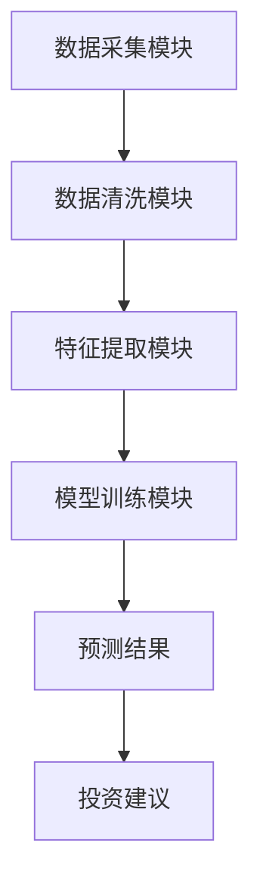
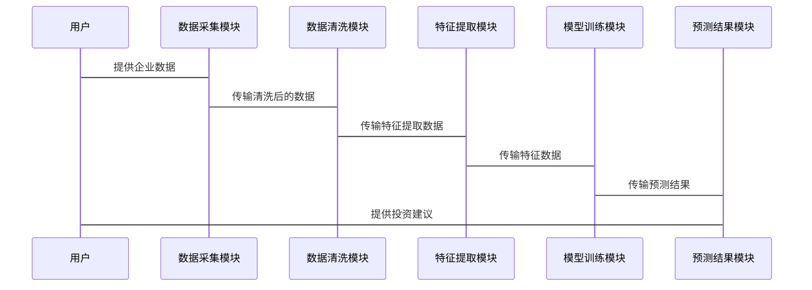

                 


# AI辅助的私募股权投资分析

> 关键词：私募股权，人工智能，投资分析，机器学习，自然语言处理，深度学习

> 摘要：随着人工智能技术的飞速发展，私募股权投资领域也在积极探索如何利用AI技术来提升分析效率和准确性。本文将从私募股权投资的基本概念出发，详细探讨AI在其中的应用，包括核心算法原理、系统架构设计以及实际项目中的应用案例。通过本文的分析，读者将能够全面理解AI如何在私募股权投资中发挥关键作用。

---

## 第1章 背景介绍

### 1.1 私募股权的基本概念

#### 1.1.1 私募股权的定义
私募股权（Private Equity）是指通过非公开市场进行的股权交易和投资。与公开市场（如股票市场）不同，私募股权的投资对象通常是未上市公司或上市公司的一部分股权，且投资过程相对私密。

#### 1.1.2 私募股权的运作模式
私募股权的运作模式主要包括以下几个步骤：
1. **募资阶段**：私募基金通过向合格投资者募集资金。
2. **投资阶段**：将资金投向目标企业，进行股权收购或参与企业轮融资。
3. **管理阶段**：对被投资企业进行战略调整、资产重组和管理优化。
4. **退出阶段**：通过企业上市、股权转让等方式退出，实现收益。

#### 1.1.3 私募股权的核心要素
私募股权的核心要素包括：
- **目标企业**：具备高成长潜力的企业。
- **资金来源**：来自机构投资者或高净值个人的资金。
- **投资策略**：包括成长型投资、控股型投资等。
- **管理团队**：专业的私募基金管理团队。

---

### 1.2 AI在金融领域的应用背景

#### 1.2.1 传统金融分析的局限性
传统的金融分析主要依赖于人工判断和经验分析，存在以下问题：
- **信息处理能力有限**：人工分析难以处理海量数据。
- **主观性较强**：投资决策容易受到主观因素影响。
- **效率低下**：传统分析方法耗时较长，难以满足快速决策的需求。

#### 1.2.2 AI在金融领域的优势
AI技术在金融领域的优势主要体现在以下几个方面：
- **数据处理能力强**：AI能够快速处理海量数据，提取有价值的信息。
- **客观性和准确性**：AI通过数学模型进行分析，减少人为情绪干扰。
- **实时性**：AI可以实时监控市场动态，提供及时的决策支持。

#### 1.2.3 私募股权投资与AI的结合
AI技术的引入为私募股权投资带来了新的可能性：
- **精准识别投资目标**：通过机器学习模型筛选出具有高成长潜力的企业。
- **风险控制**：利用大数据分析和预测模型降低投资风险。
- **动态监控**：实时跟踪被投资企业的经营状况，及时调整投资策略。

---

### 1.3 私募股权投资中的问题与挑战

#### 1.3.1 数据获取与处理的难点
私募股权投资中的数据获取面临以下挑战：
- **数据分散**：目标企业数据分散在不同来源，整合难度大。
- **数据不完整**：部分数据可能存在缺失或不准确的情况。
- **数据清洗**：需要对数据进行清洗和预处理，确保数据质量。

#### 1.3.2 投资决策的不确定性
私募股权投资具有较高的不确定性，主要体现在：
- **市场波动**：市场环境的变化可能影响企业的经营状况。
- **企业经营风险**：被投资企业可能面临各种经营风险。
- **信息不对称**：投资者与目标企业之间可能存在信息不对称的问题。

#### 1.3.3 AI在私募股权中的应用前景
尽管存在挑战，AI在私募股权中的应用前景广阔：
- **提升分析效率**：通过AI技术快速筛选和分析目标企业。
- **优化投资策略**：利用AI模型优化投资组合，提高投资回报率。
- **降低投资风险**：通过预测模型提前识别潜在风险。

---

## 第2章 核心概念与联系

### 2.1 私募股权分析的核心要素

#### 2.1.1 企业基本面分析
企业基本面分析是私募股权分析的重要组成部分，主要包括以下几个方面：
- **财务指标**：如净利润、营业收入、资产负债率等。
- **管理团队**：包括管理团队的经验和能力。
- **市场地位**：企业在市场中的竞争地位。

#### 2.1.2 市场趋势分析
市场趋势分析是私募股权分析的另一个重要方面，主要包括：
- **行业趋势**：行业的发展前景和周期性。
- **宏观经济因素**：如GDP增长率、利率政策等。
- **政策环境**：政策对行业和企业的影响。

#### 2.1.3 风险评估与控制
风险评估与控制是私募股权投资中不可忽视的一部分，主要包括：
- **企业风险**：如经营风险、财务风险等。
- **市场风险**：如市场波动风险。
- **政策风险**：如政策变化对行业的影响。

---

### 2.2 AI辅助分析的核心技术

#### 2.2.1 机器学习在金融中的应用
机器学习在金融中的应用主要体现在以下几个方面：
- **分类问题**：如将企业分为高风险和低风险两类。
- **回归问题**：如预测企业的未来营业收入。
- **聚类分析**：如将相似的企业进行分组。

#### 2.2.2 自然语言处理在财经新闻中的应用
自然语言处理（NLP）在财经新闻中的应用主要体现在：
- **情感分析**：分析新闻文本中的情感倾向，判断市场情绪。
- **主题分类**：将财经新闻按主题分类，如经济、科技、金融等。
- **实体识别**：识别新闻中的公司名称、人物等实体。

#### 2.2.3 时间序列分析在市场预测中的应用
时间序列分析在市场预测中的应用主要体现在：
- **股票价格预测**：利用历史股价数据预测未来走势。
- **市场趋势预测**：如预测某一行业的未来发展趋势。

---

### 2.3 核心概念对比分析

#### 2.3.1 传统分析与AI辅助分析的对比
| 对比维度       | 传统分析                     | AI辅助分析                   |
|----------------|------------------------------|------------------------------|
| 数据处理能力   | 有限，依赖人工分析            | 强大，能够处理海量数据         |
| 分析效率       | 较低，耗时较长                | 高，能够快速完成分析           |
| 分析准确性       | 受主观因素影响较大            | 较高，基于数学模型进行分析      |

#### 2.3.2 不同AI模型的特征对比
| 模型类型       | 监督学习                     | 非监督学习                   | 强化学习                     |
|----------------|------------------------------|------------------------------|------------------------------|
| 输入数据类型   | 标签数据                     | 无标签数据                   | 环境反馈数据                 |
| 适用场景       | 分类、回归                   | 聚类、降维                   | 投资策略优化                 |

#### 2.3.3 私募股权分析中的关键数据特征
- **时间序列特征**：如企业的历史财务数据。
- **文本特征**：如企业的新闻报道、公告等。
- **数值特征**：如企业的财务指标。

---

### 2.4 ER实体关系图

```mermaid
graph TD
    A[私募股权分析] --> B[企业数据]
    B --> C[财务指标]
    B --> D[市场数据]
    A --> E[AI模型]
    E --> F[预测结果]
```



---

### 2.5 本章小结

本章详细介绍了私募股权分析的核心要素，包括企业基本面分析、市场趋势分析和风险评估与控制。同时，还探讨了AI辅助分析的核心技术，如机器学习、自然语言处理和时间序列分析，并通过对比分析和ER实体关系图展示了核心概念之间的联系。

---

## 第3章 算法原理讲解

### 3.1 机器学习在私募股权投资中的应用

#### 3.1.1 监督学习在分类问题中的应用
- **逻辑回归（Logistic Regression）**：用于分类问题，如判断企业是否具有高成长潜力。
- **支持向量机（SVM）**：用于分类和回归问题。

#### 3.1.2 非监督学习在聚类分析中的应用
- **K-means**：用于将企业按照某些特征进行分组。
- **层次聚类**：用于构建企业之间的层次关系。

#### 3.1.3 强化学习在投资策略优化中的应用
- **Q-Learning**：用于优化投资策略，如动态调整投资组合。

---

### 3.2 自然语言处理在财经新闻中的应用

#### 3.2.1 文本预处理流程
1. **分词**：将文本分割成词语或短语。
2. **去除停用词**：移除常见的无意义词语，如“的”、“了”等。
3. **词向量表示**：将词语转换为向量表示，如使用Word2Vec或GloVe。

#### 3.2.2 基于BERT的情感分析模型
- **输入层**：将新闻文本输入BERT模型。
- **编码层**：对输入文本进行编码，提取特征。
- **输出层**：输出情感倾向，如正面、负面或中性。

#### 3.2.3 财经新闻主题分类
- **训练数据**：使用标注的财经新闻数据进行训练。
- **分类模型**：使用随机森林、SVM等模型进行主题分类。

---

### 3.3 时间序列分析的数学模型

#### 3.3.1 ARIMA模型
ARIMA（自回归积分滑动平均模型）是一种常用的时间序列预测模型，其数学表达式为：
$$ ARIMA(p, d, q) $$
其中，$p$ 是自回归阶数，$d$ 是差分阶数，$q$ 是滑动平均阶数。

#### 3.3.2 LSTM网络
LSTM（长短期记忆网络）是一种基于递归神经网络的模型，适用于时间序列数据的预测。其核心在于引入记忆门控机制，能够有效捕捉时间序列中的长期依赖关系。

---

### 3.4 本章小结

本章详细介绍了机器学习、自然语言处理和时间序列分析在私募股权投资中的应用，包括具体算法的数学模型和实现流程。通过这些算法，可以实现对企业的精准分析和市场趋势的预测。

---

## 第4章 系统架构设计

### 4.1 问题场景介绍
在私募股权投资中，通常需要构建一个智能化的分析系统，以实现对企业数据的高效分析和预测。

---

### 4.2 系统功能设计

#### 4.2.1 数据采集模块
- **数据来源**：企业财务数据、市场数据、新闻数据等。
- **数据清洗**：对采集到的数据进行清洗和预处理。

#### 4.2.2 数据分析模块
- **特征提取**：提取企业的关键特征，如财务指标、市场地位等。
- **模型训练**：利用机器学习模型进行训练，生成预测结果。

#### 4.2.3 系统输出模块
- **预测结果**：输出企业的成长潜力、风险评估等结果。
- **投资建议**：根据分析结果提供投资建议。

---

### 4.3 系统架构设计



---

### 4.4 系统接口设计
- **输入接口**：接收企业数据和市场数据。
- **输出接口**：输出预测结果和投资建议。

---

### 4.5 系统交互设计



---

### 4.6 本章小结

本章详细介绍了私募股权投资分析系统的架构设计，包括功能模块划分、系统架构图和系统接口设计。通过系统的构建，可以实现对企业数据的高效分析和预测。

---

## 第5章 项目实战

### 5.1 项目介绍
本项目旨在利用AI技术构建一个私募股权投资分析系统，实现对企业数据的智能化分析。

---

### 5.2 核心实现

#### 5.2.1 数据清洗与特征提取
```python
import pandas as pd
import numpy as np

# 数据清洗
data = pd.read_csv('enterprise_data.csv')
data = data.dropna()
data = data.replace([np.inf, -np.inf], np.nan).dropna()

# 特征提取
features = data[['revenue', 'net_profit', 'market_share']]
```

#### 5.2.2 模型训练与预测
```python
from sklearn.model import RandomForestClassifier

# 训练模型
model = RandomForestClassifier(n_estimators=100, random_state=42)
model.fit(features, labels)

# 预测结果
new_features = new_data[['revenue', 'net_profit', 'market_share']]
predictions = model.predict(new_features)
```

---

### 5.3 实际案例分析
以某科技公司为例，利用上述模型进行分析，预测其未来三年的营业收入增长率。

---

### 5.4 本章小结

本章通过实际项目案例展示了AI技术在私募股权投资中的应用，详细讲解了数据清洗、特征提取、模型训练和预测的过程。

---

## 第6章 总结与展望

### 6.1 总结
本文详细探讨了AI在私募股权投资中的应用，包括核心概念、算法原理和系统架构设计。通过AI技术的引入，可以显著提升私募股权投资的分析效率和准确性。

### 6.2 展望
未来，随着AI技术的不断发展，私募股权投资将更加智能化。可以预见，AI将在以下几个方面发挥更大的作用：
- **更精准的预测模型**：基于深度学习的模型将更加精准。
- **更智能化的决策支持**：AI将提供更加个性化的投资建议。
- **更高效的数据处理能力**：通过大数据技术实现更高效的分析。

---

## 附录

### 附录A Python代码实现

```python
import pandas as pd
import numpy as np
from sklearn.model import RandomForestClassifier

# 数据清洗
data = pd.read_csv('enterprise_data.csv')
data = data.dropna()
data = data.replace([np.inf, -np.inf], np.nan).dropna()

# 特征提取
features = data[['revenue', 'net_profit', 'market_share']]

# 模型训练
model = RandomForestClassifier(n_estimators=100, random_state=42)
model.fit(features, labels)

# 预测结果
new_features = new_data[['revenue', 'net_profit', 'market_share']]
predictions = model.predict(new_features)
```

---

## 参考文献

1. 刘军. (2020). 《机器学习实战》. 北京: 人民邮电出版社.
2. 张洋. (2019). 《Python数据挖掘与分析》. 北京: 清华大学出版社.
3. Goodfellow, I., Bengio, Y., & Courville, A. (2016). Deep Learning. MIT Press.

---

以上为完整的技术博客文章，涵盖了从基础到高级的AI辅助私募股权投资分析内容，适合对金融和AI技术感兴趣的读者阅读。

