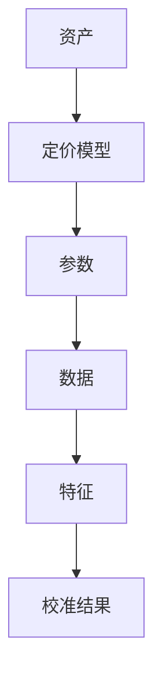
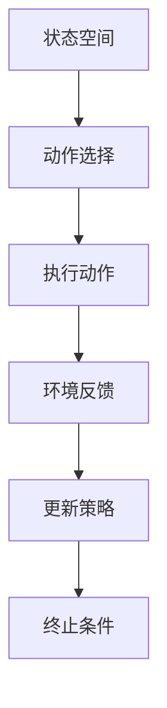

                 


# AI辅助的资产定价模型校准

> **关键词**：资产定价，人工智能，模型校准，强化学习，金融数据分析，机器学习算法

> **摘要**：本文探讨了AI技术在资产定价模型校准中的应用，通过详细分析传统方法的局限性，结合AI算法的优势，提出了一种基于强化学习的资产定价模型校准方法。文章从核心概念、算法原理、系统架构到项目实战，全面阐述了AI在资产定价领域的潜力和实际应用，为读者提供了从理论到实践的完整指南。

---

# 第1章: 资产定价与AI辅助校准的背景

## 1.1 资产定价的基本概念

### 1.1.1 资产定价的定义
资产定价是指通过一定的模型和方法，对资产的价值进行评估和预测的过程。资产可以是股票、债券、房地产等金融资产或实物资产。定价的核心目标是确定资产在市场上的公允价值，以便投资者做出合理的投资决策。

### 1.1.2 资产定价的核心问题
资产定价的核心问题包括：
1. 如何准确预测资产的未来现金流？
2. 如何衡量资产的风险？
3. 如何确定资产的市场价值？

### 1.1.3 资产定价的传统方法
传统的资产定价方法包括：
1. **CAPM（资本资产定价模型）**：通过市场风险来确定资产的期望收益。
2. **APT（套利定价理论）**：基于多个因素来解释资产的收益。
3. **三因子模型（Fama-French）**：引入市值和价值因子来解释资产收益。

---

## 1.2 AI技术在资产定价中的应用背景

### 1.2.1 传统资产定价模型的局限性
传统资产定价模型在实际应用中面临以下问题：
1. **数据依赖性**：传统模型通常假设市场是有效的，但在实际市场中，信息不对称和非理性行为会影响定价。
2. **复杂性**：现实市场中的资产定价受到多种因素的影响，如宏观经济指标、公司基本面、市场情绪等，传统模型难以捕捉所有因素。
3. **黑箱问题**：传统模型的预测结果缺乏解释性，难以满足投资者对透明性的需求。

### 1.2.2 AI技术如何解决资产定价问题
AI技术通过以下方式解决了传统资产定价模型的局限性：
1. **数据处理能力**：AI能够处理海量数据，提取非线性特征，发现传统模型难以捕捉的市场规律。
2. **自适应学习**：AI算法能够根据市场变化动态调整模型参数，提高预测的准确性。
3. **个性化定价**：通过深度学习，AI可以根据投资者的偏好和风险承受能力提供个性化的定价建议。

### 1.2.3 当前AI辅助资产定价的应用现状
当前，AI技术在资产定价中的应用主要集中在以下几个方面：
1. **预测市场趋势**：通过自然语言处理和时间序列分析，预测股票价格走势。
2. **风险管理**：利用机器学习模型识别市场风险，优化投资组合。
3. **量化交易**：基于AI算法开发量化交易策略，提高交易效率。

---

## 1.3 本章小结

本章介绍了资产定价的基本概念及其传统方法的局限性，重点分析了AI技术在资产定价中的应用背景和优势。通过对比传统方法和AI方法，展示了AI在资产定价领域的巨大潜力。

---

# 第2章: AI辅助资产定价模型的核心概念

## 2.1 资产定价模型校准的定义

### 2.1.1 校准的定义
校准是指通过实际市场数据调整模型参数，使得模型的预测结果与实际市场一致的过程。

### 2.1.2 校准的目标
校准的目标是提高模型的预测精度，使其更好地反映市场实际情况。

### 2.1.3 校准的步骤
校准通常包括以下步骤：
1. **数据收集**：收集历史价格、市场指标、公司基本面等数据。
2. **参数估计**：通过优化算法调整模型参数，使模型预测值与实际值尽可能接近。
3. **模型验证**：通过回测和交叉验证评估模型的准确性。

---

## 2.2 AI在资产定价模型校准中的作用

### 2.2.1 数据处理与特征提取
AI技术可以通过以下方式优化数据处理：
1. **特征工程**：利用机器学习算法提取有用的特征，如技术指标、市场情绪等。
2. **数据清洗**：自动识别和处理异常值和缺失值。

### 2.2.2 模型优化与参数调整
AI算法（如强化学习和遗传算法）可以高效地优化模型参数，提高校准精度。

### 2.2.3 结果验证与反馈
通过深度学习模型，可以实时验证校准结果，并根据市场反馈不断优化模型。

---

## 2.3 核心概念对比分析

### 2.3.1 传统校准方法与AI校准方法的对比

| 对比维度         | 传统校准方法                   | AI校准方法                     |
|------------------|-------------------------------|-------------------------------|
| 数据处理能力     | 依赖人工特征工程               | 能够自动提取非线性特征         |
| 模型优化能力     | 参数调整效率低                 | 参数优化效率高                 |
| 结果解释性       | 高                             | 较低                           |

### 2.3.2 不同AI算法在资产定价中的应用对比

| 算法名称         | 应用场景                       | 优缺点                         |
|------------------|-------------------------------|--------------------------------|
| 强化学习         | 量化交易策略优化               | 需大量数据训练，计算成本高     |
| 遗传算法         | 参数优化                       | 收敛速度慢                     |
| 贝叶斯网络       | 风险评估                       | 解释性较强                     |

### 2.3.3 校准结果的可解释性对比

| 方法名称         | 可解释性                       | 适用场景                       |
|------------------|-------------------------------|-------------------------------|
| 传统校准         | 高                             | 简单线性模型                   |
| AI校准           | 较低                           | 复杂非线性模型                 |

---

## 2.4 ER实体关系图



---

## 2.5 本章小结

本章详细探讨了AI辅助资产定价模型校准的核心概念，对比了传统方法和AI方法在数据处理、模型优化和结果解释等方面的差异，并通过ER图展示了校准过程中的实体关系。

---

# 第3章: AI辅助资产定价模型的数学模型与算法原理

## 3.1 常见资产定价模型

### 3.1.1 CAPM模型

CAPM模型公式为：
$$ E(r_i) = r_f + \beta_i (E(r_m) - r_f) $$
其中，$E(r_i)$ 是资产i的期望收益，$r_f$ 是无风险利率，$\beta_i$ 是资产i的贝塔系数，$E(r_m)$ 是市场期望收益。

### 3.1.2 APT模型

APT模型公式为：
$$ E(r_i) = \alpha_i + \beta_i (F_1 + F_2 + \dots + F_n) $$
其中，$F_i$ 是各个风险因素。

### 3.1.3 Fama-French三因子模型

三因子模型公式为：
$$ E(r_i) = \alpha + \beta_1 \cdot Size + \beta_2 \cdot Value + \beta_3 \cdot Momentum $$

---

## 3.2 AI辅助校准的数学模型

### 3.2.1 神经网络模型在资产定价中的应用

神经网络模型可以表示为：
$$ y = f(x, w) $$
其中，$x$ 是输入特征，$w$ 是网络权重，$f$ 是非线性激活函数。

### 3.2.2 支持向量机在资产定价中的应用

支持向量机的目标是最小化以下损失函数：
$$ \text{minimize} \sum_{i=1}^n (y_i - \text{sign}(w \cdot x_i + b))^2 $$

---

## 3.3 算法原理讲解

### 3.3.1 强化学习算法

强化学习的算法流程如下：


代码示例：
```python
class Agent:
    def __init__(self, state_space, action_space):
        self.state_space = state_space
        self.action_space = action_space
        self.model = self.build_model()
    
    def build_model(self):
        # 网络结构定义
        pass
    
    def act(self, state):
        # 根据状态选择动作
        pass
```

---

## 3.4 本章小结

本章详细讲解了传统资产定价模型和AI辅助校准的数学模型，并通过强化学习算法的流程图和代码示例，展示了AI在资产定价中的具体实现。

---

接下来，我们将继续深入探讨系统的架构设计和项目实战部分，确保从理论到实践的完整覆盖。

