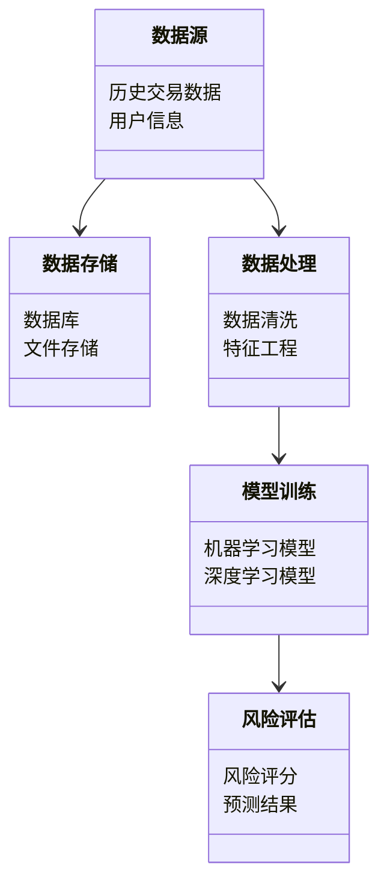
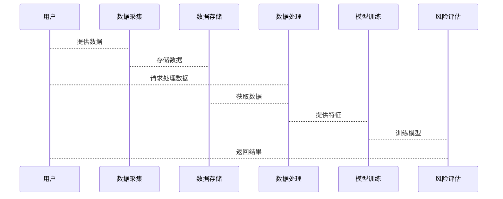

                 

# AI辅助的金融风险评估系统设计

## 关键词：AI、金融风险、评估系统、机器学习、深度学习

## 摘要：本文将详细探讨如何利用人工智能技术辅助金融风险评估系统的构建。从传统方法的局限性出发，分析AI技术在金融领域的优势，详细介绍机器学习和深度学习算法的原理及应用，系统架构设计，项目实战实现，以及最佳实践和未来发展方向。

---

## 目录大纲

### 第1章: 金融风险评估概述
1.1 金融风险的基本概念
1.2 传统金融风险评估方法
1.3 AI技术在金融领域的应用前景
1.4 本书的目标与范围

### 第2章: AI辅助金融风险评估的核心概念
2.1 AI在金融风险评估中的作用
2.2 机器学习与深度学习在金融中的应用
2.3 金融风险评估中的关键指标
2.4 系统设计的核心要素

### 第3章: AI辅助金融风险评估的算法原理
3.1 机器学习算法概述
3.2 深度学习算法概述
3.3 常见算法的优缺点对比
3.4 算法实现的数学模型

### 第4章: AI辅助金融风险评估的系统架构设计
4.1 系统设计的核心要素
4.2 系统功能设计（领域模型Mermaid类图）
4.3 系统架构设计（Mermaid架构图）
4.4 系统接口设计
4.5 系统交互流程（Mermaid序列图）

### 第5章: AI辅助金融风险评估的项目实战
5.1 环境搭建
5.2 数据准备与预处理
5.3 模型训练与优化
5.4 模型评估与结果分析
5.5 代码实现与解读

### 第6章: 最佳实践与总结
6.1 项目小结
6.2 注意事项
6.3 拓展阅读

---

## 第1章: 金融风险评估概述

### 1.1 金融风险的基本概念
金融风险是指在金融活动中，由于各种不确定因素的影响，导致资金损失的可能性。常见的金融风险包括市场风险、信用风险、流动性风险和操作风险。

### 1.2 传统金融风险评估方法
传统方法依赖于历史数据和统计分析，如VaR模型和信用评分模型。然而，这些方法在面对复杂和非线性关系时表现有限，且难以处理大数据和实时变化。

### 1.3 AI技术在金融领域的应用前景
AI技术通过机器学习和深度学习，能够处理大量非结构化数据，发现隐藏模式，提高预测准确性。AI在金融中的应用包括欺诈检测、信用评分和市场预测。

### 1.4 本书的目标与范围
本书旨在介绍如何利用AI技术构建金融风险评估系统，涵盖从理论到实践的全过程，帮助读者掌握系统设计和实现的关键点。

---

## 第2章: AI辅助金融风险评估的核心概念

### 2.1 AI在金融风险评估中的作用
AI通过自动化数据处理、模型构建和预测，提高风险评估的效率和准确性。

### 2.2 机器学习与深度学习在金融中的应用
机器学习适用于分类和回归问题，深度学习擅长处理复杂数据，如图像和文本。

### 2.3 金融风险评估中的关键指标
关键指标包括违约概率、风险价值和信用评分，这些指标帮助量化风险。

### 2.4 系统设计的核心要素
系统设计需要考虑数据来源、模型选择和系统的扩展性，确保系统高效可靠。

---

## 第3章: AI辅助金融风险评估的算法原理

### 3.1 机器学习算法概述
- **线性回归**：用于预测连续变量，公式为$$ y = \beta_0 + \beta_1x + \epsilon $$
- **支持向量机**：适用于分类和回归，通过最大化间隔进行优化
- **随机森林**：基于决策树的集成方法，提高模型鲁棒性

### 3.2 深度学习算法概述
- **神经网络**：基本结构包括输入层、隐藏层和输出层
- **卷积神经网络**：适用于图像处理，通过卷积操作提取特征
- **循环神经网络**：适用于序列数据，如时间序列分析

### 3.3 常见算法的优缺点对比
| 算法       | 优点                           | 缺点                           |
|------------|--------------------------------|--------------------------------|
| 线性回归    | 简单，易于解释                 | 无法处理非线性关系             |
| 支持向量机  | 高维数据表现好                 | 参数敏感性高                   |
| 随机森林    | 鲁棒性强，适合小数据           | 对大数据处理较慢               |
| 神经网络    | 处理复杂数据能力强             | 需要大量数据，计算复杂         |

### 3.4 算法实现的数学模型
- **线性回归**：$$ L = \frac{1}{2m}\sum_{i=1}^{m}(y_i - \hat{y}_i)^2 $$
- **神经网络**：$$ a^{(l+1)} = \sigma(w^{(l)}a^{(l)} + b^{(l)}) $$

---

## 第4章: AI辅助金融风险评估的系统架构设计

### 4.1 系统设计的核心要素
系统设计需考虑数据采集、存储、处理和分析，确保高效和安全。

### 4.2 系统功能设计（领域模型Mermaid类图）

### 4.3 系统架构设计（Mermaid架构图）

### 4.4 系统接口设计
系统接口包括数据输入接口、模型调用接口和结果输出接口，确保模块间高效通信。

### 4.5 系统交互流程（Mermaid序列图）

---

## 第5章: AI辅助金融风险评估的项目实战

### 5.1 环境搭建
安装Python、Pandas、Scikit-learn、TensorFlow等工具，配置开发环境。

### 5.2 数据准备与预处理
加载数据，清洗缺失值，进行特征工程，如标准化和PCA降维。

### 5.3 模型训练与优化
选择模型，训练数据，调整超参数，评估模型性能。

### 5.4 模型评估与结果分析
使用混淆矩阵、ROC曲线等指标评估模型，分析结果并优化。

### 5.5 代码实现与解读
提供完整的代码实现，解读关键部分，如数据预处理和模型训练。

---

## 第6章: 最佳实践与总结

### 6.1 项目小结
总结项目的实现过程，分析系统的优缺点，提出改进建议。

### 6.2 注意事项
提示读者在实际应用中需要注意数据隐私、模型泛化能力等问题。

### 6.3 拓展阅读
推荐相关书籍和论文，鼓励读者深入学习和研究。

---

通过以上目录，读者可以系统地学习AI辅助金融风险评估系统的构建过程，从理论到实践，逐步掌握系统设计和实现的关键点。

