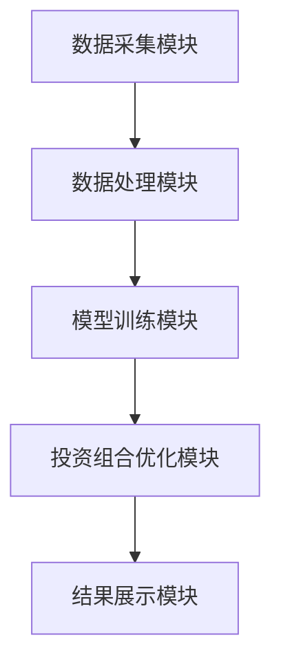

                 


```markdown
# 第五章: 系统架构与实现

## 5.1 系统架构设计
### 5.1.1 系统功能模块划分
- 数据采集模块
- 数据处理模块
- 模型训练模块
- 投资组合优化模块
- 结果展示模块

### 5.1.2 系统架构图（使用 mermaid）


## 5.2 系统功能设计
### 5.2.1 数据采集模块
- 数据来源：爬取财经网站、API接口调用、数据库导入
- 数据类型：文本数据、结构化数据、非结构化数据
- 数据清洗：去除缺失值、处理异常值、标准化处理

### 5.2.2 数据处理模块
- 数据预处理：特征提取、降维、数据增强
- 数据建模：训练ESG评分模型
- 数据分析：生成ESG评分报告

### 5.2.3 模型训练模块
- 选择模型：支持向量机、随机森林、神经网络
- 训练数据：划分训练集、验证集、测试集
- 模型调优：参数优化、交叉验证、超参数调整

### 5.2.4 投资组合优化模块
- 确定目标：最大化收益、最小化风险、满足ESG评分要求
- 选择算法：遗传算法、粒子群优化、模拟退火
- 优化过程：迭代优化、收敛判断、结果输出

### 5.2.5 结果展示模块
- 可视化：柱状图、折线图、饼图
- 报告生成：PDF、HTML、Excel
- 交互式界面：用户自定义查看

## 5.3 系统接口设计
### 5.3.1 数据接口
- API接口定义：RESTful API
- 接口调用：使用Python的requests库
- 返回格式：JSON格式

### 5.3.2 模型接口
- 模型服务接口：Flask或Django框架
- 调用方式：HTTP请求
- 返回结果：预测评分

## 5.4 系统交互流程
### 5.4.1 用户登录
- 用户输入用户名和密码
- 系统验证身份
- 登录成功后进入主界面

### 5.4.2 数据采集
- 用户选择数据来源
- 系统启动数据采集任务
- 数据采集完成后提示用户

### 5.4.3 模型训练
- 用户选择训练数据和模型
- 系统开始训练过程
- 训练完成后显示训练结果

### 5.4.4 投资组合优化
- 用户输入投资预算和风险偏好
- 系统启动优化过程
- 显示优化结果和可视化报告

## 5.5 本章小结
通过系统的架构设计和功能实现，我们可以看到AI在ESG投资分析中的具体应用。每个模块都有其特定的功能和作用，共同构成了一个完整的ESG投资分析系统。通过合理的接口设计和系统交互流程，用户可以方便地使用系统进行ESG投资分析，实现高效和准确的投资决策。
```

