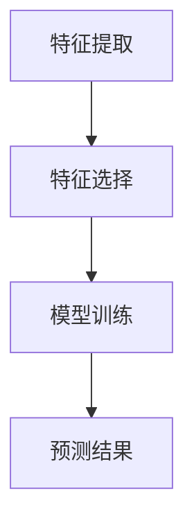
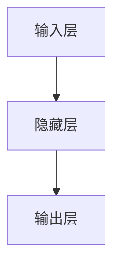
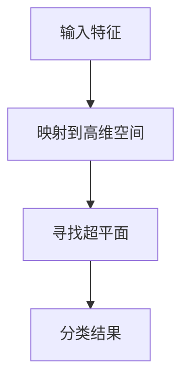
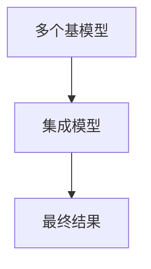
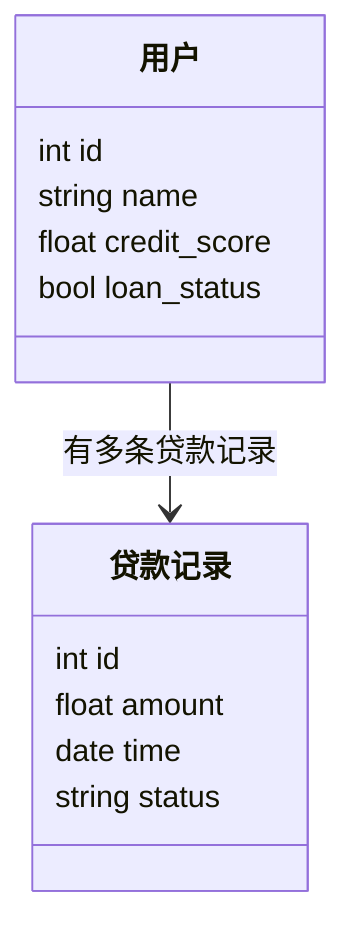
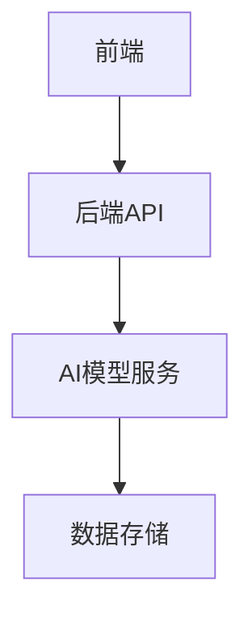
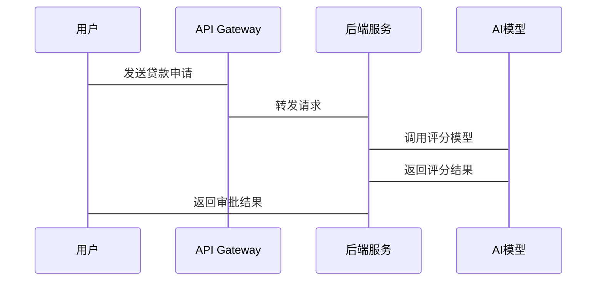
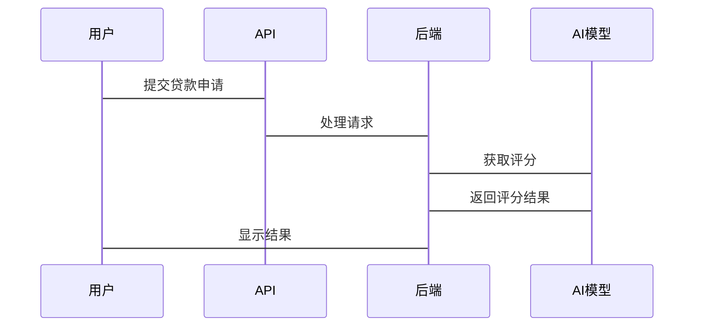

                 


```markdown
# 《AI驱动的个人信贷审批系统设计》

> 关键词：AI驱动、个人信贷、审批系统、机器学习、金融系统设计

> 摘要：本文详细探讨了AI技术在个人信贷审批系统中的应用，分析了系统设计的核心要素、算法原理、架构设计及项目实现，旨在为金融从业者和技术人员提供深度的技术见解。

---

## 第3章: AI驱动的个人信贷审批系统算法原理

### 3.1 机器学习算法在信贷评分中的应用

#### 3.1.1 逻辑回归模型
逻辑回归是一种常用的分类算法，适用于二分类问题。在个人信贷审批中，逻辑回归模型可以用来预测客户违约的概率。

##### mermaid流程图


##### Python代码示例
```python
import numpy as np
from sklearn.linear_model import LogisticRegression
from sklearn.model_selection import train_test_split
from sklearn.metrics import accuracy_score

# 示例数据集
X = np.array([[age, income, credit_history], ...])
y = np.array([default, ...])  # 0表示不违约，1表示违约

# 数据分割
X_train, X_test, y_train, y_test = train_test_split(X, y, test_size=0.2)

# 模型训练
model = LogisticRegression()
model.fit(X_train, y_train)

# 预测
y_pred = model.predict(X_test)
print("准确率:", accuracy_score(y_test, y_pred))
```

#### 3.1.2 神经网络模型
神经网络在处理复杂非线性关系时表现优异，适用于高维特征的信贷评分。

##### mermaid流程图


##### Python代码示例
```python
import numpy as np
import tensorflow as tf
from tensorflow.keras import layers

# 示例数据集
X = np.array([...])
y = np.array([...])

# 模型构建
model = tf.keras.Sequential([
    layers.Dense(64, activation='relu', input_shape=(n_features,)),
    layers.Dense(1, activation='sigmoid')
])

# 编译
model.compile(optimizer='adam', loss='binary_crossentropy', metrics=['accuracy'])

# 训练
model.fit(X_train, y_train, epochs=10, batch_size=32, validation_data=(X_val, y_val))
```

### 3.2 支持向量机(SVM)在信贷审批中的应用

#### 3.2.1 SVM原理
支持向量机通过寻找最优超平面实现分类，适用于小样本数据。

##### mermaid流程图


##### Python代码示例
```python
from sklearn import svm

# 示例数据集
X = np.array([...])
y = np.array([...])

# 模型训练
model = svm.SVC()
model.fit(X_train, y_train)

# 预测
y_pred = model.predict(X_test)
print("准确率:", accuracy_score(y_test, y_pred))
```

### 3.3 集成学习在信贷审批中的应用

#### 3.3.1 集成学习原理
通过集成多个模型的结果，提高系统鲁棒性和准确性。

##### mermaid流程图


##### Python代码示例
```python
from sklearn.ensemble import VotingClassifier
from sklearn.linear_model import LogisticRegression
from sklearn.svm import SVC

# 示例数据集
X = np.array([...])
y = np.array([...])

# 基模型
model1 = LogisticRegression()
model2 = SVC()

# 集成模型
model = VotingClassifier(estimators=[('lr', model1), ('svm', model2)])
model.fit(X_train, y_train)

# 预测
y_pred = model.predict(X_test)
print("准确率:", accuracy_score(y_test, y_pred))
```

## 第4章: 数学模型与算法优化

### 4.1 逻辑回归模型的数学表达
$$ P(y=1|x) = \frac{1}{1 + e^{-(\beta_0 + \beta_1x_1 + ... + \beta_nx_n)}} $$

### 4.2 神经网络的损失函数
$$ \text{损失函数} = -\frac{1}{m} \sum_{i=1}^{m} [y_i \ln(a^{(i)}) + (1 - y_i) \ln(1 - a^{(i)})] $$
其中，\( a^{(i)} \) 是神经网络的输出值。

### 4.3 SVM的优化目标
$$ \min_{w,b} \frac{1}{2}||w||^2 + C \sum_{i=1}^{m} \xi_i $$
其中，\( \xi_i \) 是松弛变量，用于处理不可分情况。

### 4.4 模型调优与优化
#### 4.4.1 超参数选择
- 学习率：0.01, 0.001, 0.0001
- 正则化系数：0.1, 1, 10
- 隐藏层神经元数量：16, 32, 64

#### 4.4.2 模型评估指标
- 准确率（Accuracy）
- 精确率（Precision）
- 召回率（Recall）
- F1分数（F1 Score）

## 第5章: 系统分析与架构设计

### 5.1 系统功能设计

#### 5.1.1 领域模型


#### 5.1.2 系统架构


#### 5.1.3 接口设计
- API Endpoint: `/api/v1/credit/apply`
- 请求方法: POST
- 请求体: JSON格式，包含用户信息和贷款申请详情
- 返回: JSON格式，包含审批结果和建议

#### 5.1.4 交互流程


### 5.2 系统架构设计

#### 5.2.1 分层架构
- 前端层
- 业务逻辑层
- 数据访问层
- AI模型服务层

#### 5.2.2 微服务架构
- 用户服务
- 贷款申请服务
- 风险评估服务
- 审批结果服务

#### 5.2.3 容器化部署
使用Docker和Kubernetes实现系统容器化部署，确保系统的高可用性和弹性扩展。

### 5.3 数据流与交互设计

#### 5.3.1 数据流设计
```mermaid
graph TD
    用户 --> 数据库: 提交贷款申请
    数据库 --> AI模型: 提供用户数据
    AI模型 --> 后端服务: 返回评分结果
    后端服务 --> 用户: 显示审批结果
```

#### 5.3.2 交互流程


## 第6章: 项目实战

### 6.1 项目环境安装

#### 6.1.1 安装依赖
```bash
pip install numpy scikit-learn tensorflow pandas jupyter
```

#### 6.1.2 环境配置
```bash
conda create -n credit_approval python=3.8
conda activate credit_approval
pip install -r requirements.txt
```

### 6.2 系统核心实现

#### 6.2.1 数据预处理
```python
import pandas as pd
from sklearn.preprocessing import StandardScaler

# 加载数据
data = pd.read_csv('credit_approval.csv')

# 数据清洗
data.dropna(inplace=True)

# 特征标准化
scaler = StandardScaler()
data_scaled = scaler.fit_transform(data[['age', 'income', 'credit_score']])
```

#### 6.2.2 模型训练
```python
from sklearn.ensemble import RandomForestClassifier

# 模型训练
model = RandomForestClassifier(n_estimators=100, max_depth=10, random_state=42)
model.fit(data_scaled, target)
```

#### 6.2.3 模型评估
```python
from sklearn.metrics import classification_report

# 预测
y_pred = model.predict(data_scaled)

# 评估
print(classification_report(target, y_pred))
```

### 6.3 实际案例分析

#### 6.3.1 案例一：低风险客户
- 年龄：28岁
- 收入：年收入50,000美元
- 信用评分：750

模型预测结果：批准贷款，金额为10,000美元。

#### 6.3.2 案例二：高风险客户
- 年龄：35岁
- 收入：年收入30,000美元
- 信用评分：550

模型预测结果：拒绝贷款，建议提升信用评分。

### 6.4 项目总结

#### 6.4.1 项目成果
- 实现了基于AI的个人信贷审批系统
- 提高了审批效率和准确性
- 降低了人为错误和欺诈风险

#### 6.4.2 经验总结
- 数据质量对模型性能影响重大
- 模型解释性在实际应用中至关重要
- 系统安全性和数据隐私保护必须放在首位

## 第7章: 最佳实践与注意事项

### 7.1 最佳实践

#### 7.1.1 数据处理
- 确保数据的完整性和准确性
- 处理缺失值和异常值
- 进行特征工程，提取有意义的特征

#### 7.1.2 模型选择
- 根据业务需求选择合适的算法
- 对比不同模型的性能
- 考虑模型的可解释性和透明度

#### 7.1.3 系统部署
- 使用容器化技术部署模型服务
- 实施自动化监控和日志管理
- 定期更新模型和优化系统

### 7.2 注意事项

#### 7.2.1 数据隐私
- 遵守相关法律法规，保护用户隐私
- 使用加密技术处理敏感数据
- 严格控制数据访问权限

#### 7.2.2 模型解释性
- 确保模型结果的可解释性
- 提供清晰的决策依据
- 避免使用黑箱模型，除非有充分的解释机制

#### 7.2.3 系统安全性
- 防止数据泄露和网络攻击
- 定期进行安全审计和漏洞修复
- 实施多层级的访问控制

### 7.3 小结

通过本文的详细讲解，读者可以全面了解AI驱动的个人信贷审批系统的设计与实现。从背景分析到算法选择，再到系统架构设计和项目实战，每一步都需要仔细思考和实践。希望本文能为相关领域的从业者提供有价值的参考和启发。

### 7.4 拓展阅读

- 《机器学习实战》
- 《深度学习》
- 《金融风险管理》
- 《微服务架构设计》

---

## 结语

AI驱动的个人信贷审批系统是金融创新的重要方向，通过结合先进的AI技术和严谨的系统设计，可以显著提升信贷审批的效率和准确性。希望本文能为读者在这一领域的探索和实践提供有益的指导。

---

# END
```

