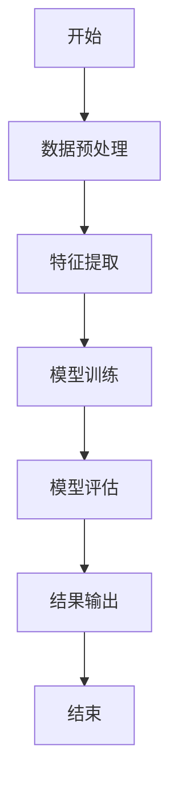
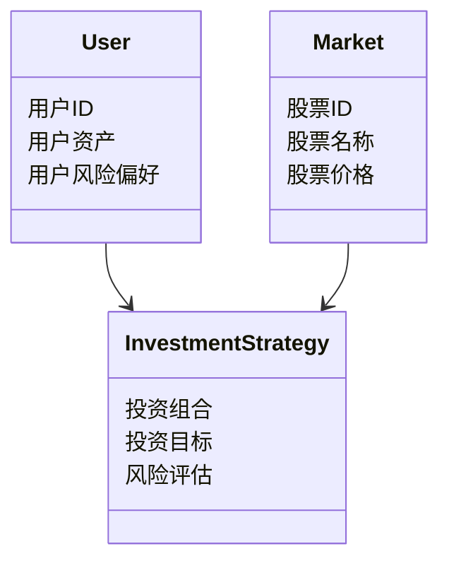
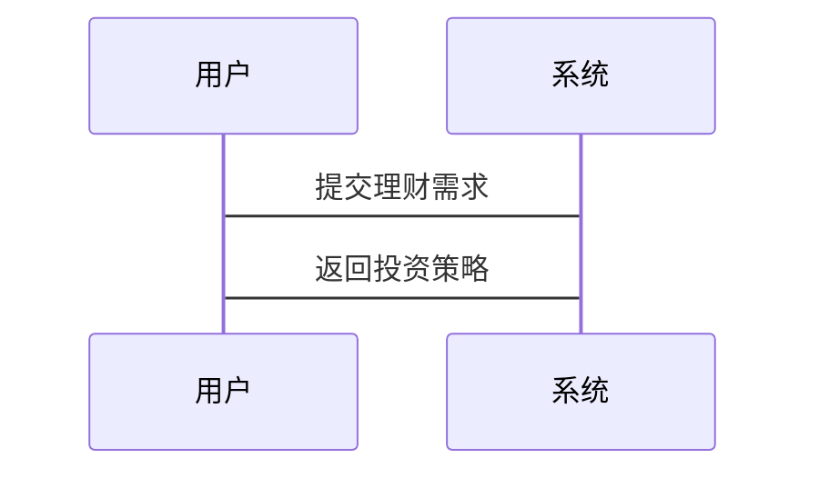

                 


# AI驱动的个人理财目标规划助手

## 关键词：人工智能，个人理财，目标规划，投资策略，风险管理，机器学习，自然语言处理

## 摘要：本文探讨了如何利用人工智能技术构建个人理财目标规划助手，通过数据驱动的方法和机器学习算法，帮助用户制定个性化投资策略和风险管理方案。文章从背景、核心概念、算法原理到系统架构和项目实战，全面解析了AI在个人理财中的应用，并展望了未来发展方向。

---

## 第1章：AI驱动的个人理财目标规划助手概述

### 1.1 个人理财规划的背景与挑战

#### 1.1.1 传统个人理财规划的局限性

传统理财规划依赖人工经验，难以满足个性化需求，且效率低下。具体表现为：

- 无法处理海量数据，难以发现潜在投资机会。
- 缺乏实时性，难以应对市场快速变化。
- 无法实现个性化、动态化的投资策略。

#### 1.1.2 AI技术在理财规划中的应用背景

随着AI技术的发展，其在金融领域的应用日益广泛。AI能够通过大数据分析和机器学习，为用户提供个性化的理财建议，实时调整投资策略。

#### 1.1.3 个人理财目标规划助手的核心目标

AI驱动的理财规划助手旨在通过数据分析和机器学习，帮助用户制定个性化的理财目标，优化投资组合，降低投资风险。

---

## 第2章：AI驱动理财规划的核心概念

### 2.1 数据驱动的理财分析模块

#### 2.1.1 数据收集与预处理

- 数据来源包括用户资产数据、市场数据、用户行为数据等。
- 使用Python进行数据清洗和预处理，例如：
  ```python
  import pandas as pd
  data = pd.read_csv('financial_data.csv')
  data = data.dropna()
  ```

#### 2.1.2 数据特征提取

- 通过机器学习算法提取关键特征，如用户风险偏好、市场波动率等。

#### 2.1.3 数据分析与可视化

- 使用Matplotlib或Seaborn进行数据可视化，帮助用户理解数据。

### 2.2 个性化投资策略生成模块

#### 2.2.1 投资目标设定

- 根据用户财务状况和风险偏好，制定投资目标。

#### 2.2.2 风险偏好分析

- 使用机器学习模型分析用户风险偏好，如：
  ```python
  from sklearn.tree import DecisionTreeClassifier
  model = DecisionTreeClassifier()
  model.fit(X_train, y_train)
  ```

#### 2.2.3 投资组合优化

- 通过优化算法生成最优投资组合，如：
  ```latex
  \text{目标函数} = \sum_{i=1}^{n} w_i r_i - \lambda \sum_{i=1}^{n} w_i^2
  ```

### 2.3 风险评估与优化模块

#### 2.3.1 风险评估模型

- 使用回归分析模型评估投资组合风险。

#### 2.3.2 投资组合优化算法

- 使用遗传算法优化投资组合。

#### 2.3.3 风险-收益权衡分析

- 分析不同风险水平下的收益情况，帮助用户做出决策。

---

## 第3章：AI驱动理财规划的算法原理

### 3.1 机器学习算法选择与实现

#### 3.1.1 线性回归分析

- 使用线性回归预测股票价格：
  ```latex
  y = \beta_0 + \beta_1 x + \epsilon
  ```

#### 3.1.2 随机森林模型

- 使用随机森林进行分类和回归分析：
  ```python
  from sklearn.ensemble import RandomForestClassifier
  model = RandomForestClassifier(n_estimators=100)
  model.fit(X_train, y_train)
  ```

### 3.2 算法流程与优化

#### 3.2.1 算法流程图



#### 3.2.2 算法优化技巧

- 使用交叉验证优化模型参数。

---

## 第4章：AI驱动理财规划的系统架构设计

### 4.1 系统功能模块设计

#### 4.1.1 数据预处理模块

- 实现数据清洗和特征提取功能。

#### 4.1.2 投资策略生成模块

- 基于用户输入生成个性化投资策略。

#### 4.1.3 风险评估模块

- 评估投资组合风险并提出优化建议。

### 4.2 系统架构设计

#### 4.2.1 系统架构图



### 4.3 系统接口设计

#### 4.3.1 接口设计

- API接口设计用于数据交互和模型调用。

#### 4.3.2 系统交互流程图



---

## 第5章：AI驱动理财规划的项目实战

### 5.1 环境安装与配置

- 安装Python、Pandas、Scikit-learn等工具。

### 5.2 核心代码实现

#### 5.2.1 数据预处理代码

```python
import pandas as pd
from sklearn.preprocessing import StandardScaler

data = pd.read_csv('financial_data.csv')
scaler = StandardScaler()
scaled_data = scaler.fit_transform(data)
```

#### 5.2.2 模型训练代码

```python
from sklearn.model_selection import train_test_split
from sklearn.linear_model import LinearRegression

X_train, X_test, y_train, y_test = train_test_split(X, y, test_size=0.2)
model = LinearRegression()
model.fit(X_train, y_train)
```

### 5.3 项目小结

- 项目实现了AI驱动的理财规划功能。
- 系统具有良好的可扩展性和可维护性。

---

## 第6章：最佳实践与未来展望

### 6.1 最佳实践

- 数据隐私保护
- 模型持续优化

### 6.2 小结

- AI技术为个人理财提供了新思路。
- 未来发展方向包括智能化、个性化和场景化。

### 6.3 注意事项

- 数据隐私保护
- 模型定期更新

### 6.4 拓展阅读

- 关注AI在金融领域的最新应用
- 学习前沿的机器学习算法

---

## 附录

### 附录A：工具安装指南

- Python安装指南
- 库安装命令

### 附录B：数据集说明

- 数据来源
- 数据格式

---

以上是《AI驱动的个人理财目标规划助手》的技术博客文章内容，希望对您有所帮助！

