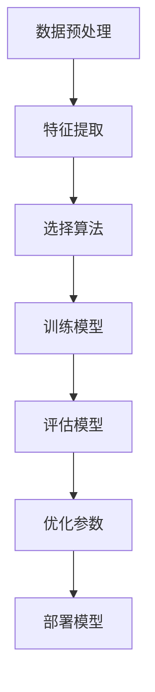
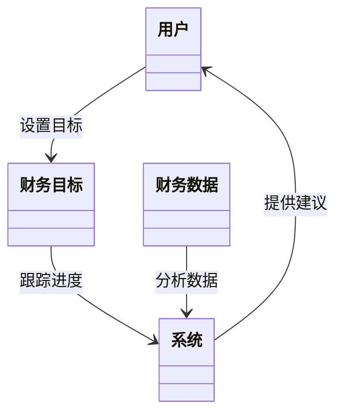
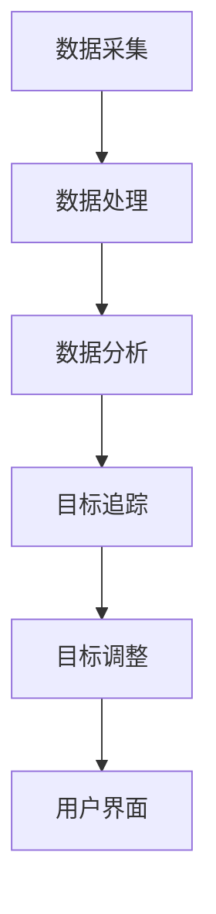
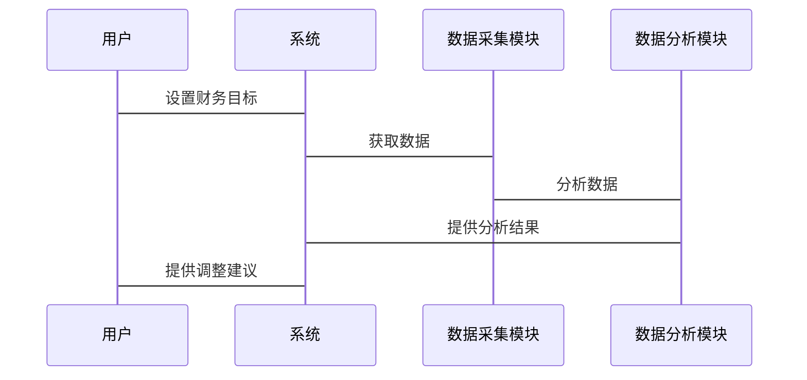

                 


# AI驱动的个人财务目标追踪与调整系统

## 关键词：AI技术、个人财务管理、财务目标追踪、机器学习、算法优化、系统架构

## 摘要：本文介绍了一种基于AI技术的个人财务目标追踪与调整系统。通过分析个人财务管理中的痛点和需求，提出了一种结合机器学习、自然语言处理和强化学习的AI驱动解决方案。文章详细阐述了系统的背景、核心概念、算法原理、系统架构，并通过实际案例展示了系统的实现和应用效果。

---

# 第一部分: AI驱动的个人财务目标追踪与调整系统背景介绍

## 第1章: 问题背景与目标描述

### 1.1 问题背景

#### 1.1.1 传统个人财务管理的痛点
传统个人财务管理存在以下痛点：
- 数据分散：财务数据（如银行账单、消费记录等）分散在不同平台，难以统一管理。
- 知识门槛高：用户需要具备一定的财务知识才能进行有效的财务规划。
- 时间成本高：手动记录和分析财务数据耗时耗力。
- 缺乏实时性：财务目标的调整需要依赖定期的人工评估，无法实时响应。

#### 1.1.2 AI技术在财务管理中的应用潜力
AI技术在财务管理中的潜力包括：
- 自动化数据处理：AI能够自动收集、整理和分析财务数据。
- 智能预测：基于历史数据，AI可以预测未来的收入和支出，帮助用户制定更准确的财务计划。
- 实时调整：AI可以实时监控用户的财务状况，并根据变化自动调整财务目标。

#### 1.1.3 个人财务目标追踪与调整的必要性
个人财务目标的追踪与调整是实现财务健康的关键步骤。通过AI技术，用户可以：
- 实时监控财务状况，及时发现异常。
- 根据市场变化和个人收支情况，动态调整财务目标。
- 提高财务决策的科学性和准确性。

### 1.2 问题描述

#### 1.2.1 个人财务目标的多样性与复杂性
个人财务目标包括：
- 收入目标：如月薪、投资收益等。
- 支出目标：如房贷、生活开支等。
- 储蓄目标：如应急基金、 retirement savings 等。
- 投资目标：如股票、基金等。

财务目标的多样性与复杂性使得传统的静态管理方法难以满足需求。

#### 1.2.2 财务数据的实时性与准确性要求
财务数据需要实时更新，以便及时调整财务目标。同时，数据的准确性直接影响到财务分析的准确性。

#### 1.2.3 用户行为与财务目标的动态调整需求
用户的收入、支出和投资行为会不断变化，财务目标也需要随之调整。传统的定期评估方法难以满足实时调整的需求。

### 1.3 问题解决思路

#### 1.3.1 利用AI技术实现自动化财务目标追踪
通过AI技术，系统可以自动收集和分析用户的财务数据，实时追踪财务目标的实现进度。

#### 1.3.2 基于数据驱动的财务目标调整策略
系统可以根据历史数据和当前数据，预测未来的财务状况，并提出调整建议。

#### 1.3.3 AI算法在个人财务管理中的具体应用
- 机器学习：用于预测收入和支出。
- 自然语言处理：用于解析财务文档和用户意图。
- 强化学习：用于优化投资组合。

### 1.4 系统边界与外延

#### 1.4.1 系统功能的边界定义
系统功能包括：
- 数据采集：从银行、支付宝等平台获取财务数据。
- 数据分析：分析收入、支出、资产和负债。
- 财务目标设定：帮助用户设定合理的财务目标。
- 财务目标追踪：实时监控目标实现进度。
- 财务目标调整：根据实际情况自动调整目标。

#### 1.4.2 系统与外部环境的交互关系
系统需要与以下外部环境进行交互：
- 数据源：银行、支付宝、微信支付等平台。
- 用户：通过移动APP或网页界面与用户交互。
- 第三方服务：如投资平台、信用评估机构等。

#### 1.4.3 系统功能的扩展性与灵活性
系统设计应具备扩展性，能够支持新的财务目标和新的数据源。同时，系统应具备灵活性，能够根据用户需求进行个性化配置。

### 1.5 核心概念与组成要素

#### 1.5.1 财务目标的定义与分类
财务目标是指用户在一定时间内希望通过财务管理实现的具体成果。根据目标的性质，可以分为：
- 收入目标：如月入目标。
- 支出目标：如房贷、生活开支等。
- 储蓄目标：如应急基金、退休储蓄等。
- 投资目标：如股票、基金等。

#### 1.5.2 AI算法在系统中的作用
AI算法用于：
- 数据分析：如聚类分析、回归分析等。
- 预测：如收入预测、支出预测。
- 优化：如投资组合优化。

#### 1.5.3 系统功能模块的组成与关系
系统功能模块包括：
- 数据采集模块：负责获取财务数据。
- 数据处理模块：对数据进行清洗和预处理。
- 分析模块：使用AI算法进行分析和预测。
- 目标追踪模块：实时监控目标实现进度。
- 目标调整模块：根据分析结果调整财务目标。
- 用户界面模块：供用户查看和管理财务目标。

---

## 第2章: 核心概念与联系

### 2.1 AI驱动的财务管理核心原理

#### 2.1.1 机器学习在财务目标追踪中的应用
机器学习用于：
- 预测未来的收入和支出。
- 分析历史数据，识别财务模式。

#### 2.1.2 自然语言处理在财务数据解析中的作用
自然语言处理用于：
- 解析财务文档，提取关键信息。
- 理解用户的意图，提供个性化的财务建议。

#### 2.1.3 强化学习在财务目标调整中的应用
强化学习用于：
- 优化投资组合。
- 动态调整财务目标。

### 2.2 核心概念属性对比表

| 核心概念 | 属性 | 描述 |
|----------|------|------|
| 财务目标 | 类型 | 收入目标、支出目标等 |
| AI算法 | 类型 | 机器学习、自然语言处理等 |
| 数据特征 | 类别 | 收入、支出、资产、负债等 |

### 2.3 ER实体关系图架构的 Mermaid 流程图

```mermaid
erd
    用户
    财务目标
    财务数据
    系统
    用户 --> 财务目标: 设置目标
    用户 --> 财务数据: 提供数据
    财务目标 --> 系统: 跟踪进度
    财务数据 --> 系统: 分析数据
    系统 --> 用户: 提供建议
```

---

## 第3章: 算法原理讲解

### 3.1 算法流程图



### 3.2 代码实现

```python
import pandas as pd
from sklearn.linear_model import LinearRegression

# 数据预处理
data = pd.read_csv('financial_data.csv')
data = data.dropna()

# 特征提取
X = data[['income', 'expenses']]
y = data['savings']

# 选择算法
model = LinearRegression()

# 训练模型
model.fit(X, y)

# 评估模型
print('Coefficients:', model.coef_)
print('Intercept:', model.intercept_)
```

### 3.3 数学模型与公式

#### 3.3.1 收益预测模型

$$ \text{预测收益} = \beta_0 + \beta_1 \times \text{收入} + \beta_2 \times \text{支出} $$

其中，$\beta_0$ 是截距，$\beta_1$ 和 $\beta_2$ 是回归系数。

#### 3.3.2 风险评估模型

$$ \text{风险} = \sigma(y) $$

其中，$\sigma(y)$ 是收益的方差。

---

## 第4章: 系统分析与架构设计方案

### 4.1 系统功能设计

#### 4.1.1 领域模型类图



### 4.2 系统架构设计

#### 4.2.1 系统架构图



### 4.3 接口和交互设计

#### 4.3.1 系统接口设计
- 数据接口：用于与银行、支付宝等平台交互。
- 用户接口：用于用户设置和查看财务目标。

#### 4.3.2 交互设计



---

## 第5章: 项目实战

### 5.1 环境搭建

```bash
pip install pandas numpy scikit-learn matplotlib
```

### 5.2 核心代码实现

```python
import pandas as pd
from sklearn.linear_model import LinearRegression

# 数据预处理
data = pd.read_csv('financial_data.csv')
data = data.dropna()

# 特征提取
X = data[['income', 'expenses']]
y = data['savings']

# 训练模型
model = LinearRegression()
model.fit(X, y)

# 预测结果
predictions = model.predict(X)
print('预测值:', predictions)
```

### 5.3 案例分析

#### 5.3.1 数据获取与处理
假设我们有以下数据：

| 收入 | 支出 | 储蓄 |
|------|------|------|
| 10000| 5000 | 5000 |
| 8000 | 4000 | 4000 |
| 12000| 6000 | 6000 |

通过数据预处理，我们得到：

| 收入 | 支出 | 储蓄 |
|------|------|------|
| 10000| 5000 | 5000 |
| 8000 | 4000 | 4000 |
| 12000| 6000 | 6000 |

### 5.4 项目总结

通过本项目，我们实现了一个基于AI的个人财务目标追踪与调整系统，能够实时监控用户的财务状况，并根据实际情况提供个性化的调整建议。系统的实现不仅提高了财务管理的效率，还降低了用户的财务风险。

---

## 第6章: 最佳实践、小结、注意事项、拓展阅读

### 6.1 最佳实践
- 定期备份数据，确保数据的安全性。
- 定期更新模型，以适应市场变化。
- 提供用户教育，帮助用户更好地理解系统功能。

### 6.2 小结
本文介绍了一种基于AI技术的个人财务目标追踪与调整系统，详细阐述了系统的背景、核心概念、算法原理、系统架构，并通过实际案例展示了系统的实现和应用效果。

### 6.3 注意事项
- 数据隐私：确保用户的财务数据得到充分保护。
- 系统稳定性：确保系统的稳定运行，避免数据丢失或服务中断。
- 用户体验：确保系统的用户界面简洁易用。

### 6.4 拓展阅读
- 《机器学习实战》
- 《Python数据分析与挖掘实战》
- 《AI在金融领域的应用》

---

# 结语

通过本文的介绍，读者可以了解到AI技术在个人财务管理中的广泛应用，以及如何利用AI算法实现财务目标的追踪与调整。未来，随着AI技术的不断发展，个人财务管理将更加智能化和个性化，帮助用户更好地实现财务目标。

