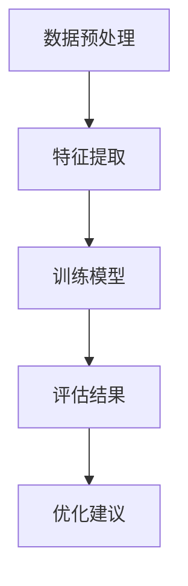
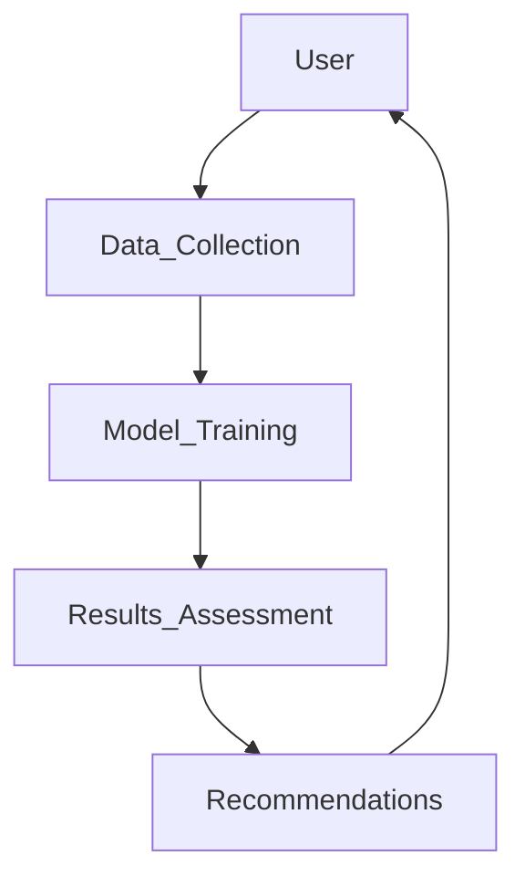

                 


# AI驱动的个人财务韧性评估与增强系统

## 关键词：AI、个人财务、韧性评估、机器学习、系统架构

## 摘要：本文探讨了如何利用人工智能技术构建个人财务韧性评估与增强系统。通过分析财务数据和风险因素，结合机器学习算法，提出了一种智能化的财务风险管理解决方案，并展示了系统的架构设计与实际应用案例。

---

# 第一部分: AI驱动的个人财务韧性评估与增强系统概述

## 第1章: 个人财务韧性评估的背景与挑战

### 1.1 个人财务韧性的重要性
#### 1.1.1 什么是个人财务韧性
- 财务韧性指个人在面对财务风险时的抗压能力与恢复能力，包括应对突发事件、市场波动等能力。

#### 1.1.2 财务韧性在个人生活中的作用
- 通过科学的财务规划，优化资产配置，降低风险。
- 提高应对突发事件的财务储备。

#### 1.1.3 数字化时代的财务风险管理
- 传统财务评估方法的局限性：依赖人工分析，效率低，主观性强。
- AI技术的应用优势：快速处理海量数据，精准预测风险，提供个性化建议。

### 1.2 AI技术在财务领域的应用背景
#### 1.2.1 AI技术的发展与财务领域的结合
- 人工智能技术在金融领域的广泛应用，包括智能投顾、风险管理、信用评估等。

#### 1.2.2 传统财务评估方法的局限性
- 传统评估方法依赖经验判断，难以覆盖复杂场景。
- 数据处理效率低，无法实时反馈。

#### 1.2.3 AI驱动的财务评估的优势
- 高效性：快速处理大量数据，实时反馈。
- 精准性：基于机器学习算法，精准预测风险。

### 1.3 个人财务韧性评估的核心问题
#### 1.3.1 财务风险的识别与预测
- 如何通过AI技术识别潜在的财务风险，例如债务风险、流动性风险等。

#### 1.3.2 财务行为的优化与建议
- 基于AI算法，为用户提供个性化的财务优化建议，例如资产配置、消费习惯等。

#### 1.3.3 财务数据的隐私与安全
- 数据隐私保护：如何确保用户数据的安全性。
- 合规性：符合相关法律法规，保护用户隐私。

---

## 第2章: AI驱动的个人财务韧性评估系统的核心概念

### 2.1 系统定义与目标
#### 2.1.1 系统的定义
- AI驱动的个人财务韧性评估与增强系统：通过AI技术分析用户的财务数据，评估财务韧性，并提供个性化的增强建议。

#### 2.1.2 系统的目标与功能
- 目标：帮助用户优化财务结构，增强抗风险能力。
- 功能：数据采集、风险评估、优化建议、实时监控。

### 2.2 核心概念与联系
#### 2.2.1 财务韧性评估的属性特征对比表

| 属性 | 特征 |
|------|------|
| 数据来源 | 账户余额、收支记录、资产配置 |
| 风险因素 | 债务负担、收入稳定性、应急储备 |
| 评估指标 | 财务健康指数、抗风险能力、流动性 |

#### 2.2.2 ER实体关系图

```mermaid
er
    actor: 用户
    system: 财务韧性评估系统
    financial_data: 财务数据
    risk_factors: 风险因素
    assessment_results: 评估结果
    recommendations: 建议
    actor --> financial_data
    actor --> risk_factors
    financial_data --> system
    risk_factors --> system
    system --> assessment_results
    assessment_results --> recommendations
    actor <-- recommendations
```

---

## 第3章: 系统的算法原理与数学模型

### 3.1 算法原理
#### 3.1.1 基于机器学习的分类算法
- 使用随机森林和XGBoost算法进行风险分类，预测财务韧性指数。



#### 3.1.2 随机森林与XGBoost算法的选择与比较

```python
from sklearn.ensemble import RandomForestClassifier
from xgboost import XGBClassifier

# 随机森林模型
rf_model = RandomForestClassifier(n_estimators=100, random_state=42)
rf_model.fit(X_train, y_train)
rf_predictions = rf_model.predict(X_test)

# XGBoost模型
xgb_model = XGBClassifier(n_estimators=100, learning_rate=0.1, random_state=42)
xgb_model.fit(X_train, y_train)
xgb_predictions = xgb_model.predict(X_test)
```

### 3.2 数学模型
#### 3.2.1 财务韧性指数的计算公式

$$
\text{财务韧性指数} = \frac{\text{应急储备} + \text{资产配置得分} + \text{收入稳定性}}{\text{总分}}
$$

其中：
- 应急储备：用户的应急资金储备。
- 资产配置得分：基于资产配置的评分。
- 收入稳定性：收入来源的稳定性。

---

## 第4章: 系统分析与架构设计

### 4.1 系统功能设计
#### 4.1.1 数据采集模块
- 收集用户的财务数据，包括收入、支出、资产等。

#### 4.1.2 评估分析模块
- 使用机器学习模型评估用户的财务韧性。

#### 4.1.3 增强建议模块
- 提供个性化的财务优化建议。

### 4.2 系统架构设计



### 4.3 系统接口设计
- API接口：提供给第三方应用调用，例如移动应用、网页应用。

---

## 第5章: 项目实战

### 5.1 环境安装
```bash
pip install numpy pandas scikit-learn xgboost
```

### 5.2 核心实现代码
```python
import pandas as pd
from sklearn.model_selection import train_test_split
from sklearn.ensemble import RandomForestClassifier
from xgboost import XGBClassifier

# 数据加载
data = pd.read_csv('financial_data.csv')

# 数据预处理
X = data.drop('target', axis=1)
y = data['target']

# 划分训练集和测试集
X_train, X_test, y_train, y_test = train_test_split(X, y, test_size=0.2, random_state=42)

# 模型训练
rf_model = RandomForestClassifier().fit(X_train, y_train)
xgb_model = XGBClassifier().fit(X_train, y_train)

# 模型预测
rf_predictions = rf_model.predict(X_test)
xgb_predictions = xgb_model.predict(X_test)

# 模型评估
from sklearn.metrics import accuracy_score
print("随机森林准确率:", accuracy_score(y_test, rf_predictions))
print("XGBoost准确率:", accuracy_score(y_test, xgb_predictions))
```

---

## 第6章: 总结与展望

### 6.1 总结
- 本文提出了基于AI的个人财务韧性评估与增强系统，结合机器学习算法，提供了高效的解决方案。

### 6.2 展望
- 引入时间序列分析，提升风险预测能力。
- 结合强化学习，优化财务决策。

---

通过以上步骤，我们构建了一个基于AI的个人财务韧性评估与增强系统，为用户提供科学的财务管理和风险控制方案。

