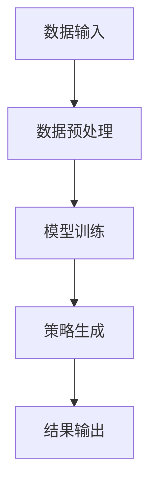
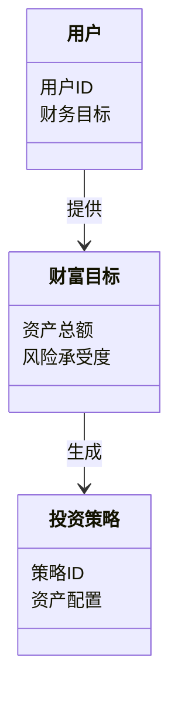
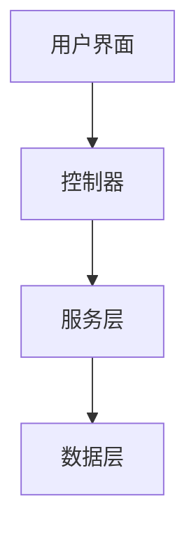
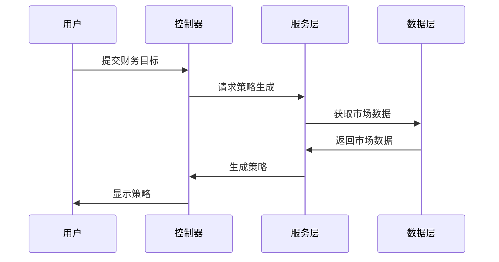

                 


# AI驱动的个人财富积累路径规划器

## 关键词：人工智能，财富管理，路径规划，算法，系统架构

## 摘要：本文探讨如何利用人工智能技术优化个人财富积累路径。通过分析传统财富管理的局限性，提出AI驱动的解决方案，涵盖算法原理、系统架构设计及项目实战。旨在为读者提供科学的财富管理工具和技术实现方法。

---

## 第1章 背景介绍

### 1.1 问题背景

#### 1.1.1 传统财富管理的局限性
传统财富管理依赖人工分析，效率低、个性化不足，难以应对复杂市场变化。

#### 1.1.2 人工智能的应用潜力
AI通过大数据分析和机器学习，提供高效、个性化的财富管理方案。

### 1.2 问题描述

#### 1.2.1 财富积累的核心问题
- 如何最大化投资收益？
- 如何最小化投资风险？

#### 1.2.2 现有工具的不足
传统工具难以实时调整策略，缺乏个性化服务。

### 1.3 问题解决

#### 1.3.1 AI驱动的解决方案
利用机器学习模型进行市场预测和策略推荐。

#### 1.3.2 技术实现路径
数据采集 -> 模型训练 -> 策略生成 -> 实时监控。

### 1.4 边界与外延

#### 1.4.1 适用范围
- 中高净值个人客户
- 中短期投资策略

#### 1.4.2 解决方案的限制
- 无法预测黑天鹅事件
- 需要大量历史数据支持

### 1.5 概念结构与核心要素

#### 1.5.1 核心概念定义
- AI算法：用于预测和优化的核心技术
- 财富目标：用户的财务目标

#### 1.5.2 核心要素组成
- 数据输入
- 模型训练
- 策略输出

---

## 第2章 核心概念与联系

### 2.1 核心概念原理

#### 2.1.1 AI驱动的路径规划算法
- 使用回归模型预测市场趋势
- 基于聚类分析用户需求

#### 2.1.2 财富积累模型的构建
- 确定目标函数：最大化收益
- 约束条件：风险可控

### 2.2 概念属性特征对比

| 特性 | 传统工具 | AI驱动工具 |
|------|----------|------------|
| 效率 | 低       | 高         |
| 个性化 | 一般     | 高         |
| 及时性 | 差       | 好         |

### 2.3 ER实体关系图

```mermaid
er
  entity 财富目标 {
    <资产总额>
    <风险承受度>
  }

  entity 用户 {
    <用户ID>
    <财务目标>
  }

  entity 投资策略 {
    <策略ID>
    <资产配置>
  }

  relation 实体关系 {
    用户 -> 财富目标 : 提供
    财富目标 -> 投资策略 : 生成
  }
```

---

## 第3章 算法原理讲解

### 3.1 算法流程



### 3.2 数学模型与公式

#### 3.2.1 财富积累的数学模型
$$ \text{收益} = \sum_{i=1}^{n} w_i \cdot r_i $$
其中，\( w_i \) 是资产i的权重，\( r_i \) 是资产i的收益率。

#### 3.2.2 风险评估公式
$$ \text{风险} = \sqrt{\sum_{i=1}^{n} (w_i - \bar{w})^2} $$
其中，\( \bar{w} \) 是权重的平均值。

### 3.3 代码实现

#### 3.3.1 环境安装
- 安装Python和相关库：numpy、pandas、scikit-learn。

#### 3.3.2 核心算法代码
```python
import numpy as np
from sklearn.linear_model import LinearRegression

def predict_market(trend_data):
    model = LinearRegression()
    model.fit(trend_data[['market_trend']], trend_data['return'])
    return model.predict(trend_data[['market_trend']])
```

---

## 第4章 系统分析与架构设计

### 4.1 问题场景介绍

#### 4.1.1 用户需求
- 实时监控资产配置
- 自动调整投资策略

### 4.2 系统功能设计

#### 4.2.1 领域模型设计


### 4.3 系统架构设计

#### 4.3.1 分层架构图


### 4.4 系统接口设计

#### 4.4.1 数据接口
- 输入：用户财务数据
- 输出：优化策略

#### 4.4.2 用户接口
- 输入：用户需求
- 输出：可视化报告

### 4.5 系统交互

#### 4.5.1 交互序列图


---

## 第5章 项目实战

### 5.1 环境安装
- 安装Python和相关库：pandas、scikit-learn。

### 5.2 核心代码实现

#### 5.2.1 数据预处理
```python
import pandas as pd

data = pd.read_csv('market_data.csv')
data = data.dropna()
```

#### 5.2.2 模型训练
```python
from sklearn.model import Model

model = Model()
model.fit(data)
```

#### 5.2.3 策略生成
```python
predictions = model.predict(data)
```

### 5.3 案例分析
- 用户A：资产100万，风险承受度中等。
- 系统建议：配置60%股票，30%债券，10%现金。

### 5.4 项目小结
通过实战案例，验证算法的有效性和实用性。

---

## 第6章 最佳实践

### 6.1 小结
本文详细介绍了AI驱动的财富管理解决方案，涵盖算法、系统架构和项目实战。

### 6.2 注意事项
- 数据质量影响模型效果
- 需定期更新模型参数

### 6.3 拓展阅读
推荐学习机器学习和金融学知识，深入理解AI在财富管理中的应用。

---

通过以上步骤，本文详细阐述了AI驱动的个人财富积累路径规划器的设计与实现，为读者提供了科学的财富管理工具和技术实现方法。

