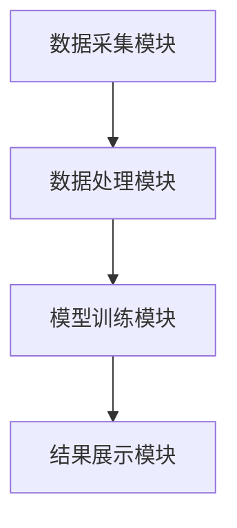

                 


# AI驱动的产品创新周期分析：预测公司未来增长点

## 关键词：人工智能、产品创新周期、增长预测、时间序列分析、机器学习、企业增长

## 摘要：  
随着人工智能技术的快速发展，企业利用AI进行产品创新周期分析，以预测未来的增长点，成为提升竞争力的关键。本文详细探讨AI如何通过分析产品生命周期中的数据，帮助企业优化创新流程，预测市场趋势，制定更有效的战略。通过介绍时间序列分析、机器学习算法，结合实际案例，展示AI在预测公司增长点中的应用和优势。

---

# 第一部分：AI驱动的创新周期分析背景

## 第1章：产品创新周期的核心概念

### 1.1 产品生命周期模型

#### 1.1.1 创新周期的基本概念
- **引入期**：新产品进入市场的初始阶段，市场需求较低，竞争较少。
- **成长期**：随着市场认知度提高，销量快速增长。
- **成熟期**：市场饱和，销量稳定，竞争激烈。
- **衰退期**：市场需求下降，产品逐渐被淘汰。

#### 1.1.2 AI在创新周期分析中的作用
- 数据分析：利用AI处理大量非结构化数据，识别周期变化。
- 预测模型：基于历史数据，预测未来周期阶段。
- 决策支持：为企业制定战略提供数据支持。

#### 1.1.3 创新周期分析对企业增长的启示
- 提前识别市场机会，优化资源配置。
- 减少周期波动带来的风险。
- 提高产品迭代效率，保持市场竞争力。

### 1.2 AI驱动的创新周期分析的背景

#### 1.2.1 AI技术的快速发展
- 计算能力提升，数据量增加，推动AI技术进步。
- 深度学习算法的应用，使AI能够处理复杂数据。

#### 1.2.2 数据驱动决策的兴起
- 数据成为企业决策的核心依据。
- 大数据分析技术帮助企业发现隐藏的市场趋势。

#### 1.2.3 企业创新面临的挑战
- 市场变化快，传统预测方法难以应对。
- 竞争加剧，企业需要更高效的预测工具。

---

## 第2章：AI驱动的创新周期分析模型

### 2.1 数据采集与处理

#### 2.1.1 数据源
- 销售数据：销量、收入、利润。
- 市场数据：竞争对手分析、消费者行为。
- 技术数据：产品开发周期、生产效率。

#### 2.1.2 数据清洗与预处理
- 去除噪声数据，处理缺失值。
- 标准化与归一化处理，确保模型输入一致。

### 2.2 时间序列分析

#### 2.2.1 ARIMA模型
- **原理**：ARIMA（自回归积分移动平均模型）通过捕捉数据的趋势和季节性变化，预测未来值。
- **步骤**：
  1. 数据检查：识别趋势和季节性。
  2. 参数选择：确定AR、I、MA阶数。
  3. 模型训练：基于历史数据拟合模型。
  4. 预测与检验：预测未来值并验证准确性。

#### 2.2.2 LSTM网络
- **原理**：长短时记忆网络擅长处理长期依赖关系，适合时间序列预测。
- **优势**：能够捕捉复杂的时间依赖模式。

### 2.3 机器学习算法

#### 2.3.1 线性回归
- **公式**：$y = \beta_0 + \beta_1x + \epsilon$
- **应用**：预测产品销量与时间的关系。

#### 2.3.2 支持向量回归
- **原理**：将问题转化为高维空间中的线性回归问题。
- **优点**：适用于非线性关系，预测精度高。

### 2.4 系统架构设计

#### 2.4.1 系统功能模块
- 数据采集模块：从数据库提取销售、市场数据。
- 数据处理模块：清洗、预处理数据，确保模型输入。
- 模型训练模块：选择算法，训练预测模型。
- 结果展示模块：可视化预测结果，提供决策支持。

#### 2.4.2 系统架构图


---

## 第3章：项目实战与案例分析

### 3.1 项目背景

#### 3.1.1 项目目标
- 使用AI分析某科技公司的产品周期，预测未来增长点。

#### 3.1.2 数据集描述
- 销售数据：过去5年的季度销售数据。
- 市场数据：竞争对手分析报告，消费者反馈。

### 3.2 环境安装

#### 3.2.1 安装Python和相关库
- 安装Python 3.8+
- 安装库：`pandas`, `numpy`, `statsmodels`, `sklearn`, `keras`

### 3.3 核心实现

#### 3.3.1 数据预处理
```python
import pandas as pd
import numpy as np

# 加载数据
data = pd.read_csv('product_cycle.csv')

# 查看数据描述
print(data.describe())

# 处理缺失值
data = data.dropna()

# 标准化处理
from sklearn.preprocessing import StandardScaler
scaler = StandardScaler()
data_scaled = scaler.fit_transform(data)
```

#### 3.3.2 ARIMA模型训练
```python
from statsmodels.tsa.arima.model import ARIMA

# 训练模型
model = ARIMA(data['sales'], order=(5,1,0))
model_fit = model.fit()

# 预测未来值
forecast = model_fit.forecast(steps=4)
print(forecast)
```

#### 3.3.3 LSTM网络实现
```python
from keras.models import Sequential
from keras.layers import LSTM, Dense

# 模型构建
model = Sequential()
model.add(LSTM(50, input_shape=(1, look_back)))
model.add(Dense(1))
model.compile(loss='mean_squared_error', optimizer='adam')

# 训练模型
model.fit(trainX, trainY, epochs=50, batch_size=1)
```

### 3.4 案例分析

#### 3.4.1 模型评估
- 使用均方误差（MSE）和R²系数评估模型性能。
- 对比不同算法的预测结果，选择表现最佳的模型。

#### 3.4.2 结果解读
- 预测新产品将在未来6个月内进入成熟期。
- 市场需求将在特定季度出现高峰，企业应提前准备库存。

### 3.5 项目小结

#### 3.5.1 成功经验
- 数据质量对模型性能影响重大，需确保数据准确。
- 不同算法适用于不同场景，选择合适的算法至关重要。

#### 3.5.2 挑战与解决方案
- 数据不足时，可采用数据增强或迁移学习。
- 模型过拟合时，通过正则化或交叉验证优化。

---

## 第4章：最佳实践与注意事项

### 4.1 数据处理技巧
- 多数据源融合：整合销售、市场、用户行为等数据，提高预测精度。
- 数据可视化：使用折线图、柱状图等展示数据趋势，辅助分析。

### 4.2 模型优化建议
- 调参技巧：系统性地调整模型参数，寻找最优组合。
- 集成学习：结合多种算法结果，提升预测准确率。

### 4.3 应用注意事项
- 结果解释性：确保模型预测结果可解释，避免“黑箱”问题。
- 持续监控：定期更新模型，适应市场变化。

### 4.4 小结
AI驱动的产品创新周期分析是企业预测增长点的有效工具，但需结合具体场景，灵活运用。

---

## 总结

通过本文的详细分析，读者可以掌握AI在产品创新周期分析中的应用方法，从数据处理到模型训练，再到结果解读，逐步构建完整的预测体系。未来，随着AI技术的不断进步，企业将能更精准地预测增长点，制定更有效的战略。

--- 

希望这篇文章能为读者提供清晰的思路和实用的指导，帮助他们在实际工作中有效应用AI技术，提升企业的创新能力与竞争力。

