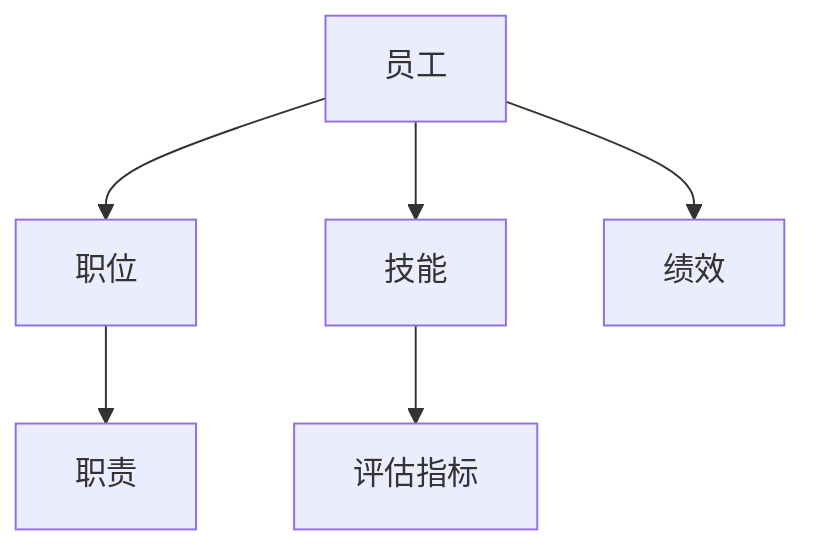
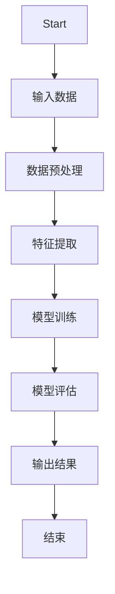
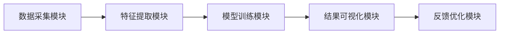
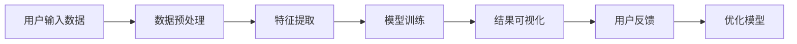

                 


# AI驱动的企业人才画像系统：全方位员工能力评估

## 关键词：
AI驱动，人才画像，员工能力评估，企业数字化转型，人工智能，员工绩效管理，数据驱动决策

## 摘要：
随着企业数字化转型的加速，AI驱动的人才画像系统成为企业优化人力资源管理的重要工具。本文详细探讨了AI在企业人才画像中的应用，从数据采集到模型训练，再到系统架构设计，全面解析了如何利用AI技术实现全方位员工能力评估。通过实际案例分析和系统设计，本文为读者提供了从理论到实践的完整指南，帮助企业更好地进行人才管理和决策优化。

---

## 第一部分：AI驱动的人才画像系统背景与概念

### 第1章：企业人才画像的定义与背景

#### 1.1 什么是人才画像
##### 1.1.1 人才画像的定义
人才画像是基于员工的多维度数据（如技能、经验、绩效、行为特征等），通过AI技术构建的员工能力模型，用于帮助企业更全面地了解员工的能力和发展潜力。

##### 1.1.2 人才画像的核心要素
- **数据源**：包括员工的历史数据、实时数据和外部数据（如市场趋势、行业标准）。
- **评估维度**：涵盖技能、经验、绩效、行为特征、潜力等多个维度。
- **分析模型**：利用机器学习算法对数据进行建模和分析，生成员工画像。

##### 1.1.3 人才画像的构建目标
- **提升招聘效率**：通过数据筛选，快速匹配适合岗位的候选人。
- **优化培训计划**：根据员工的能力差距制定个性化的培训方案。
- **提高绩效管理**：通过实时数据监控，优化员工绩效评估。
- **支持战略决策**：基于员工画像，制定人才梯队建设和组织优化策略。

#### 1.2 企业人才画像的现状与挑战
##### 1.2.1 传统人才评估方法的局限性
传统的评估方法依赖主观判断，存在数据不全面、评估结果不准确的问题。

##### 1.2.2 数据驱动人才评估的优势
数据驱动的评估方法能够利用大量数据，发现潜在规律，提升评估的客观性和准确性。

##### 1.2.3 当前企业在人才画像中的主要挑战
- 数据不足或数据质量低。
- 缺乏专业的技术工具和算法支持。
- 人才画像的应用范围有限，难以覆盖全职命周期。

#### 1.3 AI驱动人才画像的必要性
##### 1.3.1 数据分析在人才评估中的作用
通过数据分析，企业可以发现员工的能力特点和潜在问题，为决策提供数据支持。

##### 1.3.2 AI技术如何提升人才画像的准确性
AI技术能够从海量数据中提取有用信息，构建高精度的员工画像。

##### 1.3.3 企业数字化转型中的人才画像需求
企业数字化转型需要更高效的人才管理工具，AI驱动的人才画像是实现这一目标的关键技术。

### 第2章：人才画像系统的核心概念与联系

#### 2.1 核心概念与原理
##### 2.1.1 数据采集与特征提取
数据采集是人才画像的基础，特征提取则是从数据中提取关键信息的过程。

##### 2.1.2 模型训练与评估
通过机器学习算法对特征进行建模，生成员工画像，并通过评估指标验证模型的准确性。

##### 2.1.3 结果可视化与反馈机制
将模型结果以可视化形式呈现，并根据反馈不断优化模型。

#### 2.2 核心概念对比分析
##### 2.2.1 数据源类型对比
| 数据源类型 | 描述 | 优缺点 |
|------------|------|--------|
| 历史数据    | 包括员工过去的表现和记录 | 数据全面但可能过时 |
| 实时数据    | 包括当前的工作表现和行为 | 数据新鲜但可能不完整 |
| 外部数据    | 包括市场趋势和行业标准 | 数据丰富但可能难以获取 |

##### 2.2.2 模型算法对比
| 算法类型 | 描述 | 适用场景 |
|----------|------|----------|
| K-Means  | 无监督学习算法 | 适合聚类分析 |
| SVM      | 支持向量机 | 适合分类任务 |
| 神经网络 | 深度学习算法 | 适合复杂模式识别 |

##### 2.2.3 评估指标对比
| 评估指标 | 描述 | 计算公式 |
|----------|------|----------|
| 准确率    | 模型预测正确的比例 | (TP + TN) / (TP + TN + FP + FN) |
| 召回率    | 模型预测出的正例中真实为正例的比例 | TP / (TP + FN) |
| F1分数    | 调和准确率 | 2 * (Precision * Recall) / (Precision + Recall) |

#### 2.3 系统架构的ER实体关系图


---

## 第二部分：AI驱动的人才画像系统算法与数学模型

### 第3章：人才画像系统的算法原理

#### 3.1 算法原理概述
人才画像系统通常采用监督学习算法，如支持向量机（SVM）和神经网络。以下是基于深度学习的模型流程图：



#### 3.2 算法实现代码
以下是一个简单的基于K-近邻算法的人才画像分类示例：

```python
from sklearn.neighbors import KNeighborsClassifier
from sklearn.model_selection import train_test_split
from sklearn.metrics import accuracy_score

# 示例数据集
X = [[5, 2], [3, 3], [6, 1], [7, 2], [4, 5], [5, 5], [3, 6], [4, 4], [7, 4], [6, 5]]
y = [0, 0, 1, 1, 0, 0, 1, 1, 1, 1]

# 数据分割
X_train, X_test, y_train, y_test = train_test_split(X, y, test_size=0.3)

# 模型训练
knn = KNeighborsClassifier(n_neighbors=3)
knn.fit(X_train, y_train)

# 模型预测
y_pred = knn.predict(X_test)

# 模型评估
print("准确率:", accuracy_score(y_test, y_pred))
```

#### 3.3 算法的数学模型与公式
以下是K-近邻算法的核心公式：

$$
d(x_i, x_j) = \sqrt{\sum_{k=1}^n (x_{i}^{k} - x_{j}^{k})^2}
$$

其中，$d(x_i, x_j)$ 表示样本 $x_i$ 和 $x_j$ 之间的欧氏距离。

---

## 第三部分：AI驱动的人才画像系统架构设计

### 第4章：人才画像系统的功能与架构

#### 4.1 系统功能设计
人才画像系统主要包括以下功能模块：

1. **数据采集模块**：收集员工的多维度数据。
2. **特征提取模块**：从数据中提取关键特征。
3. **模型训练模块**：利用机器学习算法构建员工画像。
4. **结果可视化模块**：以图形化形式展示员工能力画像。
5. **反馈优化模块**：根据反馈不断优化模型。

#### 4.2 系统架构设计
以下是系统的总体架构图：



#### 4.3 系统接口设计
以下是系统的主要接口：

1. **数据接口**：与企业现有的HR系统对接，获取员工数据。
2. **模型接口**：提供API供其他系统调用员工画像结果。
3. **用户界面**：供管理人员查看和分析员工画像。

#### 4.4 系统交互流程
以下是系统交互流程图：



---

## 第四部分：AI驱动的人才画像系统项目实战

### 第5章：人才画像系统的项目实现

#### 5.1 项目环境安装
以下是Python环境的安装步骤：

```bash
# 安装必要的库
pip install numpy
pip install pandas
pip install scikit-learn
pip install matplotlib
```

#### 5.2 核心代码实现
以下是基于神经网络的员工能力评估模型实现：

```python
import numpy as np
from sklearn.datasets import make_classification
from sklearn.model_selection import train_test_split
from sklearn.metrics import accuracy_score
from sklearn.neural_network import MLPClassifier

# 生成示例数据
X, y = make_classification(n_samples=100, n_features=2, n_classes=2, random_state=42)

# 数据分割
X_train, X_test, y_train, y_test = train_test_split(X, y, test_size=0.3)

# 模型训练
mlp = MLPClassifier(hidden_layer_sizes=(10, 10), max_iter=100)
mlp.fit(X_train, y_train)

# 模型预测
y_pred = mlp.predict(X_test)

# 模型评估
print("准确率:", accuracy_score(y_test, y_pred))
```

#### 5.3 项目小结
通过上述代码实现，我们可以看到AI技术在人才画像系统中的强大能力。模型能够从数据中提取特征，构建高精度的员工画像，为企业的 talent management 提供有力支持。

---

## 第五部分：AI驱动的人才画像系统最佳实践

### 第6章：人才画像系统的应用与优化

#### 6.1 最佳实践
##### 6.1.1 数据质量管理
确保数据的完整性和准确性，是人才画像系统成功的关键。

##### 6.1.2 模型选择与优化
根据具体需求选择合适的算法，并通过不断优化模型提升准确性。

##### 6.1.3 系统安全性
保护员工数据的安全，确保系统符合隐私保护相关法规。

#### 6.2 小结
AI驱动的人才画像系统能够帮助企业更全面地了解员工的能力，优化人才管理流程，提升企业的整体竞争力。

---

## 结语
AI驱动的企业人才画像系统是企业数字化转型的重要工具，通过数据驱动的决策，帮助企业实现更高效的人才管理。随着技术的不断进步，AI在人才画像中的应用将更加广泛，为企业创造更大的价值。

