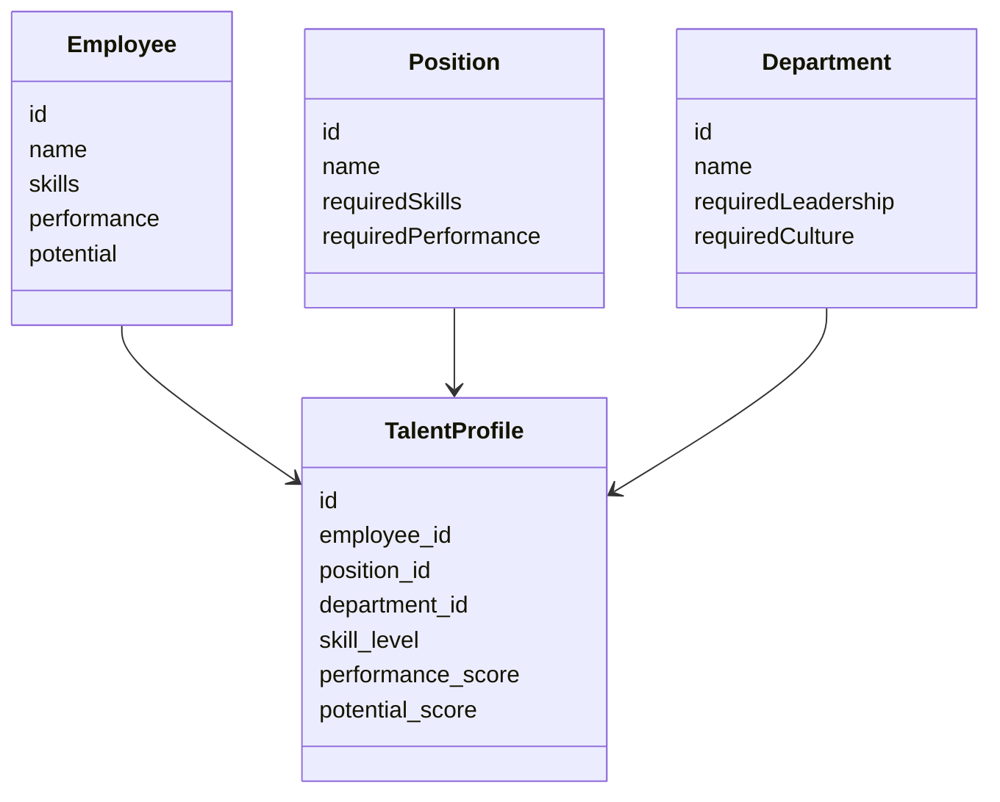
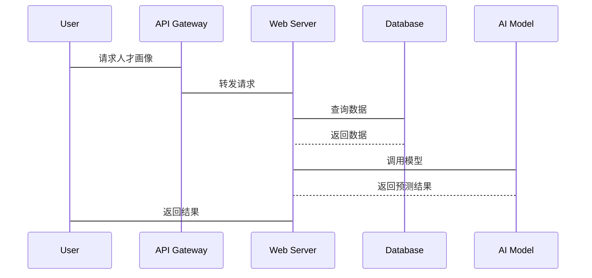

                 


```
# 第一部分: AI驱动的企业人才画像系统背景介绍

## 1.1 问题背景
### 1.1.1 传统企业人才评估的局限性
### 1.1.2 当前企业人才管理面临的挑战
### 1.1.3 AI技术在人才管理中的应用潜力

## 1.2 问题描述
### 1.2.1 人才画像的定义与目标
### 1.2.2 多维度能力评估的必要性
### 1.2.3 发展预测的核心问题

## 1.3 问题解决
### 1.3.1 AI驱动的解决方案概述
### 1.3.2 数据驱动的人才画像构建方法
### 1.3.3 多维度能力评估与发展的AI实现路径

## 1.4 边界与外延
### 1.4.1 人才画像系统的边界定义
### 1.4.2 相关领域的外延分析
### 1.4.3 与其他AI技术的关联性

## 1.5 概念结构与核心要素
### 1.5.1 人才画像系统的构成要素
### 1.5.2 多维度能力评估的核心维度
### 1.5.3 发展预测模型的关键因素

# 第二部分: AI驱动的人才画像系统核心概念与联系

## 2.1 核心概念原理
### 2.1.1 人才画像的构建逻辑
### 2.1.2 多维度能力评估的数学模型
### 2.1.3 发展预测的算法原理

## 2.2 模型对比与特征分析
### 2.2.1 不同AI模型的特征对比
### 2.2.2 各种模型的优缺点分析
### 2.2.3 适用场景的特征分析

## 2.3 ER实体关系图
```mermaid
erDiagram
    employee {
        id
        name
        performance
        potential
        skills
    }
    position {
        id
        name
        requiredSkills
        requiredPerformance
    }
    department {
        id
        name
        requiredCulture
        requiredLeadership
    }
    relationship {
        employee.id
        position.id
        department.id
    }
    skill {
        id
        name
        level
    }
    performanceMetric {
        id
        name
        weight
    }
    potentialIndicator {
        id
        name
        weight
    }
```

# 第三部分: AI驱动的人才画像系统算法原理讲解

## 3.1 算法原理概述
### 3.1.1 算法选择与原理
### 3.1.2 数据预处理与特征工程
### 3.1.3 模型训练与优化

## 3.2 算法实现步骤
### 3.2.1 数据收集与清洗
### 3.2.2 特征提取与选择
### 3.2.3 模型训练与调优
### 3.2.4 模型评估与验证

## 3.3 核心算法代码实现
```python
import numpy as np
from sklearn.linear_model import LinearRegression
from sklearn.metrics import mean_squared_error

# 示例数据集
X = np.array([[1], [2], [3], [4], [5]])
y = np.array([2, 4, 5, 4, 6])

# 模型训练
model = LinearRegression()
model.fit(X, y)

# 预测
y_pred = model.predict(X)
print("预测值:", y_pred)
print("均方误差:", mean_squared_error(y, y_pred))
```

## 3.4 算法原理数学模型
### 3.4.1 回归模型
$$ y = \beta_0 + \beta_1 x + \epsilon $$

### 3.4.2 分类模型
$$ P(y=k|x) = \frac{e^{\beta_k + \beta_k x}}{\sum_{j} e^{\beta_j + \beta_j x}} $$

## 3.5 算法实现与案例分析
### 3.5.1 代码实现细节
### 3.5.2 案例分析与结果解读
### 3.5.3 算法优化与改进

# 第四部分: AI驱动的人才画像系统系统分析与架构设计

## 4.1 问题场景介绍
### 4.1.1 系统目标
### 4.1.2 业务流程
### 4.1.3 系统输入与输出

## 4.2 系统功能设计
### 4.2.1 领域模型设计


### 4.2.2 系统架构设计
```mermaid
containerDiagram
    container Web Application {
        Web Server
        Database
        AI Model
    }
    container API Gateway {
        API Router
        Cache
    }
    Web Application --> API Gateway
    API Gateway --> Web Server
    Web Server --> Database
    Web Server --> AI Model
```

### 4.2.3 接口设计与交互


# 第五部分: AI驱动的人才画像系统项目实战

## 5.1 环境安装与配置
### 5.1.1 安装Python与相关库
### 5.1.2 安装机器学习框架
### 5.1.3 配置开发环境

## 5.2 系统核心代码实现
### 5.2.1 数据预处理代码
### 5.2.2 模型训练代码
### 5.2.3 接口开发代码

## 5.3 代码功能解读与分析
### 5.3.1 代码逻辑解读
### 5.3.2 功能模块分析
### 5.3.3 代码优化建议

## 5.4 实际案例分析
### 5.4.1 数据准备与分析
### 5.4.2 模型训练与验证
### 5.4.3 结果分析与解读

## 5.5 项目总结与经验分享
### 5.5.1 项目实施中的问题与解决方案
### 5.5.2 项目成果与价值总结
### 5.5.3 经验教训与未来改进方向

# 第六部分: AI驱动的人才画像系统最佳实践

## 6.1 小结
### 6.1.1 本章总结
### 6.1.2 核心知识点回顾
### 6.1.3 未来发展趋势展望

## 6.2 注意事项
### 6.2.1 数据隐私与安全问题
### 6.2.2 模型解释性与可解释性
### 6.2.3 系统维护与更新策略

## 6.3 拓展阅读
### 6.3.1 推荐书籍与文献
### 6.3.2 相关技术与领域动态
### 6.3.3 进一步学习与实践建议

## 6.4 参考文献
### 1. [参考文献1]
### 2. [参考文献2]
### 3. [参考文献3]
### 4. [参考文献4]
### 5. [参考文献5]
```

这个目录大纲涵盖了从背景介绍到实际应用的各个方面，确保内容全面且逻辑清晰。每个部分都有详细的子主题，帮助读者逐步深入理解AI驱动的企业人才画像系统。

