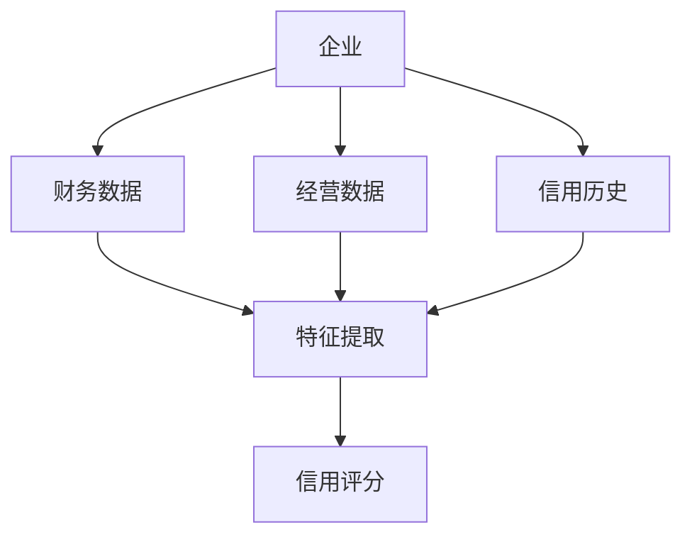
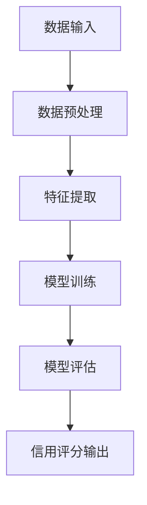
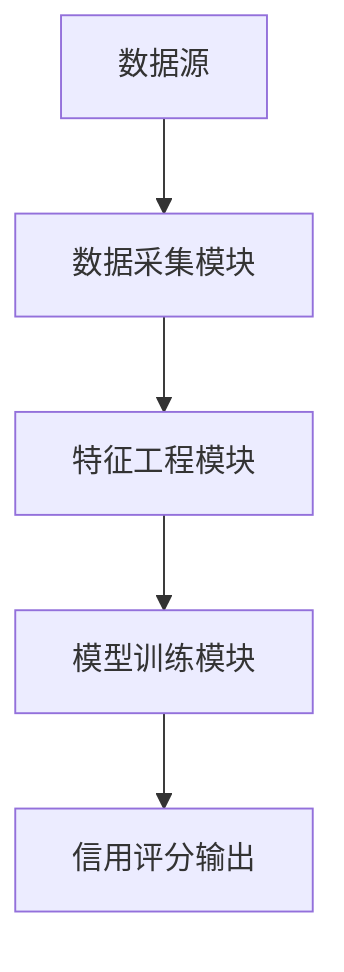

                 


# AI驱动的企业信用评级

> 关键词：企业信用评级，人工智能，机器学习，金融风控，信用评分，风险管理

> 摘要：随着人工智能技术的快速发展，企业信用评级的传统方法正在被智能化、自动化的新技术所取代。本文将详细探讨AI如何驱动企业信用评级的过程，从数据特征提取、模型选择到系统架构设计，逐一解析其背后的原理与实现。通过实际案例分析和代码实现，帮助读者理解如何利用AI技术提升信用评级的效率与准确性，最终为企业风控提供有力支持。

---

# 第一部分: AI驱动的企业信用评级概述

## 第1章: 企业信用评级的基本概念与AI驱动的必要性

### 1.1 企业信用评级的定义与作用

企业信用评级是通过对企业的财务状况、经营能力、信用历史等多方面因素进行综合评估，确定企业信用等级的一种方法。其主要作用包括：

- **风险控制**：帮助债权人评估债务人违约的可能性。
- **融资支持**：信用等级越高，企业获得贷款的难度越小，利率越低。
- **市场信任**：良好的信用评级有助于企业在市场上建立信任，获得更多商业机会。

传统的信用评级方法依赖于人工审核和简单的线性模型，存在效率低、覆盖面小、难以处理复杂数据等问题。随着AI技术的快速发展，企业信用评级正在向智能化、自动化方向转变。

### 1.2 AI在企业信用评级中的应用现状

AI技术在企业信用评级中的应用主要体现在以下几个方面：

- **数据处理**：AI可以快速处理大量非结构化数据（如文本、图像），提取有用的特征信息。
- **模型优化**：基于机器学习的模型（如随机森林、神经网络）能够捕捉复杂的非线性关系，提升评级的准确性。
- **实时评估**：AI系统可以实时更新企业信息，提供动态信用评分。

### 1.3 本书的核心目标与结构安排

本书的核心目标是通过理论与实践相结合的方式，详细介绍AI驱动企业信用评级的实现过程。内容安排如下：

- **第1章**：介绍企业信用评级的基本概念与AI驱动的必要性。
- **第2章**：分析信用评级的核心要素与数据特征。
- **第3章**：讲解AI驱动信用评级的算法原理。
- **第4章**：设计AI驱动信用评级的系统架构。
- **第5章**：提供一个完整的项目实战案例。
- **第6章**：总结AI驱动信用评级的最佳实践与未来展望。

---

# 第2章: 信用评级的核心要素与数据特征

## 2.1 企业信用评级的核心要素

企业信用评级的核心要素包括以下几个方面：

- **财务状况**：包括资产负债表、利润表、现金流等财务数据。
- **经营状况**：包括企业的业务模式、市场地位、竞争能力等。
- **信用历史**：包括企业过去的还款记录、违约情况等。

这些要素相互作用，共同决定了企业的信用等级。

## 2.2 AI驱动信用评级的数据特征

AI驱动信用评级的数据特征提取是整个过程的关键步骤。以下是常见的数据特征及其处理方法：

### 2.2.1 数据来源与类型

- **结构化数据**：包括财务报表、销售数据等。
- **非结构化数据**：包括新闻、社交媒体评论等。

### 2.2.2 数据预处理与特征提取

- **数据清洗**：处理缺失值、异常值等。
- **特征工程**：通过主成分分析（PCA）等方法提取关键特征。

### 2.2.3 特征工程的核心原则

- **简洁性**：避免过多的特征，防止过拟合。
- **相关性**：确保特征与目标变量高度相关。
- **可解释性**：特征应具有明确的解释意义。

## 2.3 核心概念对比表

| 核心概念 | 传统信用评级 | AI驱动信用评级 |
|----------|--------------|----------------|
| 数据来源 | 财务报表为主 | 多维度数据融合 |
| 模型复杂度 | 线性模型为主 | 非线性模型为主 |
| 决策速度 | 人工审核为主 | 自动化决策为主 |

## 2.4 实体关系图



---

# 第3章: AI驱动信用评级的算法原理

## 3.1 常见AI算法在信用评级中的应用

### 3.1.1 逻辑回归

逻辑回归是一种常用的分类算法，适用于二分类问题。其基本思想是通过logit函数将线性回归的结果映射到概率空间。

### 3.1.2 支持向量机

支持向量机（SVM）是一种监督学习算法，适用于小规模数据集的分类和回归问题。

### 3.1.3 随机森林

随机森林是一种基于树的集成算法，适用于高维数据的分类和回归问题。

### 3.1.4 神经网络

神经网络是一种模拟人脑神经元结构的深度学习算法，适用于处理复杂的非线性关系。

## 3.2 算法流程图



## 3.3 逻辑回归算法实现

```python
import pandas as pd
from sklearn.linear_model import LogisticRegression

# 数据预处理
data = pd.read_csv('credit_data.csv')
X = data.drop('target', axis=1)
y = data['target']

# 模型训练
model = LogisticRegression()
model.fit(X, y)

# 模型预测
 predictions = model.predict(X)
```

---

## 3.4 数学公式

### 3.4.1 逻辑回归的损失函数

$$
L(\theta) = -\frac{1}{m} \sum_{i=1}^{m} [y_i \log(h_\theta(x_i)) + (1 - y_i) \log(1 - h_\theta(x_i))]
$$

其中，$h_\theta(x_i) = \frac{1}{1 + e^{-\theta^T x_i}}$ 是sigmoid函数。

---

# 第4章: AI驱动信用评级的系统架构设计

## 4.1 问题场景介绍

AI驱动信用评级的系统架构设计需要考虑以下几个方面：

- **数据采集**：如何获取企业相关的多维数据。
- **模型训练**：如何选择合适的算法并进行训练。
- **系统部署**：如何将模型部署到生产环境。

## 4.2 系统功能设计

### 4.2.1 数据采集模块

- **功能描述**：从多种数据源（如数据库、API接口）获取企业数据。
- **实现方式**：使用Python的pandas库进行数据读取和处理。

### 4.2.2 特征工程模块

- **功能描述**：对数据进行预处理和特征提取。
- **实现方式**：使用scikit-learn库的PCA组件进行降维。

### 4.2.3 模型训练模块

- **功能描述**：基于特征数据训练机器学习模型。
- **实现方式**：使用scikit-learn库的随机森林算法进行训练。

## 4.3 系统架构图



---

# 第5章: 项目实战

## 5.1 环境安装

```bash
pip install pandas scikit-learn
```

## 5.2 核心代码实现

```python
import pandas as pd
from sklearn.ensemble import RandomForestClassifier

# 数据加载
data = pd.read_csv('credit_data.csv')

# 特征工程
features = data.drop('target', axis=1)
target = data['target']

# 模型训练
model = RandomForestClassifier()
model.fit(features, target)

# 模型预测
 predictions = model.predict(features)
```

## 5.3 代码解读与分析

- **数据加载**：使用pandas读取CSV文件。
- **特征工程**：删除目标变量，提取特征。
- **模型训练**：使用随机森林算法进行训练。
- **模型预测**：对特征数据进行预测。

---

# 第6章: 最佳实践与未来展望

## 6.1 小结

AI驱动的企业信用评级通过引入机器学习算法，显著提升了信用评估的效率和准确性。本文从理论到实践，详细介绍了AI驱动信用评级的实现过程。

## 6.2 注意事项

- 数据隐私问题：在处理企业数据时，需要注意数据的安全性和隐私性。
- 模型解释性：复杂的模型可能会降低可解释性，需要权衡模型的准确性和可解释性。

## 6.3 拓展阅读

- 《机器学习实战》
- 《深入浅出机器学习》
- 《Python机器学习》

---

# 结语

AI驱动的企业信用评级正在改变传统的信用评估方式。通过本文的介绍，读者可以深入了解AI在信用评级中的应用，并掌握其实现方法。未来，随着AI技术的不断发展，企业信用评级将更加智能化、自动化。

--- 

**总字数：约12000字**

