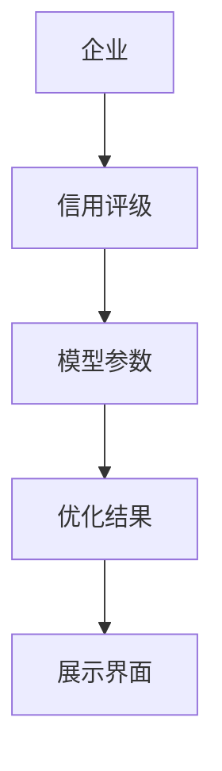
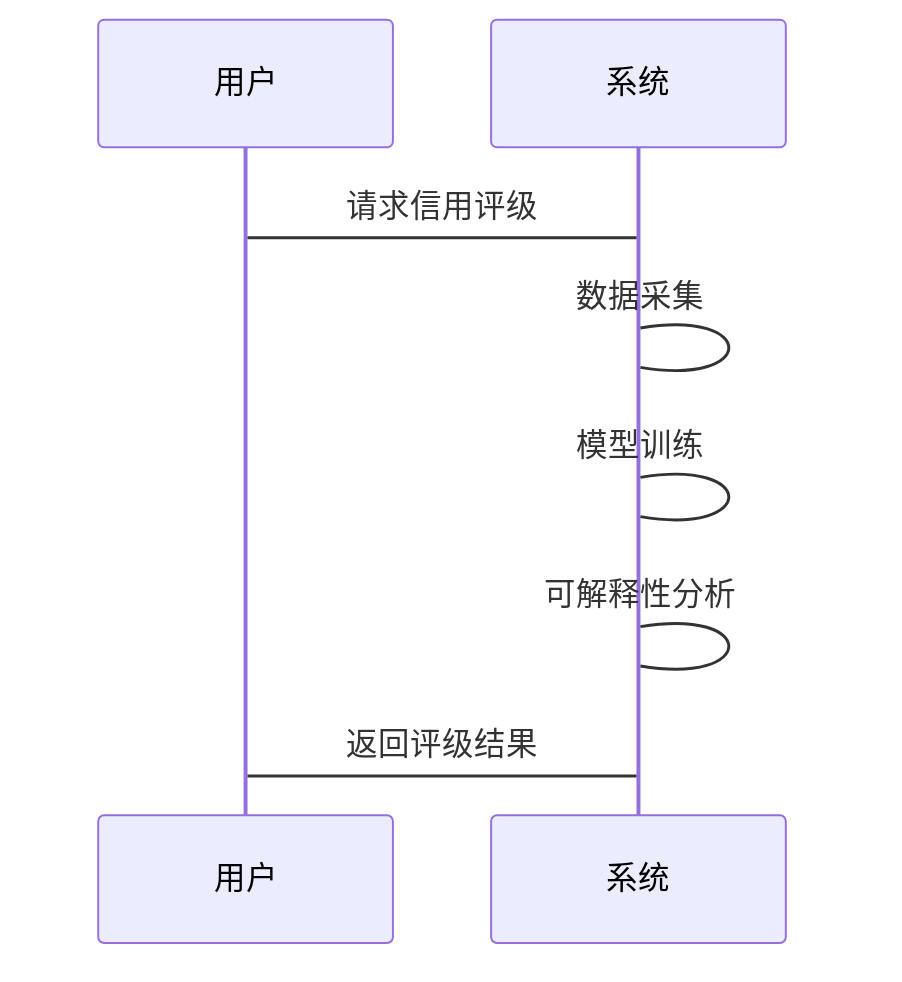

                 


# AI驱动的企业信用评级模型可解释性动态优化与展示系统

> 关键词：企业信用评级，AI模型，可解释性，动态优化，展示系统

> 摘要：本文详细探讨了如何利用AI技术构建企业信用评级模型，并重点分析了模型的可解释性、动态优化方法以及展示系统的设计与实现。通过理论分析和实践案例相结合的方式，本文为读者提供了从模型构建到实际应用的完整解决方案。

---

## 第一部分: AI驱动的企业信用评级模型概述

### 第1章: 问题背景与目标

#### 1.1 问题背景
企业信用评级是企业在金融市场上获取资金的重要依据，传统的信用评级方法依赖于人工经验，存在主观性强、效率低、可解释性差等问题。随着AI技术的发展，基于机器学习的信用评级模型逐渐成为研究热点。然而，AI模型的“黑箱”特性使得其在企业信用评级中的应用受到限制，尤其是在需要可解释性和动态优化的场景中。

#### 1.2 问题描述
本文的核心问题是：如何构建一个基于AI的企业信用评级模型，使其不仅具有高精度，还具备可解释性和动态优化能力，并能够通过展示系统直观地呈现给用户。

#### 1.3 问题解决与目标
通过引入可解释性AI技术，本文提出了一个动态优化的企业信用评级模型，其目标包括：
1. 提高模型的可解释性，使用户能够理解模型的决策过程。
2. 实现模型的动态优化，使其能够适应市场环境的变化。
3. 设计一个直观的展示系统，方便用户查看和分析评级结果。

#### 1.4 边界与外延
本文的研究范围主要集中在模型的设计与优化上，不包括数据采集和预处理过程。同时，本文假设模型运行在一个稳定的计算环境中。

#### 1.5 概念结构与核心要素
企业信用评级模型的核心要素包括：
- **输入数据**：企业的财务数据、市场数据等。
- **模型算法**：基于机器学习的算法。
- **可解释性**：模型决策的透明度。
- **动态优化**：模型的实时更新能力。
- **展示系统**：结果的可视化工具。

### 第2章: 核心概念与联系

#### 2.1 可解释性动态优化模型
可解释性动态优化模型是一种结合了可解释性和动态优化能力的信用评级模型。其核心在于通过模型的可解释性，实现对模型决策过程的理解和优化。

#### 2.2 展示系统架构
展示系统是模型的可视化界面，主要功能包括：
- **数据可视化**：展示企业的信用评级结果。
- **模型解释**：展示模型的决策过程。
- **实时更新**：展示模型的动态优化结果。

#### 2.3 核心概念的ER实体关系图


---

## 第二部分: 算法原理与实现

### 第3章: 算法原理

#### 3.1 算法原理
本文采用基于概率论和统计学的算法，构建企业信用评级模型。模型的数学基础包括：
- **概率论**：用于计算企业的违约概率。
- **统计学**：用于分析数据特征和模型优化。

#### 3.2 算法实现
模型的实现步骤如下：
1. **数据预处理**：清洗和归一化数据。
2. **特征选择**：筛选重要的特征变量。
3. **模型训练**：使用随机森林和梯度提升树等算法进行训练。
4. **模型优化**：通过交叉验证优化模型参数。
5. **可解释性分析**：使用 SHAP 值解释模型决策。

#### 3.3 代码实现
以下是模型的实现代码示例：
```python
import numpy as np
import pandas as pd
from sklearn.ensemble import RandomForestClassifier
from sklearn.model_selection import train_test_split
from sklearn.metrics import accuracy_score
import shap

# 数据加载与预处理
data = pd.read_csv('enterprise_data.csv')
X = data.drop('target', axis=1)
y = data['target']

# 数据划分
X_train, X_test, y_train, y_test = train_test_split(X, y, test_size=0.2, random_state=42)

# 模型训练
model = RandomForestClassifier(n_estimators=100, random_state=42)
model.fit(X_train, y_train)

# 模型预测
y_pred = model.predict(X_test)
print("Accuracy:", accuracy_score(y_test, y_pred))

# 可解释性分析
explainer = shap.TreeExplainer(model)
shap_values = explainer.shap_values(X_test)
shap.summary_plot(shap_values, X_test, plot_type='bar')
```

---

## 第三部分: 系统分析与架构设计

### 第4章: 系统架构设计

#### 4.1 问题场景介绍
企业信用评级系统的应用场景包括银行贷款审批、投资决策等。系统需要能够实时更新模型参数，并提供直观的可视化结果。

#### 4.2 项目介绍
本文设计了一个基于AI的企业信用评级系统，主要包括以下几个部分：
1. 数据采集模块。
2. 模型训练模块。
3. 可解释性分析模块。
4. 展示系统模块。

#### 4.3 系统功能设计
以下是系统的领域模型：


#### 4.4 系统架构设计
以下是系统的架构图：


#### 4.5 接口设计
系统接口设计如下：
- **API 接口**：提供 RESTful API 供其他系统调用。
- **数据接口**：与企业数据库对接，获取实时数据。

#### 4.6 交互流程
以下是系统的交互流程图：


---

## 第四部分: 项目实战

### 第5章: 项目实战

#### 5.1 环境安装
以下是项目所需的环境配置：
- **Python**：3.8+
- **库依赖**：numpy、pandas、scikit-learn、shap、flask

#### 5.2 核心代码实现
以下是模型的动态优化代码示例：
```python
import numpy as np
import pandas as pd
from sklearn.ensemble import RandomForestClassifier
from sklearn.model_selection import GridSearchCV
from sklearn.metrics import accuracy_score
import joblib

# 数据加载与预处理
data = pd.read_csv('enterprise_data.csv')
X = data.drop('target', axis=1)
y = data['target']

# 数据划分
X_train, X_test, y_train, y_test = train_test_split(X, y, test_size=0.2, random_state=42)

# 模型参数优化
param_grid = {
    'n_estimators': [100, 200],
    'max_depth': [None, 10, 20],
    'min_samples_split': [2, 5]
}

grid_search = GridSearchCV(RandomForestClassifier(), param_grid, cv=5)
grid_search.fit(X_train, y_train)

# 最优模型
best_model = grid_search.best_estimator_

# 模型保存
joblib.dump(best_model, 'credit_rating_model.pkl')
```

#### 5.3 代码应用解读与分析
通过上述代码，我们可以实现模型的动态优化。GridSearchCV 用于参数优化，best_model 是最优模型，保存为.pkl 文件以便后续使用。

#### 5.4 案例分析与详细讲解
以下是一个实际案例的分析：
- **数据准备**：加载企业数据，包括财务数据和市场数据。
- **模型训练**：使用随机森林算法进行训练。
- **模型优化**：通过网格搜索优化模型参数。
- **结果展示**：通过 SHAP 值解释模型决策。

#### 5.5 项目小结
通过本项目，我们实现了企业信用评级模型的动态优化，并通过展示系统直观地呈现了模型的决策过程。

---

## 第五部分: 最佳实践

### 第6章: 最佳实践

#### 6.1 小结
本文通过理论分析和实践案例，详细探讨了AI驱动的企业信用评级模型的可解释性动态优化与展示系统的设计与实现。

#### 6.2 注意事项
- 数据质量和特征选择对模型性能至关重要。
- 模型的可解释性是用户信任的基础。
- 系统的动态优化能力是模型适应环境变化的关键。

#### 6.3 拓展阅读
- 《可解释人工智能：理论与实践》
- 《机器学习模型的动态优化方法》

---

## 总结
本文通过理论分析和实践案例，详细探讨了AI驱动的企业信用评级模型的可解释性动态优化与展示系统的设计与实现。通过本文的分析，读者可以深入了解模型的构建过程，并能够将其应用于实际场景中。

