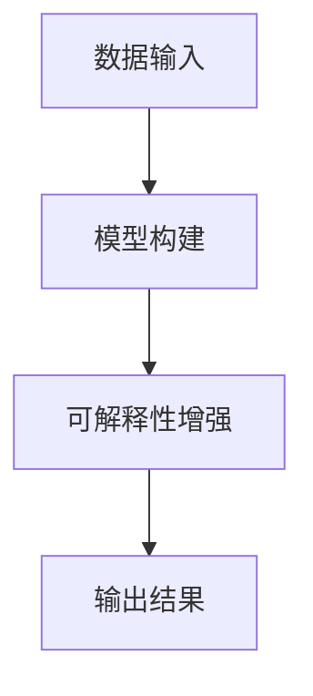
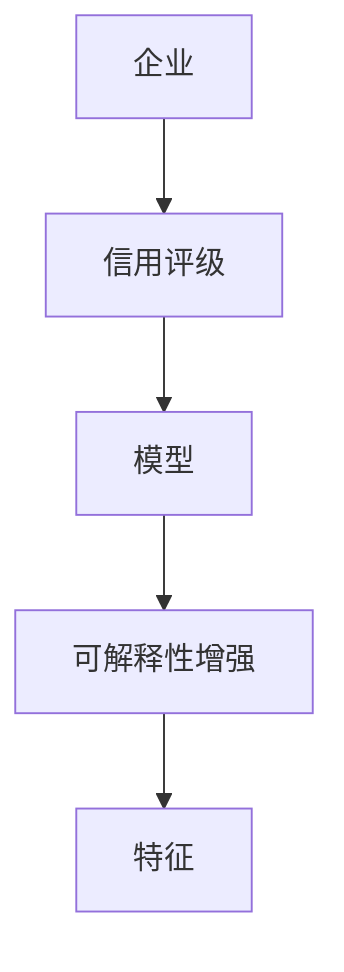
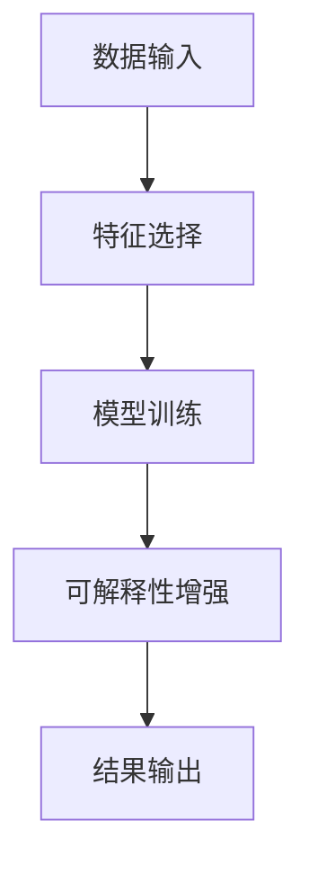
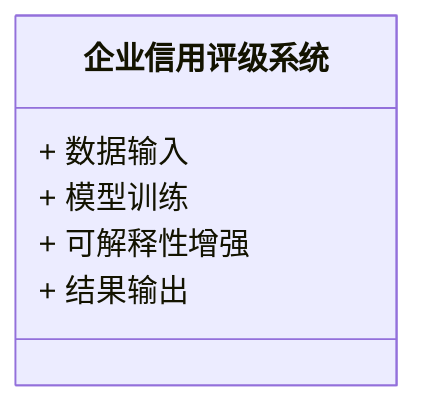
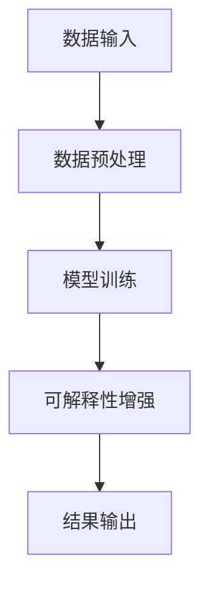
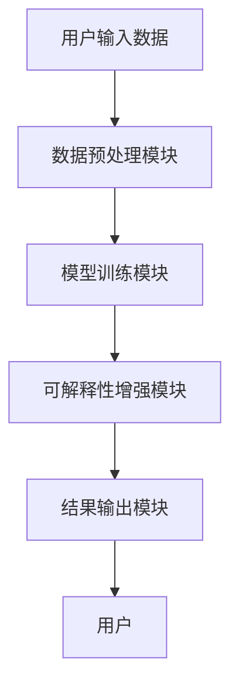

                 


# AI驱动的企业信用评级模型可解释性增强系统

## 关键词：企业信用评级，可解释性，AI，模型增强，风险管理

## 摘要：本文探讨了如何通过AI技术增强企业信用评级模型的可解释性，以提高模型的透明度和可信度。文章从背景介绍、核心概念、算法原理、系统架构、项目实战到最佳实践，全面分析了AI驱动的可解释性增强系统的构建过程和应用价值。

---

# 第一部分: 背景与概念

## 第1章: AI驱动的企业信用评级模型概述

### 1.1 问题背景
#### 1.1.1 企业信用评级的重要性
企业信用评级是评估企业信用状况的重要工具，直接影响企业的融资能力、投资决策和风险管理。传统的信用评级模型通常基于统计分析和专家经验，但随着数据量的增加和复杂性的提升，传统方法的局限性日益显现。

#### 1.1.2 当前信用评级模型的局限性
1. **黑箱问题**：传统模型往往难以解释其决策过程，导致用户难以信任模型的输出。
2. **数据稀疏性**：在某些行业或领域，数据量有限，导致模型泛化能力不足。
3. **动态变化**：企业的信用状况受多种因素影响，模型需要动态调整以适应变化。

#### 1.1.3 AI技术在信用评级中的应用潜力
AI技术，特别是机器学习和深度学习，能够处理海量数据，发现传统方法难以捕捉的模式和关系。通过AI技术，可以构建更准确、更可解释的信用评级模型。

### 1.2 问题描述
#### 1.2.1 信用评级模型的可解释性问题
模型的可解释性是指用户能够理解模型如何得出结论的能力。不可解释的模型会影响用户的信任和模型的实际应用。

#### 1.2.2 黑箱模型对企业决策的影响
不可解释的模型可能导致错误决策，尤其是在企业信用评级这种高风险领域。

#### 1.2.3 增强可解释性的必要性
增强可解释性可以提高模型的透明度和可信度，帮助企业更好地理解和管理信用风险。

### 1.3 问题解决
#### 1.3.1 可解释性增强的目标
通过技术手段，使模型的决策过程更加透明，用户能够理解模型的输出。

#### 1.3.2 AI驱动的解决方案
利用AI技术，如特征重要性分析、规则解释方法等，增强模型的可解释性。

#### 1.3.3 技术路线与实现路径
1. 数据预处理：清洗、特征选择。
2. 模型训练：构建基础信用评级模型。
3. 可解释性增强：通过技术手段，如SHAP值、LIME等，增强模型的可解释性。
4. 结果展示：可视化模型的解释结果。

### 1.4 边界与外延
#### 1.4.1 信用评级模型的边界
模型仅针对企业的财务数据和经营数据，不考虑外部宏观经济因素。

#### 1.4.2 可解释性增强的范围
仅针对模型的输出结果进行解释，不涉及模型的训练过程。

#### 1.4.3 相关领域的联系与区别
与传统信用评级模型相比，AI驱动的模型更加注重数据的深度挖掘和模型的可解释性。

### 1.5 概念结构与核心要素
#### 1.5.1 核心概念组成
- 数据输入：企业财务数据、经营数据。
- 模型构建：机器学习模型。
- 可解释性增强：解释方法。
- 输出结果：信用评级结果和解释信息。

#### 1.5.2 核心要素的特征对比
| 特征 | 数据输入 | 模型构建 | 可解释性增强 | 输出结果 |
|------|----------|----------|--------------|----------|
| 数据类型 | 结构化数据 | AI模型 | 解释方法 | 结果和解释 |
| 数据来源 | 企业内部数据 | 数据挖掘 | 用户可理解 | 透明化 |

#### 1.5.3 概念结构的可视化


---

# 第二部分: 核心概念与联系

## 第2章: 可解释性增强系统的核心原理

### 2.1 核心概念原理
#### 2.1.1 可解释性增强的基本原理
通过分析模型的特征重要性、规则可解释性等方法，揭示模型的决策逻辑。

#### 2.1.2 AI驱动的可解释性方法
1. **特征重要性分析**：通过特征权重来解释模型的决策过程。
2. **规则生成**：将复杂的模型转化为简单的规则，便于用户理解。
3. **实例解释**：针对具体实例，解释模型的决策过程。

#### 2.1.3 系统设计的核心思想
通过技术手段，平衡模型的准确性和可解释性，提高模型的实用性和用户信任度。

### 2.2 核心概念属性对比
#### 2.2.1 可解释性与不可解释性的对比
| 属性 | 可解释性 | 不可解释性 |
|------|----------|------------|
| 理解难度 | 较低 | 较高 |
| 用户信任度 | 高 | 低 |
| 应用范围 | 广泛 | 有限 |

#### 2.2.2 不同模型的可解释性特征
| 模型类型 | 可解释性 |
|----------|----------|
| 线性回归 | 高 |
| 支持向量机 | 中等 |
| 随机森林 | 中等 |
| 神经网络 | 低 |

#### 2.2.3 核心要素的属性分析
通过分析模型的特征重要性、规则复杂度等属性，选择适合的可解释性增强方法。

### 2.3 ER实体关系图


---

# 第三部分: 算法原理讲解

## 第3章: 可解释性增强算法的原理与实现

### 3.1 算法原理
#### 3.1.1 基于特征重要性的可解释性方法
通过特征重要性分析，揭示模型中各特征对最终结果的影响程度。

#### 3.1.2 基于模型解释的可解释性方法
通过模型解释技术，如SHAP值、LIME等，解释模型的决策过程。

#### 3.1.3 基于规则的可解释性方法
将复杂的模型转化为简单的规则，便于用户理解。

### 3.2 算法流程图


### 3.3 算法实现
#### 3.3.1 数据预处理
```python
import pandas as pd
data = pd.read_csv('credit_data.csv')
data = data.dropna()
```

#### 3.3.2 模型训练
```python
from sklearn.ensemble import RandomForestClassifier
model = RandomForestClassifier()
model.fit(X_train, y_train)
```

#### 3.3.3 可解释性增强
```python
import shap
explainer = shap.TreeExplainer(model)
shap_values = explainer.shap_values(X)
```

#### 3.3.4 结果解释
```python
shap.summary_plot(shap_values, X, plot_type="bar")
```

### 3.4 数学模型与公式
#### 3.4.1 线性回归模型
$$ y = \beta_0 + \beta_1 x_1 + \beta_2 x_2 + ... + \beta_n x_n $$

#### 3.4.2 随机森林模型
$$ y = \text{多数投票} $$

#### 3.4.3 SHAP值计算公式
$$ \phi_i = \sum_{j} (z_{j} - z_{j-1}) \times f(j, i) $$

---

# 第四部分: 系统分析与架构设计

## 第4章: 可解释性增强系统的架构设计

### 4.1 问题场景介绍
企业信用评级系统需要处理大量数据，同时需要对模型的决策过程进行解释。

### 4.2 系统功能设计


### 4.3 系统架构设计


### 4.4 系统接口设计
系统接口包括数据输入接口、模型训练接口、解释结果接口和结果输出接口。

### 4.5 系统交互流程图


---

# 第五部分: 项目实战

## 第5章: 项目实战与案例分析

### 5.1 环境安装
```bash
pip install pandas scikit-learn shap
```

### 5.2 核心代码实现
```python
import pandas as pd
from sklearn.ensemble import RandomForestClassifier
import shap

# 数据加载
data = pd.read_csv('credit_data.csv')
X = data.drop('credit_rating', axis=1)
y = data['credit_rating']

# 数据分割
from sklearn.model_selection import train_test_split
X_train, X_test, y_train, y_test = train_test_split(X, y, test_size=0.2)

# 模型训练
model = RandomForestClassifier()
model.fit(X_train, y_train)

# 可解释性增强
explainer = shap.TreeExplainer(model)
shap_values = explainer.shap_values(X_test)

# 结果解释
shap.summary_plot(shap_values, X_test, plot_type="bar")
```

### 5.3 代码解读与分析
通过SHAP值，我们可以清晰地看到每个特征对信用评级结果的影响程度。

### 5.4 案例分析
以某企业为例，分析其信用评级结果的解释过程，展示模型的可解释性增强效果。

### 5.5 项目小结
通过本项目，我们成功实现了AI驱动的企业信用评级模型的可解释性增强系统，提高了模型的透明度和可信度。

---

# 第六部分: 最佳实践

## 第6章: 最佳实践与总结

### 6.1 小结
通过本文的介绍，我们了解了如何利用AI技术增强企业信用评级模型的可解释性。

### 6.2 注意事项
1. 数据质量对模型的可解释性有重要影响。
2. 选择合适的可解释性增强方法，根据具体场景调整参数。

### 6.3 未来趋势
随着AI技术的发展，模型的可解释性将成为企业信用评级系统的重要发展方向。

### 6.4 拓展阅读
推荐相关书籍和论文，供读者进一步学习和研究。

---

# 结语
通过本文的详细讲解，我们全面了解了AI驱动的企业信用评级模型可解释性增强系统的构建过程和应用价值。希望本文能为读者提供有价值的参考，帮助他们在实际工作中更好地应用这些技术。

