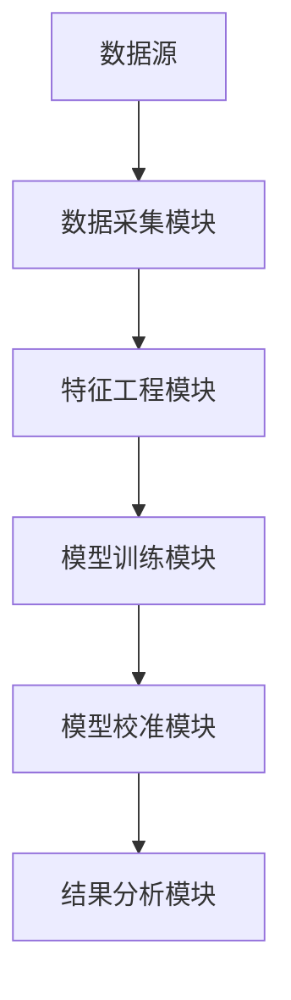

                 


# 目录大纲：《AI驱动的企业信用评级模型校准系统》

## 第一部分：背景介绍

### 第1章：企业信用评级的背景与挑战

#### 1.1 问题背景
- 1.1.1 企业信用评级的重要性
- 1.1.2 传统信用评级方法的局限性
- 1.1.3 AI技术在信用评级中的潜力

#### 1.2 问题描述
- 1.2.1 信用评级的核心要素
- 1.2.2 数据获取与处理的挑战
- 1.2.3 模型准确性和实时性的需求

#### 1.3 问题解决
- 1.3.1 AI驱动模型的优势
- 1.3.2 数据预处理与特征提取的方法
- 1.3.3 模型调优与校准的技术

#### 1.4 边界与外延
- 1.4.1 信用评级的适用范围
- 1.4.2 系统边界与功能限制
- 1.4.3 相关领域的扩展

#### 1.5 核心概念与组成
- 1.5.1 信用评级的定义与属性
- 1.5.2 AI模型的核心要素
- 1.5.3 系统架构的组成部分

## 第二部分：核心概念与联系

### 第2章：核心概念原理

#### 2.1 企业信用评级的定义与特征
- 2.1.1 信用评级的基本概念
- 2.1.2 信用评级的特征对比
- 2.1.3 信用评级的分类

#### 2.2 AI在信用评级中的作用
- 2.2.1 数据处理与特征提取
- 2.2.2 模型训练与预测
- 2.2.3 模型校准与优化

#### 2.3 核心概念的ER实体关系图
```mermaid
erDiagram
    actor 顾客 {
        +string 企业ID
        +string 企业名称
        +string 信用等级
    }

    actor 系统 {
        +string 模型ID
        +string 模型名称
        +string 算法类型
    }

    actor 数据 {
        +string 数据ID
        +string 数据类型
        +string 数据来源
    }

    顾客 --> 系统: 使用模型
    系统 --> 数据: 加载数据
    系统 --> 系统: 训练模型
    系统 --> 系统: 校准模型
```

## 第三部分：算法原理讲解

### 第3章：算法原理与实现

#### 3.1 逻辑回归算法
- 3.1.1 算法原理
- 3.1.2 损失函数与优化方法
- 3.1.3 模型实现

#### 3.2 随机森林算法
- 3.2.1 算法原理
- 3.2.2 特征重要性分析
- 3.2.3 模型实现

#### 3.3 深度学习模型
- 3.3.1 神经网络基础
- 3.3.2 模型训练与优化
- 3.3.3 模型实现

## 第四部分：系统分析与架构设计方案

### 第4章：系统架构设计

#### 4.1 问题场景介绍
- 4.1.1 企业信用评级的典型场景
- 4.1.2 系统需求分析
- 4.1.3 系统目标设定

#### 4.2 功能模块设计
- 4.2.1 数据采集模块
- 4.2.2 特征工程模块
- 4.2.3 模型训练模块
- 4.2.4 模型校准模块
- 4.2.5 结果分析模块

#### 4.3 系统架构图


## 第五部分：项目实战

### 第5章：项目实战与案例分析

#### 5.1 环境安装
- 5.1.1 安装Python
- 5.1.2 安装机器学习库
- 5.1.3 安装其他依赖工具

#### 5.2 核心代码实现
- 5.2.1 数据预处理代码
- 5.2.2 特征提取代码
- 5.2.3 模型训练代码
- 5.2.4 模型校准代码
- 5.2.5 结果分析代码

#### 5.3 代码解读与分析
- 5.3.1 数据预处理部分
- 5.3.2 特征提取部分
- 5.3.3 模型训练部分
- 5.3.4 模型校准部分
- 5.3.5 结果分析部分

#### 5.4 实际案例分析
- 5.4.1 案例背景介绍
- 5.4.2 数据准备
- 5.4.3 模型训练
- 5.4.4 模型校准
- 5.4.5 结果分析

## 第六部分：总结与展望

### 第6章：总结与展望

#### 6.1 最佳实践
- 6.1.1 数据清洗的重要性
- 6.1.2 模型调优的技巧
- 6.1.3 结果验证的方法

#### 6.2 项目小结
- 6.2.1 项目目标达成情况
- 6.2.2 关键技术总结
- 6.2.3 经验与教训

#### 6.3 注意事项
- 6.3.1 模型过拟合的防范
- 6.3.2 数据隐私的保护
- 6.3.3 系统性能的优化

#### 6.4 拓展阅读
- 6.4.1 推荐的书籍和资源
- 6.4.2 相关领域的研究进展
- 6.4.3 未来发展趋势

## 第七部分：附录

### 附录A：术语表
- 术语解释与定义

### 附录B：工具与库
- 使用的工具和库的清单与简介

### 附录C：参考文献
- 相关文献和资料的引用列表

## 索引
- 按主题或关键词排列的索引列表

