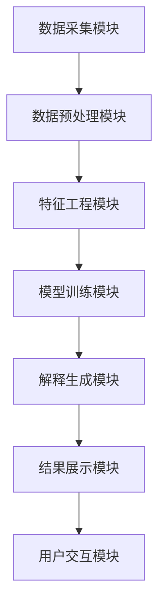

                 


# AI驱动的企业信用评级模型解释系统

> 关键词：企业信用评级，AI，可解释性，机器学习，模型解释

> 摘要：随着人工智能技术的快速发展，企业信用评级模型逐渐从传统的统计方法转向基于机器学习的AI驱动模型。然而，这些模型的复杂性和黑箱特性使得其可解释性成为实际应用中的主要障碍。本文将详细探讨如何构建一个AI驱动的企业信用评级模型解释系统，从背景介绍、核心概念、算法原理、系统设计到实际案例分析，全面剖析该系统的构建过程和关键点，为读者提供一份详尽的技术指南。

---

## 第1章 企业信用评级与AI驱动的模型解释概述

### 1.1 企业信用评级的定义与重要性

企业信用评级是评估企业在金融市场中的信用状况和偿债能力的重要指标。它通常基于企业的财务数据、市场表现、管理能力等因素，帮助企业获得融资、投资决策等提供参考依据。传统上，信用评级主要依赖于经验丰富的分析师和统计模型，但随着数据量的爆炸式增长和算法的进步，AI驱动的模型逐渐成为主流。

### 1.2 AI驱动的模型解释性的重要性

AI模型在信用评级中的应用虽然提高了预测的准确性，但其复杂性导致了可解释性的缺失。这使得企业在依赖这些模型的同时，难以理解其背后的决策逻辑，增加了信任风险和法律风险。因此，构建一个能够解释AI模型的系统显得尤为重要。

### 1.3 本章小结

本章介绍了企业信用评级的定义和其在金融领域的重要性，指出了传统评级方法的局限性，并强调了AI驱动模型在提升信用评级准确性的同时，其可解释性问题的严重性，为后续章节的展开奠定了基础。

---

## 第2章 企业信用评级的核心概念与背景

### 2.1 信用评级的背景与问题背景

随着全球经济的快速发展，企业融资需求日益增加，传统的信用评级方法已难以满足复杂多变的市场需求。AI技术的引入，不仅提升了信用评级的效率，还能够处理非结构化数据，为评级提供更全面的信息支持。

### 2.2 信用评级的核心概念与问题描述

信用评级的核心在于对企业财务健康状况的全面评估。传统方法依赖于财务比率分析，而AI模型则能够整合更多的数据源，如社交媒体数据、供应链信息等，提供更精准的预测。

### 2.3 解决策略与系统架构

本节将从企业信用评级的背景出发，分析AI驱动模型在信用评级中的应用，探讨如何通过可解释性AI技术解决模型黑箱问题，并为后续系统设计提供思路。

---

## 第3章 企业信用评级模型的算法原理

### 3.1 传统信用评级模型的原理

传统信用评级模型主要基于财务指标，如流动比率、速动比率等，通过统计分析得出评级结果。这些模型虽然简单易懂，但缺乏对非财务因素的考量，且难以处理大数据环境下的复杂场景。

### 3.2 可解释性AI（XAI）算法原理

可解释性AI算法如SHAP和LIME，通过局部可解释性解释模型的决策过程。SHAP通过权重分配的方法，明确每个特征对最终决策的影响程度；LIME则通过拟合线性模型，模拟局部数据分布，从而解释模型的预测结果。

### 3.3 算法原理的数学模型与公式

- **SHAP值公式**：
$$
\phi_i = \sum_{S \subseteq \{i\}} \omega_S \cdot (f(S \cup \{i\}) - f(S))
$$

- **LIME解释性公式**：
$$
\text{minimize} \sum_{i=1}^n \omega_{i} (f(x_i) - g(x_i)) + \lambda \|g\|_2^2
$$

---

## 第4章 企业信用评级模型的系统架构

### 4.1 系统功能模块设计

系统主要包括数据采集、模型训练、解释生成、结果展示和用户交互五大模块。数据采集模块负责获取企业相关信息；模型训练模块基于机器学习算法构建信用评级模型；解释生成模块利用XAI技术对模型进行解释；结果展示模块以可视化形式呈现评级结果及解释信息；用户交互模块提供用户操作界面。

### 4.2 系统架构图



### 4.3 系统接口设计

系统主要通过API接口与外部数据源和用户交互模块进行通信，采用RESTful API设计，确保系统的可扩展性和可维护性。

---

## 第5章 企业信用评级模型的项目实战

### 5.1 项目背景与目标

本项目旨在构建一个基于AI的信用评级系统，通过可解释性技术，使用户能够理解模型的决策过程，提升系统的透明度和可信度。

### 5.2 项目环境与工具

- **开发工具**：Python、Jupyter Notebook
- **机器学习库**：scikit-learn、XGBoost
- **可解释性工具**：SHAP、LIME
- **可视化工具**：Matplotlib、Seaborn

### 5.3 项目实现

#### 数据预处理

```python
import pandas as pd
data = pd.read_csv('企业信用数据.csv')
data = data.dropna().astype(float)
```

#### 模型训练

```python
from sklearn.ensemble import RandomForestClassifier
model = RandomForestClassifier()
model.fit(X_train, y_train)
```

#### 可解释性分析

```python
import shap
explainer = shap.TreeExplainer(model)
shap_values = explainer.shap_values(X_test)
```

### 5.4 项目小结

通过本项目的实施，我们成功构建了一个可解释的AI驱动信用评级系统，验证了可解释性技术的有效性，并为实际应用提供了参考。

---

## 第6章 可解释性AI在信用评级中的应用

### 6.1 可解释性AI的重要性

可解释性AI（XAI）是确保AI模型在金融领域可靠应用的关键。它不仅满足了监管要求，还增强了用户对系统的信任。

### 6.2 XAI技术的核心优势

XAI技术通过提供模型决策的透明解释，帮助分析师理解模型的行为，识别潜在的偏差，并优化模型性能。

### 6.3 XAI技术的挑战与未来方向

尽管XAI技术在信用评级中展现出巨大潜力，但其在实际应用中仍面临数据隐私、计算效率等挑战。未来，需要进一步研究如何在保证可解释性的前提下，提升模型的性能和效率。

---

## 第7章 总结与展望

### 7.1 总结

本文详细探讨了AI驱动的企业信用评级模型解释系统的构建过程，从背景分析到系统设计，再到项目实战，全面阐述了该系统的构建方法和关键点。

### 7.2 展望

随着AI技术的不断进步，可解释性AI将在信用评级中发挥越来越重要的作用。未来的研究方向包括开发更高效的解释方法，以及探索AI模型与传统模型的结合应用。

---

## 参考文献

（此处列出相关的学术论文、书籍和技术文档）

---

通过本文的系统介绍，读者可以全面了解AI驱动的企业信用评级模型解释系统的构建过程，并将其应用于实际场景中，为企业的信用评级提供更准确、更透明的支持。

