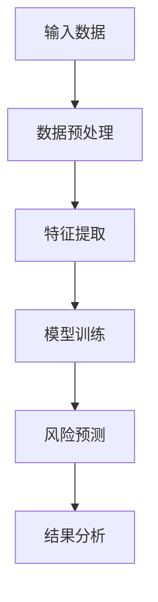
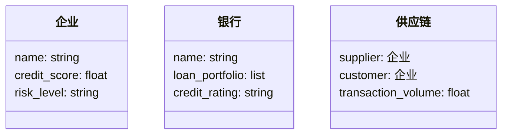
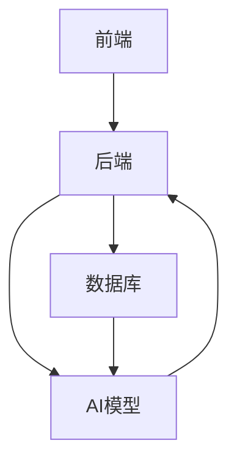

                 


# AI驱动的企业信用风险传导分析

## 关键词：企业信用风险，人工智能，风险传导，机器学习，金融分析

## 摘要：本文详细探讨了人工智能在企业信用风险传导分析中的应用。通过分析信用风险的定义、传导机制及其影响因素，结合机器学习和图神经网络等技术，提出了一种基于AI的信用风险传导分析方法。本文还提供了具体的算法实现、系统架构设计和实际案例分析，帮助读者深入了解如何利用AI技术进行信用风险的识别、评估和管理。

---

# 第1章: 企业信用风险与AI驱动分析概述

## 1.1 企业信用风险的基本概念

### 1.1.1 信用风险的定义与特征
信用风险是指由于债务人或交易对手无法履行其合同义务，导致债权人或相关方遭受损失的风险。企业信用风险的核心在于评估企业在经营过程中可能面临的财务困境或违约风险。其主要特征包括不确定性、传染性、动态性和复杂性。

### 1.1.2 信用风险的传导机制
信用风险的传导机制是指风险在企业之间通过供应链、金融网络或其他经济关联渠道传播的过程。常见的传导路径包括：
1. **直接传导**：企业自身的财务状况恶化直接引发风险。
2. **间接传导**：通过供应商、客户或合作伙伴之间的关联性引发风险。
3. **系统性传导**：由于市场波动或宏观经济因素影响，风险在多个企业之间同时发生或加剧。

### 1.1.3 AI技术在信用风险分析中的作用
人工智能技术，尤其是机器学习和自然语言处理，能够从海量数据中提取非结构化信息，发现传统方法难以察觉的风险信号。AI技术可以帮助企业快速识别潜在风险源，预测风险传导路径，并制定有效的风险应对策略。

## 1.2 AI驱动信用风险分析的背景与意义

### 1.2.1 传统信用风险分析的局限性
传统的信用风险分析方法依赖于财务报表和历史数据，难以捕捉企业之间的复杂关联和非结构化信息。此外，传统方法对实时数据的处理能力有限，难以应对金融市场中快速变化的风险环境。

### 1.2.2 AI技术在信用风险分析中的优势
AI技术具有以下显著优势：
1. **数据处理能力**：能够处理结构化数据（如财务数据）和非结构化数据（如新闻、社交媒体信息）。
2. **实时性**：能够实时监控市场动态，及时发现潜在风险。
3. **预测能力**：通过机器学习模型，可以预测企业违约概率和风险传导路径。

### 1.2.3 企业信用风险传导的复杂性
企业信用风险的传导往往涉及多个变量，包括企业间的关联性、市场环境、宏观经济因素等。AI技术可以帮助建模这些复杂关系，捕捉潜在的风险传染路径。

## 1.3 本书的核心目标与框架

### 1.3.1 本书的核心目标
本书旨在探讨如何利用人工智能技术，特别是机器学习和图神经网络，来分析和预测企业信用风险的传导过程。通过理论分析和实际案例，帮助读者掌握AI驱动信用风险分析的核心方法。

### 1.3.2 本书的逻辑框架
本书分为以下几个部分：
1. **理论基础**：介绍信用风险的基本概念和AI技术在信用风险分析中的应用。
2. **核心概念**：分析信用风险传导的核心概念和特征。
3. **算法原理**：详细讲解基于机器学习和图神经网络的信用风险分析算法。
4. **系统设计**：设计信用风险分析系统的架构和功能模块。
5. **项目实战**：通过实际案例展示如何利用AI技术进行信用风险分析。

### 1.3.3 本书的适用读者
本书适用于以下读者：
- 金融机构的信用风险管理人员
- 数据科学家和机器学习工程师
- 对信用风险分析和AI技术感兴趣的学术研究人员

---

# 第2章: 信用风险传导的理论基础

## 2.1 信用风险传导的基本理论

### 2.1.1 信用风险传导的定义
信用风险传导是指由于某一个或多个企业的信用状况恶化，导致其他相关企业或整个金融系统面临风险的过程。

### 2.1.2 信用风险传导的主要路径
1. **直接关联**：企业之间存在直接的供应链或合作关系，一家企业的违约可能直接影响另一家企业。
2. **间接关联**：通过金融市场（如债券市场、股票市场）的波动，影响相关企业的信用状况。
3. **系统性风险**：宏观经济波动或金融危机导致多家企业同时面临信用风险。

### 2.1.3 信用风险传导的关键影响因素
- **企业间关联性**：企业之间的供应链、合作关系等。
- **市场环境**：宏观经济指标、行业周期等。
- **金融工具的复杂性**：衍生品、债券等金融工具的杠杆效应。

## 2.2 AI技术在信用风险传导分析中的应用

### 2.2.1 机器学习在信用风险分析中的应用
机器学习技术可以用于：
1. **违约概率预测**：利用历史数据训练模型，预测企业的违约概率。
2. **风险因素识别**：通过特征工程提取关键风险因素。
3. **风险传导路径预测**：利用图神经网络建模企业间的关联性，预测风险传导路径。

### 2.2.2 自然语言处理在信用风险分析中的应用
自然语言处理技术可以用于：
1. **新闻事件分析**：从新闻中提取企业相关的负面信息，如诉讼、高管变动等。
2. **财务报告分析**：从企业财报中提取关键财务指标，进行风险评估。

### 2.2.3 图神经网络在信用风险传导中的应用
图神经网络（Graph Neural Network, GNN）可以用于建模企业间的关联性，分析风险传导路径。GNN通过节点表示学习，能够捕捉企业间的复杂关系，并预测风险传导的可能性。

---

# 第3章: 信用风险传导的核心概念与联系

## 3.1 信用风险传导的核心概念

### 3.1.1 信用风险传导的主体
- **企业**：信用风险的来源。
- **银行**：信用风险的主要承担者。
- **市场**：信用风险传导的环境。

### 3.1.2 信用风险传导的客体
- **供应链**：企业之间的物资和资金流动。
- **金融市场**：债券、股票等金融工具的交易。
- **经济系统**：宏观经济环境的影响。

### 3.1.3 信用风险传导的路径
1. **直接路径**：企业间直接的债务或合作关系。
2. **间接路径**：通过金融市场或宏观经济因素影响。
3. **系统性路径**：多家企业同时受到外部冲击的影响。

## 3.2 信用风险传导的核心特征

### 3.2.1 信用风险传导的非线性特征
信用风险的传导过程往往是非线性的，即输入与输出之间不存在简单的比例关系。这使得传统的线性模型难以有效捕捉风险传导的复杂性。

### 3.2.2 信用风险传导的网络特征
企业之间的关联性可以看作一个复杂的网络，风险在这些网络中的传播路径和速度取决于网络的结构特征，如节点度数、网络密度等。

### 3.2.3 信用风险传导的动态特征
信用风险的传导过程是一个动态过程，受到市场环境、企业经营状况等多种因素的影响。动态特征使得信用风险的预测和管理具有较大的挑战性。

## 3.3 信用风险传导的ER实体关系图

```mermaid
er
actor: 企业
actor: 银行
actor: 供应商
actor: 客户
actor: 市场
```

---

# 第4章: AI驱动信用风险传导的算法原理

## 4.1 信用风险传导的机器学习模型

### 4.1.1 机器学习模型的选择
在信用风险分析中，常用的机器学习模型包括：
- **逻辑回归（Logistic Regression）**
- **支持向量机（SVM）**
- **随机森林（Random Forest）**
- **梯度提升树（GBDT）**

### 4.1.2 机器学习模型的训练
以随机森林为例，模型训练过程如下：

```python
from sklearn.ensemble import RandomForestClassifier

# 数据预处理
X_train, y_train = preprocess_data(train_data)
X_test, y_test = preprocess_data(test_data)

# 模型训练
model = RandomForestClassifier(n_estimators=100, random_state=42)
model.fit(X_train, y_train)

# 模型评估
accuracy = model.score(X_test, y_test)
print(f"模型准确率：{accuracy}")
```

### 4.1.3 机器学习模型的评估
模型评估指标包括：
- **准确率（Accuracy）**
- **精确率（Precision）**
- **召回率（Recall）**
- **F1分数（F1 Score）**

---

## 4.2 基于图神经网络的信用风险传导分析

### 4.2.1 图神经网络的基本原理
图神经网络通过节点表示学习，捕捉企业之间的关联性。其核心思想是将企业看作图中的节点，企业之间的关系看作图的边。通过图神经网络，可以预测风险在图中的传播路径。

### 4.2.2 图神经网络在信用风险分析中的应用
图神经网络可以用于：
1. **风险传导路径预测**：通过图结构分析，识别风险传导的关键路径。
2. **风险传播概率计算**：预测企业在风险传导中的影响范围和概率。

### 4.2.3 图神经网络的实现步骤



---

## 4.3 算法实现的Python代码示例

### 4.3.1 基于机器学习的信用风险预测

```python
import pandas as pd
from sklearn.ensemble import RandomForestClassifier
from sklearn.metrics import accuracy_score, precision_score, recall_score, f1_score

# 加载数据
data = pd.read_csv('credit_risk.csv')

# 数据预处理
X = data.drop(columns=['label'])
y = data['label']

# 划分训练集和测试集
from sklearn.model_selection import train_test_split
X_train, X_test, y_train, y_test = train_test_split(X, y, test_size=0.2, random_state=42)

# 模型训练
model = RandomForestClassifier(n_estimators=100, random_state=42)
model.fit(X_train, y_train)

# 模型预测
y_pred = model.predict(X_test)

# 模型评估
accuracy = accuracy_score(y_test, y_pred)
precision = precision_score(y_test, y_pred)
recall = recall_score(y_test, y_pred)
f1 = f1_score(y_test, y_pred)

print(f"准确率：{accuracy}")
print(f"精确率：{precision}")
print(f"召回率：{recall}")
print(f"F1分数：{f1}")
```

### 4.3.2 基于图神经网络的信用风险传导分析

```python
import networkx as nx
from sklearn.manifold import TSNE
import matplotlib.pyplot as plt

# 创建图结构
G = nx.Graph()
G.add_nodes_from(['企业A', '企业B', '企业C'])
G.add_edges_from([('企业A', '企业B'), ('企业B', '企业C')])

# 图可视化
pos = nx.spring_layout(G)
nx.draw(G, pos, node_size=500, edge_color='blue', width=2)
plt.show()
```

---

## 4.3.3 算法的数学模型与公式

### 4.3.3.1 逻辑回归模型
$$ P(y=1|x) = \frac{1}{1 + e^{- (w^T x + b)}} $$

### 4.3.3.2 随机森林模型
随机森林通过集成学习（Bagging）和特征选择（Random Forest）来提高模型的准确性和稳定性。

### 4.3.3.3 图神经网络模型
图神经网络通过节点表示学习，将企业间的关联性表示为图结构。其数学模型可以表示为：
$$ h_i = \sum_{j \in N(i)} \theta h_j + b_i $$
其中，$h_i$ 是节点 $i$ 的表示，$N(i)$ 是节点 $i$ 的邻居节点，$\theta$ 是模型参数，$b_i$ 是偏置项。

---

# 第5章: 信用风险传导的系统分析与架构设计

## 5.1 信用风险传导的系统功能设计

### 5.1.1 领域模型


### 5.1.2 系统架构设计


### 5.1.3 系统交互设计
```mermaid
sequenceDiagram
    participant 用户
    participant 前端
    participant 后端
    participant 数据库
    participant AI模型
    用户 -> 前端: 提交查询
    前端 -> 后端: 发送查询请求
    后端 -> 数据库: 获取企业数据
    后端 -> AI模型: 请求风险评估
    AI模型 -> 后端: 返回风险评估结果
    后端 -> 前端: 返回结果
    用户 <- 前端: 显示结果
```

---

## 5.2 信用风险传导的系统架构设计

### 5.2.1 系统架构图


### 5.2.2 系统功能模块
1. **数据采集模块**：从企业财报、新闻等来源获取数据。
2. **特征提取模块**：对数据进行特征提取，生成模型输入。
3. **模型训练模块**：训练机器学习或图神经网络模型。
4. **风险评估模块**：根据模型输出，生成信用风险评估报告。
5. **风险监控模块**：实时监控企业信用状况，及时预警风险。

---

## 5.3 系统接口设计

### 5.3.1 API接口定义
- **输入接口**：企业数据，如财务数据、新闻数据等。
- **输出接口**：信用风险评估结果，如违约概率、风险等级等。

### 5.3.2 API调用示例
```python
import requests

url = 'http://localhost:8000/api/credit_risk'
data = {
    'enterprise_name': '企业A',
    'financial_data': {
        'revenue': 1000000,
        'profit': 100000
    }
}
response = requests.post(url, json=data)
result = response.json()
print(result)
```

---

## 5.4 系统交互流程图

```mermaid
sequenceDiagram
    participant 用户
    participant 前端
    participant 后端
    participant 数据库
    participant AI模型
    用户 -> 前端: 提交企业名称
    前端 -> 后端: 请求信用风险评估
    后端 -> 数据库: 获取企业数据
    后端 -> AI模型: 请求风险评估
    AI模型 -> 后端: 返回评估结果
    后端 -> 前端: 返回结果
    用户 <- 前端: 显示评估结果
```

---

# 第6章: AI驱动信用风险传导的项目实战

## 6.1 环境安装与配置

### 6.1.1 安装Python和相关库
```bash
python --version
pip install numpy pandas scikit-learn networkx
```

### 6.1.2 安装机器学习框架
```bash
pip install scikit-learn
pip install xgboost
pip install lightgbm
```

## 6.2 数据采集与预处理

### 6.2.1 数据来源
- **企业财报**：包括收入、利润、资产负债表等数据。
- **新闻数据**：企业相关的新闻、公告等。
- **市场数据**：股票价格、债券收益率等。

### 6.2.2 数据清洗
```python
import pandas as pd

# 加载数据
data = pd.read_csv('credit_risk.csv')

# 删除缺失值
data = data.dropna()

# 标准化处理
from sklearn.preprocessing import StandardScaler
scaler = StandardScaler()
data[['revenue', 'profit']] = scaler.fit_transform(data[['revenue', 'profit']])
```

## 6.3 特征工程与模型训练

### 6.3.1 特征提取
```python
# 提取特征
X = data[['revenue', 'profit', 'market_share', 'debt_ratio']]
y = data['label']

# 划分训练集和测试集
from sklearn.model_selection import train_test_split
X_train, X_test, y_train, y_test = train_test_split(X, y, test_size=0.2, random_state=42)
```

### 6.3.2 模型训练
```python
from sklearn.ensemble import RandomForestClassifier

model = RandomForestClassifier(n_estimators=100, random_state=42)
model.fit(X_train, y_train)
```

### 6.3.3 模型评估
```python
from sklearn.metrics import classification_report

y_pred = model.predict(X_test)
print(classification_report(y_test, y_pred))
```

---

## 6.4 系统实现与部署

### 6.4.1 系统部署
将模型部署到服务器，提供API接口供前端调用。

### 6.4.2 系统监控
实时监控模型性能，及时更新模型参数。

---

## 6.5 实际案例分析

### 6.5.1 案例背景
某制造企业由于原材料价格上涨和市场需求下降，面临较大的信用风险。

### 6.5.2 数据分析
通过模型分析，发现该企业的违约概率为80%，风险主要来源于供应链中断和市场需求下降。

### 6.5.3 风险评估与应对
根据模型预测，银行可以采取以下措施：
1. **减少贷款额度**：降低对该企业的贷款支持。
2. **加强供应链管理**：与供应商协商延长付款期限。
3. **风险分散**：将风险分散到多个供应商或市场。

---

## 6.6 项目小结

### 6.6.1 项目总结
通过本项目，我们利用AI技术成功构建了一个信用风险分析系统，能够实时监控企业的信用状况，并预测风险的传导路径。

### 6.6.2 经验总结
- **数据质量**：高质量的数据是模型准确性的基础。
- **模型解释性**：复杂的模型需要可解释性，以便于业务人员理解和使用。
- **实时性**：信用风险分析需要实时数据支持，以应对快速变化的市场环境。

---

# 第7章: 小结与注意事项

## 7.1 本书的核心内容总结
本书系统地介绍了AI技术在信用风险传导分析中的应用，从理论到实践，详细讲解了如何利用机器学习和图神经网络技术进行信用风险的识别、评估和管理。

## 7.2 读者需要注意的问题
1. **数据质量**：确保数据的完整性和准确性。
2. **模型解释性**：复杂的模型需要可解释性，以便于业务决策。
3. **实时性**：信用风险分析需要实时数据支持，以应对快速变化的市场环境。
4. **风险管理**：在利用AI技术进行信用风险分析时，需要制定完善的风险管理策略，避免模型的过度拟合和误判。

## 7.3 进一步学习的方向
- **深入学习机器学习算法**：如XGBoost、LightGBM等。
- **探索图神经网络**：研究GraphSAGE、GAT等图神经网络模型。
- **结合自然语言处理技术**：将NLP技术应用于信用风险分析，提升模型的预测能力。

---

# 结语

通过本书的学习，读者可以掌握AI驱动信用风险传导分析的核心方法，为企业的信用风险管理提供有力的技术支持。未来，随着AI技术的不断发展，信用风险分析将更加智能化、精准化，为企业和社会创造更大的价值。

