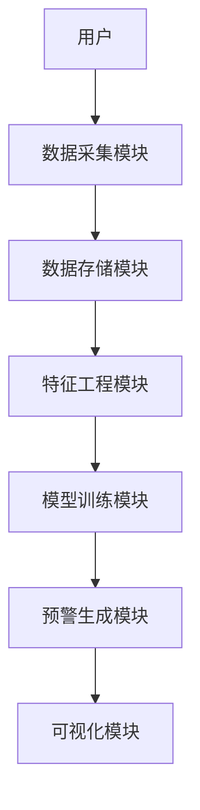

                 


# AI驱动的企业信用风险早期预警系统

> 关键词：企业信用风险、AI技术、预警系统、机器学习、风险管理

> 摘要：本文详细探讨了AI技术在企业信用风险早期预警系统中的应用，从系统背景、核心概念、算法原理到系统架构和项目实战，全面解析了如何利用AI技术提升信用风险管理的效率和准确性。

---

## 第1章: 企业信用风险早期预警系统背景介绍

### 1.1 问题背景与描述

#### 1.1.1 企业信用风险的定义与特征
企业信用风险是指企业在经营过程中，由于自身或外部环境的变化，无法履行合同义务，导致债权人遭受损失的风险。这种风险通常表现为企业的还款能力或还款意愿下降，从而影响其信用状况。

信用风险具有以下特征：
1. **可量化性**：通过财务指标（如资产负债率、流动比率等）和非财务指标（如企业声誉、市场环境等）进行量化评估。
2. **可预测性**：通过历史数据和机器学习模型，可以预测未来可能出现的风险。
3. **动态性**：企业信用状况会随着市场环境、经营状况的变化而变化，需要实时监控和更新。

#### 1.1.2 传统信用风险管理的局限性
传统的信用风险管理主要依赖于人工审核和简单的财务指标分析，存在以下问题：
1. **效率低下**：人工审核耗时长，难以覆盖大量企业。
2. **片面性**：仅依赖财务指标，忽视了市场环境、企业行为等非财务因素。
3. **主观性**：审核结果受人为因素影响较大，缺乏客观性。

#### 1.1.3 AI技术在信用风险管理中的应用潜力
AI技术（人工智能）通过大数据分析和机器学习算法，能够从海量数据中提取有用信息，发现传统方法难以察觉的风险信号。AI技术的应用可以显著提高信用风险管理的效率和准确性，帮助企业在早期发现潜在风险，从而采取预防措施。

---

### 1.2 问题解决与边界

#### 1.2.1 信用风险早期预警的目标与意义
信用风险早期预警系统的目标是通过实时监控和分析企业内外部数据，识别潜在风险因素，提前发出预警信号，帮助债权人采取相应的风险控制措施。其意义在于：
1. **降低损失**：通过早期预警，可以提前采取措施，减少因企业违约带来的损失。
2. **提高效率**：自动化分析和实时监控，显著提高了信用评估和管理的效率。
3. **增强决策能力**：基于AI的分析结果，提供更精准的信用评估，增强决策的科学性。

#### 1.2.2 系统的边界与外延
信用风险早期预警系统主要关注企业的信用状况，其边界包括：
- **数据范围**：企业财务数据、市场数据、行业数据等。
- **预警范围**：企业违约风险、流动性风险、偿债风险等。
- **目标用户**：银行、投资机构、供应链企业等债权人。

系统外延包括但不限于：
- **数据来源**：企业财务报表、市场行情、新闻资讯等。
- **分析方法**：机器学习、自然语言处理、时间序列分析等。

#### 1.2.3 核心要素与组成结构
信用风险早期预警系统的核心要素包括：
1. **数据采集**：获取企业相关数据，包括财务数据、市场数据等。
2. **特征提取**：从数据中提取有用的特征，如财务指标、市场指标等。
3. **模型训练**：基于特征数据，训练机器学习模型，识别风险信号。
4. **预警生成**：根据模型预测结果，生成预警信号。
5. **决策支持**：提供预警结果的可视化和决策支持。

---

### 1.3 核心概念与联系

#### 1.3.1 核心概念的定义与属性对比表
以下是核心概念的定义与属性对比表：

| 概念       | 定义                                                                 | 属性特征         |
|------------|----------------------------------------------------------------------|------------------|
| 信用风险   | 企业未能履行合同义务，导致债权人损失的风险                                   | 可量化、可预测   |
| AI技术     | 模拟人类智能的计算机技术                                                 | 数据驱动、自适应 |
| 预警系统   | 提前识别潜在风险并发出警报的系统                                         | 实时性、准确性   |

#### 1.3.2 实体关系ER图
以下是信用风险早期预警系统的核心实体关系图：

```mermaid
erDiagram
    customer[企业] {
        string id
        string name
        double credit_score
    }
    financial_data[财务数据] {
        string id
        double revenue
        double profit
        date period
    }
    market_data[市场数据] {
        string id
        double market_share
        double interest_rate
        date period
    }
    risk_assessment[风险评估] {
        string id
        string risk_level
        date assessment_date
    }
   预警系统
    customer --> financial_data : 关联
    customer --> market_data : 关联
    financial_data --> risk_assessment : 输入
    market_data --> risk_assessment : 输入
```

---

## 第2章: 信用风险早期预警的核心算法原理

### 2.1 逻辑回归算法

#### 2.1.1 算法原理
逻辑回归是一种用于分类的统计方法，常用于二分类问题（如违约与非违约）。其核心思想是通过 sigmoid 函数将线性回归的输出映射到概率空间。

公式如下：
$$ P(y=1|x) = \frac{1}{1 + e^{- (\beta_0 + \beta_1 x_1 + \beta_2 x_2 + \dots + \beta_n x_n)}} $$

其中：
- $y$ 是目标变量（违约标记）。
- $x_i$ 是特征变量。
- $\beta_i$ 是模型参数。

#### 2.1.2 算法实现
以下是逻辑回归算法的Python实现示例：

```python
import numpy as np
from sklearn.linear_model import LogisticRegression

# 数据准备
X = np.array([[50, 200],  # 示例数据
              [100, 300],
              [150, 250],
              [200, 300]])

y = np.array([0, 0, 1, 1])  # 标签：0表示非违约，1表示违约

# 模型训练
model = LogisticRegression()
model.fit(X, y)

# 预测
print(model.predict(X))  # 输出预测结果
```

---

### 2.2 随机森林算法

#### 2.2.1 算法原理
随机森林是一种基于决策树的集成学习算法，通过构建多棵决策树并进行投票或平均，提高模型的准确性和稳定性。

#### 2.2.2 算法实现
以下是随机森林算法的Python实现示例：

```python
from sklearn.ensemble import RandomForestClassifier

# 数据准备
X = np.array([[50, 200],
              [100, 300],
              [150, 250],
              [200, 300]])

y = np.array([0, 0, 1, 1])

# 模型训练
model = RandomForestClassifier(n_estimators=10)
model.fit(X, y)

# 预测
print(model.predict(X))  # 输出预测结果
```

---

## 第3章: 系统架构设计与实现

### 3.1 系统模块划分

系统主要模块包括：
1. 数据采集模块：负责收集企业相关数据。
2. 特征工程模块：对数据进行清洗、特征提取和转换。
3. 模型训练模块：基于特征数据训练机器学习模型。
4. 预警生成模块：根据模型预测结果生成预警信号。
5. 可视化模块：提供预警结果的可视化展示。

---

### 3.2 系统架构设计

以下是系统架构设计图：



---

## 第4章: 项目实战与案例分析

### 4.1 环境安装与数据准备

#### 4.1.1 环境安装
需要安装以下Python库：
- `numpy`
- `pandas`
- `scikit-learn`
- `mermaid`（可选）

#### 4.1.2 数据准备
以下是示例数据：

```python
import pandas as pd

data = {
    '企业ID': [1, 2, 3, 4],
    '营业收入': [500, 600, 700, 800],
    '净利润': [100, 120, 150, 200],
    '行业': ['制造业', '科技', '金融', '制造业'],
    '信用评分': [70, 60, 80, 75],
    '违约标记': [0, 0, 1, 0]
}

df = pd.DataFrame(data)
print(df)
```

---

### 4.2 核心代码实现

#### 4.2.1 特征工程

```python
from sklearn.preprocessing import StandardScaler

# 数据标准化
scaler = StandardScaler()
X_scaled = scaler.fit_transform(df[['营业收入', '净利润', '信用评分']])
```

#### 4.2.2 模型训练与预测

```python
from sklearn.model_selection import train_test_split
from sklearn.metrics import accuracy_score

# 数据分割
X_train, X_test, y_train, y_test = train_test_split(X_scaled, df['违约标记'], test_size=0.2)

# 模型训练
model = LogisticRegression()
model.fit(X_train, y_train)

# 模型预测
y_pred = model.predict(X_test)
print('准确率:', accuracy_score(y_test, y_pred))
```

---

## 第5章: 小结与注意事项

### 5.1 小结
本文详细介绍了AI驱动的企业信用风险早期预警系统的背景、核心概念、算法原理、系统架构和项目实现。通过逻辑回归和随机森林算法的示例，展示了如何利用AI技术提升信用风险管理的效率和准确性。

### 5.2 注意事项
1. **数据质量**：数据的准确性和完整性对模型性能影响重大，需确保数据来源可靠。
2. **模型解释性**：复杂的模型可能难以解释，需权衡模型的准确性和可解释性。
3. **实时性**：企业信用状况会动态变化，需确保系统的实时监控能力。

### 5.3 拓展阅读
建议读者进一步学习以下内容：
- **时间序列分析**：用于分析企业信用风险的时变性。
- **自然语言处理**：用于分析企业新闻和公告，提取潜在风险信号。

---

通过本文的学习，读者可以掌握AI技术在信用风险管理中的应用，为企业信用风险的早期预警提供有力支持。

