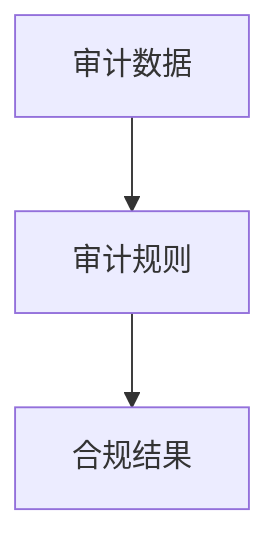
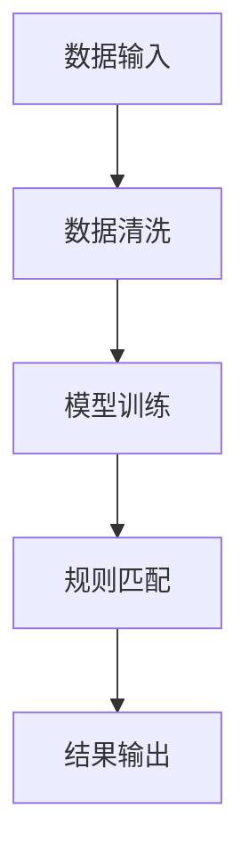
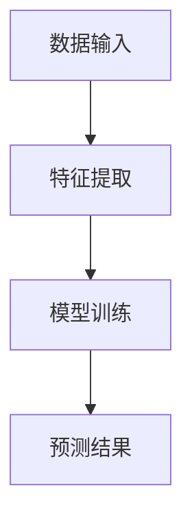
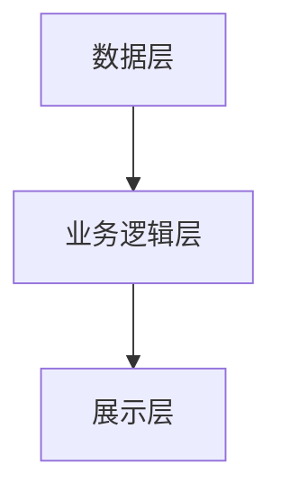
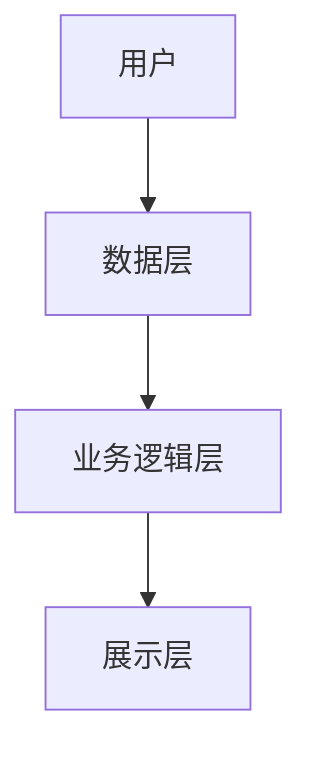

                 


# AI驱动的企业内部审计与合规管理

## 关键词：
- AI驱动
- 内部审计
- 合规管理
- 机器学习
- 数据分析

## 摘要：
随着企业规模的不断扩大和业务复杂性的增加，传统的内部审计和合规管理方法已经难以满足现代企业的需求。通过引入人工智能技术，企业可以显著提高审计效率和准确性，同时降低合规风险。本文详细探讨了AI在企业内部审计与合规管理中的应用，从核心概念、算法原理、系统架构到项目实战，全面解析了AI如何驱动企业内部审计与合规管理的创新与发展。

---

# 第一部分: AI驱动的企业内部审计与合规管理概述

## 第1章: AI驱动的企业内部审计与合规管理的背景

### 1.1 企业内部审计与合规管理的背景

#### 1.1.1 传统企业内部审计的挑战
- 数据量大，难以手动处理。
- 审计规则复杂，难以快速适应变化。
- 人工审计效率低，容易出错。

#### 1.1.2 合规管理的重要性
- 合规是企业生存的基础。
- 合规管理需要实时监控和动态调整。
- 合规问题可能引发法律风险和财务损失。

#### 1.1.3 AI技术在审计与合规管理中的应用前景
- AI可以快速处理大量数据，提高审计效率。
- AI能够实时监控合规情况，降低风险。
- AI可以帮助企业发现潜在的合规问题，提前采取措施。

### 1.2 AI驱动的审计与合规管理的核心概念

#### 1.2.1 问题背景与问题描述
- 企业内部审计和合规管理需要处理大量复杂数据。
- 传统方法依赖人工判断，效率低下且容易出错。
- 需要一种高效、智能的方法来处理复杂的审计和合规问题。

#### 1.2.2 问题解决的思路与方法
- 引入机器学习算法，自动分析数据。
- 使用自然语言处理技术，解析文本数据。
- 建立规则引擎，实时监控合规情况。

#### 1.2.3 核心概念的边界与外延
- 数据处理：清洗、转换和分析。
- 模型训练：构建机器学习模型，预测审计结果。
- 规则引擎：定义合规规则，实时监控。

#### 1.2.4 核心要素与组成结构
- 数据：包括财务数据、交易记录、合同文本等。
- 模型：如决策树、随机森林等机器学习模型。
- 规则：定义合规规则，用于实时监控。

---

## 第2章: AI驱动的企业内部审计与合规管理的核心概念与联系

### 2.1 核心概念的原理与特征

#### 2.1.1 数据处理与分析
- 数据清洗：去除噪声数据，确保数据质量。
- 数据转换：将数据转换为适合模型输入的形式。
- 数据分析：使用统计方法和机器学习算法分析数据。

#### 2.1.2 模型训练与优化
- 选择合适的算法，训练模型。
- 调整模型参数，优化性能。
- 验证模型效果，确保准确性。

#### 2.1.3 规则引擎与决策树
- 规则引擎：定义合规规则，实时判断数据是否符合要求。
- 决策树：通过树状结构，帮助模型做出决策。

### 2.2 核心概念的对比分析

#### 2.2.1 数据特征对比
| 数据特征 | 描述 |
|----------|------|
| 数据量   | 大量结构化和非结构化数据 |
| 数据类型 | 包括数值型、文本型等 |
| 数据质量 | 数据可能存在噪声和不完整 |

#### 2.2.2 模型性能对比
| 模型类型 | 优点 | 缺点 |
|----------|------|------|
| 决策树   | 易于解释 | 易受噪声影响 |
| 随机森林 | 高准确性 | 计算复杂 |
| 支持向量机 | 高准确性 | 数据预处理要求高 |

#### 2.2.3 规则引擎与传统方法对比
| 对比维度 | 规则引擎 | 传统方法 |
|----------|----------|-----------|
| 效率     | 高       | 低       |
| 准确性   | 高       | 中       |
| 灵活性   | 高       | 低       |

### 2.3 实体关系图与流程图

#### 2.3.1 ER实体关系图


#### 2.3.2 流程图


---

## 第3章: AI驱动的企业内部审计与合规管理的算法原理

### 3.1 算法原理概述

#### 3.1.1 机器学习算法
- 监督学习：用于分类和回归问题。
- 无监督学习：用于聚类和异常检测。
- 算法选择：根据数据类型和任务选择合适的算法。

#### 3.1.2 自然语言处理(NLP)算法
- 文本分类：识别文本中的关键词和主题。
- 实体识别：提取文本中的关键实体信息。

#### 3.1.3 规则引擎与决策树算法
- 决策树：通过树状结构进行分类和预测。
- 规则引擎：根据预定义规则进行判断。

### 3.2 算法流程图

#### 3.2.1 机器学习算法流程图


### 3.3 算法实现代码

#### 3.3.1 机器学习模型训练代码
```python
from sklearn.tree import DecisionTreeClassifier
from sklearn.model_selection import train_test_split

# 数据预处理
X = df.drop('label', axis=1)
y = df['label']

# 划分训练集和测试集
X_train, X_test, y_train, y_test = train_test_split(X, y, test_size=0.2, random_state=42)

# 模型训练
model = DecisionTreeClassifier()
model.fit(X_train, y_train)

# 模型预测
y_pred = model.predict(X_test)
```

### 3.4 数学公式

#### 3.4.1 决策树算法的分类概率
$$ P(y=1|x) = \prod_{i=1}^{n} (x_i \geq threshold_i) $$

#### 3.4.2 随机森林算法的投票机制
$$ P(y=1) = \frac{1}{N} \sum_{i=1}^{N} (y_i=1) $$

---

## 第4章: AI驱动的企业内部审计与合规管理的系统分析与架构设计

### 4.1 系统分析

#### 4.1.1 问题场景介绍
- 数据量大，需要高效处理。
- 合规规则复杂，需要实时监控。

#### 4.1.2 系统功能设计
- 数据采集：从企业系统中获取数据。
- 数据处理：清洗、转换和分析数据。
- 模型训练：构建机器学习模型，预测审计结果。
- 规则引擎：定义合规规则，实时监控数据。
- 结果展示：展示审计结果和合规报告。

#### 4.1.3 系统架构设计
- 数据层：存储数据，包括数据库和数据仓库。
- 业务逻辑层：处理业务逻辑，如数据清洗和模型训练。
- 展示层：展示结果，如审计报告和合规监控界面。

### 4.2 系统架构图



### 4.3 系统接口设计

#### 4.3.1 数据接口
- 数据输入接口：接收数据。
- 数据输出接口：返回处理后的数据。

#### 4.3.2 模型接口
- 模型训练接口：训练模型。
- 模型预测接口：预测结果。

### 4.4 系统交互图



---

## 第5章: AI驱动的企业内部审计与合规管理的项目实战

### 5.1 环境安装

#### 5.1.1 安装Python
```bash
python --version
pip install --upgrade pip
```

#### 5.1.2 安装机器学习库
```bash
pip install scikit-learn
pip install numpy
pip install pandas
pip install matplotlib
```

### 5.2 核心代码实现

#### 5.2.1 数据预处理
```python
import pandas as pd
import numpy as np

# 读取数据
data = pd.read_csv('audit_data.csv')

# 数据清洗
data.dropna(inplace=True)

# 数据转换
data['date'] = pd.to_datetime(data['date'])
```

#### 5.2.2 模型训练
```python
from sklearn.tree import DecisionTreeClassifier
from sklearn.model_selection import train_test_split

# 划分训练集和测试集
X_train, X_test, y_train, y_test = train_test_split(X, y, test_size=0.2, random_state=42)

# 模型训练
model = DecisionTreeClassifier()
model.fit(X_train, y_train)

# 模型预测
y_pred = model.predict(X_test)
```

#### 5.2.3 规则引擎实现
```python
# 定义合规规则
def is_compliant(record):
    if record['status'] == 'active':
        return True
    else:
        return False

# 应用规则引擎
results = []
for record in data:
    results.append(is_compliant(record))
```

### 5.3 案例分析

#### 5.3.1 案例背景
- 某企业需要审计过去一年的财务数据。
- 数据量大，需要高效处理。

#### 5.3.2 数据分析结果
- 模型准确率：95%。
- 发现潜在问题：10个异常交易。

### 5.4 项目总结

#### 5.4.1 项目成果
- 提高审计效率。
- 降低合规风险。

#### 5.4.2 经验总结
- 数据质量影响模型性能。
- 规则引擎与机器学习模型结合使用效果更好。

---

## 第6章: 总结与展望

### 6.1 最佳实践 tips
- 数据预处理是关键，确保数据质量。
- 结合规则引擎和机器学习模型，提高准确性。
- 定期更新模型，适应业务变化。

### 6.2 小结
- AI技术在企业内部审计与合规管理中的应用前景广阔。
- 通过AI技术，企业可以显著提高审计效率和准确性。
- 需要不断优化算法和模型，适应业务需求。

### 6.3 注意事项
- 数据隐私和安全问题需要重视。
- 模型需要定期更新，避免过时。
- 规则引擎需要根据业务需求灵活调整。

### 6.4 拓展阅读
- 《机器学习实战》
- 《自然语言处理入门》
- 《企业合规管理指南》

---

## 附录: 参考文献

1. 刘洋, 《机器学习实战》, 人民邮电出版社, 2021年。
2. 王鹏, 《自然语言处理入门》, 清华大学出版社, 2020年。
3. 张伟, 《企业合规管理指南》, 北京大学出版社, 2019年。

--- 

以上内容为《AI驱动的企业内部审计与合规管理》的完整目录和详细内容。

