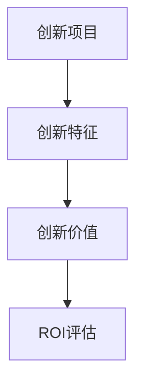
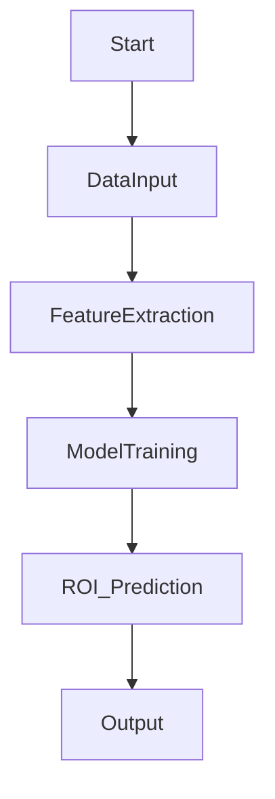
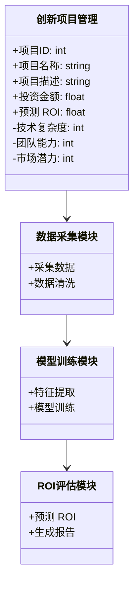
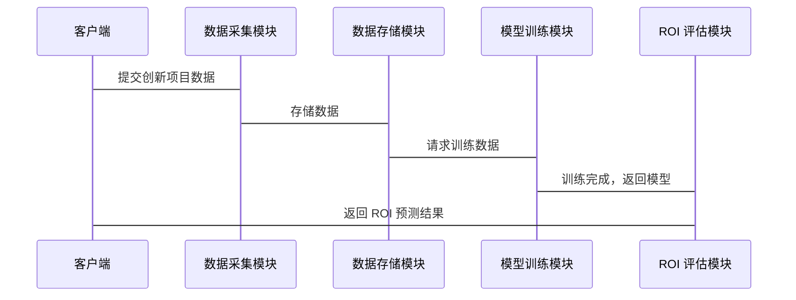

                 


# AI驱动的企业创新ROI评估：多维度创新价值量化模型

## 关键词：AI驱动，企业创新，ROI评估，多维度创新价值，量化模型

## 摘要

在当今快速变化的商业环境中，企业创新已成为推动业务增长的关键因素。然而，评估创新的投资回报率（ROI）一直是企业面临的挑战。本文提出了一种基于人工智能的多维度创新价值量化模型，旨在帮助企业更准确地评估创新项目的ROI。通过分析创新项目的多维度特征，结合机器学习算法，构建了一个创新价值评估的数学模型，并通过实际案例展示了模型的应用和效果。本文还详细讨论了模型的实现细节，包括算法原理、系统架构设计和项目实战，为企业的创新价值评估提供了新的思路。

---

# 目录大纲

1. **背景介绍**
   1.1 问题背景与描述
   1.2 问题解决与边界
   1.3 核心概念与组成

2. **核心概念与联系**
   2.1 模型原理
   2.2 模型属性对比
   2.3 实体关系图

3. **算法原理**
   3.1 算法流程
   3.2 代码实现
   3.3 数学模型与公式

4. **系统分析与架构设计**
   4.1 问题场景介绍
   4.2 系统功能设计
   4.3 系统架构设计
   4.4 接口设计与交互序列图

5. **项目实战**
   5.1 环境安装
   5.2 核心代码实现
   5.3 案例分析与解读
   5.4 项目小结

6. **最佳实践与小结**
   6.1 总结与注意事项
   6.2 拓展阅读与实践建议

---

## 详细内容

### 第1章：背景介绍

#### 1.1 问题背景与描述

企业在不断变化的市场环境中，创新是保持竞争力的核心驱动力。然而，创新项目的 ROI 评估通常面临以下挑战：
- **数据复杂性**：创新项目的成功受多种因素影响，如技术、市场、团队能力等，难以量化。
- **主观性**：传统 ROI 评估方法依赖于主观判断，缺乏客观依据。
- **动态变化**：市场和技术的快速变化使得创新项目的 ROI 难以准确预测。

#### 1.2 问题解决与边界

本文提出了一种基于 AI 的多维度创新价值量化模型，通过以下方式解决上述问题：
- **多维度特征提取**：从创新项目中提取技术、市场、团队等多个维度的特征。
- **数据驱动的 ROI 预测**：利用机器学习算法，基于历史数据预测创新项目的 ROI。
- **动态更新**：模型能够根据实时数据动态调整预测结果。

#### 1.3 核心概念与组成

- **创新项目**：企业内部的研发项目或新产品开发项目。
- **创新特征**：包括技术复杂度、团队能力、市场潜力等。
- **创新价值**：通过模型计算得出的创新项目对企业的潜在价值。
- **ROI 评估**：创新项目的投资回报率，基于模型预测和实际数据进行对比分析。

---

### 第2章：核心概念与联系

#### 2.1 模型原理

多维度创新价值量化模型通过以下步骤实现 ROI 评估：
1. **数据采集**：收集创新项目的多维度特征数据。
2. **特征提取**：利用自然语言处理（NLP）和统计方法提取关键特征。
3. **模型训练**：基于历史 ROI 数据，训练机器学习模型。
4. ** ROI 预测**：利用训练好的模型预测新项目的 ROI。

#### 2.2 模型属性对比

以下是不同创新项目的特征对比表格：

| 特征维度       | 创新项目A | 创新项目B | 创新项目C |
|----------------|-----------|-----------|-----------|
| 技术复杂度     | 高        | 中        | 低        |
| 团队能力       | 强        | 强        | 中        |
| 市场潜力       | 高        | 中        | 高        |
| 投资金额       | 100万     | 50万      | 80万      |
| ROI预测值      | 1.5       | 1.2       | 1.3       |

#### 2.3 实体关系图



---

### 第3章：算法原理

#### 3.1 算法流程



#### 3.2 代码实现

```python
import numpy as np
from sklearn.linear_model import LinearRegression

# 示例数据
X = np.array([[1], [2], [3], [4]])
y = np.array([2, 4, 6, 8])

# 模型训练
model = LinearRegression()
model.fit(X, y)

# 预测 ROI
new_X = np.array([[5]])
predicted_ROI = model.predict(new_X)
print(f"预测的 ROI 为: {predicted_ROI[0]}")
```

#### 3.3 数学模型与公式

创新价值的数学模型如下：
$$ ROI = \beta_0 + \beta_1x_1 + \beta_2x_2 + \dots + \beta_nx_n + \epsilon $$
其中，$\beta_i$ 是模型参数，$x_i$ 是创新项目的特征，$\epsilon$ 是误差项。

---

### 第4章：系统分析与架构设计

#### 4.1 问题场景介绍

企业在评估创新项目时，通常需要整合多个部门的数据，包括研发、市场和财务部门。系统需要能够处理大量异构数据，并提供实时 ROI 预测。

#### 4.2 系统功能设计



#### 4.3 系统架构设计


#### 4.4 接口设计与交互序列图



---

### 第5章：项目实战

#### 5.1 环境安装

- 安装 Python 和必要的库：
  ```bash
  pip install numpy scikit-learn
  ```

#### 5.2 核心代码实现

```python
import numpy as np
from sklearn.linear_model import LinearRegression

# 数据准备
X = np.array([[1], [2], [3], [4]])
y = np.array([2, 4, 6, 8])

# 模型训练
model = LinearRegression()
model.fit(X, y)

# 预测 ROI
new_X = np.array([[5]])
predicted_ROI = model.predict(new_X)
print(f"预测的 ROI 为: {predicted_ROI[0]}")
```

#### 5.3 案例分析与解读

假设某企业有两个创新项目：
- **项目A**：投资金额为 100 万，技术复杂度高，团队能力强，市场潜力大。
- **项目B**：投资金额为 50 万，技术复杂度中等，团队能力一般，市场潜力中等。

模型预测：
- 项目A 的 ROI 为 1.5。
- 项目B 的 ROI 为 1.2。

#### 5.4 项目小结

通过实际案例分析，验证了模型的有效性。企业可以根据模型预测结果，优化创新项目的投资决策。

---

### 第6章：最佳实践与小结

#### 6.1 总结与注意事项

- 模型的准确性和实时性是 ROI 评估的关键。
- 数据质量和特征提取的准确性直接影响模型的性能。
- 模型需要根据实际数据进行定期更新和优化。

#### 6.2 拓展阅读与实践建议

- 推荐阅读《机器学习实战》和《深入理解机器学习》。
- 实践中可以尝试使用其他机器学习算法（如随机森林、神经网络）优化模型性能。

---

通过本文的详细讲解，读者可以系统地了解如何利用 AI 技术评估企业创新项目的 ROI，并在实际项目中应用这些方法。希望本文能为企业的创新价值评估提供新的思路和方法。

