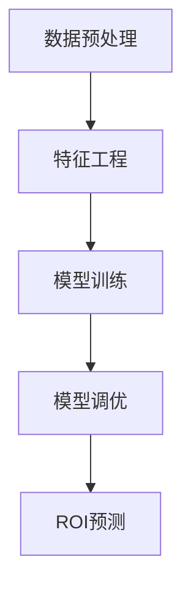
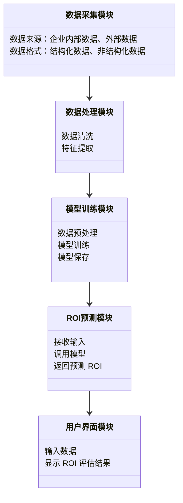

                 


# AI驱动的企业创新ROI评估：量化创新投资回报

> 关键词：AI驱动，创新ROI，投资回报，企业创新，量化评估

> 摘要：本文深入探讨AI在企业创新投资回报评估中的应用，通过分析创新与AI的结合点，构建数据驱动的决策模型，提供创新 ROI 的量化方法和系统架构设计，结合实际案例，为企业的创新投资决策提供科学依据。

---

# 第一部分：AI驱动的企业创新ROI评估背景与概念

## 第1章：AI驱动的企业创新ROI评估概述

### 1.1 问题背景与描述
#### 1.1.1 企业创新投资回报的重要性
企业在创新方面的投资（如研发投入、新产品开发等）对企业长期发展至关重要。然而，如何量化这些投资的回报率（ROI）一直是企业管理层面临的难题。传统的 ROI 计算方法通常基于财务数据，但难以全面反映创新活动的多维度价值。

#### 1.1.2 创新 ROI 评估的核心问题
- 创新投资的周期长、不确定性高，传统 ROI 计算方法难以准确反映创新活动的实际价值。
- 创新活动涉及多个部门和团队，数据分散且难以整合。
- 如何将创新活动与企业的整体绩效（如营收增长、市场份额等）建立动态关联。

#### 1.1.3 AI驱动创新 ROI 评估的解决思路
通过AI技术，可以实时收集、分析和预测创新活动的多维度数据，建立动态的 ROI 评估模型，为企业提供更科学的投资决策依据。

### 1.2 创新 ROI 评估的核心概念
#### 1.2.1 创新投资的定义与范围
创新投资包括企业在技术研发、产品开发、市场拓展、知识产权保护等多个方面的投入。

#### 1.2.2 投资回报的量化方法
创新 ROI = （净收益 / 投资成本）× 100%
其中，净收益 = 实际收益 - 投资成本

#### 1.2.3 创新与AI的结合点
- AI技术可以帮助企业更高效地收集、处理和分析创新相关的数据。
- 通过机器学习算法，可以预测创新项目未来的收益潜力。
- AI还可以优化创新资源配置，提高创新 ROI。

### 1.3 AI在创新 ROI 评估中的作用
#### 1.3.1 数据驱动的决策支持
AI可以整合企业内外部数据，建立统一的创新数据平台，为 ROI 评估提供基础。

#### 1.3.2 智能预测与优化
通过机器学习模型，AI可以预测创新项目的潜在收益，并优化资源配置。

#### 1.3.3 提高评估效率与准确性
AI技术可以自动化处理大量数据，减少人为误差，提高 ROI 评估的效率和准确性。

### 1.4 本章小结
本章通过分析企业创新投资回报的重要性，提出了AI驱动创新 ROI 评估的核心概念，并探讨了AI在其中的关键作用。

---

# 第二部分：创新 ROI 评估的核心概念与联系

## 第2章：创新 ROI 评估的基本原理

### 2.1 创新 ROI 的核心要素
#### 2.1.1 投资的构成与分类
- 投资构成：包括研发成本、人员成本、设备采购等。
- 投资分类：按时间、部门、项目分类。

#### 2.1.2 收益的来源与类型
- 收益来源：包括直接收益（如销售收入）和间接收益（如品牌价值提升）。
- 收益类型：分为财务收益和非财务收益。

#### 2.1.3 时间价值与风险因素
创新项目的时间价值和风险需要在 ROI 评估中予以考虑。

### 2.2 AI驱动评估的关键技术
#### 2.2.1 数据采集与清洗
- 数据来源：企业内部数据（如财务数据、项目文档）、外部数据（如市场数据）。
- 数据清洗：去除噪声数据，确保数据质量。

#### 2.2.2 特征提取与选择
- 特征提取：从数据中提取有助于 ROI 评估的特征。
- 特征选择：通过特征重要性分析，选择对 ROI 影响最大的特征。

#### 2.2.3 模型训练与优化
- 模型选择：如线性回归、随机森林、神经网络等。
- 模型优化：通过交叉验证调整模型参数，提高预测精度。

### 2.3 创新 ROI 评估的数学模型
#### 2.3.1 基本公式与计算方法
$$ ROI = \frac{净收益}{投资成本} \times 100\% $$

#### 2.3.2 复杂场景下的扩展模型
- 考虑时间价值的 ROI 计算：
$$ ROI_{时间价值} = \frac{净现值}{初始投资} \times 100\% $$

- 考虑风险的 ROI 计算：
$$ ROI_{风险调整} = ROI_{基础} \times (1 - 风险系数) $$

### 2.4 本章小结
本章从基本原理出发，详细讲解了创新 ROI 评估的核心要素和AI驱动评估的关键技术，并通过数学公式展示了如何将这些要素结合起来进行评估。

---

# 第三部分：创新 ROI 评估的核心概念对比与ER图

## 第3章：创新 ROI 评估的核心概念对比与ER图

### 3.1 创新与AI的属性对比
#### 3.1.1 创新投入的属性分析
- 属性：金额、时间、部门、项目阶段等。

#### 3.1.2 AI技术的属性分析
- 属性：数据来源、算法类型、模型参数等。

#### 3.1.3 两者属性的对比分析
- 数据需求：创新投入需要结构化数据，AI需要多维数据。
- 处理方式：创新投入依赖财务分析，AI依赖算法预测。

### 3.2 创新 ROI 评估的ER实体关系图
```mermaid
er
    entity 创新项目 {
        id: int
        名称: string
        投资金额: float
        预期收益: float
        实际收益: float
        项目阶段: string
        项目负责人: string
        投资时间: date
    }
    
    entity AI模型 {
        id: int
        模型名称: string
        算法类型: string
        训练数据来源: string
        模型参数: string
        预测结果: float
    }
    
    entity ROI评估 {
        id: int
        项目ID: int
        模型ID: int
        ROI值: float
        评估时间: date
    }
    
    relationship 创新项目 - ROI评估: 1:n
    relationship AI模型 - ROI评估: 1:n
```

### 3.3 本章小结
本章通过对比分析创新与AI的属性，并构建了ER实体关系图，展示了创新 ROI 评估的核心概念及其关联关系。

---

# 第四部分：创新 ROI 评估的算法原理

## 第4章：创新 ROI 评估的算法原理

### 4.1 算法概述
创新 ROI 评估的核心算法包括数据预处理、特征工程、模型训练和调优。

### 4.2 算法流程


### 4.3 数据预处理
```python
import pandas as pd
import numpy as np

# 加载数据
data = pd.read_csv('innovation_projects.csv')

# 删除缺失值
data.dropna(inplace=True)

# 标准化处理
from sklearn.preprocessing import StandardScaler
scaler = StandardScaler()
data[['投资金额', '预期收益']] = scaler.fit_transform(data[['投资金额', '预期收益']])
```

### 4.4 特征工程
```python
from sklearn.feature_selection import SelectKBest
from sklearn.feature_selection import chi2

# 选择最重要的特征
selector = SelectKBest(score_func=chi2, k=3)
selected_features = selector.fit_transform(data, target)
```

### 4.5 模型训练与优化
```python
from sklearn.model_selection import GridSearchCV
from sklearn.ensemble import RandomForestRegressor

# 定义参数搜索空间
param_grid = {
    'n_estimators': [100, 200],
    'max_depth': [None, 10, 20],
    'min_samples_split': [2, 5, 10]
}

# 网格搜索优化模型
grid_search = GridSearchCV(RandomForestRegressor(), param_grid, cv=5)
grid_search.fit(X_train, y_train)

# 最优模型
best_model = grid_search.best_estimator_
```

### 4.6 本章小结
本章详细讲解了创新 ROI 评估的算法原理，包括数据预处理、特征工程、模型训练与优化的全过程，并通过代码示例展示了如何实现这些步骤。

---

# 第五部分：创新 ROI 评估的系统分析与架构设计

## 第5章：系统分析与架构设计

### 5.1 问题场景介绍
企业需要一个AI驱动的创新 ROI 评估系统，支持实时数据采集、模型训练和预测、以及可视化展示。

### 5.2 系统功能设计


### 5.3 系统架构设计
```mermaid
archi
    数据源 --> 数据采集模块
    数据采集模块 --> 数据处理模块
    数据处理模块 --> 模型训练模块
    模型训练模块 --> ROI预测模块
    ROI预测模块 --> 用户界面模块
    用户界面模块 --> 数据可视化模块
```

### 5.4 系统接口设计
- 数据接口：提供REST API，供其他系统调用。
- 用户接口：提供可视化界面，供用户输入数据和查看结果。

### 5.5 系统交互设计
```mermaid
sequenceDiagram
    用户 -> 数据采集模块: 提供数据
    数据采集模块 -> 数据处理模块: 请求处理数据
    数据处理模块 -> 模型训练模块: 请求训练模型
    模型训练模块 -> ROI预测模块: 请求预测 ROI
    ROI预测模块 -> 用户界面模块: 返回 ROI 结果
    用户 <- 用户界面模块: 查看 ROI 评估结果
```

### 5.6 本章小结
本章通过系统分析与架构设计，展示了如何构建一个AI驱动的创新 ROI 评估系统，并详细描述了系统各模块的功能和交互关系。

---

# 第六部分：创新 ROI 评估的项目实战

## 第6章：项目实战

### 6.1 环境安装与配置
```bash
# 安装所需库
pip install pandas numpy scikit-learn matplotlib
```

### 6.2 核心代码实现
```python
import pandas as pd
from sklearn.ensemble import RandomForestRegressor
from sklearn.metrics import mean_absolute_error

# 加载数据
data = pd.read_csv('innovation_projects.csv')

# 数据分割
X = data.drop('实际收益', axis=1)
y = data['实际收益']

# 训练模型
model = RandomForestRegressor(n_estimators=200, max_depth=10, min_samples_split=2)
model.fit(X, y)

# 预测 ROI
predicted_returns = model.predict(X)

# 评估模型
mae = mean_absolute_error(y, predicted_returns)
print(f"模型平均绝对误差：{mae}")
```

### 6.3 实际案例分析
假设某企业投资100万元开发新产品，预测 ROI 为150%，则净收益为150 - 100 = 50万元，投资回报率为50%。

### 6.4 项目小结
本章通过实际案例，展示了如何在企业中应用AI驱动的创新 ROI 评估方法，并通过代码实现和案例分析，帮助读者更好地理解和应用这些方法。

---

# 第七部分：创新 ROI 评估的最佳实践与总结

## 第7章：最佳实践与总结

### 7.1 最佳实践
- 数据是关键：确保数据的完整性和准确性。
- 模型选择：根据具体场景选择合适的算法。
- 持续优化：定期更新模型和数据，保持 ROI 评估的准确性。

### 7.2 小结
本文详细探讨了AI驱动的企业创新 ROI 评估的方法，从背景、核心概念、算法原理到系统设计和项目实战，为企业的创新投资决策提供了科学依据。

### 7.3 注意事项
- ROI 评估需要结合企业实际情况，避免过于依赖模型。
- 数据隐私和安全问题需要高度重视。

### 7.4 拓展阅读
- 推荐阅读《数据驱动的决策》和《机器学习实战》等书籍，深入了解数据处理和模型优化的方法。

---

# 结语
AI驱动的企业创新 ROI 评估是一个复杂但极具价值的领域，通过本文的探讨，希望读者能够更好地理解如何利用AI技术优化企业的创新投资决策，实现更高的投资回报。

