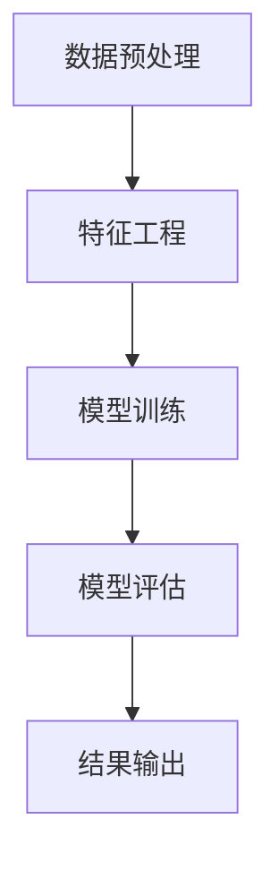
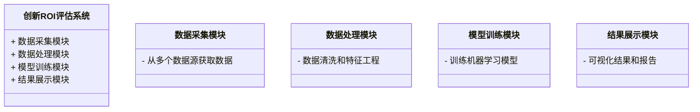

                 


# AI驱动的企业创新ROI评估：量化创新投资回报的多维度模型

## 关键词：AI驱动，ROI评估，创新投资，多维度模型，企业创新，数据驱动

## 摘要：本文探讨如何利用AI技术构建多维度模型，量化企业创新投资的回报率。通过分析创新ROI的核心概念、算法原理和系统架构，提供实际案例和最佳实践，帮助企业优化创新投资决策。

---

# 第1章: 问题背景与问题描述

## 1.1 问题背景

### 1.1.1 企业创新投资的重要性
在快速变化的商业环境中，创新是企业保持竞争力的关键。企业每年投入大量资源用于研发、产品开发和市场扩展，但如何量化这些投资的回报率（ROI）一直是企业管理层关注的核心问题。

### 1.1.2 创新 ROI 评估的挑战
传统的ROI评估方法主要依赖于财务指标，难以全面反映创新活动的多维度影响。创新项目通常涉及复杂的技术、市场和组织因素，这些因素难以量化，导致传统方法在评估创新ROI时存在局限性。

### 1.1.3 AI技术在 ROI 评估中的应用潜力
AI技术可以通过分析大量数据，提取隐藏的模式和关系，提供更精准的ROI评估。AI能够处理非结构化数据，如文本、图像和语音，从而更全面地评估创新项目的潜在影响。

## 1.2 问题描述

### 1.2.1 传统 ROI 评估的局限性
传统的ROI评估方法主要关注财务回报，忽视了创新项目在市场、技术、组织和战略层面的影响。这种方法难以捕捉创新项目的长期价值和潜在风险。

### 1.2.2 AI驱动 ROI 评估的核心问题
AI驱动的ROI评估需要解决数据整合、模型构建和结果解释等问题。如何将多维度数据转化为可量化的指标，是AI驱动ROI评估的核心挑战。

### 1.2.3 问题边界与外延
AI驱动的ROI评估应关注创新项目从构思到实施的全过程，包括资源分配、项目进度和市场反馈。评估模型需要考虑外部市场变化和内部组织调整的影响。

## 1.3 问题解决与核心要素

### 1.3.1 创新 ROI 评估的多维度模型构建
AI驱动的模型需要整合财务、市场、技术和组织等多个维度的数据，构建全面的评估框架。模型应能够预测创新项目的潜在收益和风险。

### 1.3.2 核心要素与关系分析
- **数据源**：包括财务数据、市场数据、技术数据和组织数据。
- **模型构建**：使用机器学习算法，构建预测模型。
- **结果解释**：通过可视化和案例分析，解释模型输出。

### 1.3.3 模型的输入、处理与输出
- **输入**：多维度数据，包括项目投资、团队能力、市场潜力等。
- **处理**：数据预处理、特征提取、模型训练。
- **输出**：ROI预测值、风险评估、改进建议。

---

# 第2章: 核心概念与联系

## 2.1 AI驱动 ROI 评估的核心原理

### 2.1.1 数据驱动的 ROI 评估框架
AI驱动的ROI评估基于数据驱动的方法，利用机器学习算法分析多维度数据，构建预测模型。

### 2.1.2 多维度模型的构建逻辑
模型需要整合财务、市场、技术和组织等多个维度的数据，构建全面的评估框架。

### 2.1.3 模型的可解释性与实用性
模型需要具备可解释性，以便企业能够理解和应用评估结果。同时，模型应具备实用性，能够在实际场景中应用。

## 2.2 核心概念对比分析

### 2.2.1 核心概念属性对比
| 属性       | 传统ROI评估       | AI驱动 ROI评估       |
|------------|------------------|---------------------|
| 数据来源     | 财务数据           | 多维度数据（财务、市场、技术、组织） |
| 方法论       | 财务指标分析       | 机器学习、数据挖掘   |
| 模型复杂度   | 简单线性模型       | 复杂非线性模型       |
| 可扩展性     | 有限             | 高                  |
| 可解释性     | 高               | 中等，依赖算法特性   |

### 2.2.2 ER实体关系图
```mermaid
erd
  title 创新ROI评估模型实体关系图
  R1 .项目投资
  R2 .市场潜力
  R3 .技术可行性
  R4 .组织能力
  R5 .预测ROI
  R1 --> R2 .影响
  R1 --> R3 .影响
  R1 --> R4 .影响
  R2 --> R5 .影响
  R3 --> R5 .影响
  R4 --> R5 .影响
```

---

# 第3章: 算法原理讲解

## 3.1 数据预处理

### 3.1.1 数据清洗
- 处理缺失值、异常值和重复数据。
- 示例代码：
  ```python
  import pandas as pd
  df = pd.read_csv('data.csv')
  df.dropna(inplace=True)
  ```

### 3.1.2 特征工程
- 数据标准化、特征选择和降维。
- 示例代码：
  ```python
  from sklearn.preprocessing import StandardScaler
  scaler = StandardScaler()
  df_scaled = scaler.fit_transform(df[['feature1', 'feature2']])
  ```

## 3.2 模型训练

### 3.2.1 机器学习算法选择
- 使用回归算法预测ROI。
- 示例代码：
  ```python
  from sklearn.linear_model import LinearRegression
  model = LinearRegression()
  model.fit(df_scaled, target)
  ```

### 3.2.2 模型评估
- 使用均方误差（MSE）和R²系数评估模型性能。
- 示例代码：
  ```python
  from sklearn.metrics import mean_squared_error, r2_score
  predictions = model.predict(new_data)
  mse = mean_squared_error(y_true, predictions)
  r2 = r2_score(y_true, predictions)
  ```

## 3.3 算法流程图


---

# 第4章: 数学模型与公式

## 4.1 线性回归模型
- 模型公式：
  $$ y = \beta_0 + \beta_1x_1 + \beta_2x_2 + ... + \beta_nx_n + \epsilon $$
- 示例：
  $$ ROI = \beta_0 + \beta_1 \times 投资 + \beta_2 \times 市场潜力 + \epsilon $$

## 4.2 机器学习模型
- 使用随机森林回归：
  ```python
  from sklearn.ensemble import RandomForestRegressor
  model = RandomForestRegressor(n_estimators=100)
  model.fit(X_train, y_train)
  ```

---

# 第5章: 系统分析与架构设计方案

## 5.1 项目介绍
- 项目目标：构建AI驱动的ROI评估系统。
- 项目范围：涵盖数据采集、模型构建和结果展示。

## 5.2 功能设计


## 5.3 系统架构设计


---

# 第6章: 项目实战

## 6.1 环境安装
- 安装Python、机器学习库（如scikit-learn、xgboost）和数据处理工具（如Pandas）。

## 6.2 核心代码实现

### 6.2.1 数据预处理
```python
import pandas as pd
from sklearn.preprocessing import StandardScaler

# 加载数据
df = pd.read_csv('innovation_data.csv')

# 数据清洗
df.dropna(inplace=True)

# 特征工程
features = df[['investment', 'market_potential', 'tech_feasibility', 'org_capability']]
target = df['roi']

# 数据标准化
scaler = StandardScaler()
features_scaled = scaler.fit_transform(features)
```

### 6.2.2 模型训练
```python
from sklearn.linear_model import LinearRegression
from sklearn.metrics import mean_squared_error, r2_score

# 训练模型
model = LinearRegression()
model.fit(features_scaled, target)

# 预测 ROI
new_data = ...  # 新数据
new_data_scaled = scaler.transform(new_data)
predictions = model.predict(new_data_scaled)

# 评估模型
mse = mean_squared_error(target, predictions)
r2 = r2_score(target, predictions)
```

## 6.3 案例分析
- 使用实际数据进行模型训练和预测，分析预测结果与实际ROI的差异，优化模型参数。

---

# 第7章: 最佳实践与注意事项

## 7.1 最佳实践
- 数据质量是模型性能的关键，确保数据清洗和特征工程的准确性。
- 使用交叉验证评估模型性能，避免过拟合。
- 结果解释是模型应用的重要部分，确保决策者能够理解模型输出。

## 7.2 小结
AI驱动的企业创新ROI评估为企业提供了更全面、精准的评估方法，帮助企业优化创新投资决策。

## 7.3 注意事项
- 数据隐私和安全问题需要严格控制。
- 模型的可解释性是实际应用的关键，复杂模型可能难以被管理层接受。
- 持续监控和更新模型，以适应市场变化和技术进步。

---

# 结语

通过构建AI驱动的创新ROI评估模型，企业能够更全面地评估创新项目的潜在回报，优化资源配置，提升创新能力。未来，随着AI技术的不断发展，创新ROI评估将更加智能化和精准化，为企业创造更大的价值。

---

# 参考文献
- [1] Hastie T, Tibshirani R, Friedman J. The Elements of Statistical Learning[M]. Springer, 2009.
- [2] 周志华. 机器学习[M]. 清华大学出版社, 2016.

---

希望这篇文章能满足您的需求，如果需要进一步调整或补充，请随时告知。

