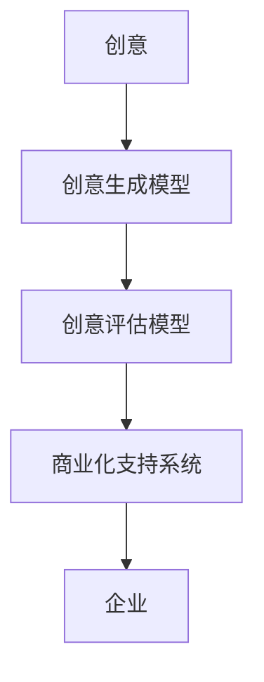
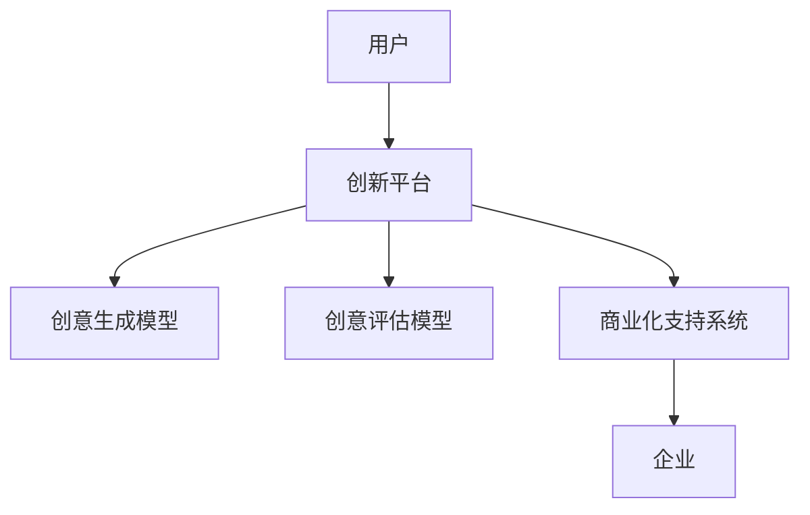

                 


# AI驱动的企业创新孵化器：从创意到商业化

## 关键词：人工智能，企业创新，孵化器，创意商业化，技术驱动

## 摘要：本文探讨了AI如何驱动企业创新孵化器的发展，从创意的生成到商业化的实现，详细分析了AI技术的应用场景、算法原理和系统架构，并通过实际案例展示了AI在企业创新中的巨大潜力。文章结构清晰，内容丰富，旨在为企业的创新提供新的思路和技术支持。

---

# 第一部分：AI驱动的企业创新孵化器概述

## 第1章：AI驱动的企业创新孵化器背景

### 1.1 企业创新的现状与挑战
企业在传统创新模式中常常面临效率低、资源浪费和风险高等问题。传统创新模式依赖于人工经验和试错，效率低下且成本高昂。此外，企业创新过程中缺乏系统性支持，导致许多创意难以从概念阶段过渡到实际应用。

AI技术的出现为企业创新提供了新的可能性。通过AI驱动的创新孵化器，企业可以实现创意的自动化生成、评估和商业化支持，从而提高创新效率，降低创新成本。

### 1.2 AI驱动的创新孵化器的核心概念
AI驱动的创新孵化器是一种利用人工智能技术，从创意生成到商业化全过程提供支持的创新模式。与传统孵化器相比，AI孵化器更加智能化、数据化和自动化，能够实时分析市场趋势、用户需求和技术创新方向，从而为企业提供更精准的创新支持。

### 1.3 本书的核心目标与结构
本书旨在探讨AI如何赋能企业创新孵化器，从创意到商业化的过程。内容涵盖AI在创意生成、评估和商业化中的应用，分析其算法原理、系统架构，并通过实际案例展示其在企业创新中的价值。

---

## 第2章：AI驱动的企业创新孵化器的核心要素

### 2.1 创新过程的阶段划分
创新过程可以分为三个主要阶段：
1. **创意生成阶段**：通过AI模型生成创意，识别潜在的创新方向。
2. **创意评估阶段**：利用AI算法对创意进行评估，筛选出可行的方案。
3. **商业化阶段**：借助AI系统支持创意的商业化，包括市场预测、产品设计和运营优化。

### 2.2 AI在创新过程中的作用
1. **创意生成**：生成式AI（如大语言模型）可以自动生成创意，帮助企业在短时间内生成大量创新想法。
2. **创意评估**：AI算法能够快速分析创意的可行性和市场潜力，减少人工评估的时间和成本。
3. **商业化支持**：AI系统可以预测市场趋势、优化产品设计，并提供运营建议，降低商业化风险。

### 2.3 核心要素分析
1. **数据驱动的创新**：AI孵化器依赖于高质量的数据，包括市场数据、用户数据和行业数据，以支持创新过程。
2. **知识图谱构建**：通过构建知识图谱，AI能够快速关联不同领域的知识，发现创新机会。
3. **自动化决策支持**：AI系统能够实时分析数据，为创新过程中的决策提供支持。

---

## 第3章：AI驱动的创新孵化器核心概念原理

### 3.1 核心概念原理
1. **创意生成的AI模型原理**：生成式AI模型通过深度学习算法生成创意，例如使用Transformer模型进行文本生成。
2. **创意评估的AI算法**：基于监督学习的模型评估创意的可行性和市场潜力。
3. **商业化支持的系统架构**：通过AI系统对市场趋势、用户需求进行实时分析，支持创意的商业化。

### 3.2 核心概念属性特征对比表
| 特性 | 创意生成 | 创意评估 | 商业化支持 |
|------|----------|----------|------------|
| 输入 | 创意种子 | 创意方案 | 创意产品   |
| 输出 | 创意列表 | 评估结果 | 商业化建议  |
| 方法 | 生成式AI | 监督学习 | 统计学习    |

### 3.3 ER实体关系图


---

## 第4章：AI驱动的创新孵化器算法原理

### 4.1 创意生成的AI模型
1. **生成式AI模型介绍**：生成式AI模型（如GPT系列）通过大量数据训练，能够生成与人类类似的文本内容。
2. **大模型生成创意的流程**：
   - 输入创意种子（如关键词或短语）。
   - 模型生成多个创意选项。
   - 人工或AI筛选出最佳创意。
3. **创意生成的数学模型**：
   - 使用Transformer架构进行文本生成。
   - 模型目标函数：$L = \text{交叉熵损失}$。

### 4.2 创意评估的AI算法
1. **评估指标的设计**：包括创新性、可行性、市场潜力等。
2. **评估算法的实现**：使用监督学习模型对创意进行分类，输出评估结果。
3. **评估结果的优化**：通过反馈机制不断优化模型。

### 4.3 商业化支持的系统算法
1. **商业化预测模型**：基于历史数据预测创意的市场表现。
2. **市场趋势分析算法**：利用自然语言处理技术分析市场报告和用户评论。
3. **自动化决策支持算法**：通过强化学习优化产品设计和运营策略。

---

## 第5章：创新孵化器系统架构设计

### 5.1 系统功能设计
1. **创意生成模块**：提供创意生成工具，支持多种输入形式。
2. **创意评估模块**：对生成的创意进行自动化评估，输出评估报告。
3. **商业化支持模块**：提供市场分析、产品设计和运营支持。

### 5.2 系统架构设计


### 5.3 系统接口设计
1. **用户接口**：提供直观的界面供用户输入创意种子和查看评估结果。
2. **系统接口**：通过API连接第三方数据源和AI模型。

---

## 第6章：项目实战

### 6.1 环境安装
1. 安装Python和相关库（如TensorFlow、PyTorch）。
2. 下载AI模型（如GPT-3）。

### 6.2 核心代码实现
```python
def generate_creative(seed):
    model = load_model("creative_generator")
    return model.generate(seed)

def evaluate_creative(creative):
    model = load_model("creative_assessor")
    return model.predict(creative)
```

### 6.3 案例分析
通过一个实际案例展示AI孵化器从创意生成到商业化的过程，分析每一步的实现细节和优化策略。

---

## 第7章：最佳实践与未来展望

### 7.1 技术选型
选择适合企业需求的AI模型和工具，确保系统的可扩展性和灵活性。

### 7.2 数据安全
确保数据的隐私和安全，遵守相关法律法规。

### 7.3 团队协作
建立跨学科团队，充分发挥AI技术的优势。

### 7.4 未来展望
随着AI技术的不断进步，企业创新孵化器将更加智能化和自动化，为企业创新提供更强大的支持。

---

## 结语
AI驱动的企业创新孵化器正在改变企业的创新模式，从创意到商业化的过程变得更加高效和精准。通过本文的分析，读者可以深入了解AI在创新过程中的应用，并为企业创新提供新的思路和技术支持。

