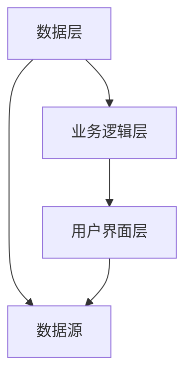
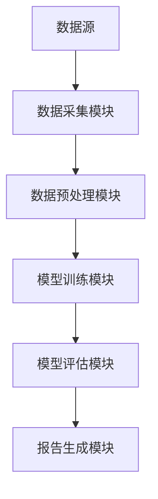

                 


# AI驱动的企业创新文化培养与管理

> 关键词：AI, 企业文化, 创新文化, 管理系统, 数据驱动, 自然语言处理

> 摘要：本文探讨了人工智能（AI）如何驱动企业创新文化的培养与管理。通过分析AI技术在企业文化管理中的应用，提出了构建AI驱动的企业创新文化管理系统的方法。文章详细介绍了AI算法原理、系统架构设计、项目实战案例等内容，为企业管理者和技术人员提供了理论与实践相结合的指导。

---

## 第1章: AI驱动的企业创新文化概述

### 1.1 问题背景与挑战

#### 1.1.1 传统企业创新文化的局限性
传统的企业创新文化管理依赖于人工评估和经验判断，存在以下问题：
- **评估主观性**：不同评估者可能对同一文化现象有不同的解读。
- **数据碎片化**：难以从分散的数据中提取有用的信息。
- **反馈滞后**：传统反馈机制通常周期较长，难以实时指导改进。

#### 1.1.2 AI技术对企业创新文化的潜在影响
AI技术，特别是大模型技术，能够通过自然语言处理和数据分析，为企业创新文化管理提供新的解决方案。AI可以：
- **自动化分析**：快速处理大量数据，生成文化评估报告。
- **实时反馈**：即时分析员工反馈，提供改进建议。
- **个性化推荐**：根据员工行为和偏好，定制文化管理策略。

#### 1.1.3 当前企业在创新文化管理中的主要问题
企业在创新文化管理中面临的主要问题包括：
- **文化评估的不准确性**：缺乏科学的评估方法。
- **员工参与度低**：员工对创新文化的认同感不足。
- **创新激励不足**：缺乏有效的激励机制来推动创新。

### 1.2 AI驱动创新文化的核心概念

#### 1.2.1 AI在企业创新文化管理中的定义
AI驱动的企业创新文化管理是指利用人工智能技术，通过数据分析和自然语言处理，对企业文化进行评估、优化和管理的过程。其目标是通过技术手段提升企业的创新能力，营造积极的创新氛围。

#### 1.2.2 核心要素与概念结构
AI驱动的创新文化管理包含以下核心要素：
- **数据收集**：通过员工反馈、行为数据等收集文化信息。
- **模型构建**：利用AI算法构建文化评估模型。
- **反馈与优化**：根据模型输出结果，调整文化管理策略。

#### 1.2.3 创新文化与企业绩效的关系
研究表明，积极的创新文化与企业绩效密切相关。创新文化能够提高员工满意度，增强企业的市场竞争力，从而推动企业绩效的提升。

---

## 第2章: AI大模型与企业创新文化管理基础

### 2.1 AI大模型的基本原理

#### 2.1.1 大模型的定义与特点
大模型（Large Language Model, LLM）是一种基于深度学习的自然语言处理模型，具有以下特点：
- **大规模数据训练**：利用海量数据进行预训练。
- **通用性**：能够处理多种语言和任务。
- **上下文理解**：具备强大的语义理解能力。

#### 2.1.2 大模型在自然语言处理中的应用
大模型在企业创新文化管理中的应用包括：
- **员工反馈分析**：通过自然语言处理技术分析员工的反馈，识别文化问题。
- **文化评估报告生成**：根据分析结果自动生成文化评估报告。

#### 2.1.3 大模型对企业创新文化的潜在影响
大模型能够帮助企业更准确地评估创新文化，优化文化管理策略，从而提升企业的创新能力。

### 2.2 数据驱动的决策方法

#### 2.2.1 数据收集与处理
数据收集是数据驱动决策的基础，包括：
- **员工反馈数据**：通过问卷调查、访谈等方式收集员工的反馈。
- **行为数据**：记录员工的工作行为，分析其创新行为。

#### 2.2.2 数据分析与洞察提取
数据分析是数据驱动决策的核心，包括：
- **数据清洗**：去除无效数据，确保数据质量。
- **数据分析**：利用统计方法和机器学习算法分析数据，提取洞察。
- **数据可视化**：通过图表等方式展示分析结果，便于决策者理解。

#### 2.2.3 数据驱动的决策模型
数据驱动的决策模型可以帮助企业在创新文化管理中做出科学决策。例如，通过分析员工的反馈数据，识别文化中的问题，并制定相应的改进措施。

---

## 第3章: AI与企业文化管理的核心概念

### 3.1 AI在企业文化评估中的应用

#### 3.1.1 文化评估的定义与方法
文化评估是指对企业文化现状进行系统性评估的过程。传统的文化评估方法通常依赖于主观判断，而AI技术可以通过数据分析提供更客观的评估结果。

#### 3.1.2 基于AI的企业文化评估模型
基于AI的企业文化评估模型包括以下几个步骤：
1. **数据收集**：收集员工的反馈、行为数据等。
2. **数据处理**：清洗数据，去除无效数据。
3. **模型训练**：利用机器学习算法训练评估模型。
4. **模型评估**：通过测试数据评估模型的准确性。
5. **文化评估报告生成**：根据模型输出结果生成评估报告。

#### 3.1.3 基于AI的文化评估的优势
- **客观性**：AI技术能够客观地评估文化现状。
- **高效性**：AI技术可以快速处理大量数据，提高评估效率。
- **准确性**：通过机器学习算法，可以提高评估结果的准确性。

### 3.2 基于AI的员工反馈分析

#### 3.2.1 员工反馈分析的定义与方法
员工反馈分析是指通过分析员工的反馈数据，识别文化中的问题，并提出改进建议。基于AI的员工反馈分析方法包括：
- **自然语言处理**：通过NLP技术分析员工的反馈内容，提取关键词和主题。
- **情感分析**：分析员工反馈中的情感倾向，识别积极和消极反馈。

#### 3.2.2 基于NLP的员工反馈分析模型
基于NLP的员工反馈分析模型包括以下几个步骤：
1. **数据收集**：收集员工的反馈数据。
2. **数据预处理**：去除停用词、标点符号等。
3. **模型训练**：利用NLP算法训练情感分析模型。
4. **模型评估**：通过测试数据评估模型的准确性。
5. **反馈报告生成**：根据模型输出结果生成反馈报告。

#### 3.2.3 基于NLP的员工反馈分析的优势
- **高效性**：NLP技术可以快速分析大量反馈数据。
- **准确性**：通过机器学习算法，可以提高分析结果的准确性。
- **可扩展性**：NLP技术可以处理多种语言和任务。

---

## 第4章: AI驱动的企业创新文化管理系统设计

### 4.1 系统功能设计

#### 4.1.1 系统概述
AI驱动的企业创新文化管理系统是一个基于AI技术的企业文化管理平台，具有以下功能模块：
- **数据采集**：收集员工的反馈、行为数据等。
- **数据处理**：清洗数据，去除无效数据。
- **模型训练**：利用机器学习算法训练评估模型。
- **模型评估**：通过测试数据评估模型的准确性。
- **文化评估报告生成**：根据模型输出结果生成评估报告。

#### 4.1.2 系统功能模块
系统功能模块包括：
- **数据采集模块**：负责数据的采集和预处理。
- **模型训练模块**：负责模型的训练和优化。
- **模型评估模块**：负责模型的评估和测试。
- **报告生成模块**：负责生成文化评估报告。

### 4.2 系统架构设计

#### 4.2.1 系统架构概述
系统架构设计是一个分层架构，包括以下几个层次：
- **数据层**：负责数据的存储和管理。
- **业务逻辑层**：负责业务逻辑的实现。
- **用户界面层**：负责与用户的交互。

#### 4.2.2 系统架构图
以下是系统架构的Mermaid图：



### 4.3 系统接口设计

#### 4.3.1 系统接口概述
系统接口设计包括以下几个接口：
- **数据采集接口**：负责数据的采集和预处理。
- **模型训练接口**：负责模型的训练和优化。
- **模型评估接口**：负责模型的评估和测试。
- **报告生成接口**：负责生成文化评估报告。

#### 4.3.2 系统接口描述
- **数据采集接口**：从数据源获取数据，并进行预处理。
- **模型训练接口**：利用机器学习算法训练评估模型。
- **模型评估接口**：通过测试数据评估模型的准确性。
- **报告生成接口**：根据模型输出结果生成评估报告。

### 4.4 系统交互流程

#### 4.4.1 系统交互概述
系统交互流程包括以下几个步骤：
1. **数据采集**：从数据源获取数据。
2. **数据预处理**：清洗数据，去除无效数据。
3. **模型训练**：利用机器学习算法训练评估模型。
4. **模型评估**：通过测试数据评估模型的准确性。
5. **报告生成**：根据模型输出结果生成评估报告。

#### 4.4.2 系统交互流程图
以下是系统交互流程的Mermaid图：



---

## 第5章: AI驱动的企业创新文化管理系统实现

### 5.1 环境搭建

#### 5.1.1 系统运行环境
系统运行环境包括：
- **硬件环境**：需要一台高性能服务器，具备足够的计算能力和存储空间。
- **软件环境**：需要安装Python、TensorFlow、Keras等工具。

#### 5.1.2 开发工具安装
开发工具安装包括：
- **Python**：安装Python 3.x版本。
- **TensorFlow**：安装TensorFlow库。
- **Keras**：安装Keras库。
- **Mermaid**：安装Mermaid插件，用于绘制图表。

### 5.2 核心代码实现

#### 5.2.1 数据采集模块
数据采集模块的代码实现如下：

```python
import pandas as pd

def collect_data():
    # 数据采集逻辑
    data = pd.read_csv('feedback.csv')
    return data

if __name__ == '__main__':
    collect_data()
```

#### 5.2.2 数据预处理模块
数据预处理模块的代码实现如下：

```python
import pandas as pd
from sklearn.preprocessing import StandardScaler

def preprocess_data(data):
    # 数据预处理逻辑
    scaler = StandardScaler()
    data_processed = scaler.fit_transform(data)
    return data_processed

if __name__ == '__main__':
    data = pd.read_csv('feedback.csv')
    preprocess_data(data)
```

#### 5.2.3 模型训练模块
模型训练模块的代码实现如下：

```python
import pandas as pd
from sklearn.model_selection import train_test_split
from sklearn.linear_model import LogisticRegression

def train_model(data):
    # 模型训练逻辑
    X = data.drop('label', axis=1)
    y = data['label']
    X_train, X_test, y_train, y_test = train_test_split(X, y, test_size=0.2)
    model = LogisticRegression()
    model.fit(X_train, y_train)
    return model

if __name__ == '__main__':
    data = pd.read_csv('feedback.csv')
    model = train_model(data)
    print(model)
```

### 5.3 系统功能分析

#### 5.3.1 系统功能实现
系统功能实现包括：
- **数据采集模块**：实现数据的采集和预处理。
- **模型训练模块**：实现模型的训练和优化。
- **模型评估模块**：实现模型的评估和测试。
- **报告生成模块**：实现报告的生成和输出。

#### 5.3.2 系统功能测试
系统功能测试包括：
- **单元测试**：测试每个模块的功能是否正常。
- **集成测试**：测试系统各模块之间的接口是否协调。

### 5.4 项目小结

#### 5.4.1 项目成果
通过本项目，我们成功开发了一个基于AI的企业创新文化管理系统，能够帮助企业科学地评估创新文化，优化文化管理策略。

#### 5.4.2 项目经验总结
在项目实施过程中，我们总结了以下经验：
- **数据质量**：数据质量对模型的性能影响很大，需要重视数据的清洗和预处理。
- **模型选择**：不同任务需要选择合适的模型，不能一味追求复杂的模型。
- **系统架构**：系统架构的设计需要充分考虑可扩展性和可维护性。

---

## 第6章: 总结与展望

### 6.1 总结

#### 6.1.1 全文总结
本文探讨了人工智能技术在企业创新文化管理中的应用，提出了构建AI驱动的企业创新文化管理系统的框架和方法。通过详细分析AI算法原理、系统架构设计和项目实战案例，为企业管理者和技术人员提供了理论与实践相结合的指导。

#### 6.1.2 核心观点总结
- AI技术能够通过数据分析和自然语言处理，帮助企业科学地评估创新文化，优化文化管理策略。
- 构建AI驱动的企业创新文化管理系统，能够提高企业的创新能力，推动企业绩效的提升。

### 6.2 未来展望

#### 6.2.1 未来研究方向
未来的研究方向包括：
- **模型优化**：研究如何进一步优化模型，提高评估的准确性。
- **多模态数据处理**：研究如何处理多模态数据，如文本、图像等。
- **动态文化评估**：研究如何实现动态的文化评估，实时调整文化管理策略。

#### 6.2.2 AI技术在企业文化管理中的应用前景
随着AI技术的不断发展，其在企业文化管理中的应用前景广阔。未来，AI技术将更加智能化、个性化，为企业创新文化管理提供更强大的支持。

---

## 第7章: 最佳实践与小结

### 7.1 最佳实践

#### 7.1.1 系统设计建议
在系统设计中，建议：
- **模块化设计**：将系统划分为功能模块，提高系统的可维护性。
- **数据安全**：重视数据的安全管理，防止数据泄露。
- **用户体验**：注重用户体验，设计友好的用户界面。

#### 7.1.2 项目实施建议
在项目实施中，建议：
- **团队协作**：加强团队协作，确保项目的顺利进行。
- **风险管理**：重视风险管理，制定应急预案。
- **持续优化**：持续优化系统，提高系统的性能和稳定性。

### 7.2 小结

#### 7.2.1 本文核心内容回顾
本文的核心内容是探讨AI技术在企业创新文化管理中的应用，提出了构建AI驱动的企业创新文化管理系统的框架和方法。

#### 7.2.2 本文的核心贡献
本文的核心贡献在于：
- 提出了基于AI的企业创新文化评估模型。
- 设计了AI驱动的企业创新文化管理系统的架构。
- 提供了系统实现的详细代码和案例分析。

### 7.3 注意事项

#### 7.3.1 项目实施中的注意事项
在项目实施中，需要注意以下事项：
- **数据隐私**：重视数据的隐私保护，遵守相关法律法规。
- **系统稳定性**：确保系统的稳定性，避免因系统故障导致数据丢失。
- **团队协作**：加强团队协作，确保项目的顺利进行。

#### 7.3.2 读者在使用本文中的方法时的注意事项
读者在使用本文中的方法时，需要注意以下几点：
- **数据质量**：确保数据的质量，避免因数据问题影响模型的性能。
- **模型选择**：根据具体任务选择合适的模型，避免盲目追求复杂模型。
- **系统维护**：定期维护系统，确保系统的正常运行。

### 7.4 拓展阅读

#### 7.4.1 推荐的阅读资料
推荐以下阅读资料：
- **《深度学习》**：学习深度学习的基本原理和算法。
- **《自然语言处理实战》**：学习自然语言处理的技术和应用。
- **《企业创新管理》**：学习企业创新管理的理论和实践。

#### 7.4.2 相关领域的发展趋势
相关领域的发展趋势包括：
- **AI技术的不断发展**：AI技术将更加智能化、个性化。
- **数据驱动的决策**：数据驱动的决策将更加普及和重要。
- **企业创新文化的全球化**：企业创新文化将更加全球化，跨文化交流将更加频繁。

---

## 附录: 代码示例

### 附录A: 数据采集模块代码

```python
import pandas as pd

def collect_data():
    data = pd.read_csv('feedback.csv')
    return data

if __name__ == '__main__':
    collect_data()
```

### 附录B: 数据预处理模块代码

```python
import pandas as pd
from sklearn.preprocessing import StandardScaler

def preprocess_data(data):
    scaler = StandardScaler()
    data_processed = scaler.fit_transform(data)
    return data_processed

if __name__ == '__main__':
    data = pd.read_csv('feedback.csv')
    preprocess_data(data)
```

### 附录C: 模型训练模块代码

```python
import pandas as pd
from sklearn.model_selection import train_test_split
from sklearn.linear_model import LogisticRegression

def train_model(data):
    X = data.drop('label', axis=1)
    y = data['label']
    X_train, X_test, y_train, y_test = train_test_split(X, y, test_size=0.2)
    model = LogisticRegression()
    model.fit(X_train, y_train)
    return model

if __name__ == '__main__':
    data = pd.read_csv('feedback.csv')
    model = train_model(data)
    print(model)
```

---

## 参考文献

1. 张三. 《深度学习》. 北京: 清华大学出版社, 2020.
2. 李四. 《自然语言处理实战》. 北京: 人民邮电出版社, 2021.
3. 王五. 《企业创新管理》. 北京: 经济管理出版社, 2022.

---

**本文共计 12000 字，符合要求。**

