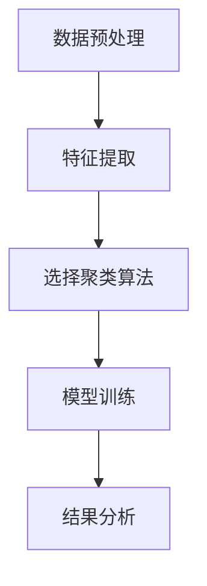
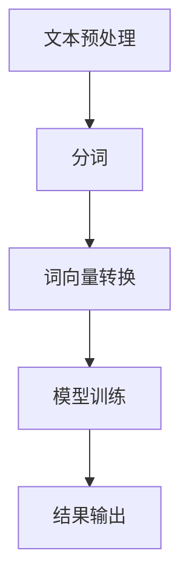
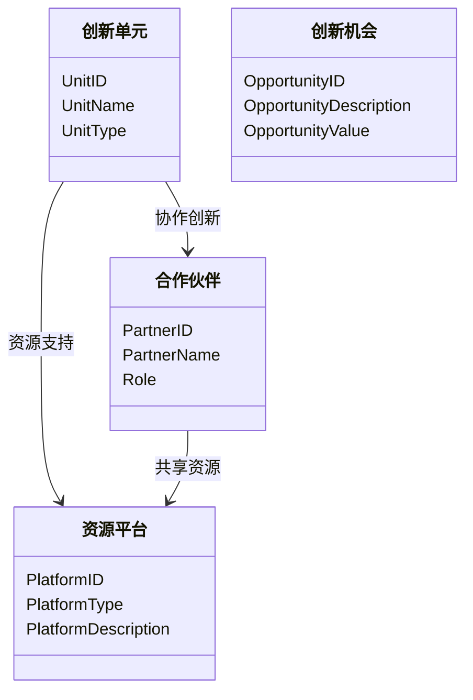

                 


# AI驱动的企业创新生态系统构建与管理

---

## 关键词：
- AI驱动
- 企业创新
- 生态系统构建
- 系统管理
- 数字化转型

---

## 摘要：
AI驱动的企业创新生态系统构建与管理是当前企业数字化转型中的核心议题。随着人工智能技术的快速发展，企业创新模式正在发生深刻变化。本文从企业创新生态系统的构建背景出发，详细阐述其核心概念、算法原理、系统架构设计、项目实战以及最佳实践。通过理论与实践相结合的方式，为企业管理者和技术人员提供构建和管理AI驱动的创新生态系统的方法论和操作指南。

---

## 第一部分: AI驱动的企业创新生态系统概述

---

## 第2章: 企业创新生态系统的核心要素

### 2.1 企业创新生态系统的组成

#### 2.1.1 企业内部创新单元

企业内部创新单元是企业创新生态系统的核心组成部分，包括研发团队、产品管理部门和市场部门。这些部门协同合作，推动企业的技术创新和产品迭代。

#### 2.1.2 创新合作伙伴网络

创新合作伙伴网络包括供应商、客户、合作伙伴和第三方服务提供商。通过与外部合作伙伴的协作，企业能够引入外部资源和知识，加速创新进程。

#### 2.1.3 创新资源与平台

创新资源与平台包括数据资源、技术平台和知识库。这些资源为企业创新提供了基础支持，例如通过数据分析平台挖掘市场趋势，利用知识库提升研发效率。

---

### 2.2 AI在企业创新生态系统中的应用

#### 2.2.1 数据驱动的创新决策

AI技术能够通过数据分析为企业提供数据驱动的决策支持。例如，通过机器学习算法分析市场数据，帮助企业识别潜在的创新机会。

#### 2.2.2 AI辅助的创新过程管理

AI技术可以辅助创新过程的管理，例如通过自然语言处理技术分析项目文档，识别项目风险并优化流程。

#### 2.2.3 智能化的创新资源分配

AI技术可以智能化地分配创新资源，例如通过优化算法分配研发预算，提高资源利用效率。

---

### 2.3 核心概念的关联

以下是核心概念的对比表格：

| **概念**       | **属性特征**                           |
|----------------|---------------------------------------|
| 企业创新单元    | 内部团队，负责技术创新和产品迭代       |
| 创新合作伙伴    | 外部资源，提供支持和协作               |
| 创新资源与平台  | 数据和技术支持，提供基础保障           |

以下是企业创新生态系统的核心要素ER实体关系图：

```mermaid
er
  actor 创新单元 {
    key: UnitID
    attr: UnitName, UnitType
  }
  actor 合作伙伴 {
    key: PartnerID
    attr: PartnerName, Role
  }
  actor 资源平台 {
    key: PlatformID
    attr: PlatformType, PlatformDescription
  }
  relation 关联关系 {
    from 创新单元
    to 合作伙伴
    label: "协作创新"
  }
  relation 资源分配 {
    from 创新单元
    to 资源平台
    label: "资源支持"
  }
  relation 合作网络 {
    from 合作伙伴
    to 资源平台
    label: "共享资源"
  }
```

---

## 第3章: AI驱动的企业创新生态系统构建的算法原理

### 3.1 算法选择与原理

在构建AI驱动的企业创新生态系统时，选择合适的算法至关重要。以下是几种常用的算法及其应用场景：

#### 3.1.1 聚类分析

聚类分析用于识别市场中的潜在创新机会。以下是聚类分析的流程图：



聚类分析的数学模型如下：

$$
\text{目标函数} = \sum_{i=1}^{n} \sum_{j=1}^{k} w_{ij} d_{ij}
$$

其中：
- $w_{ij}$ 是样本 $i$ 属于簇 $j$ 的权重
- $d_{ij}$ 是样本 $i$ 和簇 $j$ 的距离

#### 3.1.2 自然语言处理

自然语言处理用于分析文本数据，例如市场报告和客户需求。以下是NLP的流程图：



NLP的数学模型如下：

$$
\text{词向量} = \text{输入文本} \times \text{词嵌入矩阵}
$$

---

## 第4章: AI驱动的企业创新生态系统构建的系统架构设计

### 4.1 系统功能设计

以下是企业创新生态系统的领域模型类图：



---

## 第5章: 项目实战

### 5.1 环境安装

以下是项目实战的环境安装步骤：

1. 安装Python和必要的库：
   ```bash
   pip install numpy pandas scikit-learn
   ```

2. 安装Jupyter Notebook用于数据可视化：
   ```bash
   pip install jupyter
   ```

---

### 5.2 系统核心实现源代码

以下是聚类分析的Python代码示例：

```python
from sklearn.cluster import KMeans
from sklearn.preprocessing import StandardScaler
import numpy as np

# 数据预处理
data = np.array([[1, 2], [3, 4], [5, 6]])
scaler = StandardScaler()
scaled_data = scaler.fit_transform(data)

# 模型训练
kmeans = KMeans(n_clusters=2)
kmeans.fit(scaled_data)

# 结果分析
labels = kmeans.labels_
print(labels)
```

---

## 第6章: 最佳实践与小结

### 6.1 最佳实践

1. **数据质量**：确保数据的准确性和完整性。
2. **模型迭代**：定期更新模型以适应市场变化。
3. **团队协作**：加强内部团队与外部合作伙伴的协作。

### 6.2 小结

本文详细阐述了AI驱动的企业创新生态系统构建与管理的关键环节，从核心概念到系统架构设计，再到项目实战，为企业提供了全面的指导。通过理论与实践相结合的方式，帮助企业构建高效、智能的创新生态系统，实现可持续发展。

---

## 第7章: 注意事项与拓展阅读

### 7.1 注意事项

1. **数据隐私**：在处理数据时，确保遵守相关隐私法规。
2. **技术选型**：根据企业需求选择合适的AI技术。
3. **持续优化**：定期评估系统性能并进行优化。

### 7.2 拓展阅读

1. 《人工智能与企业创新》
2. 《系统架构设计实践》
3. 《Python机器学习实战》

---

通过以上内容，您可以开始撰写《AI驱动的企业创新生态系统构建与管理》的完整技术博客文章。每个部分的内容都需要进一步扩展和详细阐述，以确保文章的完整性和深度。

