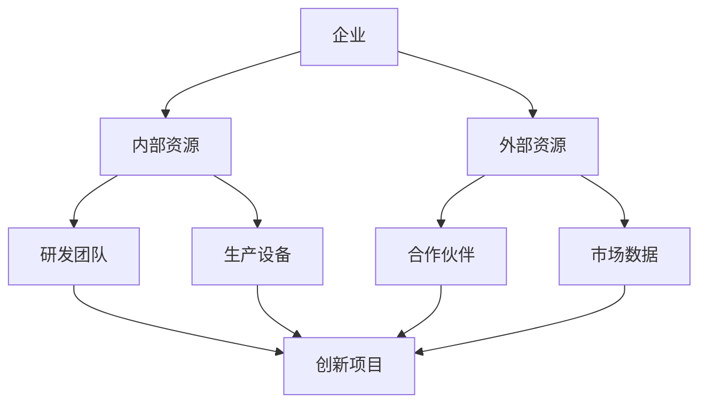
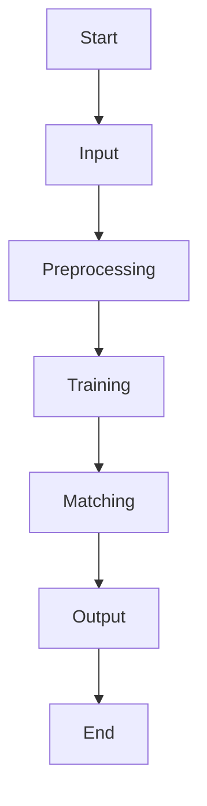
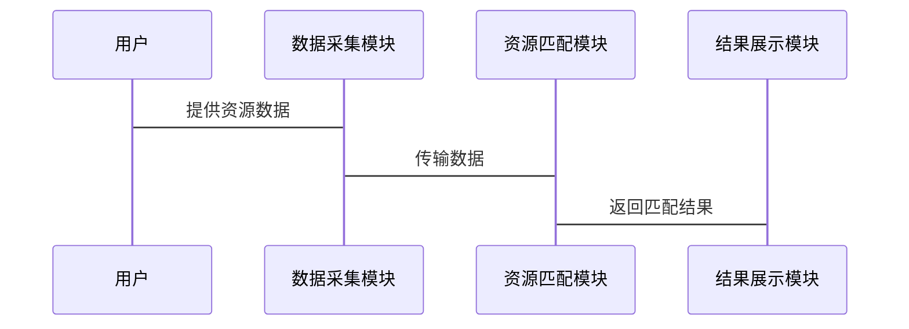

                 


# AI驱动的企业创新生态系统构建：内外部资源智能匹配

## 关键词
- AI驱动
- 企业创新
- 内外部资源
- 智能匹配
- 系统架构
- 算法原理

## 摘要
本文探讨了如何利用人工智能技术构建企业创新生态系统，实现内外部资源的智能匹配。通过分析企业创新中的资源匹配痛点，提出基于AI的解决方案，详细介绍系统的架构设计、算法原理及实现步骤，结合实际案例进行分析，为企业创新提供新思路。

---

## 第一部分: 背景介绍

### 1.1 问题背景与描述
#### 1.1.1 企业创新面临的挑战
现代企业在创新过程中面临资源分散、匹配效率低、协同困难等问题。内部资源如研发团队、生产设备等，与外部资源如合作伙伴、市场数据等难以高效匹配，导致创新效率低下。

#### 1.1.2 内外部资源匹配的痛点
- 内部资源与外部资源的属性差异大，难以统一建模。
- 资源匹配过程中信息不对称，导致匹配效率低下。
- 创新项目的资源需求复杂，匹配逻辑难以简化。

#### 1.1.3 AI驱动的创新机遇
人工智能技术可以通过数据挖掘、机器学习等方法，帮助企业实现内外部资源的智能匹配，提高创新效率。

### 1.2 问题解决与边界
#### 1.2.1 AI在资源匹配中的作用
- 数据分析与挖掘：提取资源特征，构建匹配模型。
- 智能推荐：基于算法推荐最优资源组合。
- 自适应优化：动态调整匹配策略，提升匹配效率。

#### 1.2.2 系统的边界与外延
- 系统边界：仅关注资源匹配问题，不涉及资源的具体使用过程。
- 外延：资源匹配的结果可应用于项目管理、财务管理等领域。

#### 1.2.3 核心要素与组成结构
- 核心要素：企业、内部资源、外部资源、创新项目。
- 组成结构：企业通过AI系统，实现内部资源与外部资源的智能匹配，推动创新项目落地。

---

## 第二部分: 核心概念与系统架构

### 2.1 核心概念原理
#### 2.1.1 AI驱动的创新生态系统
AI驱动的创新生态系统通过智能匹配算法，将企业内外部资源有效整合，形成一个高效协同的创新环境。

#### 2.1.2 内部资源与外部资源的定义
- 内部资源：企业内部的人员、设备、数据等。
- 外部资源：合作伙伴、市场数据、第三方服务等。

#### 2.1.3 智能匹配机制的特征
- 智能性：基于AI算法实现自动匹配。
- 高效性：快速找到最优资源组合。
- 可扩展性：支持大规模资源匹配。

### 2.2 核心要素对比分析
#### 2.2.1 内部资源与外部资源的属性对比
| 资源类型 | 资源属性 | 示例 |
|----------|----------|------|
| 内部资源 | 所有权 | 研发团队、生产设备 |
| 外部资源 | 合作权 | 合伙伴、市场数据 |

#### 2.2.2 资源类型与匹配策略的关系
资源类型影响匹配策略的选择，例如内部资源需要优先匹配内部项目，外部资源则需要根据市场数据动态调整。

#### 2.2.3 系统性能与资源效率的关联
系统性能直接影响资源匹配效率，高效的系统能够显著提升创新效率。

### 2.3 ER实体关系架构


---

## 第三部分: 资源智能匹配算法原理

### 3.1 算法原理概述
#### 3.1.1 基于协同过滤的匹配算法
协同过滤是一种常用的推荐算法，通过分析资源的相似性，找到最佳匹配。

#### 3.1.2 基于深度学习的匹配模型
深度学习模型如神经网络，能够处理复杂的资源特征，实现更精准的匹配。

#### 3.1.3 算法的数学模型与公式
协同过滤的相似性计算公式：
$$ sim(i,j) = \frac{\sum_{k} (r_{i,k} - \bar{r_i})(r_{j,k} - \bar{r_j})}{\sqrt{\sum_{k} (r_{i,k} - \bar{r_i})^2} \sqrt{\sum_{k} (r_{j,k} - \bar{r_j})^2}}} $$

### 3.2 算法实现步骤


### 3.3 算法代码实现
```python
def match_algorithm(internal, external):
    # 预处理
    processed_internal = preprocess(internal)
    processed_external = preprocess(external)
    # 训练模型
    model = train(processed_internal, processed_external)
    # 匹配
    matched_resources = model.predict(processed_internal, processed_external)
    return matched_resources
```

---

## 第四部分: 系统分析与架构设计方案

### 4.1 问题场景介绍
企业需要将内部资源与外部资源匹配，以推动创新项目落地。

### 4.2 系统功能设计
- 数据采集：收集企业内外部资源数据。
- 资源建模：构建资源特征模型。
- 智能匹配：基于算法推荐资源组合。

### 4.3 系统架构设计


### 4.4 系统接口设计
- 数据接口：提供API用于数据采集和处理。
- 匹配接口：提供API用于资源匹配。

### 4.5 系统交互设计


---

## 第五部分: 项目实战

### 5.1 环境安装
- 安装Python和必要的库（如TensorFlow、Scikit-learn）。

### 5.2 系统核心实现
```python
def preprocess(data):
    # 数据预处理代码
    pass

def train(data):
    # 模型训练代码
    pass

def main():
    internal = ...  # 内部资源数据
    external = ...  # 外部资源数据
    matched = match_algorithm(internal, external)
    print(matched)

if __name__ == "__main__":
    main()
```

### 5.3 实际案例分析
- 案例背景：某企业需要匹配研发团队与合作伙伴。
- 案例分析：通过算法找到最优匹配，提升创新效率。

---

## 第六部分: 最佳实践与总结

### 6.1 最佳实践
- 数据质量是关键：确保数据的准确性和完整性。
- 算法选择要谨慎：根据实际需求选择合适的算法。

### 6.2 小结
AI驱动的企业创新生态系统能够显著提升资源匹配效率，推动企业创新。

### 6.3 注意事项
- 系统维护：定期更新模型和数据。
- 安全问题：确保数据安全。

### 6.4 拓展阅读
- 推荐阅读《人工智能系统设计》。

---

## 第七部分: 总结

本文详细介绍了AI驱动的企业创新生态系统构建方法，通过理论分析和实际案例，展示了如何实现内外部资源的智能匹配。未来，随着AI技术的不断发展，企业创新将更加高效和智能化。

