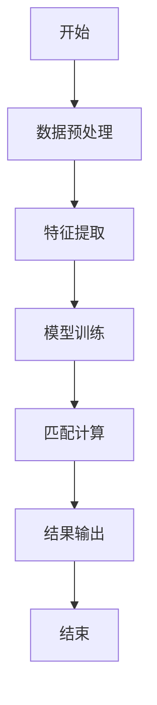
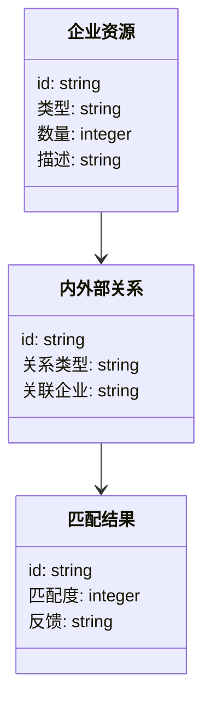
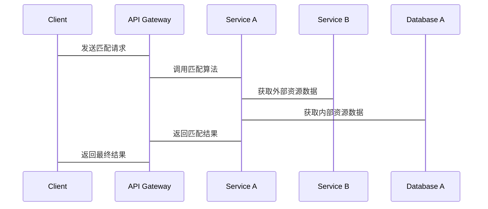

                 


# AI驱动的企业创新生态系统构建：内外部资源智能匹配与协作平台

> 关键词：人工智能, 企业创新, 资源匹配, 协作平台, 系统架构

> 摘要：随着人工智能技术的迅速发展，企业创新生态系统正在经历前所未有的变革。本文系统阐述了AI驱动的企业创新生态系统构建的核心概念，重点分析了内外部资源智能匹配与协作平台的设计与实现。通过结合理论与实践，详细探讨了基于AI的资源匹配算法、系统架构设计以及实际应用案例，为企业构建智能化创新生态系统提供了理论依据和实践指导。

---

## 目录大纲

### 第1章: AI驱动的企业创新生态系统背景

1.1 企业创新生态系统的核心概念  
    1.1.1 从传统企业模式到创新生态系统  
    1.1.2 AI驱动的创新生态系统特点  
    1.1.3 企业内外部资源匹配的重要性  

1.2 问题背景与描述  
    1.2.1 传统企业资源匹配的痛点  
    1.2.2 AI技术在资源匹配中的作用  
    1.2.3 企业创新生态系统的目标  

1.3 问题解决与边界  
    1.3.1 AI驱动的解决方案  
    1.3.2 系统的边界与外延  
    1.3.3 核心要素与组成结构  

1.4 本章小结  

---

### 第2章: 核心概念与联系

2.1 核心概念原理  
    2.1.1 企业内外部资源的定义  
    2.1.2 智能匹配的算法原理  
    2.1.3 协作平台的架构特点  

2.2 概念对比与ER图  
    2.2.1 资源类型对比表  
    2.2.2 实体关系ER图  

```mermaid
er
    entity(企业资源) {
        id: string
        类型: string
        数量: integer
        描述: string
    }
    entity(内外部关系) {
        id: string
        关系类型: string
        关联企业: string
    }
    entity(匹配结果) {
        id: string
        匹配度: integer
        反馈: string
    }
    relation(属于) between 企业资源 和 内外部关系
    relation(影响) between 内外部关系 和 匹配结果
```

2.3 本章小结  

---

### 第3章: 资源智能匹配算法原理

3.1 算法概述  
    3.1.1 基于AI的匹配模型  
    3.1.2 算法的输入输出  
    3.1.3 算法的核心步骤  

3.2 算法流程图  



3.3 算法实现代码  

```python
def resource_matching_algorithm(external_resources, internal_resources):
    # 数据预处理
    processed_external = preprocess(external_resources)
    processed_internal = preprocess(internal_resources)
    
    # 特征提取
    external_features = extract_features(processed_external)
    internal_features = extract_features(processed_internal)
    
    # 模型训练
    model = train_model(external_features, internal_features)
    
    # 匹配计算
    matched_pairs = calculate_matches(model, external_resources, internal_resources)
    
    # 结果输出
    return matched_pairs
```

3.4 数学模型与公式  

$$
匹配度 = \sum_{i=1}^{n} (w_i \cdot f_i)
$$

其中，$w_i$ 是第 $i$ 个特征的权重，$f_i$ 是第 $i$ 个特征的值。

---

### 第4章: 系统分析与架构设计方案

4.1 问题场景介绍  
    4.1.1 企业内外部资源的协同问题  
    4.1.2 系统的目标与功能  

4.2 项目介绍  
    4.2.1 项目目标  
    4.2.2 项目范围  

4.3 系统功能设计  
    4.3.1 领域模型  



4.4 系统架构设计  


4.5 系统接口设计  
    4.5.1 接口定义  
    4.5.2 接口交互流程  

4.6 系统交互图  



4.7 本章小结  

---

### 第5章: 项目实战

5.1 环境安装  
    5.1.1 系统需求  
    5.1.2 环境配置  

5.2 核心代码实现  

```python
def preprocess(data):
    # 数据预处理函数
    return processed_data

def extract_features(data):
    # 特征提取函数
    return features

def train_model(features_external, features_internal):
    # 模型训练函数
    return trained_model

def calculate_matches(model, external, internal):
    # 匹配计算函数
    return matched_pairs
```

5.3 代码应用解读与分析  
    5.3.1 代码功能分析  
    5.3.2 系统实现细节  

5.4 案例分析与实际应用  

5.5 本章小结  

---

### 第6章: 总结与展望

6.1 核心内容回顾  
    6.1.1 AI驱动的创新生态系统  
    6.1.2 资源匹配算法与平台构建  

6.2 不足之处与改进方向  
    6.2.1 当前系统的局限性  
    6.2.2 未来改进方向  

6.3 最佳实践 tips  
    6.3.1 系统设计建议  
    6.3.2 实际应用中的注意事项  

6.4 拓展阅读与深入学习  

---

### 参考文献

1. 人工智能与企业创新研究  
2. 资源匹配算法综述  
3. 系统架构设计经典案例  

---

通过以上目录大纲，我们可以系统地构建一个基于AI的企业创新生态系统，涵盖理论分析、算法实现、系统设计和实际应用等多个方面，为企业创新提供全面的指导和实践方案。

