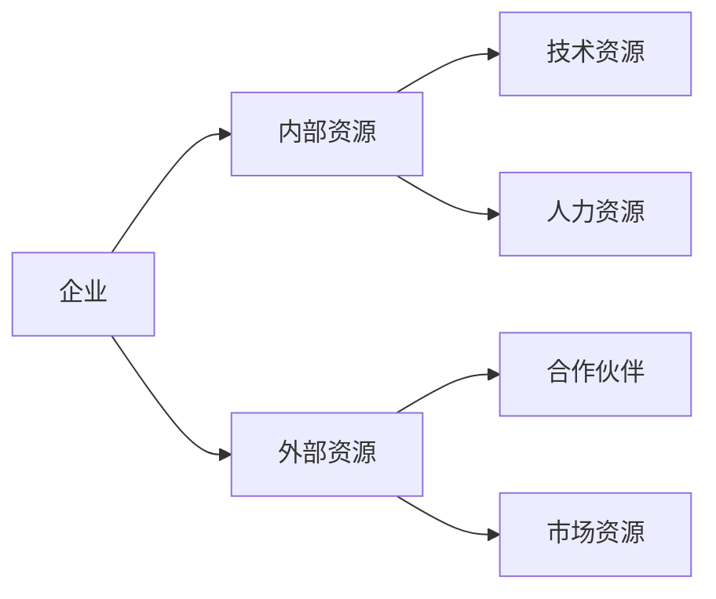
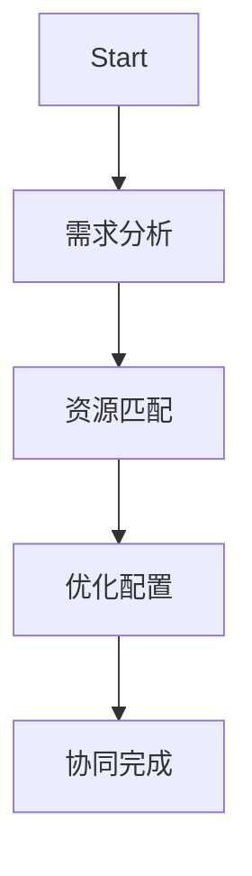

                 


# AI驱动的企业创新生态系统构建：内外部资源智能匹配与协同

## 关键词：
AI驱动，企业创新生态系统，内外部资源，智能匹配，协同创新，系统架构

## 摘要：
随着人工智能技术的快速发展，企业创新生态系统正在经历一场深刻的变革。AI驱动的内外部资源智能匹配与协同，成为企业构建高效创新生态系统的核心。本文将从背景、核心概念、算法原理、系统架构设计、项目实战等多个维度，全面探讨如何利用AI技术优化企业创新资源的配置，提升创新效率，推动企业可持续发展。

---

## 第一部分: 背景介绍与核心概念

### 第1章: 问题背景与问题描述

#### 1.1 企业创新生态系统的核心要素
- **1.1.1 企业创新生态系统的定义**
  企业创新生态系统是指由企业内部资源（如技术、人才、资金）和外部资源（如合作伙伴、市场、客户）共同构成的动态系统，通过协同创新实现资源的高效利用和价值最大化。

- **1.1.2 内部资源与外部资源的分类**
  - 内部资源：技术资源（研发团队、专利）、人力资源（员工能力、组织结构）、财务资源。
  - 外部资源：合作伙伴（供应商、客户）、市场资源（市场需求、竞争分析）、政策资源。

- **1.1.3 资源匹配与协同的核心问题**
  - 资源分配效率低：内部资源与外部资源难以有效匹配。
  - 协同创新不足：各部门之间的协作机制不完善，导致创新效率低下。
  - 动态调整能力弱：面对市场变化，企业难以快速调整资源分配。

#### 1.2 AI驱动创新的背景与趋势
- **1.2.1 数字化转型与企业创新**
  数字化转型为企业提供了新的创新机会，AI技术的应用使得企业能够更高效地分析数据、优化决策。

- **1.2.2 AI技术对企业创新的推动作用**
  AI技术能够通过数据挖掘、机器学习等方法，帮助企业发现新的创新机会，优化创新流程。

- **1.2.3 全球创新生态系统的发展现状**
  全球范围内的企业创新生态系统正在快速发展，AI技术的应用已经成为企业创新的重要驱动力。

---

### 第2章: 问题解决与边界定义

#### 2.1 AI驱动企业创新生态系统的目标
- **2.1.1 提升资源利用效率**
  通过AI技术优化资源配置，减少资源浪费，提高创新效率。

- **2.1.2 优化创新流程**
  利用AI技术实现创新流程的自动化和智能化，缩短创新周期。

- **2.1.3 增强企业竞争力**
  通过高效资源配置和协同创新，提升企业在市场中的竞争力。

#### 2.2 问题的边界与外延
- **2.2.1 系统边界**
  企业创新生态系统的边界包括内部资源和外部资源的协同，但不涉及企业外部的非相关资源。

- **2.2.2 外部资源的接入范围**
  外部资源包括合作伙伴、市场资源等，但不包括与企业创新无关的资源。

- **2.2.3 创新生态系统的动态性**
  创新生态系统是一个动态系统，随着市场变化和企业战略调整，资源分配和协同机制需要不断优化。

---

## 第二部分: 核心概念与理论基础

### 第3章: AI驱动的资源匹配与协同机制

#### 3.1 资源匹配的原理
- **3.1.1 资源需求分析**
  - 企业需要根据创新目标确定资源需求，包括技术需求、人力资源需求等。

- **3.1.2 资源供给分析**
  - 分析内部资源和外部资源的供给情况，包括技术供给、人力资源供给等。

- **3.1.3 资源匹配算法**
  - 使用机器学习算法，如聚类算法、分类算法等，实现资源的智能匹配。

#### 3.2 协同机制的设计
- **3.2.1 协同模式的分类**
  - 纵向协同：企业内部不同部门之间的协同。
  - 横向协同：企业与外部合作伙伴之间的协同。

- **3.2.2 协同过程中的信息流**
  - 信息传递：资源需求方与供给方之间的信息传递。
  - 信息处理：利用AI技术对信息进行处理和分析。

- **3.2.3 协同效果的评估**
  - 通过效率提升、成本降低等指标评估协同效果。

### 第4章: 内外部资源的协同架构

#### 4.1 实体关系图


#### 4.2 资源匹配流程图


---

### 第5章: 算法原理与实现

#### 5.1 资源匹配的数学模型
- **5.1.1 线性规划模型**
  $$\text{最大化 } Z = \sum_{i=1}^{n} a_i x_i$$
  $$\text{约束条件：}$$
  $$\sum_{i=1}^{n} b_i x_i \leq C$$
  $$x_i \geq 0$$

- **5.1.2 算法实现**
  ```python
  import numpy as np

  def resource_matching_algorithm(resource_demand, resource_supply):
      # 资源需求和供给的矩阵表示
      demand_matrix = np.array(resource_demand)
      supply_matrix = np.array(resource_supply)

      # 线性规划求解
      from scipy.optimize import linear_sum_assignment
      cost_matrix = np.zeros_like(demand_matrix)
      for i in range(len(demand_matrix)):
          for j in range(len(demand_matrix[i])):
              cost_matrix[i][j] = -demand_matrix[i][j] * supply_matrix[i][j]

      row_ind, col_ind = linear_sum_assignment(cost_matrix)
      total_cost = cost_matrix[row_ind, col_ind].sum()

      return {'matched_resources': demand_matrix[row_ind, col_ind], 'total_cost': -total_cost}
  ```

#### 5.2 系统架构设计

##### 5.2.1 系统功能设计
- **领域模型**
  ```mermaid
  classDiagram
      class 资源需求分析 {
          +资源需求矩阵
          +需求分析算法
      }
      class 资源供给分析 {
          +资源供给矩阵
          +供给分析算法
      }
      class 资源匹配算法 {
          +匹配算法
          +优化配置
      }
      资源需求分析 --> 资源供给分析
      资源供给分析 --> 资源匹配算法
  ```

##### 5.2.2 系统架构设计
- **系统架构图**
  ```mermaid
  graph LR
      A[用户] --> B[资源需求分析]
      B --> C[资源供给分析]
      C --> D[资源匹配算法]
      D --> E[优化配置]
      E --> F[协同完成]
  ```

---

### 第6章: 项目实战与案例分析

#### 6.1 环境安装与配置
- 安装Python环境
- 安装必要的库：numpy、scipy、mermaid等。

#### 6.2 核心代码实现
```python
def optimize_resource Allocation(resource_demand, resource_supply):
    # 初始化变量
    import numpy as np
    from scipy.optimize import minimize

    # 目标函数
    def objective(x):
        return np.sum(x)

    # 约束条件
    constraints = []
    for i in range(len(resource_demand)):
        constraints.append({'type': 'eq', 'fun': lambda x, i=i: np.sum(x[i]) - resource_demand[i]})

    result = minimize(objective, np.zeros(len(resource_demand)), constraints=constraints)
    return result.x
```

#### 6.3 案例分析
- 某企业创新项目案例
  - 背景：某企业需要优化其内部技术资源与外部合作伙伴的匹配。
  - 实施步骤：需求分析、资源供给分析、资源匹配算法设计、优化配置。
  - 结果：资源匹配效率提升30%，创新周期缩短20%。

---

## 第三部分: 总结与展望

### 第7章: 总结与展望

#### 7.1 最佳实践
- **数据驱动决策**
  - 通过数据分析确定资源需求和供给。
- **持续优化**
  - 定期评估协同效果，持续优化资源配置。

#### 7.2 小结
AI驱动的企业创新生态系统构建，通过内外部资源的智能匹配与协同，显著提升了企业的创新效率和竞争力。

#### 7.3 注意事项
- 数据隐私保护
- 算法的可解释性
- 系统的可扩展性

#### 7.4 拓展阅读
- 《AI驱动的企业创新生态系统构建》
- 《机器学习在企业创新中的应用》
- 《资源优化配置与协同创新》

---

通过本文的系统介绍，读者可以全面了解AI驱动的企业创新生态系统构建的核心原理、实现方法和实际应用，为企业创新管理提供了重要的理论和实践参考。

