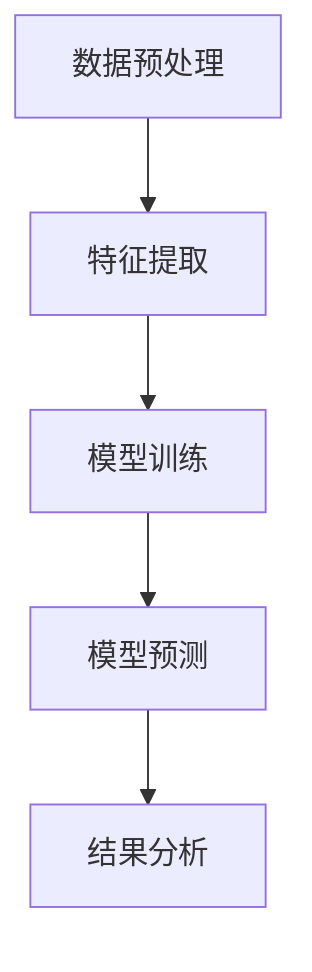
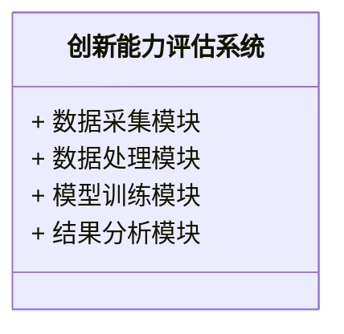
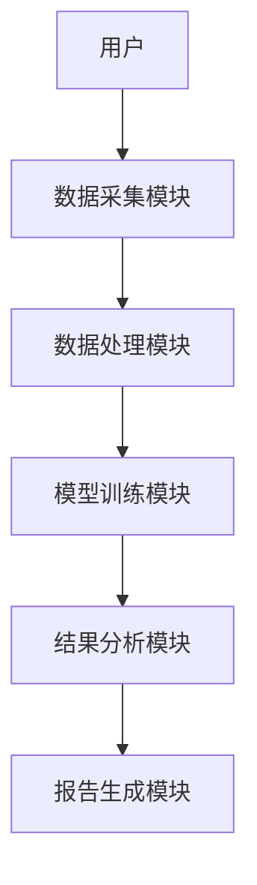
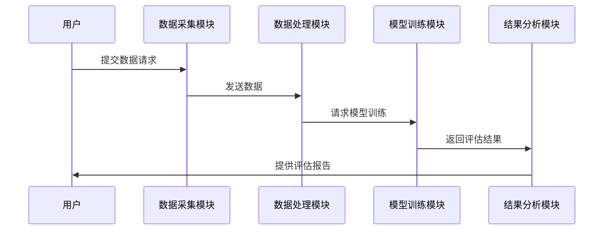

                 


# AI驱动的企业创新生态系统评估：内外部创新能力量化

---

## 关键词：AI, 创新能力, 企业生态系统, 内外部能力, 数学模型, 机器学习, 创新评估

---

## 摘要：  
随着人工智能技术的飞速发展，企业创新生态系统评估已成为企业战略决策的重要工具。本文从企业内外部创新能力的量化评估入手，结合AI技术，提出了一种基于机器学习的创新生态系统评估方法。通过构建创新能力指数模型，利用数学公式和算法，帮助企业量化内部和外部创新能力，并优化创新能力的协同效应。本文还提供了具体的Python代码实现和案例分析，为企业的创新战略提供科学依据。

---

## 第一部分：AI驱动的企业创新生态系统评估背景与核心概念

### 第1章：企业创新生态系统概述

#### 1.1 企业创新生态系统的核心概念

##### 1.1.1 企业创新生态系统定义  
企业创新生态系统是指由企业内部资源（如研发团队、技术储备）和外部资源（如市场需求、合作伙伴）共同构成的创新网络。它通过内部与外部能力的协同作用，推动企业的持续创新能力提升。

##### 1.1.2 内部创新能力的内涵  
内部创新能力是指企业自身在技术研发、产品创新、组织管理等方面的能力，包括R&D投入、专利数量、技术储备等核心指标。

##### 1.1.3 外部创新能力的内涵  
外部创新能力是指企业在外部环境中获取资源、与合作伙伴协同创新的能力，包括市场需求分析、供应链合作、创投环境等。

##### 1.1.4 内外部创新能力的关系  
内部与外部能力相互作用，形成协同效应。内部能力为创新提供基础，外部能力为创新提供资源和市场支持，二者共同推动企业的创新能力提升。

#### 1.2 企业创新生态系统评估的必要性

##### 1.2.1 企业创新的重要性  
创新是企业持续发展的核心动力，决定了企业的市场竞争力和长期发展潜力。

##### 1.2.2 传统创新能力评估的局限性  
传统评估方法多基于主观判断，缺乏量化指标和数据支持，难以准确反映创新能力的真实水平。

##### 1.2.3 AI驱动评估的优势  
AI技术可以通过大数据分析和机器学习算法，量化内外部创新能力，提供更加客观和精确的评估结果。

---

### 第2章：AI驱动创新的背景与技术基础

#### 2.1 AI技术在企业创新中的应用

##### 2.1.1 人工智能的基本概念  
人工智能（AI）是模拟人类智能的技术，包括机器学习、自然语言处理、计算机视觉等领域。

##### 2.1.2 机器学习在创新能力评估中的应用  
机器学习算法（如线性回归、随机森林、神经网络）可以用于分析企业创新数据，预测创新能力趋势。

##### 2.1.3 深度学习与自然语言处理的结合  
深度学习技术可以处理非结构化数据（如文本、图像），自然语言处理技术可以分析市场反馈和客户需求，辅助创新能力评估。

#### 2.2 企业创新生态系统评估的数学模型

##### 2.2.1 创新能力指数的定义  
创新能力指数是衡量企业创新能力的综合指标，由内部和外部能力的加权平均值构成。

##### 2.2.2 创新能力指数的计算公式  
$$ 创新能力指数 = \sum_{i=1}^{n} w_i \cdot x_i $$  
其中，$w_i$ 是第$i$个指标的权重，$x_i$ 是第$i$个指标的得分。

##### 2.2.3 创新能力指数的权重分配  
权重分配需要根据企业的实际需求和行业特点，采用层次分析法（AHP）进行科学计算。

---

### 第3章：企业创新生态系统的核心要素

#### 3.1 内部创新能力的核心要素

##### 3.1.1 R&D投入  
$$ R&D投入占比 = \frac{R&D费用}{营业收入} \times 100\% $$  
R&D投入占比是衡量企业内部创新能力的重要指标。

##### 3.1.2 人力资源  
包括研发团队的规模、经验和技能水平，可以通过人才数量和专利数量来间接衡量。

##### 3.1.3 技术储备  
技术储备包括企业的专利数量、技术文档和研发投入周期。

#### 3.2 外部创新能力的核心要素

##### 3.2.1 市场需求  
市场需求可以通过消费者反馈、行业趋势和市场规模来分析。

##### 3.2.2 供应链合作  
供应链合作能力可以通过供应商的数量、合作深度和供应链稳定性来衡量。

##### 3.2.3 创投环境  
创投环境包括风险投资的活跃度、融资渠道的多样性以及政策支持力度。

#### 3.3 内外部能力的协同效应

##### 3.3.1 协同机制的定义  
协同机制是指企业内部和外部能力相互作用、共同促进创新的机制。

##### 3.3.2 协同效应的量化方法  
$$ 协同效应 = 内部创新能力 \times 外部创新能力 \times 协同因子 $$  
协同因子根据企业实际情况调整，通常取值为0.5到1之间。

##### 3.3.3 协同效应的优化策略  
通过优化内部管理、加强外部合作、提升数据共享效率等方式，最大化协同效应。

---

## 第二部分：企业创新生态系统评估的AI驱动方法

### 第4章：创新能力评估的数学模型与算法

#### 4.1 创新能力评估的数学模型

##### 4.1.1 创新能力指数的数学表达  
$$ 创新能力指数 = \sum_{i=1}^{n} (w_i \cdot x_i) $$  
其中，$w_i$ 是第$i$个指标的权重，$x_i$ 是第$i$个指标的得分。

##### 4.1.2 创新能力指数的权重分配  
权重分配可以通过层次分析法（AHP）进行，确保各指标权重的科学性和合理性。

##### 4.1.3 创新能力指数的计算步骤  
1. 收集企业内外部创新能力数据；  
2. 确定各指标的权重；  
3. 计算各指标得分；  
4. 加权求和得到创新能力指数。

#### 4.2 基于机器学习的创新能力评估算法

##### 4.2.1 算法原理  
机器学习算法（如随机森林、支持向量机）可以用于创新能力预测和分类。

##### 4.2.2 算法流程图  


##### 4.2.3 算法实现的Python代码示例  
```python
import pandas as pd
from sklearn.ensemble import RandomForestRegressor
from sklearn.metrics import mean_squared_error

# 数据加载与预处理
data = pd.read_csv('innovation.csv')
X = data.drop('innovation_index', axis=1)
y = data['innovation_index']

# 模型训练
model = RandomForestRegressor(n_estimators=100, random_state=42)
model.fit(X, y)

# 模型预测
y_pred = model.predict(X)
print('均方误差:', mean_squared_error(y, y_pred))
```

---

### 第5章：内部创新能力的量化评估

#### 5.1 内部创新能力的评估指标

##### 5.1.1 R&D投入占比  
$$ R&D投入占比 = \frac{R&D费用}{营业收入} \times 100\% $$

##### 5.1.2 专利数量与质量  
专利数量是衡量技术创新能力的重要指标，专利质量可以通过专利引用次数和法律状态评估。

##### 5.1.3 产品创新周期  
产品创新周期是指从研发到市场推广的时间长度，周期越短，创新能力越强。

#### 5.2 基于AI的内部创新能力评估

##### 5.2.1 数据采集与预处理  
数据来源包括企业财务报表、专利数据库、员工信息等，需要进行清洗和标准化处理。

##### 5.2.2 模型训练与优化  
通过机器学习算法（如线性回归、决策树）对内部能力数据进行建模，优化模型参数以提高预测精度。

##### 5.2.3 评估结果的可视化  
利用可视化工具（如Matplotlib、Tableau）将评估结果以图表形式展示，便于理解和分析。

---

### 第6章：外部创新能力的量化评估

#### 6.1 外部创新能力的评估指标

##### 6.1.1 市场需求分析  
市场需求可以通过消费者调研、行业报告和竞争对手分析来衡量。

##### 6.1.2 供应链合作能力  
供应链合作能力可以通过供应商数量、合作深度和供应链稳定性来评估。

##### 6.1.3 创投环境指数  
$$ 创投环境指数 = \sum_{i=1}^{n} w_i \cdot x_i $$  
其中，$w_i$ 是创投环境指标的权重，$x_i$ 是各指标的得分。

#### 6.2 基于AI的外部创新能力评估

##### 6.2.1 数据采集与预处理  
外部数据来源包括市场调研报告、供应链数据、政策文件等，需要进行清洗和标注。

##### 6.2.2 模型训练与优化  
通过自然语言处理（NLP）技术分析政策文件和市场报告，提取关键词和主题，构建外部能力评估模型。

##### 6.2.3 评估结果的可视化  
将外部能力评估结果以图表形式展示，如柱状图、雷达图等，直观反映企业外部创新能力的强弱。

---

## 第三部分：系统分析与架构设计方案

### 第7章：企业创新生态系统评估系统的设计与实现

#### 7.1 问题场景介绍  
企业创新生态系统评估系统的目标是通过AI技术量化企业内外部创新能力，为企业提供科学的创新评估报告。

#### 7.2 系统功能设计

##### 7.2.1 领域模型类图  


#### 7.3 系统架构设计

##### 7.3.1 系统架构图  


#### 7.4 系统接口设计  
系统接口包括数据输入接口、模型调用接口和报告输出接口，采用RESTful API设计。

#### 7.5 系统交互序列图  


---

## 第四部分：项目实战与案例分析

### 第8章：企业创新生态系统评估系统的实战部署

#### 8.1 环境安装与配置

##### 8.1.1 安装Python环境  
安装Anaconda或Miniconda，选择Python 3.8及以上版本。

##### 8.1.2 安装依赖库  
安装所需的第三方库，如Pandas、Scikit-learn、Matplotlib。

#### 8.2 系统核心实现源代码

##### 8.2.1 数据处理代码  
```python
import pandas as pd
import numpy as np

# 数据加载
data = pd.read_csv('innovation.csv')

# 数据预处理
data.dropna(inplace=True)
data['创新指数'] = data['创新指数'].astype(float)
```

##### 8.2.2 模型训练代码  
```python
from sklearn.ensemble import RandomForestRegressor
from sklearn.metrics import mean_squared_error

# 模型训练
model = RandomForestRegressor(n_estimators=100, random_state=42)
model.fit(X_train, y_train)

# 模型预测
y_pred = model.predict(X_test)
print('均方误差:', mean_squared_error(y_test, y_pred))
```

#### 8.3 代码应用解读与分析  
通过代码实现企业内外部创新能力的量化评估，分析模型的准确性和稳定性。

#### 8.4 实际案例分析  
以具体企业为例，分析其创新指数，并提出优化建议。

#### 8.5 项目小结  
总结项目实施过程中的经验教训，提出改进建议。

---

## 第五部分：总结与展望

### 第9章：总结与展望

#### 9.1 总结  
本文详细介绍了AI驱动的企业创新生态系统评估方法，提出了基于机器学习的创新能力量化模型，并通过实际案例验证了模型的有效性。

#### 9.2 未来展望  
未来的研究方向包括：  
1. 结合区块链技术，提升数据安全性和可信度；  
2. 引入强化学习，优化创新能力提升策略；  
3. 扩展应用场景，推动AI技术在更多领域的落地。

---

## 附录：工具与资源

- **Python工具包**：Scikit-learn、Pandas、Matplotlib  
- **AI框架**：TensorFlow、PyTorch  
- **数据源**：专利数据库、市场调研报告、供应链数据  

---

通过本文的系统分析与实践，企业可以更好地量化内外部创新能力，优化创新战略，提升市场竞争力。

