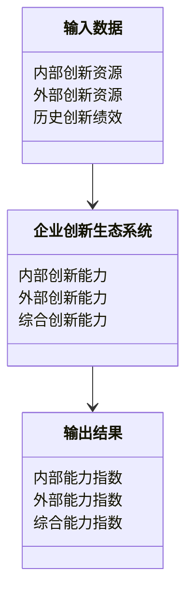

                 


# AI驱动的企业创新生态系统评估：内外部创新能力量化模型

## 关键词：AI驱动，企业创新，生态系统评估，内外部能力，量化模型

## 摘要：本文系统地探讨了AI驱动的企业创新生态系统评估的内外部创新能力量化模型，从理论基础、模型构建到算法实现，结合实际案例，详细分析了如何利用人工智能技术量化评估企业创新生态系统的能力。文章结合系统学、创新管理理论和大数据分析，提出了一个基于AI的创新能力量化模型，并通过Mermaid流程图和Python代码展示了模型的实现过程。最后，本文总结了模型的应用价值和未来发展方向。

---

# 第一部分: AI驱动的企业创新生态系统评估背景与概念

## 第1章: 企业创新生态系统概述

### 1.1 企业创新生态系统的核心概念
#### 1.1.1 企业创新的定义与内涵
企业创新是指企业在经营活动中，通过引入新技术、新产品、新市场和新管理方法，实现价值创造和竞争优势的过程。创新不仅是企业发展的核心驱动力，也是应对外部环境变化的关键能力。

#### 1.1.2 企业创新生态系统的特点
企业创新生态系统是一个复杂的系统，包含内部资源、外部环境、合作伙伴等多个要素。其特点包括：系统的整体性、要素的互动性、创新的动态性以及生态的可持续性。

#### 1.1.3 企业创新生态系统的核心要素
企业创新生态系统的核心要素包括：技术、市场、组织、文化和资源。这些要素相互作用，共同推动企业的创新活动。

### 1.2 企业内外部创新能力的定义与区别
#### 1.2.1 内部创新能力的内涵
内部创新能力是指企业内部资源和能力的整合与优化，包括技术开发、研发团队、内部管理等方面。

#### 1.2.2 外部创新能力的内涵
外部创新能力是指企业通过与外部合作伙伴（如供应商、客户、科研机构等）协作，获取外部资源和知识，推动创新的能力。

#### 1.2.3 内外部创新能力的联系与区别
内部创新能力是企业创新的基础，而外部创新能力是企业扩展创新资源和能力的重要途径。两者相互依存，共同构成了企业的创新能力。

### 1.3 企业创新生态系统评估的重要性
#### 1.3.1 企业创新生态系统评估的目的
评估企业创新生态系统的能力，可以帮助企业识别创新机会和挑战，优化资源配置，提升创新效率。

#### 1.3.2 传统评估方法的局限性
传统评估方法通常基于定量指标，难以全面捕捉企业创新的动态性和复杂性。

#### 1.3.3 AI驱动评估的优势与潜力
AI技术的应用可以将企业创新生态系统中的非结构化数据转化为可量化的指标，提供更全面、更动态的评估结果。

---

## 第2章: 企业创新生态系统评估的理论基础

### 2.1 系统学与复杂性理论
#### 2.1.1 系统学的基本概念
系统学强调整体性，认为系统的功能是各部分相互作用的结果。

#### 2.1.2 复杂性理论在企业创新中的应用
复杂性理论认为，企业创新生态系统是一个复杂的自适应系统，具有涌现性和动态性。

### 2.2 创新管理理论
#### 2.2.1 创新管理的核心理论
创新管理理论包括技术接受模型（TAM）、创新扩散理论（Diffusion of Innovation）等。

#### 2.2.2 企业创新管理的挑战与机遇
企业创新管理的挑战包括资源分配、组织协调和外部环境的不确定性；机遇包括技术进步、市场需求和政策支持。

### 2.3 人工智能与大数据分析
#### 2.3.1 AI在企业创新中的应用领域
AI技术在企业创新中的应用包括智能决策支持、知识管理、风险评估和创新预测。

#### 2.3.2 大数据分析对企业创新评估的支持
大数据分析可以提取企业内外部数据中的隐含信息，为创新评估提供数据支持。

---

## 第3章: 企业创新生态系统评估的数学模型与方法

### 3.1 数学模型构建的基本原则
#### 3.1.1 模型构建的逻辑性
模型应基于企业的实际创新过程，反映创新活动的动态性。

#### 3.1.2 模型的可操作性
模型应具有可操作性，能够通过数据和参数进行计算和调整。

#### 3.1.3 模型的可验证性
模型应可以通过实际数据进行验证和优化。

### 3.2 基于AI的创新能力量化模型
#### 3.2.1 模型的输入变量
- 内部创新资源：研发预算、研发团队规模。
- 外部创新资源：合作伙伴数量、市场需求。
- 历史创新绩效：过去几年的创新成果。

#### 3.2.2 模型的输出变量
- 内部创新能力指数：反映企业内部资源的整合能力。
- 外部创新能力指数：反映企业获取外部资源的能力。
- 综合创新能力指数：综合内部和外部创新能力的评估结果。

#### 3.2.3 模型的数学表达式
$$
\text{综合创新能力指数} = \alpha \times \text{内部创新能力指数} + (1 - \alpha) \times \text{外部创新能力指数}
$$
其中，$\alpha$ 是模型参数，表示内部能力在综合能力中的权重。

### 3.3 模型的验证与优化
#### 3.3.1 模型的验证方法
通过历史数据验证模型的准确性，调整模型参数。

#### 3.3.2 模型的优化策略
引入机器学习算法，如随机森林或神经网络，提高模型的预测能力。

---

## 第4章: 企业创新生态系统评估的系统分析与架构设计

### 4.1 问题场景介绍
企业创新生态系统评估的场景包括企业内部创新资源管理、外部合作伙伴关系管理、创新绩效评估等。

### 4.2 系统功能设计
#### 4.2.1 领域模型


#### 4.2.2 系统架构


#### 4.2.3 接口和交互设计
- API接口：提供数据输入和结果输出的接口。
- 交互流程：用户输入数据，系统处理并返回评估结果。

---

## 第5章: 项目实战

### 5.1 环境安装
安装Python、TensorFlow和Scikit-learn等工具。

### 5.2 核心代码实现
```python
import numpy as np
from sklearn.metrics import accuracy_score

def calculate_internal_capability(internal_resources):
    return np.mean(internal_resources)

def calculate_external_capability(external_resources):
    return np.mean(external_resources)

def calculate_overall_capability(internal, external, alpha=0.5):
    return alpha * internal + (1 - alpha) * external

# 示例数据
internal_resources = [80, 70, 90]
external_resources = [75, 85, 65]
alpha = 0.6

internal_capability = calculate_internal_capability(internal_resources)
external_capability = calculate_external_capability(external_resources)
overall_capability = calculate_overall_capability(internal_capability, external_capability, alpha)

print(f"内部能力指数: {internal_capability}")
print(f"外部能力指数: {external_capability}")
print(f"综合能力指数: {overall_capability}")
```

### 5.3 案例分析
以某科技公司为例，输入内部和外部资源数据，计算综合创新能力指数，并分析结果。

### 5.4 项目小结
总结项目实现的关键步骤，分析模型的优缺点，并提出改进建议。

---

## 第6章: 总结与展望

### 6.1 总结
本文提出了基于AI的企业创新生态系统评估模型，结合数学模型和系统设计，提供了实际的实现方法。

### 6.2 展望
未来可以进一步优化模型，引入更复杂的机器学习算法，并扩展到更多企业类型和行业。

---

## 关键词：AI驱动，企业创新，生态系统评估，内外部能力，量化模型

## 摘要：本文系统地探讨了AI驱动的企业创新生态系统评估的内外部创新能力量化模型，从理论基础、模型构建到算法实现，结合实际案例，详细分析了如何利用人工智能技术量化评估企业创新生态系统的能力。文章结合系统学、创新管理理论和大数据分析，提出了一个基于AI的创新能力量化模型，并通过Mermaid流程图和Python代码展示了模型的实现过程。最后，本文总结了模型的应用价值和未来发展方向。

