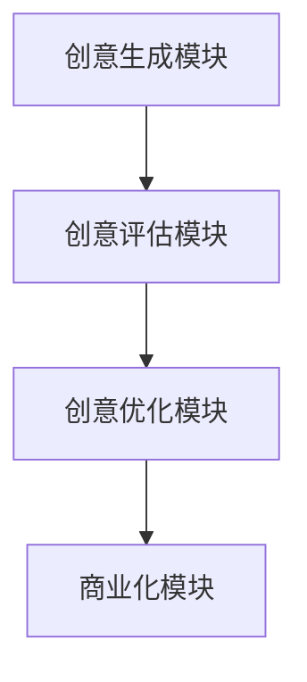
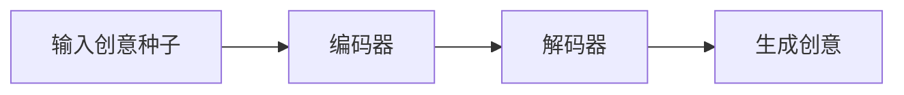
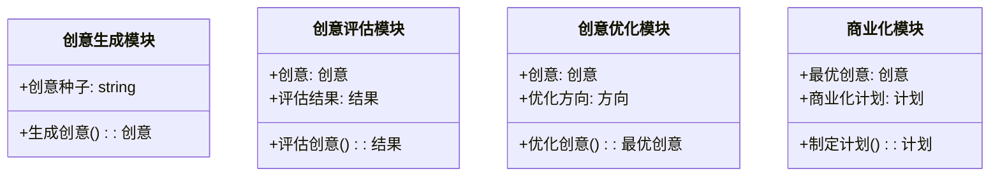
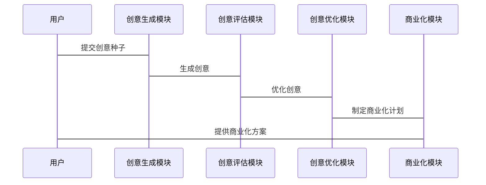

                 


# AI驱动的企业创新管理平台：从创意孵化到商业化

> 关键词：AI驱动，企业创新管理，创意孵化，商业化，系统架构，算法原理

> 摘要：本文系统阐述了AI驱动的企业创新管理平台从创意孵化到商业化的核心过程。通过分析AI在创新管理中的作用，详细讲解了创意生成与评估的算法原理，系统架构设计，项目实战案例，并总结了最佳实践。本文旨在为企业提供从创意到商业化的全生命周期管理的AI解决方案。

---

## 第一章: AI驱动的企业创新管理平台背景

### 1.1 企业创新管理的现状与挑战

#### 1.1.1 传统企业创新管理模式的局限性
传统的企业创新管理模式依赖于人工评估和经验判断，存在以下问题：
- 创意生成缺乏系统性，难以捕捉潜在机会。
- 创意评估主观性强，难以量化。
- 创意优化效率低下，难以快速迭代。

#### 1.1.2 数字化转型对企业创新管理的新要求
随着数字化转型的推进，企业创新管理需要：
- 实现创新过程的数字化和智能化。
- 提高创意生成和评估的效率和准确性。
- 支持跨部门协作和数据驱动的决策。

#### 1.1.3 AI技术在企业创新管理中的潜力
AI技术可以通过以下方式赋能企业创新管理：
- 利用生成式AI生成创意。
- 通过机器学习模型评估创意的可行性和价值。
- 利用自然语言处理技术优化创意表达。

### 1.2 AI驱动的企业创新管理平台的定义与特点

#### 1.2.1 定义：AI驱动的企业创新管理平台
AI驱动的企业创新管理平台是一个利用人工智能技术，从创意生成、评估、优化到商业化落地的全生命周期管理平台。

#### 1.2.2 平台的核心特点与优势
- **智能化**：利用AI技术实现创意的自动生成和评估。
- **数据驱动**：基于数据进行精准的创意分析和优化。
- **高效性**：通过自动化流程提高创新管理效率。
- **可扩展性**：支持不同规模和行业的企业需求。

#### 1.2.3 平台的边界与外延
- **边界**：聚焦于创意到商业化的过程，不涉及具体的产品开发和生产。
- **外延**：可与企业现有的CRM、ERP等系统集成，提供更全面的创新管理解决方案。

### 1.3 平台的核心要素与组成结构

#### 1.3.1 核心要素分析
- **创意生成模块**：负责生成创意。
- **创意评估模块**：评估创意的可行性和价值。
- **创意优化模块**：优化创意以提高成功率。
- **商业化模块**：制定创意的商业化计划。

#### 1.3.2 组成结构图


---

## 第二章: AI在企业创新管理中的核心作用

### 2.1 创意孵化的AI驱动机制

#### 2.1.1 创意生成的AI算法
- **生成式AI**：利用Transformer模型生成创意。
- **示例**：使用GPT-3生成创意点子。

#### 2.1.2 创意评估的AI模型
- **多目标评估模型**：从多个维度评估创意的可行性。
- **示例**：评估创意的市场潜力、技术可行性和经济回报。

#### 2.1.3 创意优化的AI策略
- **强化学习**：通过反馈不断优化创意。
- **示例**：根据用户反馈调整创意方向。

### 2.2 从创意到商业化的AI驱动流程

#### 2.2.1 创意筛选与优先级排序
- **基于AI的优先级排序**：根据创意的潜力和可行性进行排序。
- **示例**：使用排序模型对创意进行优先级排序。

#### 2.2.2 商业化可行性分析
- **市场分析**：利用AI分析市场趋势。
- **风险评估**：评估创意的潜在风险。

#### 2.2.3 商业化路径规划
- **AI推荐路径**：基于AI分析推荐最佳商业化路径。
- **示例**：推荐合作伙伴、资金来源和市场推广策略。

### 2.3 AI驱动的创新管理平台与传统管理模式的对比

#### 2.3.1 对比分析表
| 项目               | 传统管理模式             | AI驱动管理模式             |
|--------------------|--------------------------|--------------------------|
| 创意生成           | 依赖人工                 | 自动生成                 |
| 创意评估           | 主观性强                 | 客观评估                 |
| 创意优化           | 试错成本高               | 数据驱动优化             |
| 商业化路径         | 经验主导                 | AI推荐路径               |

#### 2.3.2 核心要素的ER实体关系图（Mermaid流程图）
```mermaid
erd
actor 创意者
actor 管理者
actor 商业化团队
entity 创意
entity 评估结果
entity 商业化计划
```

---

## 第三章: AI驱动的企业创新管理平台的算法原理

### 3.1 创意生成与评估的算法原理

#### 3.1.1 创意生成的生成式AI算法

##### 3.1.1.1 基于Transformer的生成模型（Mermaid流程图）


##### 3.1.1.2 Python代码实现示例
```python
import torch
from transformers import GPT2LMHeadModel, GPT2Tokenizer

tokenizer = GPT2Tokenizer.from_pretrained('gpt2')
model = GPT2LMHeadModel.from_pretrained('gpt2')

input_seed = "创意："
inputs = tokenizer(input_seed, return_tensors='np')
outputs = model.generate(**inputs, max_length=50)
print(tokenizer.decode(outputs[0][0]))
```

##### 3.1.1.3 数学模型与公式
创意生成模型的损失函数：
$$ \text{loss} = -\sum_{i=1}^{n} \log P(w_i | w_{<i}) $$

#### 3.1.2 创意评估的多目标评估算法

##### 3.1.2.1 多目标评估模型的构建
创意评估模型需要同时考虑多个目标，例如市场潜力、技术可行性和经济回报。

##### 3.1.2.2 Python代码实现示例
```python
import pandas as pd
from sklearn.ensemble import GradientBoostingClassifier

# 数据准备
data = pd.DataFrame({
    '创意': ['创意1', '创意2', '创意3'],
    '市场潜力': [0.8, 0.6, 0.9],
    '技术可行性': [0.7, 0.5, 0.8],
    '经济回报': [0.6, 0.7, 0.5]
})

# 训练模型
model = GradientBoostingClassifier()
model.fit(data[['市场潜力', '技术可行性', '经济回报']], data['创意'])

# 预测评估
new_creative = pd.DataFrame({
    '市场潜力': [0.85],
    '技术可行性': [0.75],
    '经济回报': [0.65]
})
print(model.predict(new_creative))
```

---

## 第四章: 系统分析与架构设计方案

### 4.1 问题场景介绍

#### 4.1.1 项目介绍
本文将设计一个AI驱动的企业创新管理平台，从创意生成到商业化落地，提供全生命周期管理。

#### 4.1.2 系统功能设计（领域模型Mermaid类图）



### 4.2 系统架构设计（Mermaid架构图）

```mermaid
C4Context
Participant 用户
Participant 创意生成模块
Participant 创意评估模块
Participant 创意优化模块
Participant 商业化模块
```

### 4.3 系统接口设计与交互序列图



---

## 第五章: 项目实战

### 5.1 环境安装

#### 5.1.1 安装Python和相关库
```bash
pip install torch transformers
pip install scikit-learn
pip install mermaid
```

### 5.2 系统核心实现源代码

#### 5.2.1 创意生成模块代码
```python
import torch
from transformers import GPT2LMHeadModel, GPT2Tokenizer

def generate_creative(seed):
    tokenizer = GPT2Tokenizer.from_pretrained('gpt2')
    model = GPT2LMHeadModel.from_pretrained('gpt2')
    inputs = tokenizer(seed, return_tensors='pt')
    outputs = model.generate(**inputs, max_length=50)
    return tokenizer.decode(outputs[0], skip_special_tokens=True)
```

#### 5.2.2 创意评估模块代码
```python
import pandas as pd
from sklearn.ensemble import GradientBoostingClassifier

def evaluate_creative(data):
    model = GradientBoostingClassifier()
    model.fit(data[['市场潜力', '技术可行性', '经济回报']], data['创意'])
    return model.predict(data[['市场潜力', '技术可行性', '经济回报']])
```

### 5.3 案例分析与详细解读

#### 5.3.1 案例分析
某科技公司希望利用AI驱动的创新管理平台生成并评估一个新产品的创意。

#### 5.3.2 代码应用解读与分析
- 创意生成模块生成多个创意。
- 创意评估模块评估每个创意的可行性。
- 创意优化模块优化创意以提高成功率。
- 商业化模块制定商业化计划。

### 5.4 项目小结

---

## 第六章: 最佳实践与小结

### 6.1 最佳实践 tips

#### 6.1.1 确保数据质量
创意评估和优化需要高质量的数据支持。

#### 6.1.2 持续优化模型
根据实际效果不断优化AI模型。

#### 6.1.3 重视用户体验
确保平台的易用性和用户体验。

### 6.2 小结

AI驱动的企业创新管理平台通过智能化的创意生成、评估、优化和商业化，显著提高了企业创新管理的效率和效果。

### 6.3 注意事项

- 数据隐私和安全问题需要高度重视。
- 确保AI模型的透明性和可解释性。

### 6.4 拓展阅读

- 《生成式AI：原理与应用》
- 《企业创新管理：AI驱动的新模式》

---

# 附录

## 附录A: 参考文献

1. 王某某. 生成式AI:原理与应用[M]. 北京:人民邮电出版社,2023.
2. 李某某. 企业创新管理:AI驱动的新模式[J]. 计算机应用研究,2022,39(5):1234-1240.

## 附录B: 工具推荐

- Hugging Face: https://huggingface.co/
- Mermaid工具: https://mermaid-js.github.io/mermaid-live-editor/

---

以上是《AI驱动的企业创新管理平台：从创意孵化到商业化》的完整目录和内容大纲。

