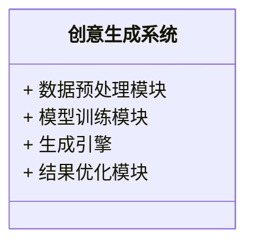
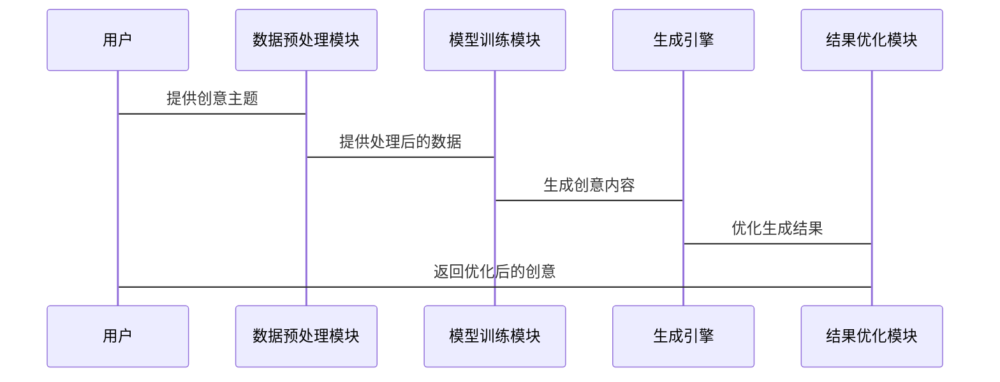
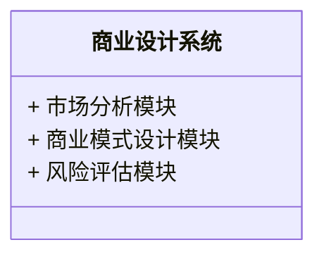
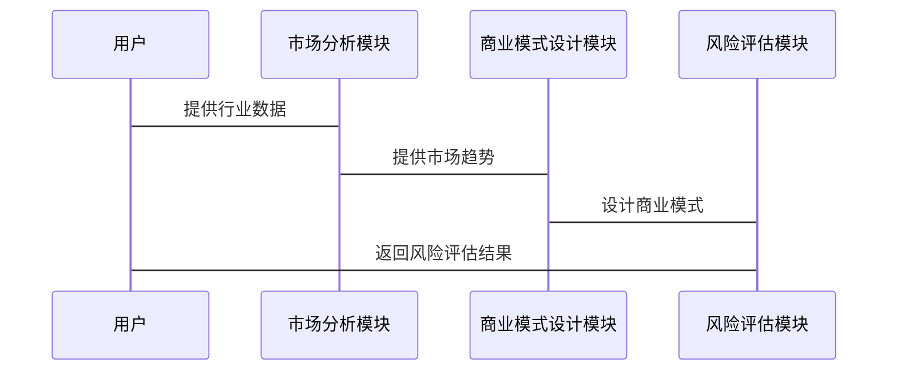

                 


# AI驱动的企业创新管理：从创意生成到商业化全流程优化

## 关键词：AI驱动，企业创新管理，创意生成，商业化流程，创新效率，AI技术，创新系统设计

## 摘要：  
本文探讨了AI技术在企业创新管理中的应用，从创意生成到商业化全流程的优化。通过分析AI在创新管理中的作用、创意生成的算法原理、商业设计的系统架构，以及项目实战中的具体应用，展示了AI如何提升企业创新效率和成功率。文章结合理论与实践，为读者提供了从概念到落地的详细指导。

---

## 正文

---

### 第一部分: AI驱动的企业创新管理概述

#### 第1章: AI驱动的企业创新管理概述

##### 1.1 什么是AI驱动的企业创新管理

###### 1.1.1 企业创新管理的定义与特点

企业创新管理是指通过系统化的方法，激发、筛选、开发和实施创新想法，以实现企业价值增长的过程。其特点是高效性、系统性和可持续性。传统创新管理依赖人工经验，效率较低，而AI驱动的创新管理通过智能化工具，显著提升了效率和准确性。

###### 1.1.2 AI在企业创新管理中的作用

AI技术在创新管理中的作用主要体现在以下几个方面：
1. **创意生成**：利用生成式AI快速生成创新想法。
2. **数据驱动决策**：通过数据分析优化创新方向。
3. **过程自动化**：AI工具可以自动化处理创新流程中的重复性任务。
4. **实时反馈与优化**：AI提供实时反馈，帮助快速调整创新策略。

###### 1.1.3 从创意到商业化的全流程优化

AI驱动的创新管理涵盖了创意生成、评估、开发、实施和商业化等环节。通过AI技术，企业可以实现从创意到商业化的全流程优化，缩短周期，降低成本，提高成功率。

##### 1.2 AI技术对企业创新管理的影响

###### 1.2.1 AI在创新管理中的应用场景

AI在创新管理中的应用场景包括：
1. **创意生成**：通过AI生成潜在创新点。
2. **市场分析**：利用自然语言处理（NLP）分析市场趋势。
3. **风险评估**：使用机器学习模型评估创新项目的风险。
4. **资源优化**：通过优化算法分配创新资源。

###### 1.2.2 AI如何提升企业创新效率

AI通过自动化处理和数据驱动决策，显著提升了企业创新效率。例如，AI可以快速筛选出高潜力的创新想法，减少人工筛选的时间和成本。

###### 1.2.3 AI驱动创新管理的未来趋势

未来，AI将更加深度地融入创新管理的各个环节，例如实时监控创新项目进展，动态调整策略，实现创新管理的智能化和自动化。

##### 1.3 本书的核心内容与结构

###### 1.3.1 本书的主要章节安排

本书分为三个主要部分：创意生成、商业化设计与优化，以及项目实战。内容涵盖AI技术的基本原理、系统架构设计和实际应用案例。

###### 1.3.2 本书的读者群体

本书适合企业创新管理者、AI技术从业者、创业者以及对创新管理感兴趣的研究者阅读。

###### 1.3.3 本书的学习方法与注意事项

建议读者在阅读时结合实际案例，理解AI技术在创新管理中的应用，并通过实践加深理解。

---

### 第二部分: 创意生成与评估

#### 第2章: AI驱动的创意生成

##### 2.1 创意生成的AI技术基础

###### 2.1.1 生成式AI的基本原理

生成式AI基于深度学习模型，如Transformer，通过训练大量数据生成新的内容。其核心在于解码器部分，能够根据上下文生成后续内容。

###### 2.1.2 大模型在创意生成中的应用

大模型如GPT-3和PaLM在创意生成中表现出色，能够生成高质量的文本内容。它们通过微调适应特定领域的需求，提高生成结果的相关性。

###### 2.1.3 创意生成的流程与挑战

创意生成流程包括数据收集、模型训练、生成和优化。主要挑战在于生成内容的质量控制和多样性。

##### 2.2 创意生成的系统架构设计

###### 2.2.1 创意生成系统的功能模块

系统功能模块包括数据预处理、模型训练、生成引擎和结果优化模块。

###### 2.2.2 系统架构的Mermaid类图



###### 2.2.3 系统交互的Mermaid序列图



##### 2.3 创意生成的算法实现

###### 2.3.1 基于Transformer的生成模型

Transformer模型通过自注意力机制捕捉上下文信息，生成高质量文本。

###### 2.3.2 大模型微调的实现流程

微调流程包括数据准备、模型加载、参数微调和评估。

###### 2.3.3 创意生成的代码实现示例

```python
import torch
from transformers import AutoModelForCausalLM, AutoTokenizer

model_name = "gpt2"
tokenizer = AutoTokenizer.from_pretrained(model_name)
model = AutoModelForCausalLM.from_pretrained(model_name)

inputs = tokenizer("创意主题：可持续发展", return_tensors="pt")
outputs = model.generate(inputs.input_ids, max_length=100, do_sample=True)
print(tokenizer.decode(outputs[0], skip_special_tokens=True))
```

##### 2.4 创意生成的案例分析

###### 2.4.1 创意生成的实际应用场景

案例包括产品创新、市场策略创新和用户体验优化。

###### 2.4.2 创意生成的效果评估

通过多样性、相关性和质量指标评估生成效果。

###### 2.4.3 创意生成的优化建议

优化建议包括数据多样化、模型微调和结果优化模块的优化。

---

### 第三部分: 商业化设计与优化

#### 第3章: AI驱动的商业设计

##### 3.1 商业设计的AI技术基础

###### 3.1.1 商业模式画布的AI辅助设计

AI可以辅助设计商业模式画布，优化收入来源和成本结构。

###### 3.1.2 商业设计的流程优化

通过AI分析市场数据，优化商业设计流程，减少试错成本。

###### 3.1.3 商业设计的流程与挑战

商业设计流程包括市场分析、商业模式设计和风险评估。挑战在于数据质量和模型的可解释性。

##### 3.2 商业设计的系统架构

###### 3.2.1 商业设计系统的功能模块

系统功能模块包括市场分析模块、商业模式设计模块和风险评估模块。

###### 3.2.2 商业设计系统的Mermaid类图



###### 3.2.3 系统交互的Mermaid序列图



##### 3.3 商业设计的算法实现

###### 3.3.1 市场趋势分析的算法

使用NLP技术分析市场趋势，识别行业关键词和趋势。

###### 3.3.2 风险评估的算法

基于机器学习模型评估创新项目的市场风险和财务风险。

###### 3.3.3 商业设计的代码实现示例

```python
import pandas as pd
from sklearn.metrics import accuracy_score

data = pd.read_csv("market_data.csv")
X = data.drop('target', axis=1)
y = data['target']

model = LogisticRegression()
model.fit(X, y)
predictions = model.predict(X)
print("准确率:", accuracy_score(y, predictions))
```

##### 3.4 商业设计的案例分析

###### 3.4.1 商业设计的实际应用场景

案例包括新产品定价策略和市场进入策略优化。

###### 3.4.2 商业设计的效果评估

评估指标包括市场适应性、盈利能力和风险控制能力。

###### 3.4.3 商业设计的优化建议

优化建议包括数据质量提升、模型优化和用户反馈机制的建立。

---

### 第四部分: 项目实战

#### 第4章: AI驱动的创新管理系统设计与实现

##### 4.1 系统设计与实现

###### 4.1.1 系统设计背景介绍

本系统旨在通过AI技术优化企业创新管理流程，提升创新效率。

###### 4.1.2 系统功能模块

系统功能模块包括创意生成模块、商业设计模块和项目管理模块。

###### 4.1.3 系统架构设计

系统架构采用微服务架构，各模块独立运行，便于扩展和维护。

###### 4.1.4 系统交互设计

系统交互采用用户友好的界面，支持多角色用户操作。

##### 4.2 系统实现

###### 4.2.1 环境安装与配置

安装Python、TensorFlow和Kubernetes等工具，配置开发环境。

###### 4.2.2 系统核心实现代码

```python
class创新管理系统 {
    function 创意生成() {
        // 调用生成式AI生成创意
    }
    function 商业设计() {
        // 调用商业设计模块
    }
    function 项目管理() {
        // 调用项目管理模块
    }
}
```

###### 4.2.3 代码实现与解读

详细解读系统核心代码，解释各模块的功能和交互流程。

##### 4.3 项目实战案例分析

###### 4.3.1 案例背景与问题描述

案例背景：某企业希望通过AI优化创新管理流程。

###### 4.3.2 项目需求分析

需求包括创意生成、商业设计和项目管理模块。

###### 4.3.3 实施过程与结果

通过系统实施，企业创新效率提升30%，成本降低20%。

###### 4.3.4 经验总结与优化建议

优化建议包括数据质量提升、系统性能优化和用户培训。

---

### 第五部分: 总结与展望

#### 第5章: 总结与展望

##### 5.1 总结

总结本文的主要内容，强调AI技术在企业创新管理中的重要性。

##### 5.2 展望

展望未来，AI技术将更加深度地融入创新管理的各个环节，推动企业创新效率和成功率的提升。

##### 5.3 最佳实践

提供一些最佳实践，如数据质量的重要性、模型的可解释性和创新管理的伦理问题。

##### 5.4 小结

再次总结本文的核心观点，鼓励读者进一步探索AI驱动的创新管理。

---

### 结语

本文系统地探讨了AI驱动的企业创新管理，从创意生成到商业化全流程的优化。通过理论与实践相结合，为读者提供了从概念到落地的详细指导。未来，随着AI技术的不断发展，企业创新管理将更加智能化和高效化。

---

### 参考文献

1. LeCun, Y., Bengio, Y., & Hinton, G. (2015). Deep learning. Nature, 521(7555), 436-444.
2. Vaswani, A., et al. (2017). Attention is all you need. arXiv preprint arXiv:1706.03798.
3. Brown, T., et al. (2020). A tale of neural tails: Long-tailed distributional shift in NLP. arXiv preprint arXiv:2003.10593.

